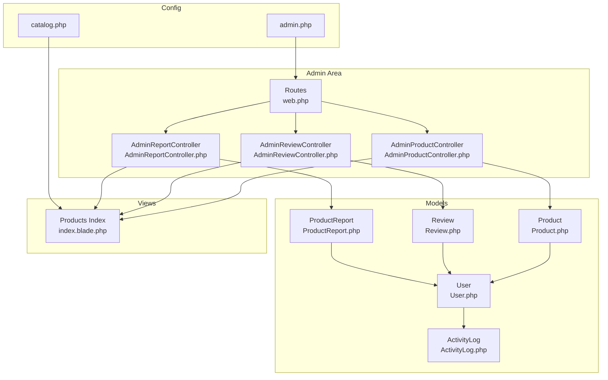
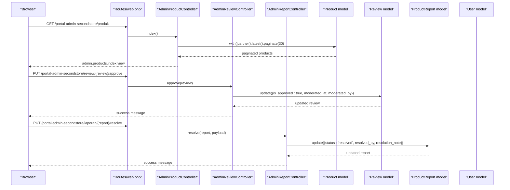
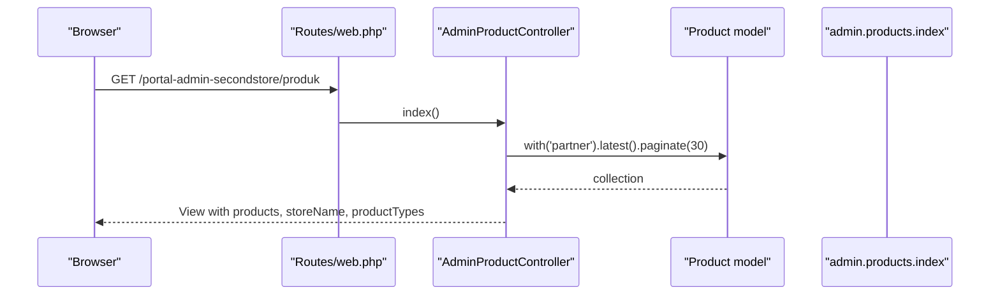
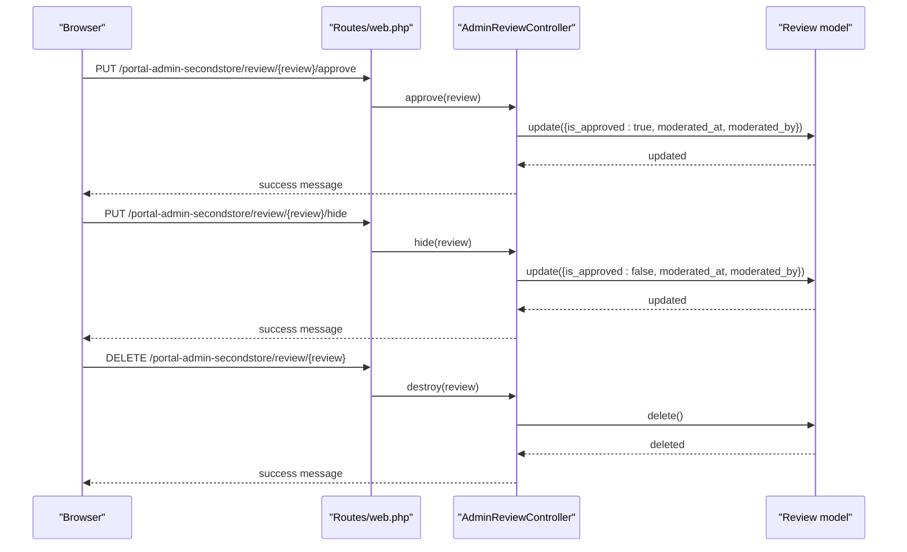
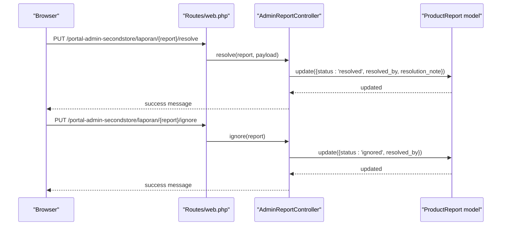
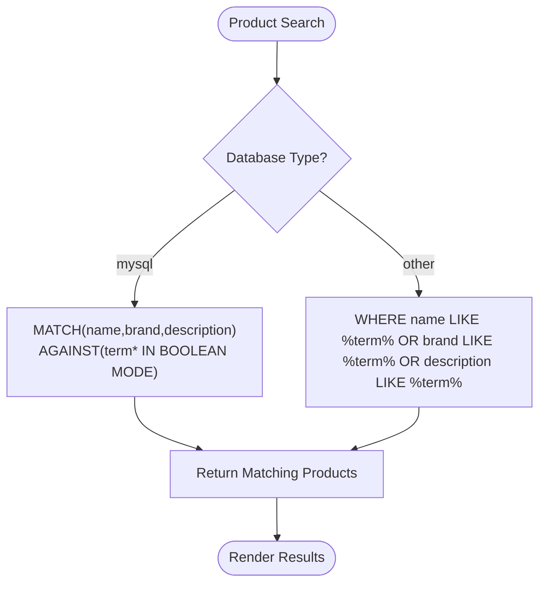
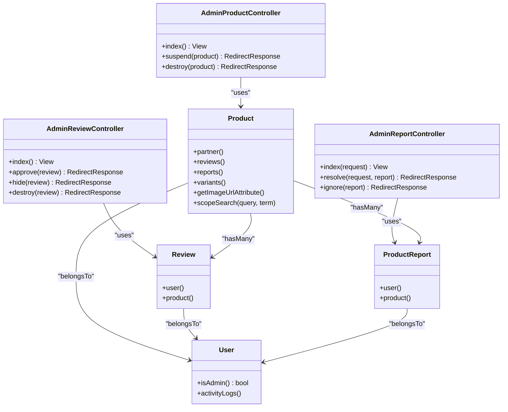

# Admin Product Moderation

<cite>
**Referenced Files in This Document**
- [AdminProductController.php](file://app/Http/Controllers/AdminProductController.php)
- [AdminReportController.php](file://app/Http/Controllers/AdminReportController.php)
- [AdminReviewController.php](file://app/Http/Controllers/AdminReviewController.php)
- [Product.php](file://app/Models/Product.php)
- [ProductReport.php](file://app/Models/ProductReport.php)
- [Review.php](file://app/Models/Review.php)
- [User.php](file://app/Models/User.php)
- [ActivityLog.php](file://app/Models/ActivityLog.php)
- [web.php](file://routes/web.php)
- [index.blade.php](file://resources/views/admin/products/index.blade.php)
- [catalog.php](file://config/catalog.php)
- [admin.php](file://config/admin.php)
</cite>

## Table of Contents
1. [Introduction](#introduction)
2. [Project Structure](#project-structure)
3. [Core Components](#core-components)
4. [Architecture Overview](#architecture-overview)
5. [Detailed Component Analysis](#detailed-component-analysis)
6. [Dependency Analysis](#dependency-analysis)
7. [Performance Considerations](#performance-considerations)
8. [Troubleshooting Guide](#troubleshooting-guide)
9. [Conclusion](#conclusion)
10. [Appendices](#appendices)

## Introduction
This document describes the administrative product moderation capabilities in KatalogThrift. It covers the admin review workflow for new product listings, quality assurance processes, and approval procedures. It documents the moderation interface for product listing, filtering options, and bulk actions. It also explains approval criteria, content verification standards, and policy enforcement mechanisms, including review moderation, report handling, and automated content screening. Examples of product approval and rejection workflows, publisher notifications, audit trails, appeals, and quality metrics are included. Guidance is provided for handling edge cases, policy violations, and community guideline enforcement.

## Project Structure
The moderation features are implemented via controller actions and Blade templates under the admin area. Routes define the admin entry path and expose endpoints for product moderation, review moderation, and report resolution. Models encapsulate product, review, and report data with relationships to users and partners. Configuration files define product categories and admin credentials.

**Diagram sources**
- [web.php:169-239](file://routes/web.php#L169-L239)
- [AdminProductController.php:9-36](file://app/Http/Controllers/AdminProductController.php#L9-L36)
- [AdminReviewController.php:9-48](file://app/Http/Controllers/AdminReviewController.php#L9-L48)
- [AdminReportController.php:10-51](file://app/Http/Controllers/AdminReportController.php#L10-L51)
- [Product.php:9-131](file://app/Models/Product.php#L9-L131)
- [Review.php:7-29](file://app/Models/Review.php#L7-L29)
- [ProductReport.php:7-26](file://app/Models/ProductReport.php#L7-L26)
- [User.php:10-130](file://app/Models/User.php#L10-L130)
- [ActivityLog.php:6-22](file://app/Models/ActivityLog.php#L6-L22)
- [index.blade.php:1-98](file://resources/views/admin/products/index.blade.php#L1-L98)
- [catalog.php:3-28](file://config/catalog.php#L3-L28)
- [admin.php:3-7](file://config/admin.php#L3-L7)

**Section sources**
- [web.php:169-239](file://routes/web.php#L169-L239)
- [catalog.php:3-28](file://config/catalog.php#L3-L28)
- [admin.php:3-7](file://config/admin.php#L3-L7)

## Core Components
- Admin Product Moderation Controller
  - Provides product listing with pagination and partner association.
  - Supports toggling product activation and permanent deletion.
  - Integrates with configuration for product types and store branding.
  - References: [AdminProductController.php:11-35](file://app/Http/Controllers/AdminProductController.php#L11-L35), [index.blade.php:64-94](file://resources/views/admin/products/index.blade.php#L64-L94)

- Admin Review Moderation Controller
  - Lists reviews with user and product/partner context.
  - Approves or hides reviews; records moderation metadata.
  - Deletes reviews when necessary.
  - References: [AdminReviewController.php:11-47](file://app/Http/Controllers/AdminReviewController.php#L11-L47)

- Admin Report Moderation Controller
  - Filters reports by status and paginates results.
  - Resolves reports with optional resolution notes and marks as resolved.
  - Ignores reports and marks as ignored.
  - References: [AdminReportController.php:12-50](file://app/Http/Controllers/AdminReportController.php#L12-L50)

- Product Model
  - Defines fillable attributes, casts, and relationships (partner, variants, reviews, reports, questions).
  - Provides computed attributes for average rating and review count.
  - Includes image URL resolution and search scopes.
  - References: [Product.php:13-131](file://app/Models/Product.php#L13-L131)

- Review Model
  - Defines fillable attributes and relationships to user and product.
  - References: [Review.php:9-28](file://app/Models/Review.php#L9-L28)

- ProductReport Model
  - Defines fillable attributes and relationships to user and product.
  - References: [ProductReport.php:9-25](file://app/Models/ProductReport.php#L9-L25)

- User Model
  - Provides role checks and activity logging integration.
  - References: [User.php:14-130](file://app/Models/User.php#L14-L130)

- Activity Log Model
  - Tracks moderation actions and points-based gamification events.
  - References: [ActivityLog.php:8-21](file://app/Models/ActivityLog.php#L8-L21)

- Routes
  - Admin entry path configured via environment variable.
  - Exposes endpoints for product suspension/deletion, review moderation, and report resolution.
  - References: [web.php:170-239](file://routes/web.php#L170-L239), [admin.php:4](file://config/admin.php#L4)

**Section sources**
- [AdminProductController.php:11-35](file://app/Http/Controllers/AdminProductController.php#L11-L35)
- [AdminReviewController.php:11-47](file://app/Http/Controllers/AdminReviewController.php#L11-L47)
- [AdminReportController.php:12-50](file://app/Http/Controllers/AdminReportController.php#L12-L50)
- [Product.php:13-131](file://app/Models/Product.php#L13-L131)
- [Review.php:9-28](file://app/Models/Review.php#L9-L28)
- [ProductReport.php:9-25](file://app/Models/ProductReport.php#L9-L25)
- [User.php:14-130](file://app/Models/User.php#L14-L130)
- [ActivityLog.php:8-21](file://app/Models/ActivityLog.php#L8-L21)
- [web.php:170-239](file://routes/web.php#L170-L239)
- [admin.php:4](file://config/admin.php#L4)

## Architecture Overview
The moderation architecture centers on three primary controllers that manage products, reviews, and reports. These controllers interact with their respective models and render views under the admin namespace. Routing enforces admin authentication and exposes endpoints for moderation actions. Configuration supplies product type metadata and admin credentials.

**Diagram sources**
- [web.php:170-239](file://routes/web.php#L170-L239)
- [AdminProductController.php:11-22](file://app/Http/Controllers/AdminProductController.php#L11-L22)
- [AdminReviewController.php:23-30](file://app/Http/Controllers/AdminReviewController.php#L23-L30)
- [AdminReportController.php:27-39](file://app/Http/Controllers/AdminReportController.php#L27-L39)
- [Product.php:36-79](file://app/Models/Product.php#L36-L79)
- [Review.php:20-28](file://app/Models/Review.php#L20-L28)
- [ProductReport.php:17-25](file://app/Models/ProductReport.php#L17-L25)
- [User.php:68-81](file://app/Models/User.php#L68-L81)

## Detailed Component Analysis

### Admin Product Moderation Interface
- Purpose: Display all products, filter by status, toggle activation, and delete products.
- Features:
  - Pagination of products with partner store name.
  - Status badges for active/inactive/sold states.
  - Action buttons to suspend/activate and delete products.
  - Integration with product types configuration for labels and emojis.
- Implementation highlights:
  - Controller fetches products with partner relationship and latest ordering.
  - View renders product rows with image URL, brand, price, category, and status.
  - Forms submit to admin routes for suspend and destroy actions.
- References:
  - Controller: [AdminProductController.php:11-35](file://app/Http/Controllers/AdminProductController.php#L11-L35)
  - View: [index.blade.php:64-94](file://resources/views/admin/products/index.blade.php#L64-L94)
  - Config: [catalog.php:14-28](file://config/catalog.php#L14-L28)

**Diagram sources**
- [web.php:185-188](file://routes/web.php#L185-L188)
- [AdminProductController.php:11-22](file://app/Http/Controllers/AdminProductController.php#L11-L22)
- [Product.php:36-39](file://app/Models/Product.php#L36-L39)
- [index.blade.php:17-21](file://resources/views/admin/products/index.blade.php#L17-L21)

**Section sources**
- [AdminProductController.php:11-35](file://app/Http/Controllers/AdminProductController.php#L11-L35)
- [index.blade.php:64-94](file://resources/views/admin/products/index.blade.php#L64-L94)
- [catalog.php:14-28](file://config/catalog.php#L14-L28)

### Review Moderation Workflow
- Purpose: Moderate user-generated reviews for quality and compliance.
- Actions:
  - Approve: sets approved flag and records moderator metadata.
  - Hide: unapproves review and records moderator metadata.
  - Delete: removes review permanently.
- Implementation highlights:
  - Controller methods update review attributes and return success feedback.
  - Models define relationships to user and product.
- References:
  - Controller: [AdminReviewController.php:23-47](file://app/Http/Controllers/AdminReviewController.php#L23-L47)
  - Model: [Review.php:20-28](file://app/Models/Review.php#L20-L28)

**Diagram sources**
- [web.php:190-194](file://routes/web.php#L190-L194)
- [AdminReviewController.php:23-47](file://app/Http/Controllers/AdminReviewController.php#L23-L47)
- [Review.php:20-28](file://app/Models/Review.php#L20-L28)

**Section sources**
- [AdminReviewController.php:23-47](file://app/Http/Controllers/AdminReviewController.php#L23-L47)
- [Review.php:20-28](file://app/Models/Review.php#L20-L28)

### Report Moderation Workflow
- Purpose: Resolve user reports against products with resolution notes and status updates.
- Actions:
  - Resolve: marks report as resolved, records resolver ID, and optional resolution note.
  - Ignore: marks report as ignored and records resolver ID.
- Implementation highlights:
  - Controller validates resolution note length and updates report fields.
  - Reports belong to user and product; view supports filtering by status.
- References:
  - Controller: [AdminReportController.php:27-50](file://app/Http/Controllers/AdminReportController.php#L27-L50)
  - Model: [ProductReport.php:17-25](file://app/Models/ProductReport.php#L17-L25)

**Diagram sources**
- [web.php:196-199](file://routes/web.php#L196-L199)
- [AdminReportController.php:27-50](file://app/Http/Controllers/AdminReportController.php#L27-L50)
- [ProductReport.php:17-25](file://app/Models/ProductReport.php#L17-L25)

**Section sources**
- [AdminReportController.php:27-50](file://app/Http/Controllers/AdminReportController.php#L27-L50)
- [ProductReport.php:17-25](file://app/Models/ProductReport.php#L17-L25)

### Automated Content Screening and Quality Assurance
- Product search scope:
  - Uses full-text search on MySQL or fallback LIKE matching for name, brand, and description.
  - Supports boolean mode prefix for wildcard-like behavior on MySQL.
- Image URL resolution:
  - Returns storage URL when path exists; otherwise falls back to external image URL.
- Quality indicators:
  - Average rating and review count computed from associated reviews.
- References:
  - Search scope: [Product.php:122-130](file://app/Models/Product.php#L122-L130)
  - Image URL: [Product.php:96-102](file://app/Models/Product.php#L96-L102)
  - Ratings: [Product.php:86-94](file://app/Models/Product.php#L86-L94)

**Diagram sources**
- [Product.php:122-130](file://app/Models/Product.php#L122-L130)

**Section sources**
- [Product.php:86-102](file://app/Models/Product.php#L86-L102)
- [Product.php:122-130](file://app/Models/Product.php#L122-L130)

### Approval Criteria and Policy Enforcement
- Product activation:
  - Toggle activation status per product; view displays active/inactive/sold badges.
- Review moderation:
  - Approved vs hidden states; moderation timestamps and moderator identity recorded.
- Report resolution:
  - Resolved or ignored with resolver identity and optional notes.
- Policy enforcement:
  - Admin credentials and entry path configurable via environment variables.
- References:
  - Activation: [AdminProductController.php:24-29](file://app/Http/Controllers/AdminProductController.php#L24-L29)
  - Review moderation: [AdminReviewController.php:23-41](file://app/Http/Controllers/AdminReviewController.php#L23-L41)
  - Report resolution: [AdminReportController.php:27-49](file://app/Http/Controllers/AdminReportController.php#L27-L49)
  - Admin config: [admin.php:4-6](file://config/admin.php#L4-L6)

**Section sources**
- [AdminProductController.php:24-29](file://app/Http/Controllers/AdminProductController.php#L24-L29)
- [AdminReviewController.php:23-41](file://app/Http/Controllers/AdminReviewController.php#L23-L41)
- [AdminReportController.php:27-49](file://app/Http/Controllers/AdminReportController.php#L27-L49)
- [admin.php:4-6](file://config/admin.php#L4-L6)

### Publisher Notifications and Audit Trail
- Activity logging:
  - Users maintain activity logs with points and referenceable entries.
  - Moderation actions can be logged via activity log creation.
- Publisher notifications:
  - No explicit notification logic is present in the reviewed controllers/models.
- References:
  - Activity log: [ActivityLog.php:8-21](file://app/Models/ActivityLog.php#L8-L21)
  - User activity integration: [User.php:105-117](file://app/Models/User.php#L105-L117)

**Section sources**
- [ActivityLog.php:8-21](file://app/Models/ActivityLog.php#L8-L21)
- [User.php:105-117](file://app/Models/User.php#L105-L117)

### Appeals and Quality Metrics Tracking
- Appeals:
  - No dedicated appeal endpoints or workflows are exposed in the reviewed routes/controllers.
- Quality metrics:
  - Product-level metrics include average rating and review counts.
  - No explicit admin dashboards or metrics pages are shown in the reviewed routes/controllers.
- References:
  - Product metrics: [Product.php:86-94](file://app/Models/Product.php#L86-L94)
  - Routes coverage: [web.php:174-239](file://routes/web.php#L174-L239)

**Section sources**
- [Product.php:86-94](file://app/Models/Product.php#L86-L94)
- [web.php:174-239](file://routes/web.php#L174-L239)

### Edge Cases and Community Guidelines
- Edge cases:
  - Product without image path falls back to external image URL.
  - Product search falls back to LIKE matching when not on MySQL.
  - Reports support optional resolution notes; missing notes are handled gracefully.
- Community guidelines:
  - No explicit policy text or guideline enforcement logic is present in the reviewed controllers/models.
- References:
  - Image URL fallback: [Product.php:96-102](file://app/Models/Product.php#L96-L102)
  - Search fallback: [Product.php:122-130](file://app/Models/Product.php#L122-L130)
  - Report resolution note: [AdminReportController.php:29-31](file://app/Http/Controllers/AdminReportController.php#L29-L31)

**Section sources**
- [Product.php:96-102](file://app/Models/Product.php#L96-L102)
- [Product.php:122-130](file://app/Models/Product.php#L122-L130)
- [AdminReportController.php:29-31](file://app/Http/Controllers/AdminReportController.php#L29-L31)

## Dependency Analysis
The moderation controllers depend on their respective models and leverage relationships to users and partners. The admin routes enforce authentication middleware and map to controller actions. Configuration files supply product metadata and admin credentials.

**Diagram sources**
- [AdminProductController.php:9-36](file://app/Http/Controllers/AdminProductController.php#L9-L36)
- [AdminReviewController.php:9-48](file://app/Http/Controllers/AdminReviewController.php#L9-L48)
- [AdminReportController.php:10-51](file://app/Http/Controllers/AdminReportController.php#L10-L51)
- [Product.php:36-79](file://app/Models/Product.php#L36-L79)
- [Review.php:20-28](file://app/Models/Review.php#L20-L28)
- [ProductReport.php:17-25](file://app/Models/ProductReport.php#L17-L25)
- [User.php:28-66](file://app/Models/User.php#L28-L66)

**Section sources**
- [AdminProductController.php:9-36](file://app/Http/Controllers/AdminProductController.php#L9-L36)
- [AdminReviewController.php:9-48](file://app/Http/Controllers/AdminReviewController.php#L9-L48)
- [AdminReportController.php:10-51](file://app/Http/Controllers/AdminReportController.php#L10-L51)
- [Product.php:36-79](file://app/Models/Product.php#L36-L79)
- [Review.php:20-28](file://app/Models/Review.php#L20-L28)
- [ProductReport.php:17-25](file://app/Models/ProductReport.php#L17-L25)
- [User.php:28-66](file://app/Models/User.php#L28-L66)

## Performance Considerations
- Pagination: Controllers use pagination to limit result sets for product, review, and report listings.
- Eager loading: Product listings eager-load partner relationships to reduce N+1 queries.
- Search scope: Full-text search is used on MySQL; a LIKE fallback reduces overhead on other databases.
- Recommendations:
  - Add database indexes for frequently filtered columns (e.g., product_type, is_active, status).
  - Consider adding composite indexes for search terms and moderation timestamps.
  - Implement caching for product type metadata and static admin UI assets.

[No sources needed since this section provides general guidance]

## Troubleshooting Guide
- Admin login issues:
  - Verify admin entry path and credentials in configuration.
  - References: [admin.php:4-6](file://config/admin.php#L4-L6)
- Product listing problems:
  - Ensure product types configuration is present and valid.
  - References: [catalog.php:14-28](file://config/catalog.php#L14-L28)
- Review moderation errors:
  - Confirm authenticated admin session and proper route bindings.
  - References: [web.php:190-194](file://routes/web.php#L190-L194)
- Report resolution failures:
  - Validate resolution note constraints and report existence.
  - References: [AdminReportController.php:29-31](file://app/Http/Controllers/AdminReportController.php#L29-L31), [web.php:196-199](file://routes/web.php#L196-L199)

**Section sources**
- [admin.php:4-6](file://config/admin.php#L4-L6)
- [catalog.php:14-28](file://config/catalog.php#L14-L28)
- [web.php:190-194](file://routes/web.php#L190-L194)
- [AdminReportController.php:29-31](file://app/Http/Controllers/AdminReportController.php#L29-L31)
- [web.php:196-199](file://routes/web.php#L196-L199)

## Conclusion
KatalogThrift’s admin moderation stack provides essential controls for product activation/deactivation and deletion, review approval/hiding, and report resolution. The architecture leverages controllers, models, routing, and configuration to deliver a straightforward moderation workflow. Extending the system to include publisher notifications, appeals, and comprehensive quality metrics would further strengthen moderation governance.

[No sources needed since this section summarizes without analyzing specific files]

## Appendices
- Example workflows:
  - Product approval: Activate product via suspend endpoint; view reflects active badge.
  - Product rejection: Deactivate product via suspend endpoint; view reflects inactive badge.
  - Publisher notification: No explicit mechanism in reviewed code; consider integrating activity logs or notifications.
  - Audit trail: Store moderator identity and timestamps during review moderation and report resolution.
  - Quality metrics: Track average ratings and review counts at product level.

[No sources needed since this section provides general guidance]