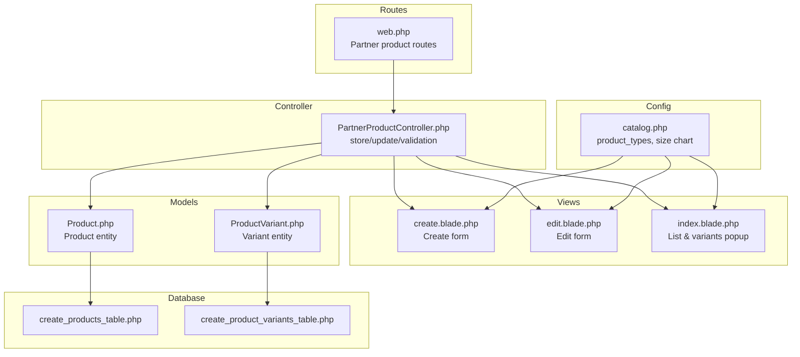
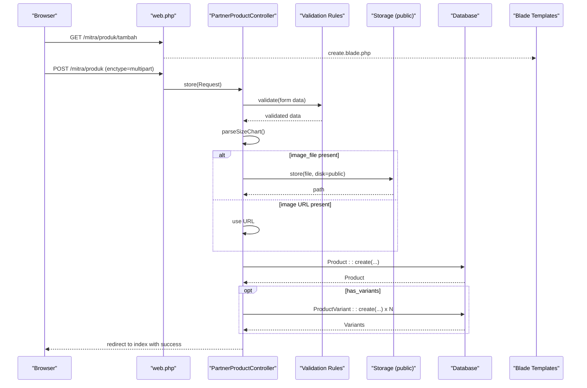
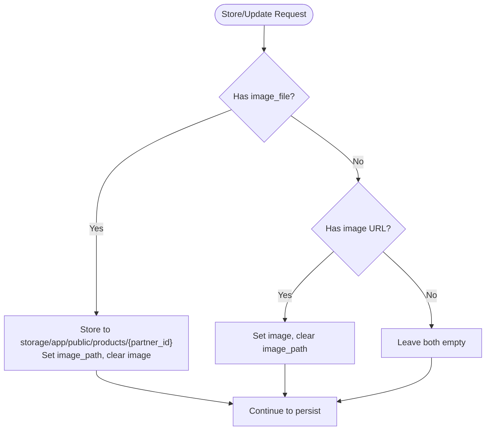
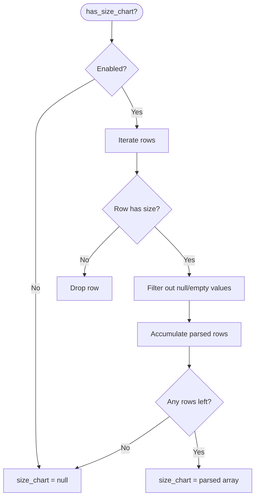
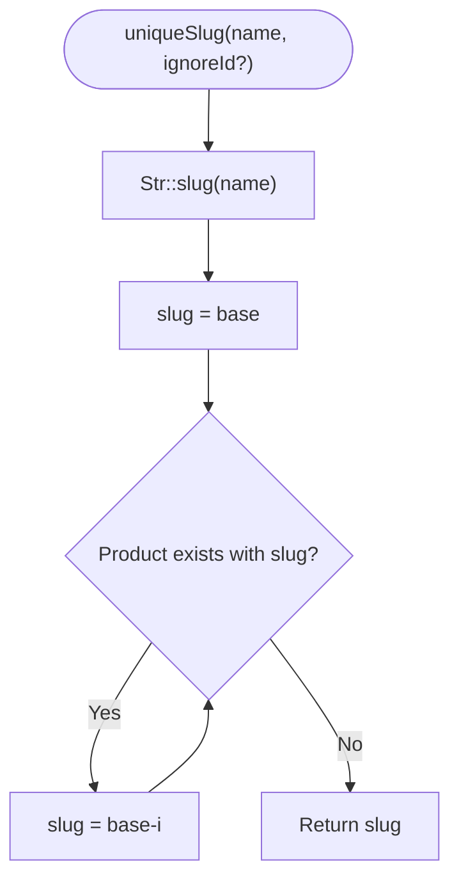
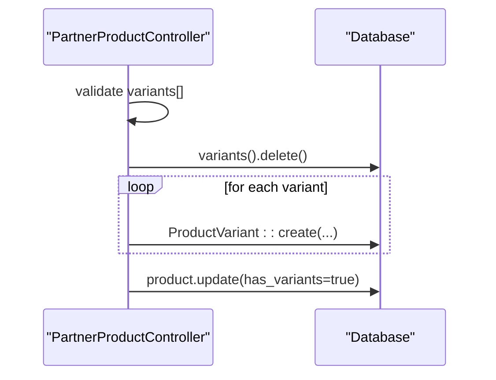
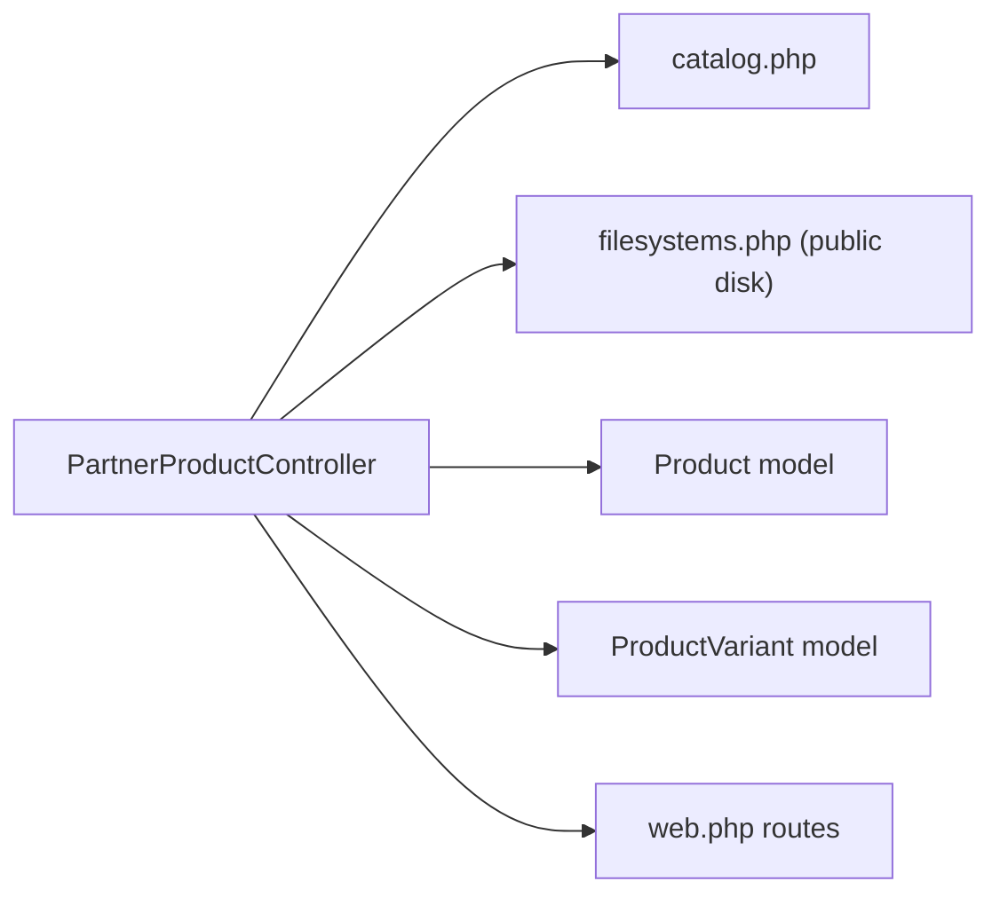
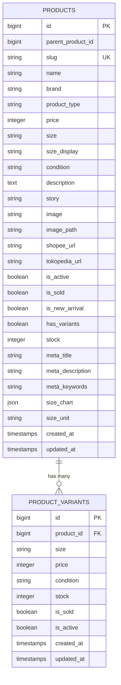

# Partner Product Creation

<cite>
**Referenced Files in This Document**
- [PartnerProductController.php](file://app/Http/Controllers/Partner/PartnerProductController.php)
- [create.blade.php](file://resources/views/partner/products/create.blade.php)
- [edit.blade.php](file://resources/views/partner/products/edit.blade.php)
- [index.blade.php](file://resources/views/partner/products/index.blade.php)
- [Product.php](file://app/Models/Product.php)
- [ProductVariant.php](file://app/Models/ProductVariant.php)
- [catalog.php](file://config/catalog.php)
- [web.php](file://routes/web.php)
- [filesystems.php](file://config/filesystems.php)
- [2026_05_04_125734_create_products_table.php](file://database/migrations/2026_05_04_125734_create_products_table.php)
- [2026_07_01_100002_create_product_variants_table.php](file://database/migrations/2026_07_01_100002_create_product_variants_table.php)
</cite>

## Table of Contents
1. [Introduction](#introduction)
2. [Project Structure](#project-structure)
3. [Core Components](#core-components)
4. [Architecture Overview](#architecture-overview)
5. [Detailed Component Analysis](#detailed-component-analysis)
6. [Dependency Analysis](#dependency-analysis)
7. [Performance Considerations](#performance-considerations)
8. [Troubleshooting Guide](#troubleshooting-guide)
9. [Conclusion](#conclusion)
10. [Appendices](#appendices)

## Introduction
This document explains the complete partner product creation workflow in KatalogThrift. It covers the product registration form, validation rules, data processing, image handling (file upload vs. external URL), size chart configuration, slug generation, and variant management. It also provides step-by-step examples and troubleshooting guidance for common validation and upload issues.

## Project Structure
The product creation feature spans controller actions, Blade templates, Eloquent models, configuration, routes, and database migrations. The key areas are:
- Routes define the partner product endpoints
- Controller validates and persists product data, handles images, and manages variants
- Blade templates render the forms for creating and editing products
- Models represent persisted entities and expose computed attributes
- Configuration defines product types, size chart columns, and defaults
- Migrations define the underlying database schema

**Diagram sources**
- [web.php:127-133](file://routes/web.php#L127-L133)
- [PartnerProductController.php:42-133](file://app/Http/Controllers/Partner/PartnerProductController.php#L42-L133)
- [create.blade.php:80-239](file://resources/views/partner/products/create.blade.php#L80-L239)
- [edit.blade.php:75-237](file://resources/views/partner/products/edit.blade.php#L75-L237)
- [index.blade.php:106-154](file://resources/views/partner/products/index.blade.php#L106-L154)
- [Product.php:9-132](file://app/Models/Product.php#L9-L132)
- [ProductVariant.php:6-22](file://app/Models/ProductVariant.php#L6-L22)
- [catalog.php:14-70](file://config/catalog.php#L14-L70)
- [2026_05_04_125734_create_products_table.php:14-26](file://database/migrations/2026_05_04_125734_create_products_table.php#L14-L26)
- [2026_07_01_100002_create_product_variants_table.php:10-30](file://database/migrations/2026_07_01_100002_create_product_variants_table.php#L10-L30)

**Section sources**
- [web.php:127-133](file://routes/web.php#L127-L133)
- [PartnerProductController.php:42-133](file://app/Http/Controllers/Partner/PartnerProductController.php#L42-L133)
- [create.blade.php:80-239](file://resources/views/partner/products/create.blade.php#L80-L239)
- [edit.blade.php:75-237](file://resources/views/partner/products/edit.blade.php#L75-L237)
- [index.blade.php:106-154](file://resources/views/partner/products/index.blade.php#L106-L154)
- [Product.php:9-132](file://app/Models/Product.php#L9-L132)
- [ProductVariant.php:6-22](file://app/Models/ProductVariant.php#L6-L22)
- [catalog.php:14-70](file://config/catalog.php#L14-L70)
- [2026_05_04_125734_create_products_table.php:14-26](file://database/migrations/2026_05_04_125734_create_products_table.php#L14-L26)
- [2026_07_01_100002_create_product_variants_table.php:10-30](file://database/migrations/2026_07_01_100002_create_product_variants_table.php#L10-L30)

## Core Components
- PartnerProductController: Handles create and update requests, applies strict validation, processes images, generates slugs, and manages variants.
- Product model: Defines fillable attributes, casts, relationships, and computed attributes (image URL, meta defaults).
- ProductVariant model: Defines variant attributes and relationships.
- Blade templates: Provide the create, edit, and list views with interactive features (size chart, variants, tabs for image selection).
- Configuration: Supplies product types and size chart column definitions.
- Routes: Expose endpoints for CRUD and variant operations under the partner namespace.

Key responsibilities:
- Validation: Enforces string length limits, numeric ranges, URL formats, booleans, and array structures.
- Image handling: Supports file uploads (validated and stored) or external image URLs.
- Size chart: Parses and stores structured size data keyed by configured columns.
- Slug generation: Ensures unique, URL-safe slugs with fallback increments.
- Variant management: Supports adding/removing variants and toggling has_variants flag.

**Section sources**
- [PartnerProductController.php:42-133](file://app/Http/Controllers/Partner/PartnerProductController.php#L42-L133)
- [Product.php:13-34](file://app/Models/Product.php#L13-L34)
- [ProductVariant.php:8-16](file://app/Models/ProductVariant.php#L8-L16)
- [create.blade.php:80-239](file://resources/views/partner/products/create.blade.php#L80-L239)
- [edit.blade.php:75-237](file://resources/views/partner/products/edit.blade.php#L75-L237)
- [catalog.php:55-70](file://config/catalog.php#L55-L70)
- [web.php:127-142](file://routes/web.php#L127-L142)

## Architecture Overview
The product creation flow follows a standard MVC pattern with explicit validation and persistence steps.

**Diagram sources**
- [web.php:127-133](file://routes/web.php#L127-L133)
- [PartnerProductController.php:42-133](file://app/Http/Controllers/Partner/PartnerProductController.php#L42-L133)
- [filesystems.php:39-45](file://config/filesystems.php#L39-L45)
- [2026_05_04_125734_create_products_table.php:14-26](file://database/migrations/2026_05_04_125734_create_products_table.php#L14-L26)
- [2026_07_01_100002_create_product_variants_table.php:10-22](file://database/migrations/2026_07_01_100002_create_product_variants_table.php#L10-L22)

## Detailed Component Analysis

### Form Fields and Validation Schema
Required fields:
- name: string, max 255
- brand: string, max 100
- product_type: string (from configuration)
- price: integer, min 0
- size: string, max 50
- condition: string, max 50
- description: string

Optional fields:
- color: string, max 50
- color_hex: string, max 7
- style_type: string
- story: string
- image_file: image, max 2048 KB
- image: URL
- shopee_url, tokopedia_url: URL
- is_active: boolean (defaults to true)
- is_new_arrival: boolean (defaults to false)
- is_sold: boolean (defaults to false)
- has_size_chart: boolean
- size_chart: array (parsed rows)
- size_unit: string, max 10 (default cm)
- has_variants: boolean
- variants: array of objects with keys:
  - size: string, max 20
  - price: integer, min 0
  - stock: integer, min 0
- meta_title: string, max 255
- meta_description: string, max 500
- meta_keywords: string, max 500

Validation specifics:
- URL fields accept URLs; image_file is validated as image and limited by size.
- Arrays are validated with indexed items (variants.*) to ensure structure.
- Boolean flags are normalized via request->boolean() with sensible defaults.

**Section sources**
- [PartnerProductController.php:44-73](file://app/Http/Controllers/Partner/PartnerProductController.php#L44-L73)
- [PartnerProductController.php:153-183](file://app/Http/Controllers/Partner/PartnerProductController.php#L153-L183)

### Image Upload Handling
Two modes are supported:
- File upload: image_file is validated and stored under storage/app/public/products/{partner_id}. The controller sets image_path and clears image.
- External URL: image is accepted as a URL; the controller sets image and clears image_path.

On updates, if a new file is uploaded, the previous file is deleted from storage.

**Diagram sources**
- [PartnerProductController.php:82-86](file://app/Http/Controllers/Partner/PartnerProductController.php#L82-L86)
- [PartnerProductController.php:189-194](file://app/Http/Controllers/Partner/PartnerProductController.php#L189-L194)
- [filesystems.php:39-45](file://config/filesystems.php#L39-L45)

**Section sources**
- [PartnerProductController.php:82-86](file://app/Http/Controllers/Partner/PartnerProductController.php#L82-L86)
- [PartnerProductController.php:189-194](file://app/Http/Controllers/Partner/PartnerProductController.php#L189-L194)

### Size Chart Configuration
The size chart is enabled/disabled via has_size_chart. When enabled, the controller parses size_chart rows and filters out empty entries. Columns are defined in configuration and include size, chest, length, shoulder, sleeve, waist, hip.

**Diagram sources**
- [PartnerProductController.php:261-278](file://app/Http/Controllers/Partner/PartnerProductController.php#L261-L278)
- [catalog.php:55-70](file://config/catalog.php#L55-L70)

**Section sources**
- [PartnerProductController.php:261-278](file://app/Http/Controllers/Partner/PartnerProductController.php#L261-L278)
- [catalog.php:55-70](file://config/catalog.php#L55-L70)

### Slug Generation
Slugs are generated from the product name using URL-safe formatting. If a conflict exists, a numeric suffix is appended until uniqueness is achieved.

**Diagram sources**
- [PartnerProductController.php:280-290](file://app/Http/Controllers/Partner/PartnerProductController.php#L280-L290)

**Section sources**
- [PartnerProductController.php:280-290](file://app/Http/Controllers/Partner/PartnerProductController.php#L280-L290)

### Variant Configuration
Variants are optional and controlled by has_variants. On create/update, if enabled:
- Existing variants are removed (replace semantics)
- New variants are created with size, price (optional), stock (optional), and condition (optional)
- The has_variants flag is set to true

**Diagram sources**
- [PartnerProductController.php:119-129](file://app/Http/Controllers/Partner/PartnerProductController.php#L119-L129)
- [PartnerProductController.php:230-241](file://app/Http/Controllers/Partner/PartnerProductController.php#L230-L241)
- [2026_07_01_100002_create_product_variants_table.php:10-22](file://database/migrations/2026_07_01_100002_create_product_variants_table.php#L10-L22)

**Section sources**
- [PartnerProductController.php:119-129](file://app/Http/Controllers/Partner/PartnerProductController.php#L119-L129)
- [PartnerProductController.php:230-241](file://app/Http/Controllers/Partner/PartnerProductController.php#L230-L241)
- [ProductVariant.php:8-16](file://app/Models/ProductVariant.php#L8-L16)

### Product Metadata (SEO)
Optional SEO fields are supported:
- meta_title: string, max 255
- meta_description: string, max 500
- meta_keywords: string, max 500

These are persisted on create/update and used for page metadata.

**Section sources**
- [PartnerProductController.php:70-72](file://app/Http/Controllers/Partner/PartnerProductController.php#L70-L72)
- [PartnerProductController.php:180-182](file://app/Http/Controllers/Partner/PartnerProductController.php#L180-L182)

### Step-by-Step Examples

#### Example 1: Create a product with variants and size chart
- Open the create form and fill required fields (name, brand, product_type, price, size, condition, description).
- Optionally enable “Add size chart” and populate the table with measurements for each size.
- Choose “Upload File” or “Use URL” for the product image.
- Enable “Has variants” and add at least one variant with size and optional price/stock.
- Submit the form.
- The controller validates, stores the image if uploaded, parses size chart, creates the product with a unique slug, and persists variants.

**Section sources**
- [create.blade.php:80-239](file://resources/views/partner/products/create.blade.php#L80-L239)
- [PartnerProductController.php:42-133](file://app/Http/Controllers/Partner/PartnerProductController.php#L42-L133)

#### Example 2: Edit an existing product and update variants
- Navigate to the edit form for the product.
- Update fields as needed (e.g., price, condition, story).
- Toggle “Has variants” and replace the variant list; the controller deletes existing variants and recreates them.
- Optionally change the image by uploading a new file or updating the URL.
- Submit to persist changes.

**Section sources**
- [edit.blade.php:75-237](file://resources/views/partner/products/edit.blade.php#L75-L237)
- [PartnerProductController.php:149-245](file://app/Http/Controllers/Partner/PartnerProductController.php#L149-L245)

#### Example 3: Manage product metadata (SEO)
- Fill meta_title, meta_description, and meta_keywords in the SEO section.
- These values are stored with the product and used for page metadata.

**Section sources**
- [create.blade.php:211-219](file://resources/views/partner/products/create.blade.php#L211-L219)
- [edit.blade.php:205-213](file://resources/views/partner/products/edit.blade.php#L205-L213)
- [PartnerProductController.php:70-72](file://app/Http/Controllers/Partner/PartnerProductController.php#L70-L72)

## Dependency Analysis
The controller depends on:
- Configuration for product types and size chart columns/defaults
- Storage disk for file uploads
- Eloquent models for persistence and relationships
- Routes for endpoint binding

**Diagram sources**
- [PartnerProductController.php:33-39](file://app/Http/Controllers/Partner/PartnerProductController.php#L33-L39)
- [catalog.php:14-70](file://config/catalog.php#L14-L70)
- [filesystems.php:39-45](file://config/filesystems.php#L39-L45)
- [web.php:127-142](file://routes/web.php#L127-L142)

**Section sources**
- [PartnerProductController.php:33-39](file://app/Http/Controllers/Partner/PartnerProductController.php#L33-L39)
- [catalog.php:14-70](file://config/catalog.php#L14-L70)
- [filesystems.php:39-45](file://config/filesystems.php#L39-L45)
- [web.php:127-142](file://routes/web.php#L127-L142)

## Performance Considerations
- Image size limit: image_file is limited to 2048 KB to prevent oversized uploads.
- Array parsing: size_chart and variants arrays are filtered and validated to reduce storage overhead.
- Slug generation: Uses a simple loop with database existence checks; ensure unique constraints are enforced at DB level.
- Storage: Using local public disk with symbolic link; consider CDN or S3 for production scalability.

[No sources needed since this section provides general guidance]

## Troubleshooting Guide

Common validation errors:
- String length exceeded: Ensure name, brand, size, condition, color, color_hex, meta_title, meta_description, meta_keywords meet max-length constraints.
- Numeric range invalid: Price and variant price/stock must be non-negative integers.
- URL format invalid: shopee_url and tokopedia_url must be valid URLs.
- Missing required fields: name, brand, product_type, price, size, condition, description are mandatory.

Image upload issues:
- File type rejected: image_file must be an image; verify MIME type.
- File too large: image_file must be ≤ 2048 KB.
- URL not accessible: If using external image URL, ensure the URL is reachable and returns an image.

Variant issues:
- Missing size: Variants require a size; empty rows are ignored during parsing.
- Duplicate sizes: The variant table enforces unique combinations of product_id and size.

Slug conflicts:
- If a product with the same name exists, the slug is suffixed with a number to ensure uniqueness.

**Section sources**
- [PartnerProductController.php:44-73](file://app/Http/Controllers/Partner/PartnerProductController.php#L44-L73)
- [PartnerProductController.php:153-183](file://app/Http/Controllers/Partner/PartnerProductController.php#L153-L183)
- [2026_07_01_100002_create_product_variants_table.php:20-21](file://database/migrations/2026_07_01_100002_create_product_variants_table.php#L20-L21)

## Conclusion
The partner product creation workflow in KatalogThrift is robust, with strong validation, flexible image handling, configurable size charts, and variant support. By following the documented validation rules and examples, partners can efficiently register and manage products with consistent metadata and presentation.

[No sources needed since this section summarizes without analyzing specific files]

## Appendices

### Data Model Overview

**Diagram sources**
- [2026_05_04_125734_create_products_table.php:14-26](file://database/migrations/2026_05_04_125734_create_products_table.php#L14-L26)
- [2026_07_01_100002_create_product_variants_table.php:10-22](file://database/migrations/2026_07_01_100002_create_product_variants_table.php#L10-L22)
- [Product.php:13-34](file://app/Models/Product.php#L13-L34)
- [ProductVariant.php:8-16](file://app/Models/ProductVariant.php#L8-L16)