# Product CRUD Operations

<cite>
**Referenced Files in This Document**
- [PartnerProductController.php](file://app/Http/Controllers/Partner/PartnerProductController.php)
- [AdminProductController.php](file://app/Http/Controllers/AdminProductController.php)
- [PartnerBulkController.php](file://app/Http/Controllers/Partner/PartnerBulkController.php)
- [Product.php](file://app/Models/Product.php)
- [ProductVariant.php](file://app/Models/ProductVariant.php)
- [create.blade.php (Partner)](file://resources/views/partner/products/create.blade.php)
- [edit.blade.php (Partner)](file://resources/views/partner/products/edit.blade.php)
- [create.blade.php (Admin)](file://resources/views/admin/products/create.blade.php)
- [edit.blade.php (Admin)](file://resources/views/admin/products/edit.blade.php)
- [index.blade.php (Admin Products)](file://resources/views/admin/products/index.blade.php)
- [catalog.php](file://config/catalog.php)
- [web.php](file://routes/web.php)
- [api.php](file://routes/api.php)
- [2026_05_04_125734_create_products_table.php](file://database/migrations/2026_05_04_125734_create_products_table.php)
</cite>

## Table of Contents
1. [Introduction](#introduction)
2. [Project Structure](#project-structure)
3. [Core Components](#core-components)
4. [Architecture Overview](#architecture-overview)
5. [Detailed Component Analysis](#detailed-component-analysis)
6. [Dependency Analysis](#dependency-analysis)
7. [Performance Considerations](#performance-considerations)
8. [Troubleshooting Guide](#troubleshooting-guide)
9. [Conclusion](#conclusion)
10. [Appendices](#appendices)

## Introduction
This document explains the complete product CRUD lifecycle in KatalogThrift, covering how partners add, manage, and maintain products, and how administrators moderate content. It details form validation, image handling, metadata management, variant support, bulk operations, and moderation controls. It also documents the available screens, configuration-driven features, and the underlying data model.

## Project Structure
The product system spans controllers, models, Blade templates, configuration, and routing:
- Controllers handle partner and admin product operations, including create, read, update, delete, variants, and bulk actions.
- Models define the product and variant entities, attributes, casts, and relationships.
- Blade views provide partner and admin UIs for product creation, editing, and moderation.
- Configuration defines product categories, size chart columns, defaults, and store branding.
- Routing exposes web endpoints for CRUD and moderation.

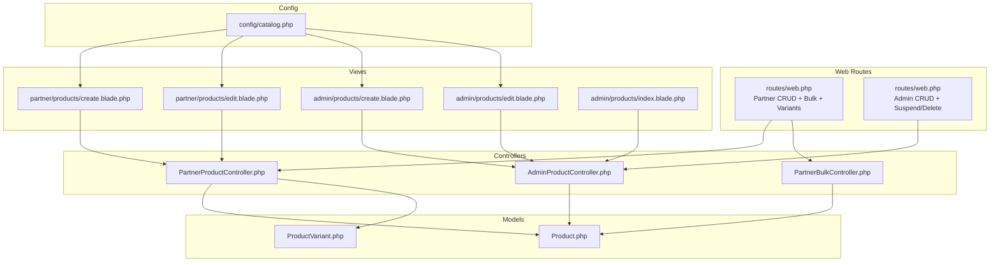

**Diagram sources**
- [web.php:119-167](file://routes/web.php#L119-L167)
- [web.php:169-239](file://routes/web.php#L169-L239)
- [PartnerProductController.php:14-337](file://app/Http/Controllers/Partner/PartnerProductController.php#L14-L337)
- [AdminProductController.php:9-37](file://app/Http/Controllers/AdminProductController.php#L9-L37)
- [PartnerBulkController.php:10-75](file://app/Http/Controllers/Partner/PartnerBulkController.php#L10-L75)
- [Product.php:9-132](file://app/Models/Product.php#L9-L132)
- [ProductVariant.php:6-23](file://app/Models/ProductVariant.php#L6-L23)
- [create.blade.php (Partner):1-300](file://resources/views/partner/products/create.blade.php#L1-L300)
- [edit.blade.php (Partner):1-274](file://resources/views/partner/products/edit.blade.php#L1-L274)
- [create.blade.php (Admin):1-191](file://resources/views/admin/products/create.blade.php#L1-L191)
- [edit.blade.php (Admin):1-196](file://resources/views/admin/products/edit.blade.php#L1-L196)
- [index.blade.php (Admin Products):1-98](file://resources/views/admin/products/index.blade.php#L1-L98)
- [catalog.php:1-141](file://config/catalog.php#L1-L141)

**Section sources**
- [web.php:119-167](file://routes/web.php#L119-L167)
- [web.php:169-239](file://routes/web.php#L169-L239)
- [PartnerProductController.php:14-337](file://app/Http/Controllers/Partner/PartnerProductController.php#L14-L337)
- [AdminProductController.php:9-37](file://app/Http/Controllers/AdminProductController.php#L9-L37)
- [PartnerBulkController.php:10-75](file://app/Http/Controllers/Partner/PartnerBulkController.php#L10-L75)
- [Product.php:9-132](file://app/Models/Product.php#L9-L132)
- [ProductVariant.php:6-23](file://app/Models/ProductVariant.php#L6-L23)
- [create.blade.php (Partner):1-300](file://resources/views/partner/products/create.blade.php#L1-L300)
- [edit.blade.php (Partner):1-274](file://resources/views/partner/products/edit.blade.php#L1-L274)
- [create.blade.php (Admin):1-191](file://resources/views/admin/products/create.blade.php#L1-L191)
- [edit.blade.php (Admin):1-196](file://resources/views/admin/products/edit.blade.php#L1-L196)
- [index.blade.php (Admin Products):1-98](file://resources/views/admin/products/index.blade.php#L1-L98)
- [catalog.php:1-141](file://config/catalog.php#L1-L141)

## Core Components
- Partner Product Controller: Implements product CRUD, image handling (upload or URL), slug generation, size chart parsing, variants management, and variant bulk save/delete.
- Admin Product Controller: Provides moderation index, suspend toggle, and hard delete.
- Partner Bulk Controller: Supports batch activation/deactivation, marking sold/new arrival, and CSV export.
- Product Model: Defines fillable attributes, casts, relationships (partner, variants, reviews, reports, questions), computed image URL, SEO helpers, and search scope.
- Product Variant Model: Defines variant attributes and casts.
- Views: Partner forms for create/edit with size charts, variants, SEO, and status toggles; Admin forms for full product management; Admin index for moderation.

**Section sources**
- [PartnerProductController.php:42-133](file://app/Http/Controllers/Partner/PartnerProductController.php#L42-L133)
- [PartnerProductController.php:149-245](file://app/Http/Controllers/Partner/PartnerProductController.php#L149-L245)
- [PartnerProductController.php:247-259](file://app/Http/Controllers/Partner/PartnerProductController.php#L247-L259)
- [PartnerProductController.php:293-335](file://app/Http/Controllers/Partner/PartnerProductController.php#L293-L335)
- [AdminProductController.php:11-29](file://app/Http/Controllers/AdminProductController.php#L11-L29)
- [AdminProductController.php:31-35](file://app/Http/Controllers/AdminProductController.php#L31-L35)
- [PartnerBulkController.php:17-41](file://app/Http/Controllers/Partner/PartnerBulkController.php#L17-L41)
- [PartnerBulkController.php:43-56](file://app/Http/Controllers/Partner/PartnerBulkController.php#L43-L56)
- [PartnerBulkController.php:58-73](file://app/Http/Controllers/Partner/PartnerBulkController.php#L58-L73)
- [Product.php:13-34](file://app/Models/Product.php#L13-L34)
- [Product.php:36-79](file://app/Models/Product.php#L36-L79)
- [Product.php:96-113](file://app/Models/Product.php#L96-L113)
- [ProductVariant.php:8-16](file://app/Models/ProductVariant.php#L8-L16)
- [create.blade.php (Partner):80-239](file://resources/views/partner/products/create.blade.php#L80-L239)
- [edit.blade.php (Partner):75-237](file://resources/views/partner/products/edit.blade.php#L75-L237)
- [create.blade.php (Admin):42-175](file://resources/views/admin/products/create.blade.php#L42-L175)
- [edit.blade.php (Admin):42-184](file://resources/views/admin/products/edit.blade.php#L42-L184)

## Architecture Overview
The system follows MVC with explicit separation of concerns:
- Web routes dispatch to controllers.
- Controllers orchestrate validation, persistence, and file storage.
- Models encapsulate domain logic and relationships.
- Views render forms and moderation UIs.
- Configuration drives product types and size chart templates.

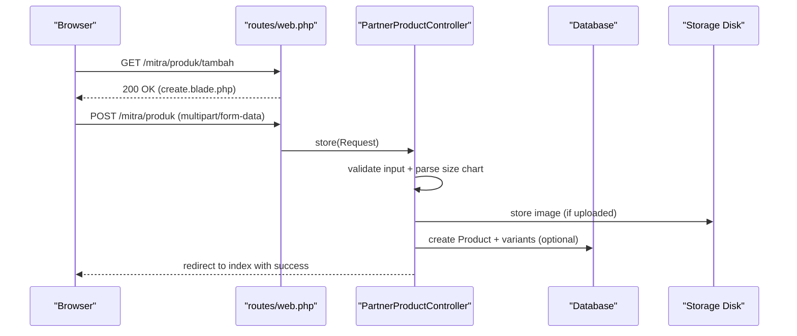

**Diagram sources**
- [web.php:127-133](file://routes/web.php#L127-L133)
- [PartnerProductController.php:42-133](file://app/Http/Controllers/Partner/PartnerProductController.php#L42-L133)
- [create.blade.php (Partner):80-81](file://resources/views/partner/products/create.blade.php#L80-L81)

## Detailed Component Analysis

### Product Data Model and Relationships
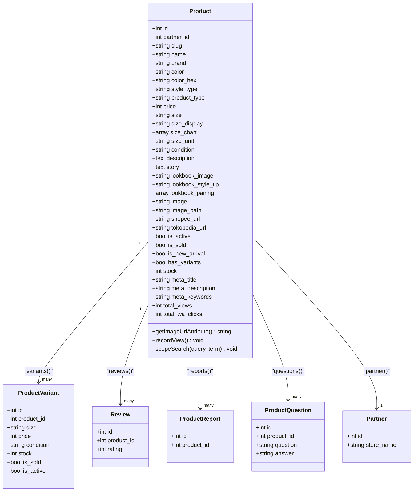

**Diagram sources**
- [Product.php:9-132](file://app/Models/Product.php#L9-L132)
- [ProductVariant.php:6-23](file://app/Models/ProductVariant.php#L6-L23)

**Section sources**
- [Product.php:13-34](file://app/Models/Product.php#L13-L34)
- [Product.php:36-79](file://app/Models/Product.php#L36-L79)
- [Product.php:96-113](file://app/Models/Product.php#L96-L113)
- [ProductVariant.php:8-16](file://app/Models/ProductVariant.php#L8-L16)

### Partner Product Creation Workflow
- Required fields validated server-side include name, brand, product_type, price, size, condition, description, and optionally image_file or image URL.
- Image handling supports either file upload (stored under a partner-scoped path) or external URL; existing file is deleted upon replacement.
- Slug is generated via a unique slug algorithm that increments suffixes if duplicates exist.
- Size chart is parsed from submitted rows; empty rows are filtered out.
- Optional features: variants, size chart, SEO metadata, and status flags (active/new arrival).
- On success, redirects to partner’s product index with a success message.

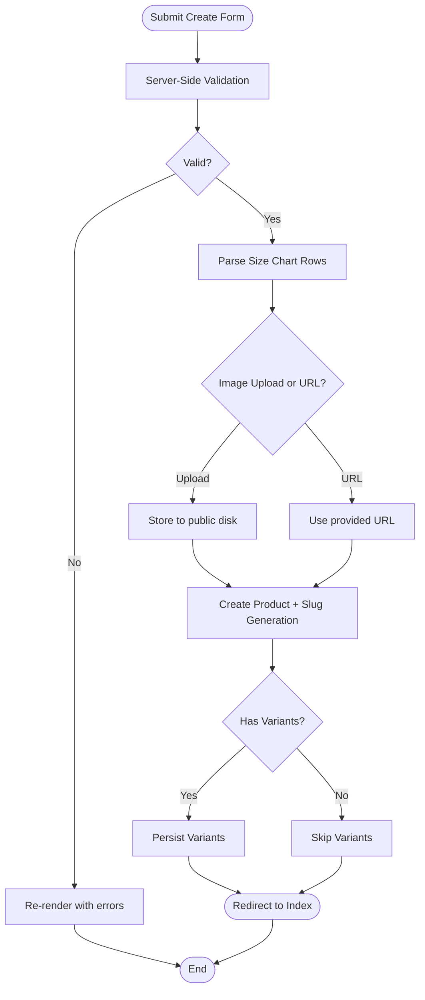

**Diagram sources**
- [PartnerProductController.php:44-73](file://app/Http/Controllers/Partner/PartnerProductController.php#L44-L73)
- [PartnerProductController.php:82-86](file://app/Http/Controllers/Partner/PartnerProductController.php#L82-L86)
- [PartnerProductController.php:261-278](file://app/Http/Controllers/Partner/PartnerProductController.php#L261-L278)
- [PartnerProductController.php:119-129](file://app/Http/Controllers/Partner/PartnerProductController.php#L119-L129)
- [create.blade.php (Partner):80-239](file://resources/views/partner/products/create.blade.php#L80-L239)

**Section sources**
- [PartnerProductController.php:42-133](file://app/Http/Controllers/Partner/PartnerProductController.php#L42-L133)
- [create.blade.php (Partner):80-239](file://resources/views/partner/products/create.blade.php#L80-L239)

### Partner Product Editing Workflow
- Edit form preloads current values and allows updating all fields, including replacing images.
- Slug is regenerated only when the name changes.
- Size chart and variants are fully replaceable; existing variants are deleted and recreated.
- Status flags include active, sold, and new arrival toggles.

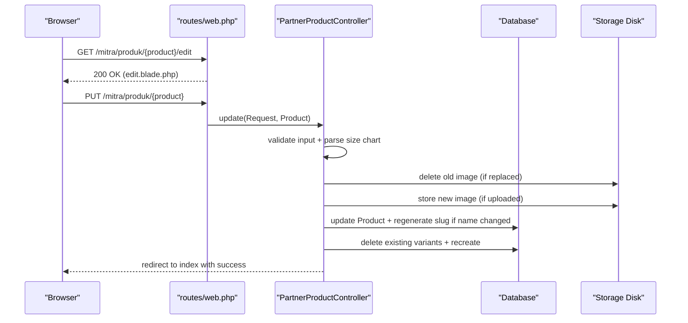

**Diagram sources**
- [web.php:131-132](file://routes/web.php#L131-L132)
- [PartnerProductController.php:149-245](file://app/Http/Controllers/Partner/PartnerProductController.php#L149-L245)
- [edit.blade.php (Partner):75-237](file://resources/views/partner/products/edit.blade.php#L75-L237)

**Section sources**
- [PartnerProductController.php:149-245](file://app/Http/Controllers/Partner/PartnerProductController.php#L149-L245)
- [edit.blade.php (Partner):75-237](file://resources/views/partner/products/edit.blade.php#L75-L237)

### Partner Product Deletion Workflow
- Soft delete semantics: the controller deletes the product record and removes associated image file from storage.
- No separate “soft delete” column exists; deletion is immediate.

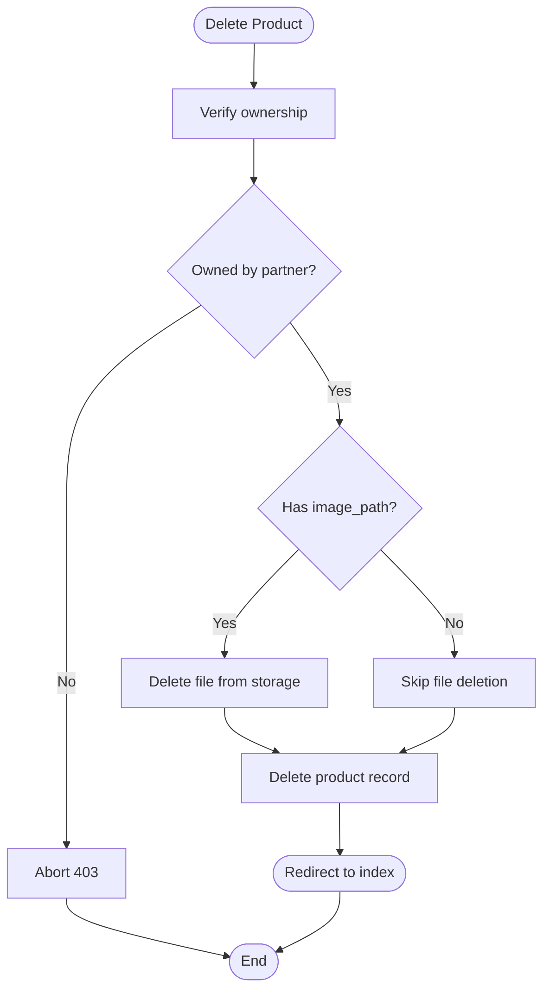

**Diagram sources**
- [PartnerProductController.php:247-259](file://app/Http/Controllers/Partner/PartnerProductController.php#L247-L259)

**Section sources**
- [PartnerProductController.php:247-259](file://app/Http/Controllers/Partner/PartnerProductController.php#L247-L259)

### Admin Moderation Workflow
- Admin index lists all products with partner attribution, category, pricing, and status badges.
- Suspend toggles active/inactive state.
- Hard delete removes the product immediately.

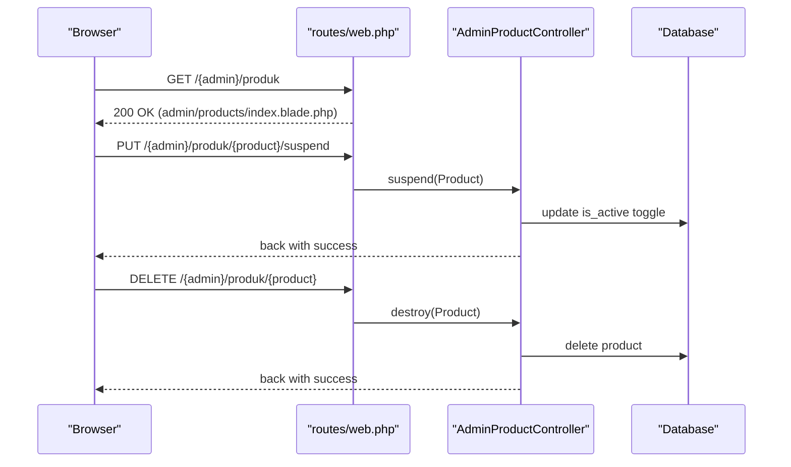

**Diagram sources**
- [web.php:186-188](file://routes/web.php#L186-L188)
- [web.php:187-188](file://routes/web.php#L187-L188)
- [AdminProductController.php:11-29](file://app/Http/Controllers/AdminProductController.php#L11-L29)
- [AdminProductController.php:31-35](file://app/Http/Controllers/AdminProductController.php#L31-L35)
- [index.blade.php (Admin Products):64-91](file://resources/views/admin/products/index.blade.php#L64-L91)

**Section sources**
- [AdminProductController.php:11-29](file://app/Http/Controllers/AdminProductController.php#L11-L29)
- [AdminProductController.php:31-35](file://app/Http/Controllers/AdminProductController.php#L31-L35)
- [index.blade.php (Admin Products):64-91](file://resources/views/admin/products/index.blade.php#L64-L91)

### Batch Updates and Export
- Bulk update supports activate/deactivate/mark sold/mark new arrival for selected products owned by the partner.
- Bulk delete removes selected owned products.
- Export generates a CSV with product metadata for the partner’s store.

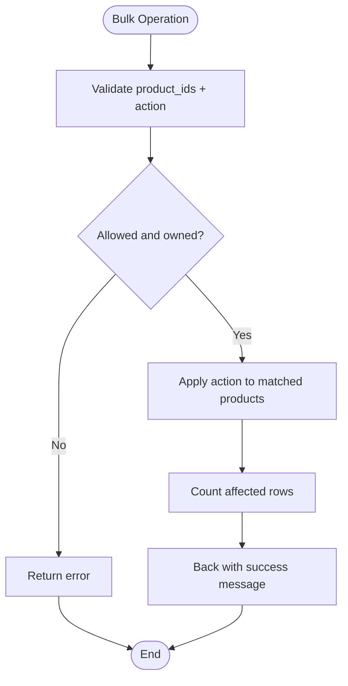

**Diagram sources**
- [web.php:135-138](file://routes/web.php#L135-L138)
- [PartnerBulkController.php:17-41](file://app/Http/Controllers/Partner/PartnerBulkController.php#L17-L41)
- [PartnerBulkController.php:43-56](file://app/Http/Controllers/Partner/PartnerBulkController.php#L43-L56)
- [PartnerBulkController.php:58-73](file://app/Http/Controllers/Partner/PartnerBulkController.php#L58-L73)

**Section sources**
- [PartnerBulkController.php:17-41](file://app/Http/Controllers/Partner/PartnerBulkController.php#L17-L41)
- [PartnerBulkController.php:43-56](file://app/Http/Controllers/Partner/PartnerBulkController.php#L43-L56)
- [PartnerBulkController.php:58-73](file://app/Http/Controllers/Partner/PartnerBulkController.php#L58-L73)

### Product Variants Management
- Variants can be saved in bulk; existing variants are deleted and replaced.
- Individual variant deletion updates has_variants flag if the last variant is removed.

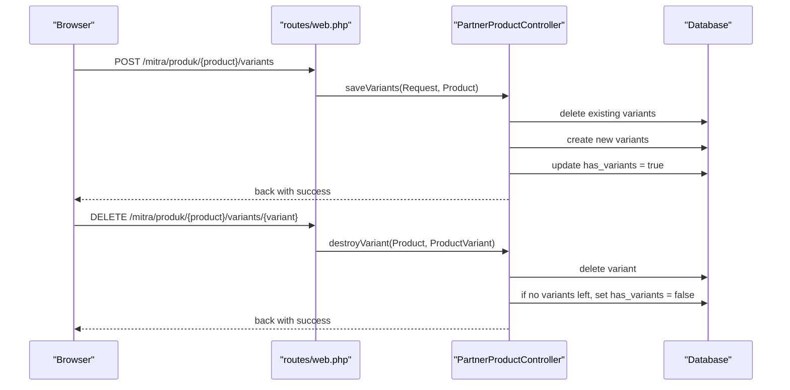

**Diagram sources**
- [web.php:140-142](file://routes/web.php#L140-L142)
- [web.php:142-142](file://routes/web.php#L142-L142)
- [PartnerProductController.php:293-321](file://app/Http/Controllers/Partner/PartnerProductController.php#L293-L321)
- [PartnerProductController.php:323-335](file://app/Http/Controllers/Partner/PartnerProductController.php#L323-L335)

**Section sources**
- [PartnerProductController.php:293-321](file://app/Http/Controllers/Partner/PartnerProductController.php#L293-L321)
- [PartnerProductController.php:323-335](file://app/Http/Controllers/Partner/PartnerProductController.php#L323-L335)

### Configuration-Driven Features
- Product types and emoji labels are configured centrally and rendered in forms and admin views.
- Size chart columns and default rows are configurable and used in both partner and admin forms.

**Section sources**
- [catalog.php:14-28](file://config/catalog.php#L14-L28)
- [catalog.php:55-70](file://config/catalog.php#L55-L70)
- [create.blade.php (Partner):93-96](file://resources/views/partner/products/create.blade.php#L93-L96)
- [edit.blade.php (Partner):87-90](file://resources/views/partner/products/edit.blade.php#L87-L90)
- [create.blade.php (Admin):76-82](file://resources/views/admin/products/create.blade.php#L76-L82)
- [edit.blade.php (Admin):77-82](file://resources/views/admin/products/edit.blade.php#L77-L82)

### API Endpoints and Authentication
- A minimal authenticated endpoint returns the current user via Sanctum.
- Product CRUD and moderation are handled via web routes; no dedicated product API endpoints are present.

**Section sources**
- [api.php:17-19](file://routes/api.php#L17-L19)
- [web.php:119-167](file://routes/web.php#L119-L167)
- [web.php:169-239](file://routes/web.php#L169-L239)

## Dependency Analysis
- Controllers depend on models and Laravel Storage for file operations.
- Views depend on configuration for product types and size chart templates.
- Routes bind URLs to controllers for CRUD, bulk, variants, and moderation.

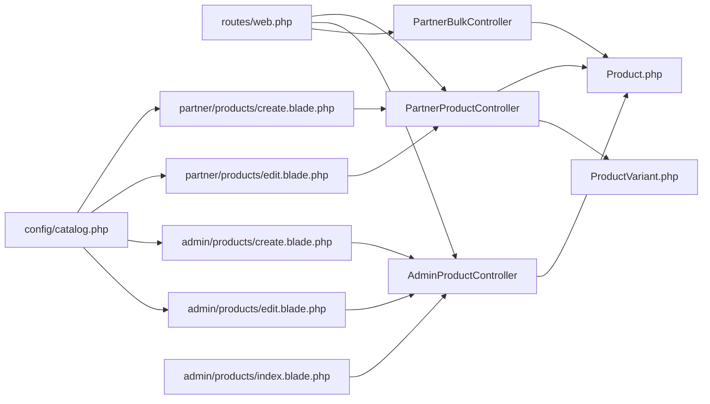

**Diagram sources**
- [web.php:119-167](file://routes/web.php#L119-L167)
- [web.php:169-239](file://routes/web.php#L169-L239)
- [PartnerProductController.php:14-337](file://app/Http/Controllers/Partner/PartnerProductController.php#L14-L337)
- [AdminProductController.php:9-37](file://app/Http/Controllers/AdminProductController.php#L9-L37)
- [PartnerBulkController.php:10-75](file://app/Http/Controllers/Partner/PartnerBulkController.php#L10-L75)
- [Product.php:9-132](file://app/Models/Product.php#L9-L132)
- [ProductVariant.php:6-23](file://app/Models/ProductVariant.php#L6-L23)
- [create.blade.php (Partner):1-300](file://resources/views/partner/products/create.blade.php#L1-L300)
- [edit.blade.php (Partner):1-274](file://resources/views/partner/products/edit.blade.php#L1-L274)
- [create.blade.php (Admin):1-191](file://resources/views/admin/products/create.blade.php#L1-L191)
- [edit.blade.php (Admin):1-196](file://resources/views/admin/products/edit.blade.php#L1-L196)
- [index.blade.php (Admin Products):1-98](file://resources/views/admin/products/index.blade.php#L1-L98)
- [catalog.php:1-141](file://config/catalog.php#L1-L141)

**Section sources**
- [web.php:119-167](file://routes/web.php#L119-L167)
- [web.php:169-239](file://routes/web.php#L169-L239)
- [PartnerProductController.php:14-337](file://app/Http/Controllers/Partner/PartnerProductController.php#L14-L337)
- [AdminProductController.php:9-37](file://app/Http/Controllers/AdminProductController.php#L9-L37)
- [PartnerBulkController.php:10-75](file://app/Http/Controllers/Partner/PartnerBulkController.php#L10-L75)
- [Product.php:9-132](file://app/Models/Product.php#L9-L132)
- [ProductVariant.php:6-23](file://app/Models/ProductVariant.php#L6-L23)
- [create.blade.php (Partner):1-300](file://resources/views/partner/products/create.blade.php#L1-L300)
- [edit.blade.php (Partner):1-274](file://resources/views/partner/products/edit.blade.php#L1-L274)
- [create.blade.php (Admin):1-191](file://resources/views/admin/products/create.blade.php#L1-L191)
- [edit.blade.php (Admin):1-196](file://resources/views/admin/products/edit.blade.php#L1-L196)
- [index.blade.php (Admin Products):1-98](file://resources/views/admin/products/index.blade.php#L1-L98)
- [catalog.php:1-141](file://config/catalog.php#L1-L141)

## Performance Considerations
- Image storage: Prefer CDN-backed URLs for production; local storage can be slow for large volumes.
- Slug generation: The unique slug loop may be O(n^2) in worst-case collisions; consider indexing slugs and caching base slugs.
- Bulk operations: Use chunked updates for very large selections to avoid memory pressure.
- Search scope: Fulltext search relies on database capabilities; ensure proper indexes for MySQL or fallback logic for others.

[No sources needed since this section provides general guidance]

## Troubleshooting Guide
- Validation errors: Forms re-render with error messages for invalid fields (e.g., missing required fields, invalid image types, or out-of-range numeric values).
- Ownership checks: Partner endpoints abort with 403 if the product does not belong to the authenticated partner.
- Image replacement: Uploading a new file replaces the previous stored file; ensure the old file is deleted to prevent orphaned blobs.
- Size chart parsing: Empty rows are ignored; ensure at least one row remains if size chart is enabled.
- Variants replacement: Saving variants deletes all prior variants; back up or review before bulk updates.
- Admin moderation: Suspend toggles active state; hard delete removes records immediately.

**Section sources**
- [PartnerProductController.php:44-73](file://app/Http/Controllers/Partner/PartnerProductController.php#L44-L73)
- [PartnerProductController.php:137-151](file://app/Http/Controllers/Partner/PartnerProductController.php#L137-L151)
- [PartnerProductController.php:189-194](file://app/Http/Controllers/Partner/PartnerProductController.php#L189-L194)
- [PartnerProductController.php:261-278](file://app/Http/Controllers/Partner/PartnerProductController.php#L261-L278)
- [PartnerProductController.php:230-241](file://app/Http/Controllers/Partner/PartnerProductController.php#L230-L241)
- [AdminProductController.php:24-29](file://app/Http/Controllers/AdminProductController.php#L24-L29)

## Conclusion
KatalogThrift provides a robust, configuration-driven product management system for partners and administrators. Partners can efficiently create, update, and manage products with rich metadata, variants, and size charts, while administrators can moderate content and enforce quality standards. The architecture cleanly separates concerns and leverages Laravel’s validation, Eloquent, and storage facilities to deliver a scalable solution.

[No sources needed since this section summarizes without analyzing specific files]

## Appendices

### Step-by-Step Examples

- Add a new product (Partner)
  1. Navigate to the create page.
  2. Fill required fields: name, brand, product_type, price, size, condition, description.
  3. Choose image via upload or URL.
  4. Optionally enable size chart and variants.
  5. Set SEO fields and status flags.
  6. Submit; on success, the product appears in the partner index.

- Edit a product (Partner)
  1. Open the edit page for the target product.
  2. Update any field; optionally replace the image.
  3. Adjust size chart and variants as needed.
  4. Toggle status flags (active, sold, new arrival).
  5. Submit; success feedback confirms changes.

- Delete a product (Partner)
  1. Access the product edit page.
  2. Initiate deletion; confirm the action.
  3. The product is removed and the associated image is deleted.

- Moderate a product (Admin)
  1. Visit the admin products index.
  2. Toggle active/inactive or delete the product.
  3. Confirm actions; success messages appear.

- Batch operations (Partner)
  1. Select multiple products on the index.
  2. Choose bulk action: activate, deactivate, mark sold, or mark new arrival.
  3. Export CSV for reporting.

**Section sources**
- [create.blade.php (Partner):80-239](file://resources/views/partner/products/create.blade.php#L80-L239)
- [edit.blade.php (Partner):75-237](file://resources/views/partner/products/edit.blade.php#L75-L237)
- [index.blade.php (Admin Products):64-91](file://resources/views/admin/products/index.blade.php#L64-L91)
- [PartnerBulkController.php:17-41](file://app/Http/Controllers/Partner/PartnerBulkController.php#L17-L41)
- [PartnerBulkController.php:58-73](file://app/Http/Controllers/Partner/PartnerBulkController.php#L58-L73)

### Data Model Reference

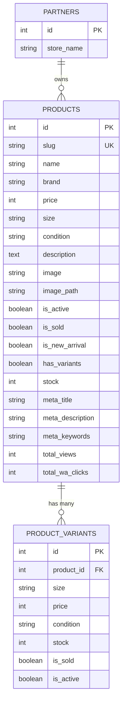

**Diagram sources**
- [2026_05_04_125734_create_products_table.php:14-26](file://database/migrations/2026_05_04_125734_create_products_table.php#L14-L26)
- [Product.php:13-34](file://app/Models/Product.php#L13-L34)
- [ProductVariant.php:8-16](file://app/Models/ProductVariant.php#L8-L16)