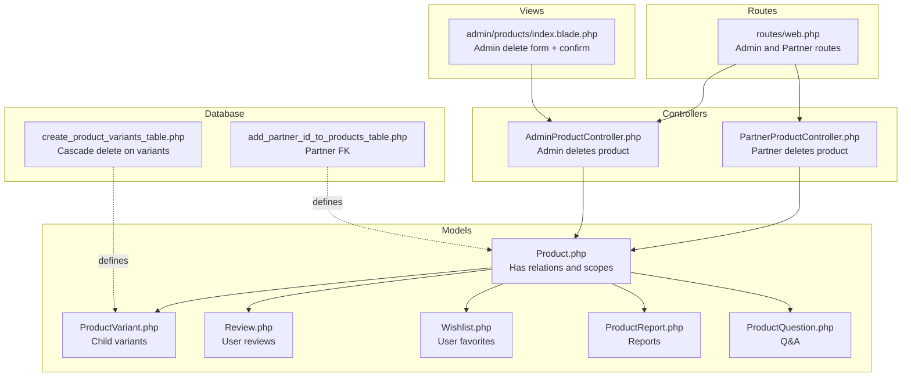
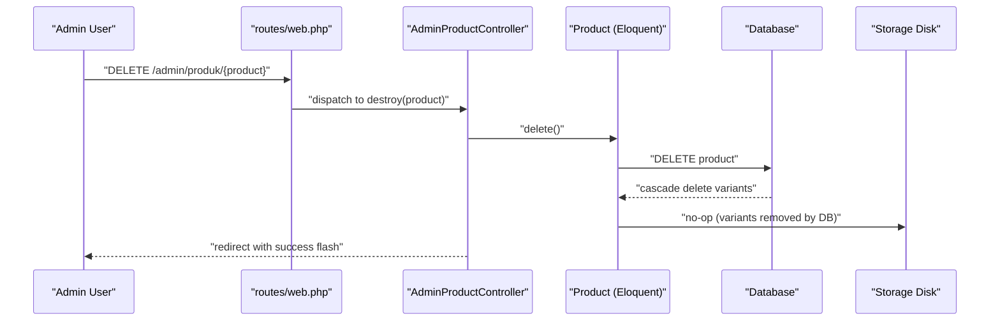
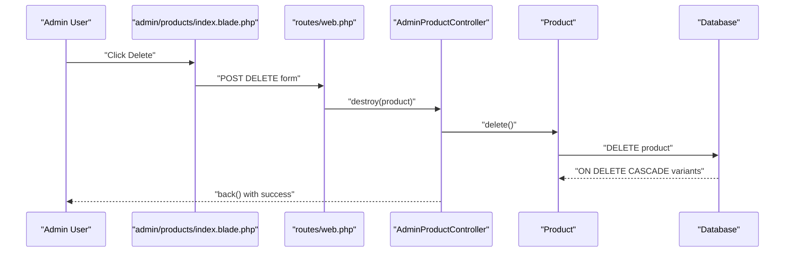
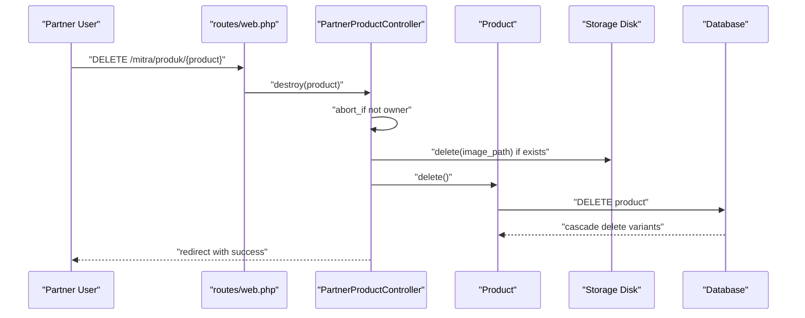
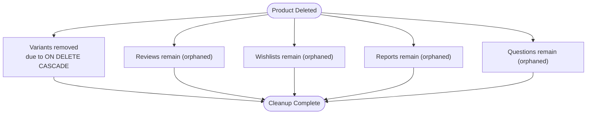
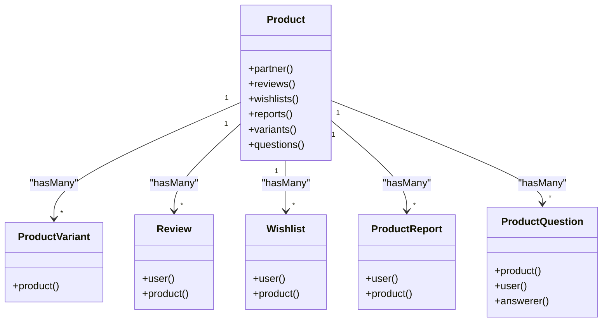

# Product Deletion Process

<cite>
**Referenced Files in This Document**
- [AdminProductController.php](file://app/Http/Controllers/AdminProductController.php)
- [PartnerProductController.php](file://app/Http/Controllers/Partner/PartnerProductController.php)
- [Product.php](file://app/Models/Product.php)
- [ProductVariant.php](file://app/Models/ProductVariant.php)
- [Review.php](file://app/Models/Review.php)
- [Wishlist.php](file://app/Models/Wishlist.php)
- [ProductReport.php](file://app/Models/ProductReport.php)
- [ProductQuestion.php](file://app/Models/ProductQuestion.php)
- [2026_07_01_100002_create_product_variants_table.php](file://database/migrations/2026_07_01_100002_create_product_variants_table.php)
- [2026_05_24_093340_add_partner_id_to_products_table.php](file://database/migrations/2026_05_24_093340_add_partner_id_to_products_table.php)
- [index.blade.php](file://resources/views/admin/products/index.blade.php)
- [web.php](file://routes/web.php)
- [EnsureAdminAuthenticated.php](file://app/Http/Middleware/EnsureAdminAuthenticated.php)
- [EnsurePartnerAuthenticated.php](file://app/Http/Middleware/EnsurePartnerAuthenticated.php)
</cite>

## Table of Contents
1. [Introduction](#introduction)
2. [Project Structure](#project-structure)
3. [Core Components](#core-components)
4. [Architecture Overview](#architecture-overview)
5. [Detailed Component Analysis](#detailed-component-analysis)
6. [Dependency Analysis](#dependency-analysis)
7. [Performance Considerations](#performance-considerations)
8. [Troubleshooting Guide](#troubleshooting-guide)
9. [Conclusion](#conclusion)
10. [Appendices](#appendices)

## Introduction
This document describes the complete product deletion process in KatalogThrift, covering permission checks, cascade deletion behavior, image file cleanup, and associated data cleanup. It also documents the deletion interface, confirmation dialogs, success/error feedback, and the impact on dependent records such as variants, reviews, wishlists, reports, and questions. Security measures preventing unauthorized deletions are explained, along with safe deletion practices, backup considerations, data retention policies, and troubleshooting guidance for deletion failures and orphaned records.

## Project Structure
The product deletion workflow spans controller actions, Eloquent model relationships, database migrations defining foreign keys and cascades, Blade templates rendering confirmation dialogs, and routing/middleware enforcing permissions.

**Diagram sources**
- [web.php:169-239](file://routes/web.php#L169-L239)
- [AdminProductController.php:31-35](file://app/Http/Controllers/AdminProductController.php#L31-L35)
- [PartnerProductController.php:247-259](file://app/Http/Controllers/Partner/PartnerProductController.php#L247-L259)
- [Product.php:36-79](file://app/Models/Product.php#L36-L79)
- [ProductVariant.php:18-21](file://app/Models/ProductVariant.php#L18-L21)
- [Review.php:20-28](file://app/Models/Review.php#L20-L28)
- [Wishlist.php:19-27](file://app/Models/Wishlist.php#L19-L27)
- [ProductReport.php:17-25](file://app/Models/ProductReport.php#L17-L25)
- [ProductQuestion.php:17-30](file://app/Models/ProductQuestion.php#L17-L30)
- [2026_07_01_100002_create_product_variants_table.php:20](file://database/migrations/2026_07_01_100002_create_product_variants_table.php#L20)
- [2026_05_24_093340_add_partner_id_to_products_table.php:14](file://database/migrations/2026_05_24_093340_add_partner_id_to_products_table.php#L14)
- [index.blade.php:84-87](file://resources/views/admin/products/index.blade.php#L84-L87)

**Section sources**
- [web.php:169-239](file://routes/web.php#L169-L239)
- [AdminProductController.php:11-35](file://app/Http/Controllers/AdminProductController.php#L11-L35)
- [PartnerProductController.php:247-259](file://app/Http/Controllers/Partner/PartnerProductController.php#L247-L259)
- [Product.php:36-79](file://app/Models/Product.php#L36-L79)
- [ProductVariant.php:18-21](file://app/Models/ProductVariant.php#L18-L21)
- [2026_07_01_100002_create_product_variants_table.php:20](file://database/migrations/2026_07_01_100002_create_product_variants_table.php#L20)
- [2026_05_24_093340_add_partner_id_to_products_table.php:14](file://database/migrations/2026_05_24_093340_add_partner_id_to_products_table.php#L14)
- [index.blade.php:84-87](file://resources/views/admin/products/index.blade.php#L84-L87)

## Core Components
- Admin deletion endpoint: Deletes a product after toggling activation state via the admin panel.
- Partner deletion endpoint: Deletes a product and removes uploaded image files from storage.
- Product model: Defines relationships to variants, reviews, wishlists, reports, questions, and provides helper attributes.
- Product variant model: Defines the child variant entity with a foreign key to product and cascade deletion policy.
- Middleware: Enforces admin and partner authentication and approval status.
- Views: Render confirmation dialogs for admin deletion.

Key implementation references:
- Admin deletion action and view confirmation dialog
- Partner deletion action with image cleanup
- Product model relationships and helper attributes
- Variant cascade deletion policy
- Route bindings and middleware protections

**Section sources**
- [AdminProductController.php:31-35](file://app/Http/Controllers/AdminProductController.php#L31-L35)
- [index.blade.php:84-87](file://resources/views/admin/products/index.blade.php#L84-L87)
- [PartnerProductController.php:247-259](file://app/Http/Controllers/Partner/PartnerProductController.php#L247-L259)
- [Product.php:36-79](file://app/Models/Product.php#L36-L79)
- [ProductVariant.php:18-21](file://app/Models/ProductVariant.php#L18-L21)
- [2026_07_01_100002_create_product_variants_table.php:20](file://database/migrations/2026_07_01_100002_create_product_variants_table.php#L20)
- [web.php:169-239](file://routes/web.php#L169-L239)

## Architecture Overview
The deletion workflow follows a layered pattern:
- HTTP requests reach controllers via named routes.
- Controllers enforce permissions and ownership.
- Controllers trigger model deletion.
- Eloquent relationships and database foreign keys manage cascade deletion of child records.
- Storage disk cleanup is performed for uploaded images.

**Diagram sources**
- [web.php:188](file://routes/web.php#L188)
- [AdminProductController.php:31-35](file://app/Http/Controllers/AdminProductController.php#L31-L35)
- [Product.php:36-79](file://app/Models/Product.php#L36-L79)
- [2026_07_01_100002_create_product_variants_table.php:20](file://database/migrations/2026_07_01_100002_create_product_variants_table.php#L20)

## Detailed Component Analysis

### Admin Product Deletion
- Endpoint: DELETE /admin/produk/{product}
- Permission: Requires admin session via middleware.
- Behavior: Calls Product::delete(), which triggers database-level cascade deletion of variants per migration definition.
- Feedback: Returns to the admin product index with a success message.

**Diagram sources**
- [index.blade.php:84-87](file://resources/views/admin/products/index.blade.php#L84-L87)
- [web.php:188](file://routes/web.php#L188)
- [AdminProductController.php:31-35](file://app/Http/Controllers/AdminProductController.php#L31-L35)
- [2026_07_01_100002_create_product_variants_table.php:20](file://database/migrations/2026_07_01_100002_create_product_variants_table.php#L20)

**Section sources**
- [web.php:188](file://routes/web.php#L188)
- [AdminProductController.php:31-35](file://app/Http/Controllers/AdminProductController.php#L31-L35)
- [index.blade.php:84-87](file://resources/views/admin/products/index.blade.php#L84-L87)
- [EnsureAdminAuthenticated.php:18-22](file://app/Http/Middleware/EnsureAdminAuthenticated.php#L18-L22)

### Partner Product Deletion
- Endpoint: DELETE /mitra/produk/{product}
- Ownership check: Ensures the product belongs to the authenticated partner.
- Image cleanup: Removes the stored image file from the public disk if present.
- Deletion: Deletes the product record.
- Feedback: Redirects to the partner’s product index with a success message.

**Diagram sources**
- [web.php:133](file://routes/web.php#L133)
- [PartnerProductController.php:247-259](file://app/Http/Controllers/Partner/PartnerProductController.php#L247-L259)
- [2026_07_01_100002_create_product_variants_table.php:20](file://database/migrations/2026_07_01_100002_create_product_variants_table.php#L20)

**Section sources**
- [web.php:133](file://routes/web.php#L133)
- [PartnerProductController.php:247-259](file://app/Http/Controllers/Partner/PartnerProductController.php#L247-L259)
- [EnsurePartnerAuthenticated.php:13-23](file://app/Http/Middleware/EnsurePartnerAuthenticated.php#L13-L23)

### Cascade Deletion and Dependent Records
- Variants: Product deletion triggers ON DELETE CASCADE for variants due to migration foreign key definition.
- Reviews: No explicit cascade is defined in the migration; therefore, deleting a product does not automatically remove reviews. Reviews remain as orphaned records unless handled separately.
- Wishlists: No explicit cascade is defined; wishlists remain as orphaned records after product deletion.
- Reports: No explicit cascade is defined; reports remain as orphaned records after product deletion.
- Questions: No explicit cascade is defined; questions remain as orphaned records after product deletion.

**Diagram sources**
- [2026_07_01_100002_create_product_variants_table.php:20](file://database/migrations/2026_07_01_100002_create_product_variants_table.php#L20)
- [Product.php:41-79](file://app/Models/Product.php#L41-L79)

**Section sources**
- [2026_07_01_100002_create_product_variants_table.php:20](file://database/migrations/2026_07_01_100002_create_product_variants_table.php#L20)
- [Product.php:41-79](file://app/Models/Product.php#L41-L79)
- [Review.php:20-28](file://app/Models/Review.php#L20-L28)
- [Wishlist.php:19-27](file://app/Models/Wishlist.php#L19-L27)
- [ProductReport.php:17-25](file://app/Models/ProductReport.php#L17-L25)
- [ProductQuestion.php:17-30](file://app/Models/ProductQuestion.php#L17-L30)

### Deletion Confirmation Dialogs
- Admin deletion: The admin product index page renders a form with a JavaScript confirmation prompt prior to submission. The form uses CSRF and method spoofing for DELETE.
- Partner deletion: Partner-side deletion occurs via partner routes and controllers without an explicit confirmation dialog in the provided controller code.

**Section sources**
- [index.blade.php:84-87](file://resources/views/admin/products/index.blade.php#L84-L87)
- [web.php:133](file://routes/web.php#L133)

### Image File Removal
- Partner deletion: If the product has an image_path, the controller deletes the file from the public disk before deleting the product record.
- Admin deletion: Does not perform explicit image removal; only the product record is deleted. Variants are cascade-deleted at the database level.

**Section sources**
- [PartnerProductController.php:251-253](file://app/Http/Controllers/Partner/PartnerProductController.php#L251-L253)
- [AdminProductController.php:33](file://app/Http/Controllers/AdminProductController.php#L33)

### Relationship Between Product Deletion and Dependent Records
- Variants: Automatically removed via database cascade.
- Reviews, Wishlists, Reports, Questions: Not removed automatically; require separate cleanup processes if desired.

**Section sources**
- [2026_07_01_100002_create_product_variants_table.php:20](file://database/migrations/2026_07_01_100002_create_product_variants_table.php#L20)
- [Product.php:41-79](file://app/Models/Product.php#L41-L79)

### Security Measures
- Admin deletion requires admin authentication via session middleware.
- Partner deletion requires partner authentication and approval status checks.
- Ownership checks: Partner deletion aborts if the product does not belong to the authenticated partner.
- CSRF protection: Forms use CSRF tokens and method spoofing for DELETE.

**Section sources**
- [EnsureAdminAuthenticated.php:18-22](file://app/Http/Middleware/EnsureAdminAuthenticated.php#L18-L22)
- [EnsurePartnerAuthenticated.php:13-23](file://app/Http/Middleware/EnsurePartnerAuthenticated.php#L13-L23)
- [PartnerProductController.php:249](file://app/Http/Controllers/Partner/PartnerProductController.php#L249)
- [index.blade.php:84-87](file://resources/views/admin/products/index.blade.php#L84-L87)

### Impact on Search Indexing, Favorites, and Analytics
- Search indexing: Product deletion removes the product from the index; dependent records (variants) are also removed via cascade. Reviews, wishlists, reports, and questions are not automatically removed, so their presence does not affect search results unless re-indexed.
- Favorites (Wishlist): Wishlisted items persist post-deletion; administrators should consider removing favorites during bulk cleanup if needed.
- Analytics: Product views and related metrics are lost upon deletion; historical analytics data remains unaffected.

[No sources needed since this section provides general guidance]

## Dependency Analysis

**Diagram sources**
- [Product.php:36-79](file://app/Models/Product.php#L36-L79)
- [ProductVariant.php:18-21](file://app/Models/ProductVariant.php#L18-L21)
- [Review.php:20-28](file://app/Models/Review.php#L20-L28)
- [Wishlist.php:19-27](file://app/Models/Wishlist.php#L19-L27)
- [ProductReport.php:17-25](file://app/Models/ProductReport.php#L17-L25)
- [ProductQuestion.php:17-30](file://app/Models/ProductQuestion.php#L17-L30)

**Section sources**
- [Product.php:36-79](file://app/Models/Product.php#L36-L79)
- [ProductVariant.php:18-21](file://app/Models/ProductVariant.php#L18-L21)
- [Review.php:20-28](file://app/Models/Review.php#L20-L28)
- [Wishlist.php:19-27](file://app/Models/Wishlist.php#L19-L27)
- [ProductReport.php:17-25](file://app/Models/ProductReport.php#L17-L25)
- [ProductQuestion.php:17-30](file://app/Models/ProductQuestion.php#L17-L30)

## Performance Considerations
- Database cascade deletion is efficient and prevents orphaned variant records.
- Image deletion for partner products avoids accumulating unused files.
- Avoid unnecessary preloading of large relations before deletion to minimize memory usage.

[No sources needed since this section provides general guidance]

## Troubleshooting Guide
Common issues and resolutions:
- Unauthorized deletion attempts:
  - Symptom: Access denied errors for admin or partner routes.
  - Cause: Missing or invalid admin session or unapproved partner account.
  - Resolution: Ensure proper authentication and approval status.

- Missing confirmation dialog for admin deletion:
  - Symptom: Immediate deletion without prompt.
  - Cause: Client-side confirmation relies on the rendered form.
  - Resolution: Verify the confirmation prompt is present in the view.

- Orphaned dependent records:
  - Symptom: Reviews, wishlists, reports, or questions persist after product deletion.
  - Cause: No automatic cascade for these relations.
  - Resolution: Implement batch cleanup routines to remove dependent records if required.

- Image file not removed:
  - Symptom: Disk space not reclaimed after deletion.
  - Cause: Admin deletion does not remove image files; only partner deletion removes stored files.
  - Resolution: Use partner deletion flow or manually remove files from storage.

- Route not found or method mismatch:
  - Symptom: 404 or 405 errors.
  - Cause: Incorrect route name or missing method spoofing.
  - Resolution: Confirm route names and ensure DELETE method with CSRF token.

**Section sources**
- [EnsureAdminAuthenticated.php:18-22](file://app/Http/Middleware/EnsureAdminAuthenticated.php#L18-L22)
- [EnsurePartnerAuthenticated.php:13-23](file://app/Http/Middleware/EnsurePartnerAuthenticated.php#L13-L23)
- [index.blade.php:84-87](file://resources/views/admin/products/index.blade.php#L84-L87)
- [PartnerProductController.php:251-253](file://app/Http/Controllers/Partner/PartnerProductController.php#L251-L253)
- [web.php:133](file://routes/web.php#L133)
- [web.php:188](file://routes/web.php#L188)

## Conclusion
KatalogThrift implements a clear product deletion workflow with distinct paths for admins and partners. Admin deletion leverages database cascade deletion for variants while preserving other dependent records. Partner deletion includes image cleanup and ownership verification. Confirmation dialogs are provided for admin deletion, and robust middleware ensures authorized access. Administrators should plan for manual cleanup of orphaned dependent records if necessary and consider backup and retention policies aligned with business requirements.

[No sources needed since this section summarizes without analyzing specific files]

## Appendices

### Safe Deletion Practices
- Back up product data and media before bulk deletions.
- Prefer partner deletion flow for products with stored images to ensure file cleanup.
- Use admin deletion for quick removal of inactive or flagged products.
- Periodically audit orphaned dependent records and clean them up according to retention policies.

[No sources needed since this section provides general guidance]

### Backup and Retention Policies
- Maintain regular database backups.
- Archive product media files off-site if required by policy.
- Define retention windows for reviews, wishlists, reports, and questions.

[No sources needed since this section provides general guidance]