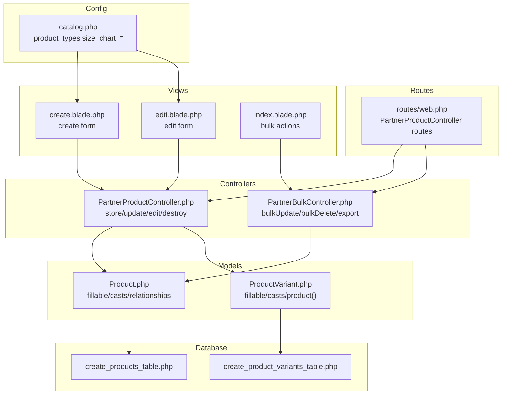
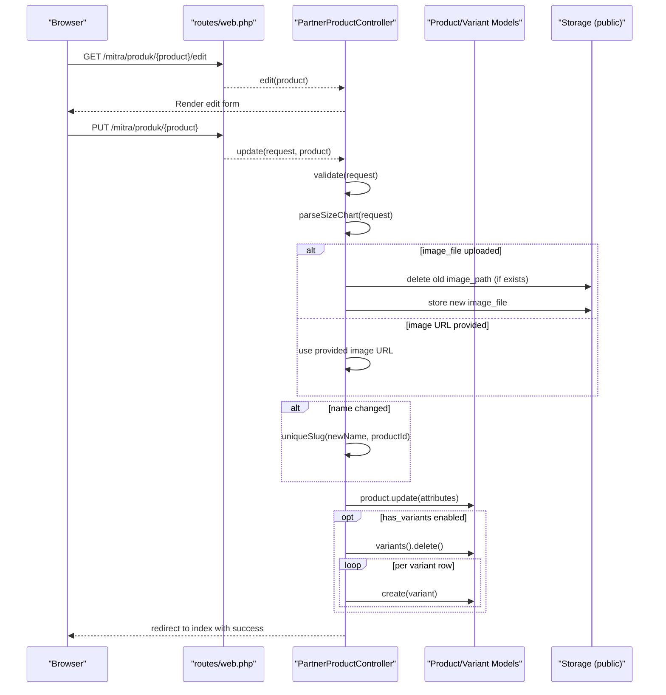
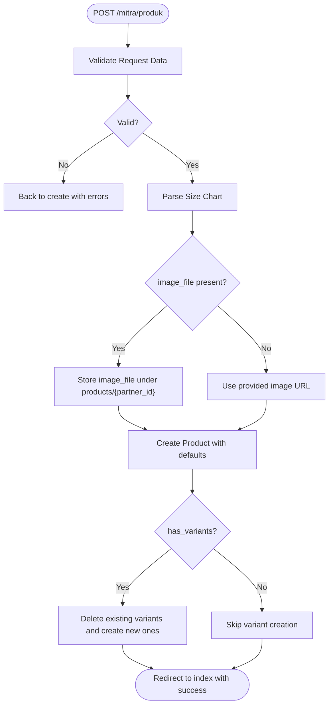
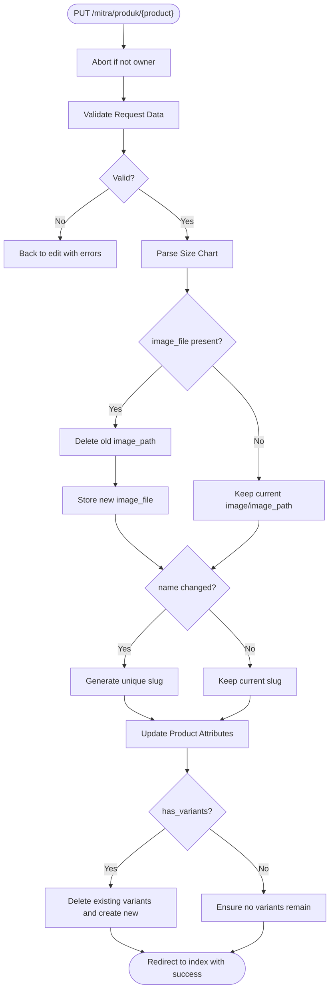
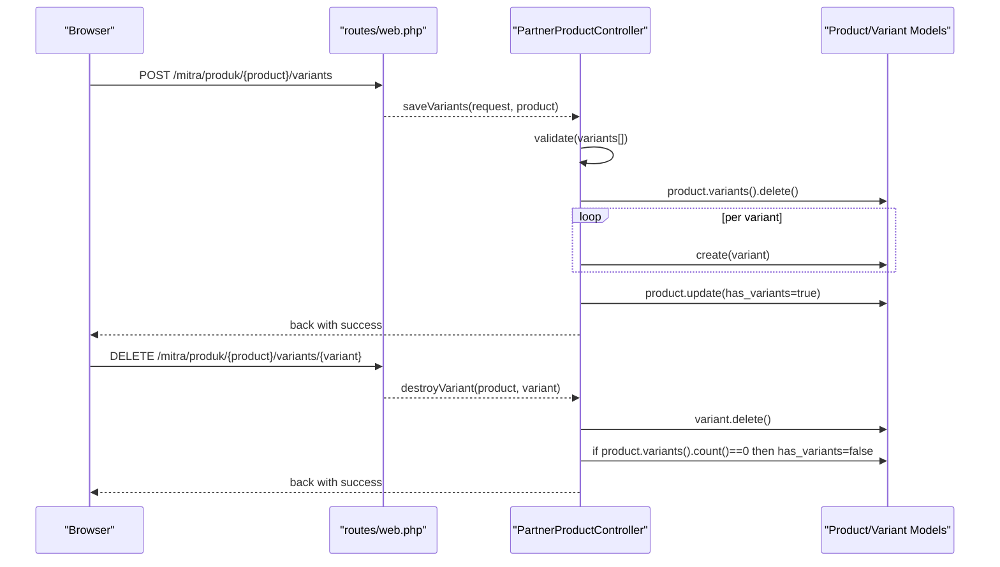
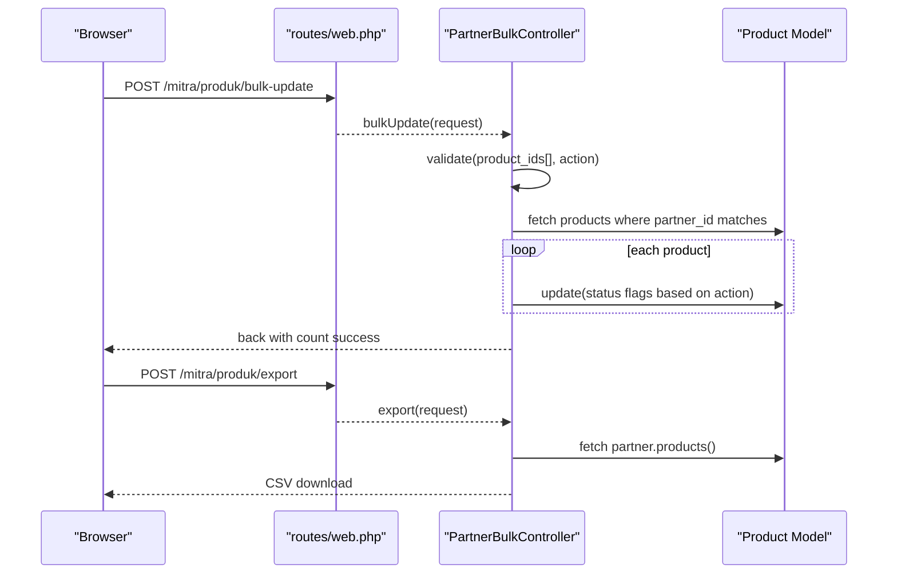
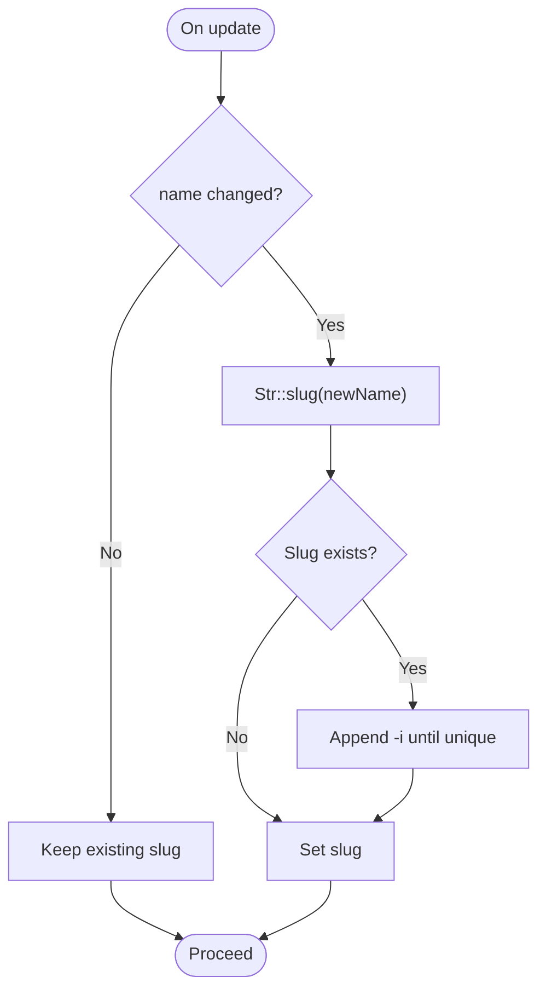
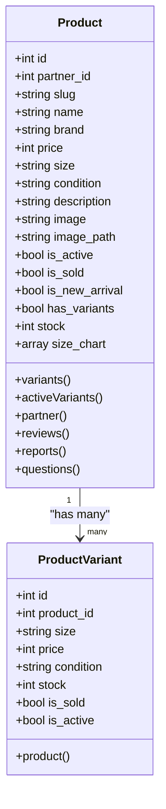
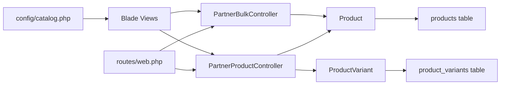

# Product Editing and Management

<cite>
**Referenced Files in This Document**
- [PartnerProductController.php](file://app/Http/Controllers/Partner/PartnerProductController.php)
- [PartnerBulkController.php](file://app/Http/Controllers/Partner/PartnerBulkController.php)
- [Product.php](file://app/Models/Product.php)
- [ProductVariant.php](file://app/Models/ProductVariant.php)
- [create.blade.php](file://resources/views/partner/products/create.blade.php)
- [edit.blade.php](file://resources/views/partner/products/edit.blade.php)
- [index.blade.php](file://resources/views/partner/products/index.blade.php)
- [web.php](file://routes/web.php)
- [catalog.php](file://config/catalog.php)
- [2026_05_04_125734_create_products_table.php](file://database/migrations/2026_05_04_125734_create_products_table.php)
- [2026_07_01_100002_create_product_variants_table.php](file://database/migrations/2026_07_01_100002_create_product_variants_table.php)
</cite>

## Table of Contents
1. [Introduction](#introduction)
2. [Project Structure](#project-structure)
3. [Core Components](#core-components)
4. [Architecture Overview](#architecture-overview)
5. [Detailed Component Analysis](#detailed-component-analysis)
6. [Dependency Analysis](#dependency-analysis)
7. [Performance Considerations](#performance-considerations)
8. [Troubleshooting Guide](#troubleshooting-guide)
9. [Conclusion](#conclusion)
10. [Appendices](#appendices)

## Introduction
This document explains the product editing and management capabilities in KatalogThrift from the partner perspective. It covers the end-to-end workflow for creating, updating, and managing products, including field validation, data updates, change tracking via slugs, variant management, price and stock adjustments, image replacement, external store URL updates, metadata editing, bulk operations, and product deactivation. It also documents slug generation for renamed products, URL structure maintenance, and guidance for handling concurrent edits, validation failures, and data consistency.

## Project Structure
The product management feature spans controllers, models, Blade views, routes, configuration, and database migrations:
- Controllers handle HTTP requests and orchestrate model updates and view rendering.
- Models define fillable attributes, casts, relationships, and helper accessors.
- Blade templates provide the partner-facing forms for creating and editing products.
- Routes bind URLs to controller actions.
- Configuration defines product types, size chart columns, and defaults.
- Migrations define the underlying schema for products and variants.

**Diagram sources**
- [web.php:127-142](file://routes/web.php#L127-L142)
- [PartnerProductController.php:42-245](file://app/Http/Controllers/Partner/PartnerProductController.php#L42-L245)
- [PartnerBulkController.php:17-74](file://app/Http/Controllers/Partner/PartnerBulkController.php#L17-L74)
- [Product.php:13-34](file://app/Models/Product.php#L13-L34)
- [ProductVariant.php:8-16](file://app/Models/ProductVariant.php#L8-L16)
- [create.blade.php:80-239](file://resources/views/partner/products/create.blade.php#L80-L239)
- [edit.blade.php:75-237](file://resources/views/partner/products/edit.blade.php#L75-L237)
- [index.blade.php:86-210](file://resources/views/partner/products/index.blade.php#L86-L210)
- [catalog.php:14-70](file://config/catalog.php#L14-L70)
- [2026_05_04_125734_create_products_table.php:14-26](file://database/migrations/2026_05_04_125734_create_products_table.php#L14-L26)
- [2026_07_01_100002_create_product_variants_table.php:10-22](file://database/migrations/2026_07_01_100002_create_product_variants_table.php#L10-L22)

**Section sources**
- [web.php:127-142](file://routes/web.php#L127-L142)
- [PartnerProductController.php:42-245](file://app/Http/Controllers/Partner/PartnerProductController.php#L42-L245)
- [PartnerBulkController.php:17-74](file://app/Http/Controllers/Partner/PartnerBulkController.php#L17-L74)
- [Product.php:13-34](file://app/Models/Product.php#L13-L34)
- [ProductVariant.php:8-16](file://app/Models/ProductVariant.php#L8-L16)
- [create.blade.php:80-239](file://resources/views/partner/products/create.blade.php#L80-L239)
- [edit.blade.php:75-237](file://resources/views/partner/products/edit.blade.php#L75-L237)
- [index.blade.php:86-210](file://resources/views/partner/products/index.blade.php#L86-L210)
- [catalog.php:14-70](file://config/catalog.php#L14-L70)
- [2026_05_04_125734_create_products_table.php:14-26](file://database/migrations/2026_05_04_125734_create_products_table.php#L14-L26)
- [2026_07_01_100002_create_product_variants_table.php:10-22](file://database/migrations/2026_07_01_100002_create_product_variants_table.php#L10-L22)

## Core Components
- PartnerProductController: Implements create, update, edit, delete, variant save/destroy, and slug generation. Handles image uploads vs. URL updates, size chart parsing, and conditional variant creation.
- PartnerBulkController: Provides bulk activation/deactivation, marking sold, and CSV export for partner’s own products.
- Product model: Defines fillable attributes, boolean casts, relationships (variants, parent/child), helper accessors for image URL and SEO defaults, and search scope.
- ProductVariant model: Defines variant attributes, boolean casts, and product relationship.
- Blade views: Provide the partner-facing forms for creating and editing products, including variant rows, size charts, and status toggles.
- Routes: Bind partner product CRUD, variants, and bulk operations.
- Config: Supplies product types and size chart column definitions used in forms.

Key responsibilities:
- Validation: Strong server-side validation ensures data integrity.
- Change tracking: Name changes trigger slug regeneration to maintain URL stability.
- Variant management: Full replace-on-update semantics for variants; individual variant deletion supported.
- Status flags: is_active, is_sold, is_new_arrival support catalog visibility and promotions.
- Metadata: SEO fields (meta_title, meta_description, meta_keywords) with defaults.

**Section sources**
- [PartnerProductController.php:42-245](file://app/Http/Controllers/Partner/PartnerProductController.php#L42-L245)
- [PartnerBulkController.php:17-74](file://app/Http/Controllers/Partner/PartnerBulkController.php#L17-L74)
- [Product.php:13-34](file://app/Models/Product.php#L13-L34)
- [ProductVariant.php:8-16](file://app/Models/ProductVariant.php#L8-L16)
- [create.blade.php:80-239](file://resources/views/partner/products/create.blade.php#L80-L239)
- [edit.blade.php:75-237](file://resources/views/partner/products/edit.blade.php#L75-L237)
- [web.php:127-142](file://routes/web.php#L127-L142)
- [catalog.php:14-70](file://config/catalog.php#L14-L70)

## Architecture Overview
The product editing flow follows a standard MVC pattern with explicit validation and controlled updates.

**Diagram sources**
- [web.php:127-142](file://routes/web.php#L127-L142)
- [PartnerProductController.php:149-245](file://app/Http/Controllers/Partner/PartnerProductController.php#L149-L245)
- [Product.php:56-59](file://app/Models/Product.php#L56-L59)
- [ProductVariant.php:18-21](file://app/Models/ProductVariant.php#L18-L21)

## Detailed Component Analysis

### Product Creation Workflow
- Validation enforces required fields and constraints for product metadata, pricing, sizing, conditions, images, external store links, SEO, and variants.
- Image handling supports either file upload (stored under a partner-scoped path) or URL assignment.
- Size chart is parsed from form rows when enabled.
- Slug is generated from the product name and guaranteed unique.
- Initial defaults set is_active true, is_sold false, stock 1, and has_variants false unless specified.

**Diagram sources**
- [PartnerProductController.php:42-133](file://app/Http/Controllers/Partner/PartnerProductController.php#L42-L133)
- [create.blade.php:80-239](file://resources/views/partner/products/create.blade.php#L80-L239)

**Section sources**
- [PartnerProductController.php:42-133](file://app/Http/Controllers/Partner/PartnerProductController.php#L42-L133)
- [create.blade.php:80-239](file://resources/views/partner/products/create.blade.php#L80-L239)

### Product Update Workflow
- Access control ensures only the owning partner can update a product.
- Validation mirrors creation rules, with additional status flags (is_active, is_sold, is_new_arrival).
- Image replacement deletes the old stored file and replaces with a new upload if provided.
- Slug is regenerated only when the product name changes.
- Size chart is re-parsed and persisted.
- Variants are fully replaced when has_variants is enabled; otherwise, existing variants are removed if previously present.

**Diagram sources**
- [PartnerProductController.php:149-245](file://app/Http/Controllers/Partner/PartnerProductController.php#L149-L245)
- [edit.blade.php:75-237](file://resources/views/partner/products/edit.blade.php#L75-L237)

**Section sources**
- [PartnerProductController.php:149-245](file://app/Http/Controllers/Partner/PartnerProductController.php#L149-L245)
- [edit.blade.php:75-237](file://resources/views/partner/products/edit.blade.php#L75-L237)

### Variant Management
- Variants are fully replaced on update when has_variants is enabled.
- Individual variant deletion is supported via dedicated route/controller action.
- Each variant includes size, optional price override, optional condition, and stock.
- The presence of variants toggles has_variants on the product.

**Diagram sources**
- [web.php:140-142](file://routes/web.php#L140-L142)
- [PartnerProductController.php:293-335](file://app/Http/Controllers/Partner/PartnerProductController.php#L293-L335)
- [Product.php:56-59](file://app/Models/Product.php#L56-L59)
- [ProductVariant.php:18-21](file://app/Models/ProductVariant.php#L18-L21)

**Section sources**
- [PartnerProductController.php:293-335](file://app/Http/Controllers/Partner/PartnerProductController.php#L293-L335)
- [Product.php:56-59](file://app/Models/Product.php#L56-L59)
- [ProductVariant.php:18-21](file://app/Models/ProductVariant.php#L18-L21)

### Bulk Updates and Deletion
- Bulk actions target the partner’s own products via product_ids and action selection.
- Supported actions: activate, deactivate, mark_sold, mark_new_arrival, delete, export_csv.
- Export generates a CSV with product name, brand, category, price, size, condition, and status.

**Diagram sources**
- [web.php:135-138](file://routes/web.php#L135-L138)
- [PartnerBulkController.php:17-74](file://app/Http/Controllers/Partner/PartnerBulkController.php#L17-L74)
- [index.blade.php:86-210](file://resources/views/partner/products/index.blade.php#L86-L210)

**Section sources**
- [PartnerBulkController.php:17-74](file://app/Http/Controllers/Partner/PartnerBulkController.php#L17-L74)
- [index.blade.php:86-210](file://resources/views/partner/products/index.blade.php#L86-L210)

### Edit Interface and Fields
The edit form exposes:
- Basic info: name, brand, product_type, style_type, price, size, condition.
- Descriptions: description, story.
- Size chart: toggle to enable, dynamic rows with configurable columns.
- Images: two tabs for file upload and URL; preview supported.
- External store links: Shopee and Tokopedia URLs.
- Variants: toggle to enable, dynamic rows for size/price/stock.
- SEO: meta_title, meta_description, meta_keywords.
- Status: is_active, is_new_arrival, is_sold.

These fields map directly to validated request keys and model attributes.

**Section sources**
- [edit.blade.php:75-237](file://resources/views/partner/products/edit.blade.php#L75-L237)
- [create.blade.php:80-239](file://resources/views/partner/products/create.blade.php#L80-L239)
- [catalog.php:14-70](file://config/catalog.php#L14-L70)

### Slug Generation and URL Maintenance
- Slugs are derived from product names and guaranteed unique per product.
- On name changes, a new slug is generated; otherwise, the existing slug is preserved.
- This maintains stable URLs for renamed products.

**Diagram sources**
- [PartnerProductController.php:196-198](file://app/Http/Controllers/Partner/PartnerProductController.php#L196-L198)
- [PartnerProductController.php:280-290](file://app/Http/Controllers/Partner/PartnerProductController.php#L280-L290)

**Section sources**
- [PartnerProductController.php:196-198](file://app/Http/Controllers/Partner/PartnerProductController.php#L196-L198)
- [PartnerProductController.php:280-290](file://app/Http/Controllers/Partner/PartnerProductController.php#L280-L290)

### Data Models and Schema
- Product: fillable includes branding, pricing, sizing, conditions, images, store links, flags, SEO, and counters. Casts booleans and size_chart arrays. Relationships include variants, reviews, reports, questions, and partner.
- ProductVariant: fillable includes product_id, size, price override, condition, stock, and flags. Casts booleans. Relationship to Product.

**Diagram sources**
- [Product.php:13-34](file://app/Models/Product.php#L13-L34)
- [ProductVariant.php:8-16](file://app/Models/ProductVariant.php#L8-L16)

**Section sources**
- [Product.php:13-34](file://app/Models/Product.php#L13-L34)
- [ProductVariant.php:8-16](file://app/Models/ProductVariant.php#L8-L16)
- [2026_05_04_125734_create_products_table.php:14-26](file://database/migrations/2026_05_04_125734_create_products_table.php#L14-L26)
- [2026_07_01_100002_create_product_variants_table.php:10-22](file://database/migrations/2026_07_01_100002_create_product_variants_table.php#L10-L22)

## Dependency Analysis
- Controllers depend on models and configuration for validation and rendering.
- Views depend on configuration for product types and size chart columns.
- Routes bind to controllers for CRUD, variants, and bulk operations.
- Models encapsulate persistence and relationships.

**Diagram sources**
- [web.php:127-142](file://routes/web.php#L127-L142)
- [PartnerProductController.php:42-245](file://app/Http/Controllers/Partner/PartnerProductController.php#L42-L245)
- [PartnerBulkController.php:17-74](file://app/Http/Controllers/Partner/PartnerBulkController.php#L17-L74)
- [Product.php:56-59](file://app/Models/Product.php#L56-L59)
- [ProductVariant.php:18-21](file://app/Models/ProductVariant.php#L18-L21)
- [catalog.php:14-70](file://config/catalog.php#L14-L70)
- [2026_05_04_125734_create_products_table.php:14-26](file://database/migrations/2026_05_04_125734_create_products_table.php#L14-L26)
- [2026_07_01_100002_create_product_variants_table.php:10-22](file://database/migrations/2026_07_01_100002_create_product_variants_table.php#L10-L22)

**Section sources**
- [web.php:127-142](file://routes/web.php#L127-L142)
- [PartnerProductController.php:42-245](file://app/Http/Controllers/Partner/PartnerProductController.php#L42-L245)
- [PartnerBulkController.php:17-74](file://app/Http/Controllers/Partner/PartnerBulkController.php#L17-L74)
- [Product.php:56-59](file://app/Models/Product.php#L56-L59)
- [ProductVariant.php:18-21](file://app/Models/ProductVariant.php#L18-L21)
- [catalog.php:14-70](file://config/catalog.php#L14-L70)
- [2026_05_04_125734_create_products_table.php:14-26](file://database/migrations/2026_05_04_125734_create_products_table.php#L14-L26)
- [2026_07_01_100002_create_product_variants_table.php:10-22](file://database/migrations/2026_07_01_100002_create_product_variants_table.php#L10-L22)

## Performance Considerations
- Image storage: Prefer compact formats and appropriate sizes; avoid oversized uploads to reduce storage and bandwidth costs.
- Variant replacement: Frequent variant updates cause deletions and recreations; batch updates when possible to minimize write amplification.
- Slug generation: Unique slug checks are O(n) in worst-case collisions; keep names reasonably unique to avoid repeated iterations.
- Bulk operations: Use bulk-update endpoints to minimize round-trips and database writes.
- Indexes: Ensure database indexes exist on frequently filtered columns (e.g., partner_id, slug) to improve query performance.

## Troubleshooting Guide
Common issues and resolutions:
- Validation failures
  - Symptoms: Form returns with error messages for missing or invalid fields.
  - Resolution: Ensure required fields are filled and formatted correctly (URLs, integers, booleans). Check the validated keys in the controller.
  - Section sources
    - [PartnerProductController.php:44-73](file://app/Http/Controllers/Partner/PartnerProductController.php#L44-L73)
    - [PartnerProductController.php:153-183](file://app/Http/Controllers/Partner/PartnerProductController.php#L153-L183)

- Image replacement not applied
  - Symptoms: Old image persists after uploading a new file.
  - Resolution: Confirm image_file is present in the request and that the old image_path exists for deletion. Verify storage permissions.
  - Section sources
    - [PartnerProductController.php:189-194](file://app/Http/Controllers/Partner/PartnerProductController.php#L189-L194)

- Slug not updating on rename
  - Symptoms: Product name changes but URL remains unchanged.
  - Resolution: Ensure the name field differs from the current value; slug regeneration occurs only on name changes.
  - Section sources
    - [PartnerProductController.php:196-198](file://app/Http/Controllers/Partner/PartnerProductController.php#L196-L198)

- Variants not reflecting updates
  - Symptoms: Variants persist despite form changes.
  - Resolution: Enable has_variants and submit variant rows; updates replace all variants. Deleting a variant row removes it.
  - Section sources
    - [PartnerProductController.php:230-241](file://app/Http/Controllers/Partner/PartnerProductController.php#L230-L241)
    - [PartnerProductController.php:323-335](file://app/Http/Controllers/Partner/PartnerProductController.php#L323-L335)

- Bulk action not executed
  - Symptoms: No status change after selecting bulk action.
  - Resolution: Verify product_ids are owned by the current partner and action is one of the supported values.
  - Section sources
    - [PartnerBulkController.php:20-37](file://app/Http/Controllers/Partner/PartnerBulkController.php#L20-L37)
    - [index.blade.php:86-210](file://resources/views/partner/products/index.blade.php#L86-L210)

- Concurrent edits
  - Guidance: Use the built-in ownership checks and CSRF protection. For race conditions on flags (e.g., is_sold), apply optimistic locking or single-writer patterns at the UI level (disable conflicting checkboxes) to prevent inconsistent states.

## Conclusion
KatalogThrift’s partner product management provides a robust, validated, and user-friendly system for editing products. It enforces strong server-side validation, supports flexible variant management, handles image uploads and URLs, and offers bulk operations for efficient catalog maintenance. Slug generation preserves URL integrity upon renames, and the status flags enable clear catalog visibility controls.

## Appendices

### Field Reference and Defaults
- Basic info: name, brand, product_type, style_type, price, size, condition.
- Descriptions: description, story.
- Size chart: has_size_chart (boolean), size_chart (array), size_unit (default cm).
- Images: image (URL), image_path (storage path).
- External store links: shopee_url, tokopedia_url.
- Variants: has_variants (boolean), variants (array of size/price/stock entries).
- SEO: meta_title, meta_description, meta_keywords.
- Status: is_active (default true), is_sold (default false), is_new_arrival (default false), stock (default 1).

**Section sources**
- [PartnerProductController.php:44-73](file://app/Http/Controllers/Partner/PartnerProductController.php#L44-L73)
- [PartnerProductController.php:153-183](file://app/Http/Controllers/Partner/PartnerProductController.php#L153-L183)
- [Product.php:13-34](file://app/Models/Product.php#L13-L34)
- [ProductVariant.php:8-16](file://app/Models/ProductVariant.php#L8-L16)