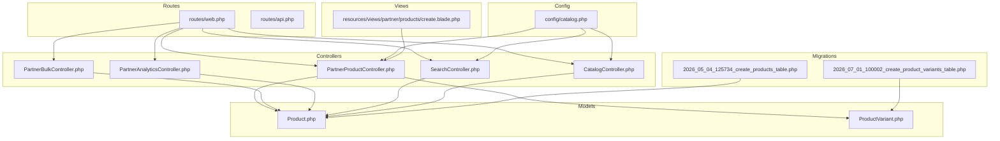
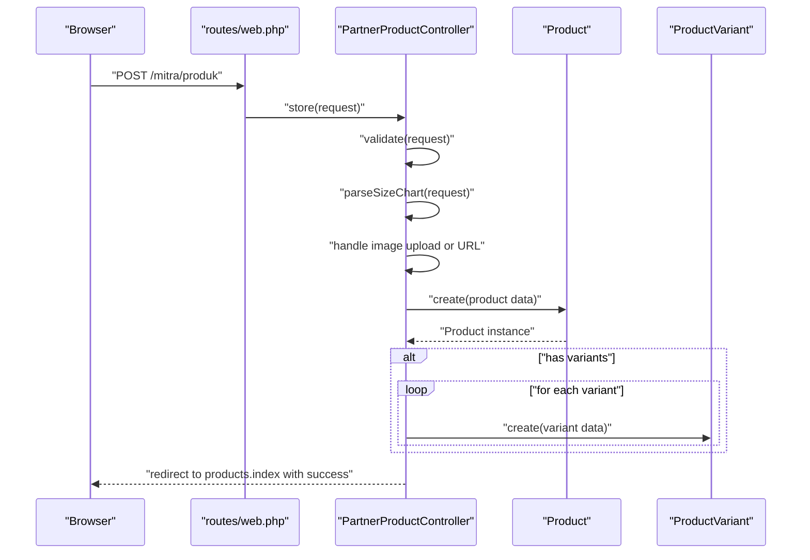
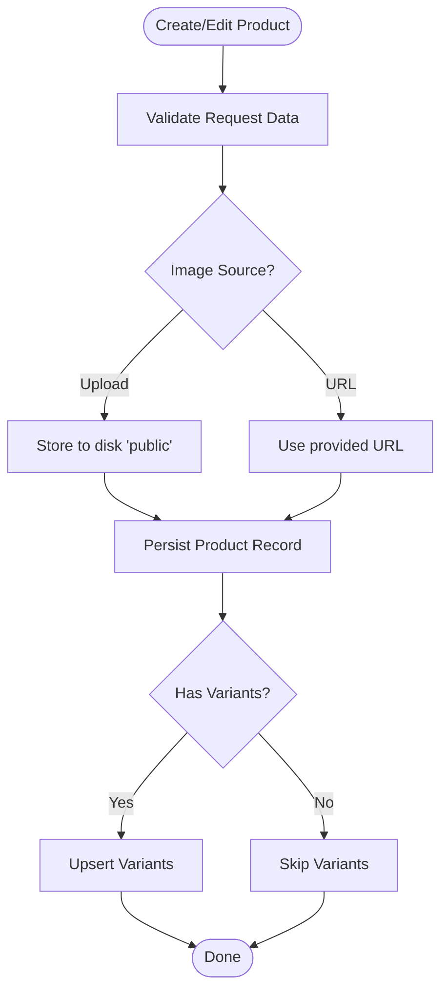
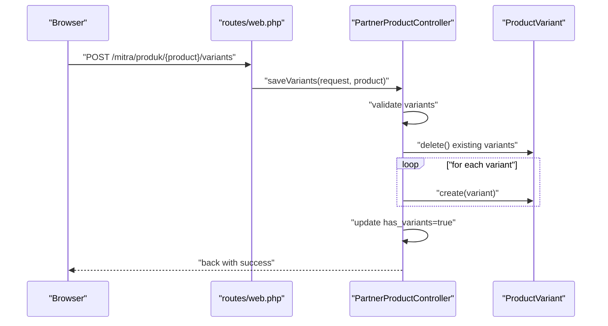
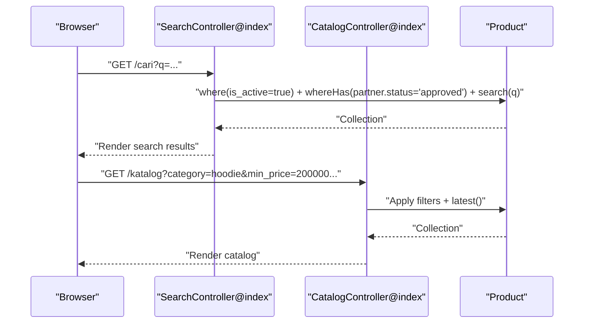
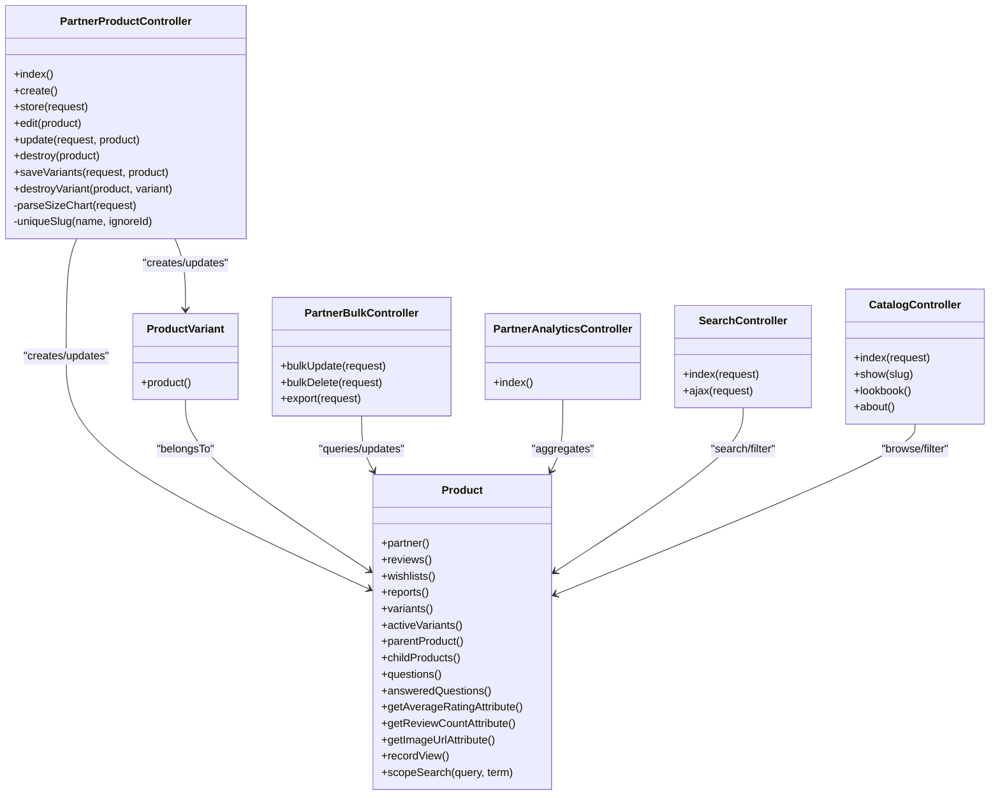
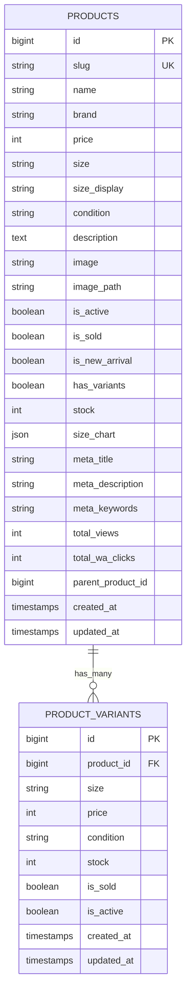

# Product Catalog Management

<cite>
**Referenced Files in This Document**
- [PartnerProductController.php](file://app/Http/Controllers/Partner/PartnerProductController.php)
- [Product.php](file://app/Models/Product.php)
- [ProductVariant.php](file://app/Models/ProductVariant.php)
- [web.php](file://routes/web.php)
- [api.php](file://routes/api.php)
- [catalog.php](file://config/catalog.php)
- [SearchController.php](file://app/Http/Controllers/SearchController.php)
- [CatalogController.php](file://app/Http/Controllers/CatalogController.php)
- [PartnerBulkController.php](file://app/Http/Controllers/Partner/PartnerBulkController.php)
- [PartnerAnalyticsController.php](file://app/Http/Controllers/Partner/PartnerAnalyticsController.php)
- [create.blade.php](file://resources/views/partner/products/create.blade.php)
- [2026_05_04_125734_create_products_table.php](file://database/migrations/2026_05_04_125734_create_products_table.php)
- [2026_07_01_100002_create_product_variants_table.php](file://database/migrations/2026_07_01_100002_create_product_variants_table.php)
</cite>

## Table of Contents
1. [Introduction](#introduction)
2. [Project Structure](#project-structure)
3. [Core Components](#core-components)
4. [Architecture Overview](#architecture-overview)
5. [Detailed Component Analysis](#detailed-component-analysis)
6. [Dependency Analysis](#dependency-analysis)
7. [Performance Considerations](#performance-considerations)
8. [Troubleshooting Guide](#troubleshooting-guide)
9. [Conclusion](#conclusion)
10. [Appendices](#appendices)

## Introduction
This document explains KatalogThrift’s product catalog management system for partners. It covers product creation, editing, deletion, variants, size charts, pricing, inventory, categorization, SEO, search and filtering, approval/moderation, media management, bulk operations, analytics, and API exposure. Practical examples illustrate CRUD flows, variant management, and search implementation.

## Project Structure
The product catalog spans controllers, models, routes, configuration, migrations, and views:
- Controllers handle partner product operations, search, catalog browsing, bulk actions, and analytics.
- Models define product and variant entities, relationships, and scopes.
- Routes expose web endpoints for partner CRUD, variants, bulk operations, and analytics.
- Configuration defines product categories, size chart templates, defaults, and brand story.
- Migrations define schema for products and variants.
- Views render partner forms and pages for product management.

**Diagram sources**
- [web.php:118-167](file://routes/web.php#L118-L167)
- [api.php:17-19](file://routes/api.php#L17-L19)
- [PartnerProductController.php:14-337](file://app/Http/Controllers/Partner/PartnerProductController.php#L14-L337)
- [PartnerBulkController.php:10-75](file://app/Http/Controllers/Partner/PartnerBulkController.php#L10-L75)
- [PartnerAnalyticsController.php:10-60](file://app/Http/Controllers/Partner/PartnerAnalyticsController.php#L10-L60)
- [SearchController.php:8-56](file://app/Http/Controllers/SearchController.php#L8-L56)
- [CatalogController.php:12-197](file://app/Http/Controllers/CatalogController.php#L12-L197)
- [Product.php:9-132](file://app/Models/Product.php#L9-L132)
- [ProductVariant.php:6-23](file://app/Models/ProductVariant.php#L6-L23)
- [catalog.php:1-141](file://config/catalog.php#L1-L141)
- [2026_05_04_125734_create_products_table.php:7-37](file://database/migrations/2026_05_04_125734_create_products_table.php#L7-L37)
- [2026_07_01_100002_create_product_variants_table.php:6-41](file://database/migrations/2026_07_01_100002_create_product_variants_table.php#L6-L41)
- [create.blade.php:1-300](file://resources/views/partner/products/create.blade.php#L1-L300)

**Section sources**
- [web.php:118-167](file://routes/web.php#L118-L167)
- [PartnerProductController.php:14-337](file://app/Http/Controllers/Partner/PartnerProductController.php#L14-L337)
- [Product.php:9-132](file://app/Models/Product.php#L9-L132)
- [ProductVariant.php:6-23](file://app/Models/ProductVariant.php#L6-L23)
- [catalog.php:1-141](file://config/catalog.php#L1-L141)
- [2026_05_04_125734_create_products_table.php:7-37](file://database/migrations/2026_05_04_125734_create_products_table.php#L7-L37)
- [2026_07_01_100002_create_product_variants_table.php:6-41](file://database/migrations/2026_07_01_100002_create_product_variants_table.php#L6-L41)
- [create.blade.php:1-300](file://resources/views/partner/products/create.blade.php#L1-L300)

## Core Components
- Partner product controller: Handles product CRUD, variants, size chart parsing, image handling, SEO metadata, and slug generation.
- Product model: Defines fillable attributes, casts, relationships, computed SEO helpers, view recording, and search scope.
- Product variant model: Defines variant attributes, casts, and belongs-to relationship.
- Routes: Expose partner CRUD, variants, bulk operations, analytics, and public catalog/search endpoints.
- Configuration: Provides product categories, size chart columns and defaults, and brand story.
- Catalog and search controllers: Implement filtering, faceting, and search with MySQL boolean/full-text or fallback LIKE.
- Bulk controller: Supports batch activation/deactivation, marking sold/new arrival, and CSV export.
- Analytics controller: Aggregates views, WhatsApp clicks, top products, wishlist counts, and review distributions.

**Section sources**
- [PartnerProductController.php:42-133](file://app/Http/Controllers/Partner/PartnerProductController.php#L42-L133)
- [Product.php:13-34](file://app/Models/Product.php#L13-L34)
- [ProductVariant.php:8-16](file://app/Models/ProductVariant.php#L8-L16)
- [web.php:127-142](file://routes/web.php#L127-L142)
- [catalog.php:14-70](file://config/catalog.php#L14-L70)
- [SearchController.php:10-54](file://app/Http/Controllers/SearchController.php#L10-L54)
- [CatalogController.php:30-82](file://app/Http/Controllers/CatalogController.php#L30-L82)
- [PartnerBulkController.php:17-73](file://app/Http/Controllers/Partner/PartnerBulkController.php#L17-L73)
- [PartnerAnalyticsController.php:17-58](file://app/Http/Controllers/Partner/PartnerAnalyticsController.php#L17-L58)

## Architecture Overview
The system follows MVC with clear separation:
- Web routes dispatch to controllers for partner product management, search, catalog, bulk operations, and analytics.
- Controllers orchestrate model interactions, validation, and persistence.
- Models encapsulate domain logic, relationships, and database casting.
- Configuration centralizes product taxonomy and UI templates.
- Views render partner forms and pages.

**Diagram sources**
- [web.php:127-133](file://routes/web.php#L127-L133)
- [PartnerProductController.php:42-133](file://app/Http/Controllers/Partner/PartnerProductController.php#L42-L133)
- [Product.php:9-132](file://app/Models/Product.php#L9-L132)
- [ProductVariant.php:6-23](file://app/Models/ProductVariant.php#L6-L23)

## Detailed Component Analysis

### Product CRUD for Partners
- Create: Validates inputs, generates unique slug, handles image upload or external URL, persists product, optionally creates variants, sets SEO metadata.
- Edit: Validates updates, regenerates slug if name changed, replaces uploaded image if provided, updates product and variants.
- Delete: Removes associated image file if present, deletes product.
- Size chart: Parses structured rows into normalized arrays when enabled.
- SEO: Uses meta title/description/keywords with sensible defaults.

**Diagram sources**
- [PartnerProductController.php:42-133](file://app/Http/Controllers/Partner/PartnerProductController.php#L42-L133)
- [PartnerProductController.php:293-321](file://app/Http/Controllers/Partner/PartnerProductController.php#L293-L321)

**Section sources**
- [PartnerProductController.php:42-133](file://app/Http/Controllers/Partner/PartnerProductController.php#L42-L133)
- [PartnerProductController.php:149-245](file://app/Http/Controllers/Partner/PartnerProductController.php#L149-L245)
- [PartnerProductController.php:247-259](file://app/Http/Controllers/Partner/PartnerProductController.php#L247-L259)
- [PartnerProductController.php:261-278](file://app/Http/Controllers/Partner/PartnerProductController.php#L261-L278)
- [PartnerProductController.php:280-290](file://app/Http/Controllers/Partner/PartnerProductController.php#L280-L290)

### Product Variants Management
- Save variants: Deletes existing variants and recreates from submitted rows; marks product with variants flag.
- Destroy variant: Removes a single variant; if none remain, clears variants flag.

**Diagram sources**
- [web.php:140-142](file://routes/web.php#L140-L142)
- [PartnerProductController.php:293-321](file://app/Http/Controllers/Partner/PartnerProductController.php#L293-L321)
- [ProductVariant.php:6-23](file://app/Models/ProductVariant.php#L6-L23)

**Section sources**
- [PartnerProductController.php:293-321](file://app/Http/Controllers/Partner/PartnerProductController.php#L293-L321)
- [PartnerProductController.php:323-335](file://app/Http/Controllers/Partner/PartnerProductController.php#L323-L335)

### Product Search and Filtering
- Public search: Filters active products whose partner status is approved, applies full-text or LIKE search, sorts by recency.
- AJAX autocomplete: Returns minimal product fields for quick suggestions.
- Catalog filters: Category, brand, partner, size, price range, availability, and new arrival flags.

**Diagram sources**
- [SearchController.php:10-31](file://app/Http/Controllers/SearchController.php#L10-L31)
- [SearchController.php:33-54](file://app/Http/Controllers/SearchController.php#L33-L54)
- [CatalogController.php:30-82](file://app/Http/Controllers/CatalogController.php#L30-L82)
- [Product.php:122-130](file://app/Models/Product.php#L122-L130)

**Section sources**
- [SearchController.php:10-54](file://app/Http/Controllers/SearchController.php#L10-L54)
- [CatalogController.php:30-82](file://app/Http/Controllers/CatalogController.php#L30-L82)
- [Product.php:122-130](file://app/Models/Product.php#L122-L130)

### Product Categorization, Tagging, and SEO
- Categories: Defined centrally with emoji labels and pairing suggestions for cross-selling.
- Tagging: Not implemented in code; recommended to extend product schema and controllers for tags.
- SEO: Computed meta title/description defaults; partners can override via form.

**Section sources**
- [catalog.php:14-28](file://config/catalog.php#L14-L28)
- [catalog.php:55-70](file://config/catalog.php#L55-L70)
- [PartnerProductController.php:70-73](file://app/Http/Controllers/Partner/PartnerProductController.php#L70-L73)
- [Product.php:104-113](file://app/Models/Product.php#L104-L113)

### Inventory Management and Pricing Strategies
- Base stock: Defaults to 1 for single products; variants maintain per-size stock.
- Pricing: Single product price; variants may override price per size.
- Availability flags: Active/inactive, sold, new arrival.
- Bulk operations: Batch activation/deactivation, mark sold/new arrival.

**Section sources**
- [PartnerProductController.php:112-117](file://app/Http/Controllers/Partner/PartnerProductController.php#L112-L117)
- [PartnerProductController.php:122-129](file://app/Http/Controllers/Partner/PartnerProductController.php#L122-L129)
- [ProductVariant.php:8-16](file://app/Models/ProductVariant.php#L8-L16)
- [PartnerBulkController.php:17-41](file://app/Http/Controllers/Partner/PartnerBulkController.php#L17-L41)

### Partner Product Approval and Moderation
- Approval gating: Public catalog and search restrict to products whose partner status is approved.
- Admin moderation: Admin routes exist for suspending products and managing reports/reviews.

**Section sources**
- [SearchController.php:17-21](file://app/Http/Controllers/SearchController.php#L17-L21)
- [CatalogController.php:32-47](file://app/Http/Controllers/CatalogController.php#L32-L47)
- [web.php:185-188](file://routes/web.php#L185-L188)

### Product Media Management, Image Optimization, and CDN
- Storage: Images stored under a partner-scoped path in the 'public' disk; URLs supported.
- Optimization: Not implemented in code; recommended to integrate a service or pipeline for resizing and compression.
- CDN: Not configured in code; recommended to serve images via CDN for performance.

**Section sources**
- [PartnerProductController.php:82-86](file://app/Http/Controllers/Partner/PartnerProductController.php#L82-L86)
- [PartnerProductController.php:189-194](file://app/Http/Controllers/Partner/PartnerProductController.php#L189-L194)
- [Product.php:96-102](file://app/Models/Product.php#L96-L102)

### Bulk Product Operations, Import/Export, and API Endpoints
- Bulk update/delete: Toggle active/sold/new arrival flags and mass delete for owned products.
- Export: CSV download of product list with name, brand, category, price, size, condition, and status.
- API: Minimal Sanctum-protected endpoint returning authenticated user.

**Section sources**
- [web.php:135-138](file://routes/web.php#L135-L138)
- [PartnerBulkController.php:17-73](file://app/Http/Controllers/Partner/PartnerBulkController.php#L17-L73)
- [api.php:17-19](file://routes/api.php#L17-L19)

### Product Analytics, Performance Metrics, and Sales Tracking
- Metrics: Total views, WhatsApp clicks, top products, wishlist counts, review distribution, daily breakdown.
- Tracking: View increments on product detail; WhatsApp click metric tracked; rating aggregation available.

**Section sources**
- [PartnerAnalyticsController.php:17-58](file://app/Http/Controllers/Partner/PartnerAnalyticsController.php#L17-L58)
- [Product.php:115-119](file://app/Models/Product.php#L115-L119)

### Practical Examples
- Create product with variants and size chart:
  - Use the partner create form to submit product details, enable variants, and size chart.
  - Backend validates, stores image if uploaded, persists product and variants, and sets SEO metadata.
  - Reference: [create.blade.php:80-239](file://resources/views/partner/products/create.blade.php#L80-L239), [PartnerProductController.php:42-133](file://app/Http/Controllers/Partner/PartnerProductController.php#L42-L133)
- Update product and replace image:
  - Submit edit form; backend replaces image file if provided and updates product and variants.
  - Reference: [PartnerProductController.php:149-245](file://app/Http/Controllers/Partner/PartnerProductController.php#L149-L245)
- Manage variants:
  - Save variants to replace existing ones; remove individual variant if desired.
  - Reference: [web.php:140-142](file://routes/web.php#L140-L142), [PartnerProductController.php:293-335](file://app/Http/Controllers/Partner/PartnerProductController.php#L293-L335)
- Search implementation:
  - Public search uses full-text or LIKE depending on database; AJAX returns compact JSON.
  - Reference: [SearchController.php:10-54](file://app/Http/Controllers/SearchController.php#L10-L54), [Product.php:122-130](file://app/Models/Product.php#L122-L130)

## Dependency Analysis

**Diagram sources**
- [Product.php:36-84](file://app/Models/Product.php#L36-L84)
- [ProductVariant.php:18-21](file://app/Models/ProductVariant.php#L18-L21)
- [PartnerProductController.php:21-290](file://app/Http/Controllers/Partner/PartnerProductController.php#L21-L290)
- [PartnerBulkController.php:17-73](file://app/Http/Controllers/Partner/PartnerBulkController.php#L17-L73)
- [PartnerAnalyticsController.php:17-58](file://app/Http/Controllers/Partner/PartnerAnalyticsController.php#L17-L58)
- [SearchController.php:10-54](file://app/Http/Controllers/SearchController.php#L10-L54)
- [CatalogController.php:30-146](file://app/Http/Controllers/CatalogController.php#L30-L146)

**Section sources**
- [Product.php:36-84](file://app/Models/Product.php#L36-L84)
- [ProductVariant.php:18-21](file://app/Models/ProductVariant.php#L18-L21)
- [PartnerProductController.php:21-290](file://app/Http/Controllers/Partner/PartnerProductController.php#L21-L290)
- [PartnerBulkController.php:17-73](file://app/Http/Controllers/Partner/PartnerBulkController.php#L17-L73)
- [PartnerAnalyticsController.php:17-58](file://app/Http/Controllers/Partner/PartnerAnalyticsController.php#L17-L58)
- [SearchController.php:10-54](file://app/Http/Controllers/SearchController.php#L10-L54)
- [CatalogController.php:30-146](file://app/Http/Controllers/CatalogController.php#L30-L146)

## Performance Considerations
- Full-text search: Uses MySQL MATCH/AGAINST when configured; otherwise falls back to LIKE queries. Consider indexing and optimizing full-text configuration for large catalogs.
- Image delivery: Serve images via CDN and optimize assets to reduce latency.
- Queries: Use eager loading (with relations) to avoid N+1 queries in listings and detail pages.
- Analytics: Aggregate daily metrics server-side; paginate and limit result sets for large datasets.

[No sources needed since this section provides general guidance]

## Troubleshooting Guide
- Slug conflicts: Unique slug generation prevents duplicates; if slug fails to update, re-save with a different name.
- Image uploads fail: Ensure file size limits and accepted MIME types; confirm public disk write permissions.
- Variants not saving: Confirm “has variants” checkbox and provide at least one variant row; existing variants are deleted before recreation.
- Search returns empty: Verify product is active and partner approved; ensure database supports full-text search or adjust query logic.
- Bulk operations not applying: Confirm ownership checks and that product IDs belong to the current partner.

**Section sources**
- [PartnerProductController.php:280-290](file://app/Http/Controllers/Partner/PartnerProductController.php#L280-L290)
- [PartnerProductController.php:82-86](file://app/Http/Controllers/Partner/PartnerProductController.php#L82-L86)
- [PartnerProductController.php:293-321](file://app/Http/Controllers/Partner/PartnerProductController.php#L293-L321)
- [SearchController.php:15-22](file://app/Http/Controllers/SearchController.php#L15-L22)
- [PartnerBulkController.php:26-37](file://app/Http/Controllers/Partner/PartnerBulkController.php#L26-L37)

## Conclusion
KatalogThrift’s product catalog system provides a robust foundation for partners to manage products, variants, and media, with built-in search, filtering, bulk operations, and analytics. Enhancements such as tagging, CDN integration, and advanced moderation workflows would further strengthen the platform.

[No sources needed since this section summarizes without analyzing specific files]

## Appendices

### Data Models Diagram

**Diagram sources**
- [2026_05_04_125734_create_products_table.php:14-26](file://database/migrations/2026_05_04_125734_create_products_table.php#L14-L26)
- [2026_07_01_100002_create_product_variants_table.php:10-22](file://database/migrations/2026_07_01_100002_create_product_variants_table.php#L10-L22)
- [Product.php:13-34](file://app/Models/Product.php#L13-L34)
- [ProductVariant.php:8-16](file://app/Models/ProductVariant.php#L8-L16)