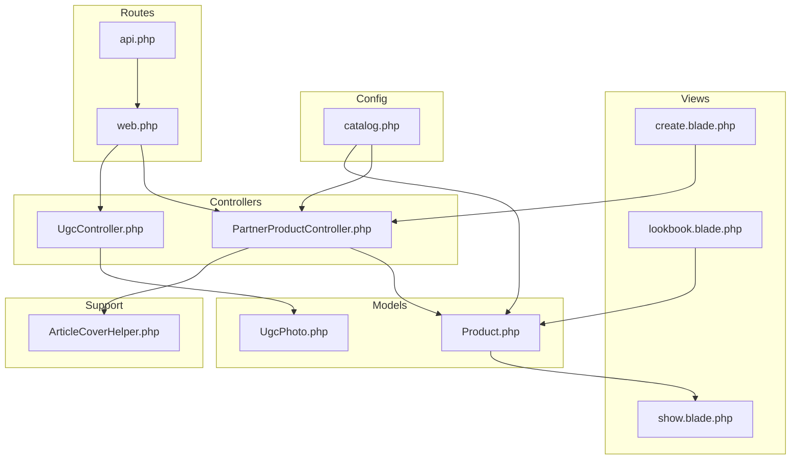
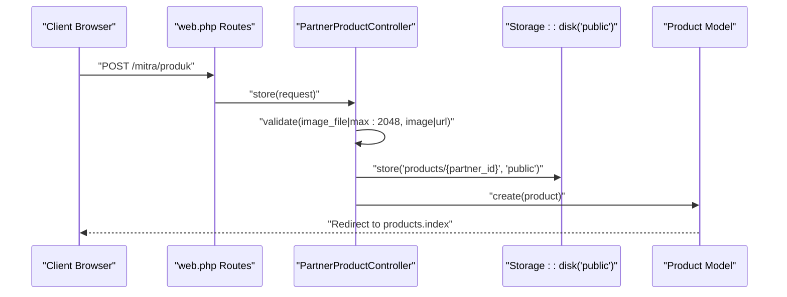
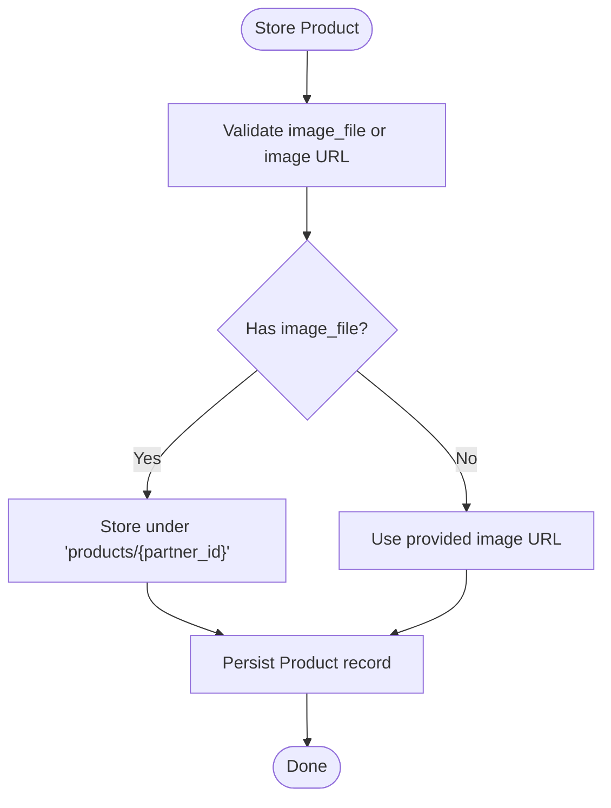
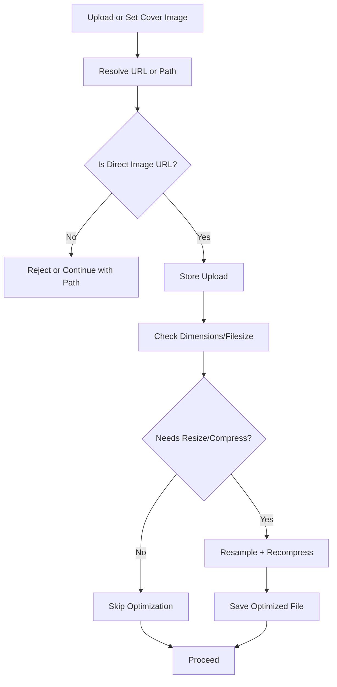
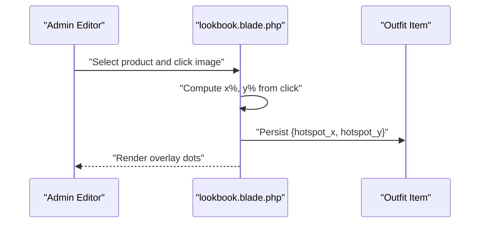
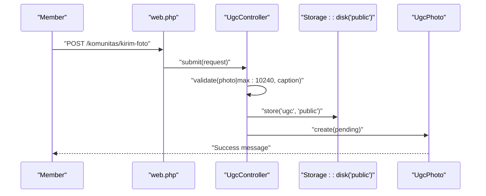
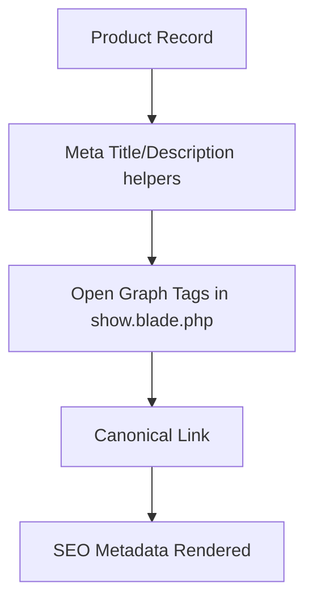
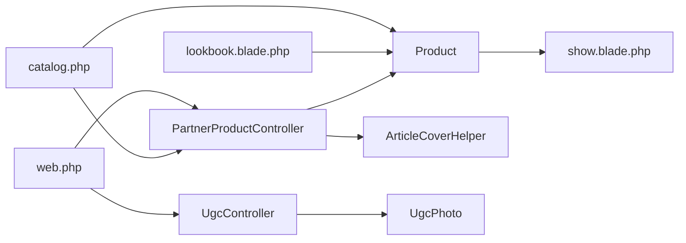

# Product Media and Display

<cite>
**Referenced Files in This Document**
- [Product.php](file://app/Models/Product.php)
- [UgcPhoto.php](file://app/Models/UgcPhoto.php)
- [PartnerProductController.php](file://app/Http/Controllers/Partner/PartnerProductController.php)
- [UgcController.php](file://app/Http/Controllers/UgcController.php)
- [ArticleCoverHelper.php](file://app/Support/ArticleCoverHelper.php)
- [catalog.php](file://config/catalog.php)
- [web.php](file://routes/web.php)
- [api.php](file://routes/api.php)
- [show.blade.php](file://resources/views/catalog/show.blade.php)
- [lookbook.blade.php](file://resources/views/catalog/lookbook.blade.php)
- [create.blade.php](file://resources/views/partner/products/create.blade.php)
- [bootstrap.js](file://resources/js/bootstrap.js)
- [10a9160ae2f5e3ea1c88041f9165ff41.php](file://storage/framework/views/10a9160ae2f5e3ea1c88041f9165ff41.php)
</cite>

## Table of Contents
1. [Introduction](#introduction)
2. [Project Structure](#project-structure)
3. [Core Components](#core-components)
4. [Architecture Overview](#architecture-overview)
5. [Detailed Component Analysis](#detailed-component-analysis)
6. [Dependency Analysis](#dependency-analysis)
7. [Performance Considerations](#performance-considerations)
8. [Troubleshooting Guide](#troubleshooting-guide)
9. [Conclusion](#conclusion)
10. [Appendices](#appendices)

## Introduction
This document explains the product media management and display systems in the application. It covers image upload workflows, file validation, and storage optimization. It documents image resizing and compression, thumbnail generation, video embedding, interactive lookbook hotspots, and SEO-friendly media handling. It also outlines CDN integration, lazy loading, and performance optimization techniques, along with backup and content delivery strategies.

## Project Structure
The media system spans models, controllers, Blade templates, configuration, and frontend assets:
- Models define attributes and accessors for URLs and SEO metadata.
- Controllers handle uploads, validation, and updates for product and UGC photos.
- Helpers optimize images during storage.
- Views render product pages, lookbooks, and hotspot-enabled editorial content.
- Configuration defines product types, size charts, and defaults.
- Routing exposes endpoints for product display, lookbook, and UGC submission.

**Diagram sources**
- [PartnerProductController.php:1-337](file://app/Http/Controllers/Partner/PartnerProductController.php#L1-L337)
- [UgcController.php:1-49](file://app/Http/Controllers/UgcController.php#L1-L49)
- [Product.php:1-132](file://app/Models/Product.php#L1-L132)
- [UgcPhoto.php:1-24](file://app/Models/UgcPhoto.php#L1-L24)
- [ArticleCoverHelper.php:1-129](file://app/Support/ArticleCoverHelper.php#L1-L129)
- [show.blade.php:1-726](file://resources/views/catalog/show.blade.php#L1-L726)
- [lookbook.blade.php:137-153](file://resources/views/catalog/lookbook.blade.php#L137-L153)
- [create.blade.php:145-166](file://resources/views/partner/products/create.blade.php#L145-L166)
- [catalog.php:1-141](file://config/catalog.php#L1-L141)
- [web.php:1-240](file://routes/web.php#L1-L240)
- [api.php:1-20](file://routes/api.php#L1-L20)

**Section sources**
- [web.php:44-74](file://routes/web.php#L44-L74)
- [catalog.php:14-28](file://config/catalog.php#L14-L28)

## Core Components
- Product model: Stores image URL or path, computes public URL, and provides SEO helpers.
- PartnerProductController: Validates and persists product images (upload vs URL), manages updates and deletes.
- UgcController: Handles user-generated content photo submissions with validation and status management.
- ArticleCoverHelper: Resolves and validates external image URLs and optimizes uploaded images.
- Blade templates: Render product and lookbook pages with SEO meta tags and interactive hotspots.

Key responsibilities:
- Image upload: Validation, storage under public disk, cleanup on update/delete.
- Image optimization: Resize and compress images when necessary.
- Video embedding: YouTube embed and HTML5 video fallback in lookbook.
- Interactive hotspots: Store normalized coordinates per product in lookbook items.
- SEO: Canonical links, Open Graph image, and meta description/title helpers.

**Section sources**
- [Product.php:96-113](file://app/Models/Product.php#L96-L113)
- [PartnerProductController.php:42-133](file://app/Http/Controllers/Partner/PartnerProductController.php#L42-L133)
- [PartnerProductController.php:149-259](file://app/Http/Controllers/Partner/PartnerProductController.php#L149-L259)
- [UgcController.php:24-47](file://app/Http/Controllers/UgcController.php#L24-L47)
- [ArticleCoverHelper.php:40-68](file://app/Support/ArticleCoverHelper.php#L40-L68)
- [ArticleCoverHelper.php:70-127](file://app/Support/ArticleCoverHelper.php#L70-L127)
- [show.blade.php:6-13](file://resources/views/catalog/show.blade.php#L6-L13)

## Architecture Overview
The media pipeline integrates validation, storage, optional optimization, and presentation across controllers, models, and views.

**Diagram sources**
- [web.php:127-133](file://routes/web.php#L127-L133)
- [PartnerProductController.php:42-117](file://app/Http/Controllers/Partner/PartnerProductController.php#L42-L117)
- [Product.php:13-34](file://app/Models/Product.php#L13-L34)

## Detailed Component Analysis

### Product Image Upload and Storage
- Validation ensures either an image file under size limits or a valid URL.
- On upload, files are stored under a partner-scoped directory on the public disk.
- The model’s URL accessor returns a public URL when a path exists; otherwise falls back to the raw URL field.
- Updates delete the previous file if replaced; deletion removes the stored file.

**Diagram sources**
- [PartnerProductController.php:78-86](file://app/Http/Controllers/Partner/PartnerProductController.php#L78-L86)
- [PartnerProductController.php:88-117](file://app/Http/Controllers/Partner/PartnerProductController.php#L88-L117)
- [Product.php:96-102](file://app/Models/Product.php#L96-L102)

**Section sources**
- [PartnerProductController.php:42-133](file://app/Http/Controllers/Partner/PartnerProductController.php#L42-L133)
- [PartnerProductController.php:149-259](file://app/Http/Controllers/Partner/PartnerProductController.php#L149-L259)
- [Product.php:96-102](file://app/Models/Product.php#L96-L102)

### Image Optimization Pipeline
- External URL validation checks host allowlists/denylists and file extensions.
- Uploaded images are optimized if larger than threshold or exceeding target dimensions.
- Optimization resamples and recompresses based on detected format.

**Diagram sources**
- [ArticleCoverHelper.php:10-38](file://app/Support/ArticleCoverHelper.php#L10-L38)
- [ArticleCoverHelper.php:62-68](file://app/Support/ArticleCoverHelper.php#L62-L68)
- [ArticleCoverHelper.php:70-127](file://app/Support/ArticleCoverHelper.php#L70-L127)

**Section sources**
- [ArticleCoverHelper.php:40-68](file://app/Support/ArticleCoverHelper.php#L40-L68)
- [ArticleCoverHelper.php:70-127](file://app/Support/ArticleCoverHelper.php#L70-L127)

### Video Embedding and Lookbook Hotspots
- Lookbook page supports YouTube embeds and HTML5 video fallback.
- Hotspot placement stores normalized percentages per product; rendering overlays clickable markers.

**Diagram sources**
- [lookbook.blade.php:137-153](file://resources/views/catalog/lookbook.blade.php#L137-L153)
- [10a9160ae2f5e3ea1c88041f9165ff41.php:34-45](file://storage/framework/views/10a9160ae2f5e3ea1c88041f9165ff41.php#L34-L45)

**Section sources**
- [lookbook.blade.php:137-153](file://resources/views/catalog/lookbook.blade.php#L137-L153)
- [10a9160ae2f5e3ea1c88041f9165ff41.php:34-45](file://storage/framework/views/10a9160ae2f5e3ea1c88041f9165ff41.php#L34-L45)

### User-Generated Content (UGC) Submission
- Submissions require an image under a strict size limit, optional caption, and optional associated product.
- Photos are stored on the public disk; status defaults to pending until moderation.

**Diagram sources**
- [web.php:60-63](file://routes/web.php#L60-L63)
- [UgcController.php:24-47](file://app/Http/Controllers/UgcController.php#L24-L47)
- [UgcPhoto.php:18-22](file://app/Models/UgcPhoto.php#L18-L22)

**Section sources**
- [UgcController.php:11-47](file://app/Http/Controllers/UgcController.php#L11-L47)
- [UgcPhoto.php:18-22](file://app/Models/UgcPhoto.php#L18-L22)

### SEO-Friendly Media Handling and Accessibility
- Product pages set canonical URL, Open Graph title/description/image, and meta keywords.
- Lookbook images use alt text derived from the title.
- Lazy loading is applied to product thumbnails in admin views.

**Diagram sources**
- [show.blade.php:6-13](file://resources/views/catalog/show.blade.php#L6-L13)
- [Product.php:104-113](file://app/Models/Product.php#L104-L113)
- [127 as "Lazy Loading"] --> [create.blade.php:128](file://resources/views/admin/outfits/create.blade.php#L128)

**Section sources**
- [show.blade.php:6-13](file://resources/views/catalog/show.blade.php#L6-L13)
- [Product.php:104-113](file://app/Models/Product.php#L104-L113)
- [create.blade.php:128](file://resources/views/admin/outfits/create.blade.php#L128)

## Dependency Analysis
- Controllers depend on models for persistence and on Storage for file operations.
- Helpers encapsulate image resolution and optimization logic.
- Views depend on models for computed attributes and configuration for defaults.
- Routes connect endpoints to controllers.

**Diagram sources**
- [PartnerProductController.php:1-337](file://app/Http/Controllers/Partner/PartnerProductController.php#L1-L337)
- [UgcController.php:1-49](file://app/Http/Controllers/UgcController.php#L1-L49)
- [Product.php:1-132](file://app/Models/Product.php#L1-L132)
- [UgcPhoto.php:1-24](file://app/Models/UgcPhoto.php#L1-L24)
- [ArticleCoverHelper.php:1-129](file://app/Support/ArticleCoverHelper.php#L1-L129)
- [show.blade.php:1-726](file://resources/views/catalog/show.blade.php#L1-L726)
- [lookbook.blade.php:137-153](file://resources/views/catalog/lookbook.blade.php#L137-L153)
- [catalog.php:1-141](file://config/catalog.php#L1-L141)
- [web.php:1-240](file://routes/web.php#L1-L240)

**Section sources**
- [web.php:44-74](file://routes/web.php#L44-L74)
- [catalog.php:14-28](file://config/catalog.php#L14-L28)

## Performance Considerations
- Image optimization reduces bandwidth and improves load times by resizing and recompressing images when needed.
- Lazy loading of thumbnails decreases initial payload.
- CDN integration can be achieved by serving the public disk via a CDN domain and ensuring HTTPS.
- Consider generating multiple responsive sizes and using modern formats (AVIF/WebP) where supported.

[No sources needed since this section provides general guidance]

## Troubleshooting Guide
- Invalid image URL: Ensure the URL points to a direct image resource or is hosted on allowed domains.
- Upload failures: Verify file size limits and MIME type validation.
- Missing images after update/delete: Confirm the storage path exists and the controller deletes previous files when replacing or removing records.
- Hotspot coordinates not persisting: Check that normalized percentages are stored and synchronized to hidden inputs.

**Section sources**
- [ArticleCoverHelper.php:10-38](file://app/Support/ArticleCoverHelper.php#L10-L38)
- [PartnerProductController.php:189-194](file://app/Http/Controllers/Partner/PartnerProductController.php#L189-L194)
- [lookbook.blade.php:137-153](file://resources/views/catalog/lookbook.blade.php#L137-L153)

## Conclusion
The media system combines robust validation, secure storage, and performance-conscious optimization. It supports diverse product imagery, editorial lookbooks with interactive hotspots, and SEO-friendly metadata. Extending the system with CDN-backed asset delivery and automated responsive image generation would further improve scalability and user experience.

[No sources needed since this section summarizes without analyzing specific files]

## Appendices

### API and Endpoint References
- Product CRUD endpoints are exposed under the partner namespace.
- UGC submission endpoint is available publicly.
- Sanctum user endpoint is available under the API namespace.

**Section sources**
- [web.php:127-133](file://routes/web.php#L127-L133)
- [web.php:60-63](file://routes/web.php#L60-L63)
- [api.php:17-19](file://routes/api.php#L17-L19)

### Frontend Notes
- Axios is configured globally for HTTP requests.
- Lazy loading is used for product thumbnails in admin views.

**Section sources**
- [bootstrap.js:7-10](file://resources/js/bootstrap.js#L7-L10)
- [create.blade.php:128](file://resources/views/admin/outfits/create.blade.php#L128)