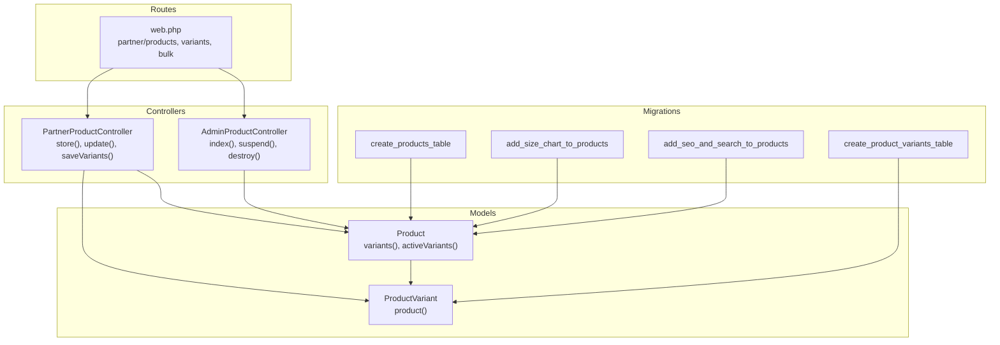
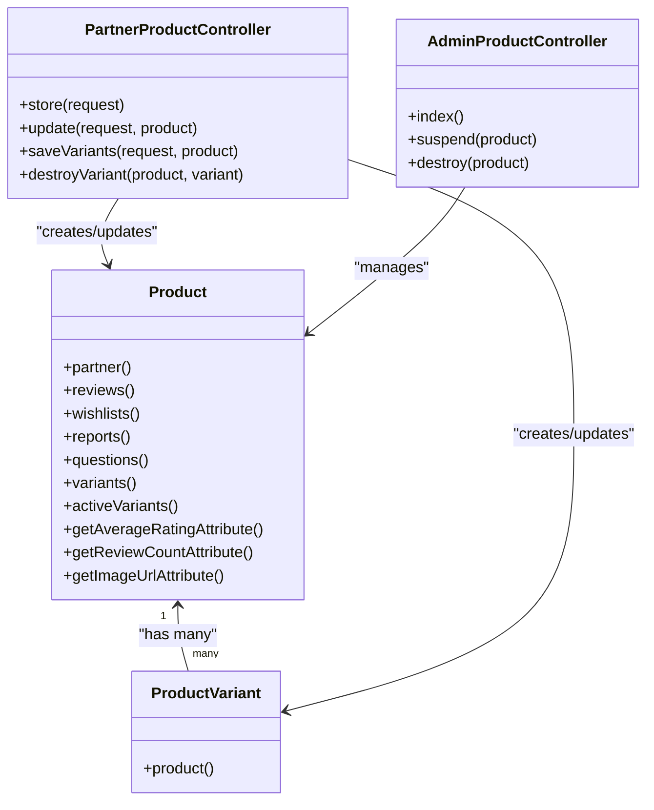
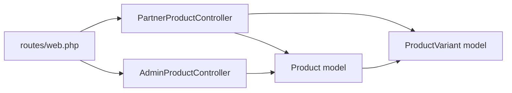
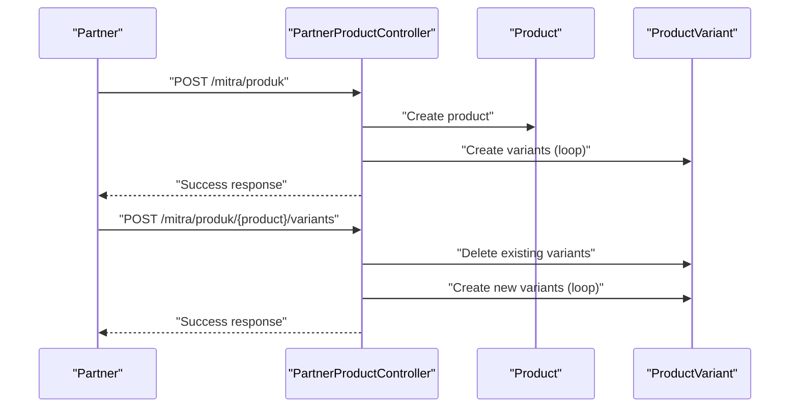

# Product Variants and Inventory Management

<cite>
**Referenced Files in This Document**
- [Product.php](file://app/Models/Product.php)
- [ProductVariant.php](file://app/Models/ProductVariant.php)
- [PartnerProductController.php](file://app/Http/Controllers/Partner/PartnerProductController.php)
- [AdminProductController.php](file://app/Http/Controllers/AdminProductController.php)
- [web.php](file://routes/web.php)
- [2026_05_04_125734_create_products_table.php](file://database/migrations/2026_05_04_125734_create_products_table.php)
- [2026_07_01_100002_create_product_variants_table.php](file://database/migrations/2026_07_01_100002_create_product_variants_table.php)
- [2026_05_28_131107_add_size_chart_to_products_table.php](file://database/migrations/2026_05_28_131107_add_size_chart_to_products_table.php)
- [2026_07_01_100007_add_seo_and_search_to_products.php](file://database/migrations/2026_07_01_100007_add_seo_and_search_to_products.php)
- [2026_07_01_100000_add_auth_and_tier_to_users.php](file://database/migrations/2026_07_01_100000_add_auth_and_tier_to_users.php)
</cite>

## Table of Contents
1. [Introduction](#introduction)
2. [Project Structure](#project-structure)
3. [Core Components](#core-components)
4. [Architecture Overview](#architecture-overview)
5. [Detailed Component Analysis](#detailed-component-analysis)
6. [Dependency Analysis](#dependency-analysis)
7. [Performance Considerations](#performance-considerations)
8. [Troubleshooting Guide](#troubleshooting-guide)
9. [Conclusion](#conclusion)
10. [Appendices](#appendices)

## Introduction
This document explains the product variants and inventory management capabilities implemented in the system. It covers how variants are modeled and created, how sizes and conditions are represented, and how stock levels are tracked. It also documents bulk operations, administrative controls, and the foundational schema supporting variant and inventory features. Practical workflows for variant setup, inventory reconciliation, and stock adjustments are included with real-world scenarios.

## Project Structure
The variant and inventory system spans models, controllers, routes, and database migrations. The primary entities are Product and ProductVariant, with PartnerProductController orchestrating variant creation and updates, and AdminProductController managing product lifecycle from an administrative perspective. Routes define the endpoints for variant operations and bulk actions.

**Diagram sources**
- [Product.php:1-132](file://app/Models/Product.php#L1-L132)
- [ProductVariant.php:1-23](file://app/Models/ProductVariant.php#L1-L23)
- [PartnerProductController.php:1-337](file://app/Http/Controllers/Partner/PartnerProductController.php#L1-L337)
- [AdminProductController.php:1-37](file://app/Http/Controllers/AdminProductController.php#L1-L37)
- [web.php:127-142](file://routes/web.php#L127-L142)
- [2026_05_04_125734_create_products_table.php:1-37](file://database/migrations/2026_05_04_125734_create_products_table.php#L1-L37)
- [2026_07_01_100002_create_product_variants_table.php](file://database/migrations/2026_07_01_100002_create_product_variants_table.php)
- [2026_05_28_131107_add_size_chart_to_products_table.php:1-20](file://database/migrations/2026_05_28_131107_add_size_chart_to_products_table.php#L1-L20)
- [2026_07_01_100007_add_seo_and_search_to_products.php:1-30](file://database/migrations/2026_07_01_100007_add_seo_and_search_to_products.php#L1-L30)

**Section sources**
- [Product.php:1-132](file://app/Models/Product.php#L1-L132)
- [ProductVariant.php:1-23](file://app/Models/ProductVariant.php#L1-L23)
- [PartnerProductController.php:1-337](file://app/Http/Controllers/Partner/PartnerProductController.php#L1-L337)
- [AdminProductController.php:1-37](file://app/Http/Controllers/AdminProductController.php#L1-L37)
- [web.php:127-142](file://routes/web.php#L127-L142)
- [2026_05_04_125734_create_products_table.php:1-37](file://database/migrations/2026_05_04_125734_create_products_table.php#L1-L37)
- [2026_07_01_100002_create_product_variants_table.php](file://database/migrations/2026_07_01_100002_create_product_variants_table.php)
- [2026_05_28_131107_add_size_chart_to_products_table.php:1-20](file://database/migrations/2026_05_28_131107_add_size_chart_to_products_table.php#L1-L20)
- [2026_07_01_100007_add_seo_and_search_to_products.php:1-30](file://database/migrations/2026_07_01_100007_add_seo_and_search_to_products.php#L1-L30)

## Core Components
- Product model encapsulates product metadata, variant relationships, and helper attributes such as average rating and review count. It defines relationships to Partner, Reviews, Wishlists, Reports, Questions, and Variants.
- ProductVariant model stores per-variant attributes including size, price, condition, stock, and activation flags, linked back to a Product.
- PartnerProductController handles product creation and updates, including parsing size charts and saving variants. It validates inputs, manages images, and persists variants in bulk.
- AdminProductController provides administrative oversight of products, including activation toggling and deletion.
- Routes expose endpoints for product CRUD, variant management, and bulk operations under the partner namespace.

Key implementation references:
- Product relationships and scopes: [Product.php:36-84](file://app/Models/Product.php#L36-L84)
- ProductVariant fillable and casts: [ProductVariant.php:8-16](file://app/Models/ProductVariant.php#L8-L16)
- Variant creation and updates via controller: [PartnerProductController.php:42-133](file://app/Http/Controllers/Partner/PartnerProductController.php#L42-L133), [PartnerProductController.php:149-245](file://app/Http/Controllers/Partner/PartnerProductController.php#L149-L245)
- Variant bulk save and delete: [PartnerProductController.php:293-335](file://app/Http/Controllers/Partner/PartnerProductController.php#L293-L335)
- Administrative product actions: [AdminProductController.php:11-35](file://app/Http/Controllers/AdminProductController.php#L11-L35)
- Routes for variants and bulk operations: [web.php:127-142](file://routes/web.php#L127-L142)

**Section sources**
- [Product.php:36-84](file://app/Models/Product.php#L36-L84)
- [ProductVariant.php:8-16](file://app/Models/ProductVariant.php#L8-L16)
- [PartnerProductController.php:42-133](file://app/Http/Controllers/Partner/PartnerProductController.php#L42-L133)
- [PartnerProductController.php:149-245](file://app/Http/Controllers/Partner/PartnerProductController.php#L149-L245)
- [PartnerProductController.php:293-335](file://app/Http/Controllers/Partner/PartnerProductController.php#L293-L335)
- [AdminProductController.php:11-35](file://app/Http/Controllers/AdminProductController.php#L11-L35)
- [web.php:127-142](file://routes/web.php#L127-L142)

## Architecture Overview
The variant and inventory architecture centers on a Product–ProductVariant relationship. Products carry global attributes (price, size, condition, SEO), while variants override per-size attributes (size, price, stock). The PartnerProductController coordinates variant creation and updates, and routes expose endpoints for bulk operations and variant management.

**Diagram sources**
- [Product.php:36-84](file://app/Models/Product.php#L36-L84)
- [ProductVariant.php:18-22](file://app/Models/ProductVariant.php#L18-L22)
- [PartnerProductController.php:42-133](file://app/Http/Controllers/Partner/PartnerProductController.php#L42-L133)
- [PartnerProductController.php:149-245](file://app/Http/Controllers/Partner/PartnerProductController.php#L149-L245)
- [PartnerProductController.php:293-335](file://app/Http/Controllers/Partner/PartnerProductController.php#L293-L335)
- [AdminProductController.php:11-35](file://app/Http/Controllers/AdminProductController.php#L11-L35)

## Detailed Component Analysis

### Product Model: Attributes, Relationships, and Helpers
- Fillable attributes include product metadata, branding, pricing, sizing, condition, descriptions, media, marketplace links, activity flags, variant presence, and SEO/search fields.
- Casts normalize booleans and arrays for structured fields like lookbook pairings and size charts.
- Relationships:
  - belongsTo Partner
  - hasMany Reviews, Wishlists, Reports, Questions
  - hasMany ProductVariant via variants() and activeVariants()
  - belongsTo/hasMany self for parent/child product grouping
- Helper attributes:
  - Average rating and review count derived from related reviews
  - Image URL resolution using storage URLs or external image field
  - SEO helpers for meta title/description and fulltext search scope

Practical implications:
- Variants are filtered by activation and sale status via activeVariants().
- Size chart and unit are stored as JSON and string respectively, enabling structured size definitions.

**Section sources**
- [Product.php:13-34](file://app/Models/Product.php#L13-L34)
- [Product.php:36-84](file://app/Models/Product.php#L36-L84)
- [Product.php:86-130](file://app/Models/Product.php#L86-L130)
- [2026_05_28_131107_add_size_chart_to_products_table.php:8-12](file://database/migrations/2026_05_28_131107_add_size_chart_to_products_table.php#L8-L12)
- [2026_07_01_100007_add_seo_and_search_to_products.php:10-16](file://database/migrations/2026_07_01_100007_add_seo_and_search_to_products.php#L10-L16)

### ProductVariant Model: Per-Size Attributes and Constraints
- Fillable fields include product linkage, size label, price, condition, stock, and activation flags.
- Boolean casts ensure consistent handling of sold/active flags.
- Relationship to Product via product().

Operational notes:
- Variants can override base product price and condition.
- Stock is maintained per variant, enabling granular inventory tracking.

**Section sources**
- [ProductVariant.php:8-16](file://app/Models/ProductVariant.php#L8-L16)
- [ProductVariant.php:18-22](file://app/Models/ProductVariant.php#L18-L22)

### PartnerProductController: Variant Creation, Updates, and Bulk Operations
Responsibilities:
- Product creation and updates:
  - Validates inputs including product metadata, optional size chart, and variant arrays.
  - Parses size chart rows into structured JSON when enabled.
  - Manages image uploads or external image URLs.
  - Persists product with defaults and SEO/search fields.
- Variant management:
  - saveVariants deletes existing variants and recreates them from submitted arrays.
  - destroyVariant removes a single variant and toggles has_variants if none remain.
- Bulk operations:
  - Routes for bulk update, bulk delete, and export are registered under the partner namespace.

Workflow highlights:
- Variant creation occurs after product creation when has_variants is true.
- Variant arrays can specify size, price, condition, and stock; missing values fall back to product defaults.

**Section sources**
- [PartnerProductController.php:42-133](file://app/Http/Controllers/Partner/PartnerProductController.php#L42-L133)
- [PartnerProductController.php:149-245](file://app/Http/Controllers/Partner/PartnerProductController.php#L149-L245)
- [PartnerProductController.php:293-335](file://app/Http/Controllers/Partner/PartnerProductController.php#L293-L335)
- [web.php:127-142](file://routes/web.php#L127-L142)

### AdminProductController: Administrative Oversight
- Provides paginated product listing with partner association.
- Toggles product activation state.
- Deletes products.

Impact:
- Supports moderation and operational control over product listings.

**Section sources**
- [AdminProductController.php:11-35](file://app/Http/Controllers/AdminProductController.php#L11-L35)

### Routes: Variant and Bulk Endpoints
- Partner product CRUD and variant endpoints:
  - GET/POST /mitra/produk
  - PUT/DELETE /mitra/produk/{product}
  - POST /mitra/produk/{product}/variants
  - DELETE /mitra/produk/{product}/variants/{variant}
- Bulk operations:
  - POST /mitra/produk/bulk-update
  - POST /mitra/produk/bulk-delete
  - POST /mitra/produk/export

These routes enable variant management and bulk actions from the partner dashboard.

**Section sources**
- [web.php:127-142](file://routes/web.php#L127-L142)

### Database Schema: Foundations for Variants and Inventory
- Products table initial schema includes identity, slug, name, brand, price, size, condition, description, image, and timestamps.
- Product variants table supports product_id, size, price, condition, stock, and activation flags.
- Size chart enhancement adds JSON column for structured size definitions and a size unit field.
- SEO/search enhancements add meta fields and a fulltext index for efficient search.

Implications:
- Structured size charts enable standardized size definitions across products.
- Fulltext index accelerates product search across name, brand, and description.

**Section sources**
- [2026_05_04_125734_create_products_table.php:14-26](file://database/migrations/2026_05_04_125734_create_products_table.php#L14-L26)
- [2026_07_01_100002_create_product_variants_table.php](file://database/migrations/2026_07_01_100002_create_product_variants_table.php)
- [2026_05_28_131107_add_size_chart_to_products_table.php:8-12](file://database/migrations/2026_05_28_131107_add_size_chart_to_products_table.php#L8-L12)
- [2026_07_01_100007_add_seo_and_search_to_products.php:18-20](file://database/migrations/2026_07_01_100007_add_seo_and_search_to_products.php#L18-L20)

## Dependency Analysis
The system exhibits clear separation of concerns:
- Models define domain entities and relationships.
- Controllers mediate between requests and persistence, handling validation and variant synchronization.
- Routes bind endpoints to controller actions.
- Migrations establish the underlying schema for products, variants, size charts, and search.

**Diagram sources**
- [web.php:127-142](file://routes/web.php#L127-L142)
- [PartnerProductController.php:42-133](file://app/Http/Controllers/Partner/PartnerProductController.php#L42-L133)
- [AdminProductController.php:11-35](file://app/Http/Controllers/AdminProductController.php#L11-L35)
- [Product.php:36-84](file://app/Models/Product.php#L36-L84)
- [ProductVariant.php:18-22](file://app/Models/ProductVariant.php#L18-L22)

**Section sources**
- [web.php:127-142](file://routes/web.php#L127-L142)
- [PartnerProductController.php:42-133](file://app/Http/Controllers/Partner/PartnerProductController.php#L42-L133)
- [AdminProductController.php:11-35](file://app/Http/Controllers/AdminProductController.php#L11-L35)
- [Product.php:36-84](file://app/Models/Product.php#L36-L84)
- [ProductVariant.php:18-22](file://app/Models/ProductVariant.php#L18-L22)

## Performance Considerations
- Indexing: The products table includes a fulltext index for name, brand, and description to accelerate search queries.
- Eager loading: Controllers fetch related variants and partner data efficiently using with() and latest() pagination.
- JSON fields: Size charts are stored as JSON; ensure appropriate indexing or normalization if querying becomes frequent.
- Image handling: Product image URLs or stored paths are resolved in the model, minimizing controller logic overhead.

Recommendations:
- Monitor fulltext search performance and consider query plan analysis.
- For high-volume variant updates, batch operations and transaction boundaries can reduce contention.
- Consider caching product variant lists for frequently accessed SKUs.

**Section sources**
- [2026_07_01_100007_add_seo_and_search_to_products.php:18-20](file://database/migrations/2026_07_01_100007_add_seo_and_search_to_products.php#L18-L20)
- [PartnerProductController.php:21-29](file://app/Http/Controllers/Partner/PartnerProductController.php#L21-L29)
- [Product.php:96-102](file://app/Models/Product.php#L96-L102)

## Troubleshooting Guide
Common issues and resolutions:
- Variant not appearing after creation:
  - Ensure has_variants is set to true and variants are saved via the dedicated endpoint.
  - Confirm that variants are not filtered out by activation or sold flags.
- Duplicate slug errors:
  - The controller generates unique slugs; if conflicts occur, verify uniqueness logic and retry.
- Image upload failures:
  - Validate file types and size limits; confirm storage disk permissions and public URL generation.
- Size chart not saved:
  - Verify has_size_chart flag and ensure size_chart rows contain non-empty size labels.
- Bulk operation errors:
  - Confirm route bindings and CSRF protection; ensure proper payload structure for bulk endpoints.

**Section sources**
- [PartnerProductController.php:280-290](file://app/Http/Controllers/Partner/PartnerProductController.php#L280-L290)
- [PartnerProductController.php:261-278](file://app/Http/Controllers/Partner/PartnerProductController.php#L261-L278)
- [web.php:135-139](file://routes/web.php#L135-L139)

## Conclusion
The system provides a robust foundation for product variants and inventory management. Products and variants are cleanly separated, with controllers orchestrating variant creation and updates, and routes exposing variant and bulk operations. The schema supports structured size definitions, SEO/search, and scalable product discovery. Administrators retain control over product listings, while partners can manage variants and inventory efficiently.

## Appendices

### Practical Workflows and Examples

#### Variant Setup Workflow
- Create a product with variants:
  - Submit product metadata and set has_variants to true.
  - Provide an array of variants with size, optional price overrides, optional condition, and stock quantities.
  - The controller deletes existing variants and re-creates them from the submitted array.
- Edit a product’s variants:
  - Use the variants endpoint to replace all variants for a product.
  - On deletion, if no variants remain, has_variants is automatically toggled off.

**Diagram sources**
- [PartnerProductController.php:42-133](file://app/Http/Controllers/Partner/PartnerProductController.php#L42-L133)
- [PartnerProductController.php:293-335](file://app/Http/Controllers/Partner/PartnerProductController.php#L293-L335)
- [web.php:127-142](file://routes/web.php#L127-L142)

#### Inventory Reconciliation Procedure
- Periodic reconciliation:
  - Compare reported sales against variant stock counts.
  - Adjust stock via the variants endpoint to reflect physical counts.
- Low-stock handling:
  - Use activeVariants() to filter available variants and monitor stock thresholds.
  - Trigger manual restocking when stock falls below predefined levels.

#### Stock Adjustment Procedures
- Single variant adjustment:
  - Update stock for a specific variant via the variants endpoint.
- Bulk stock updates:
  - Use bulk update endpoints to adjust stock across multiple variants efficiently.

#### Barcode Scanning Integration (Conceptual)
- Integrate a scanner to capture variant identifiers (SKU-like keys).
- Map scanned identifiers to product variants and trigger stock decrement via the variants endpoint.
- Log adjustments for audit trails.

#### Warehouse Management Workflows (Conceptual)
- Assign warehouse locations to variants by extending the schema with location fields.
- Track movement between locations and reconcile stock per location.
- Use bulk operations to synchronize inventory across locations.

#### Multi-Location Inventory Support (Conceptual)
- Extend ProductVariant with a location identifier and quantity per location.
- Add endpoints to transfer stock between locations and report location-specific availability.