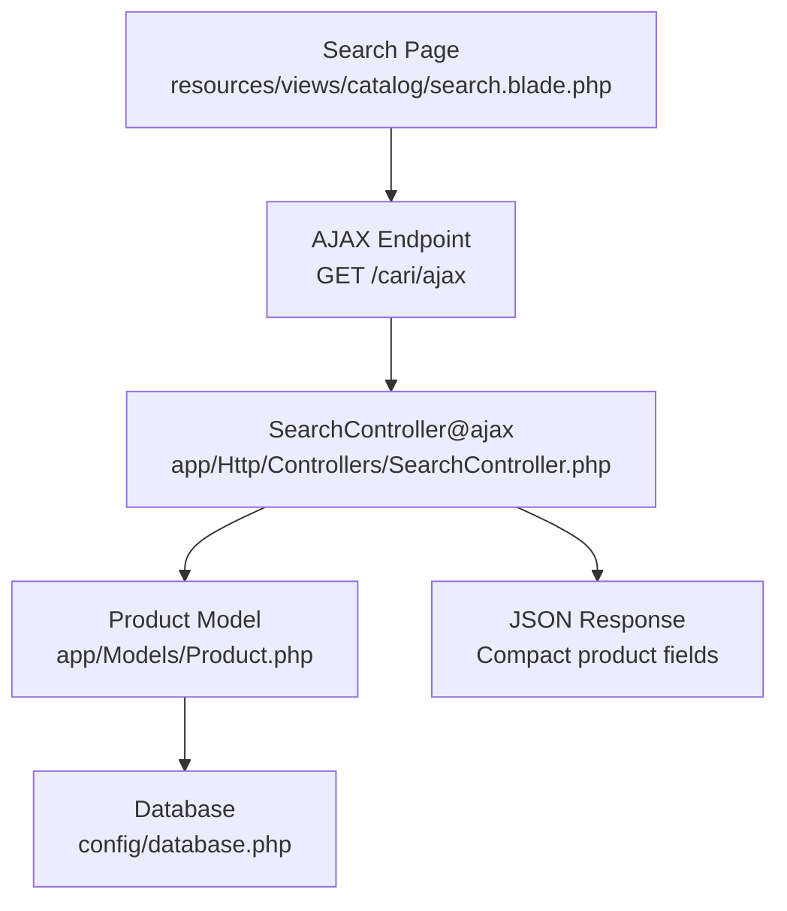
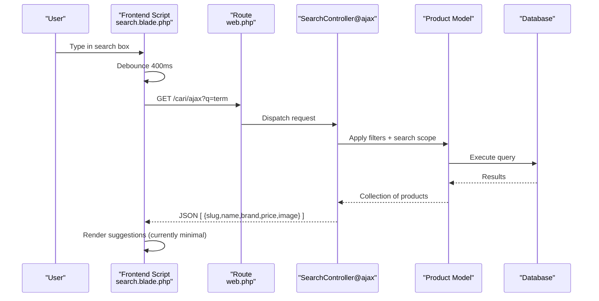
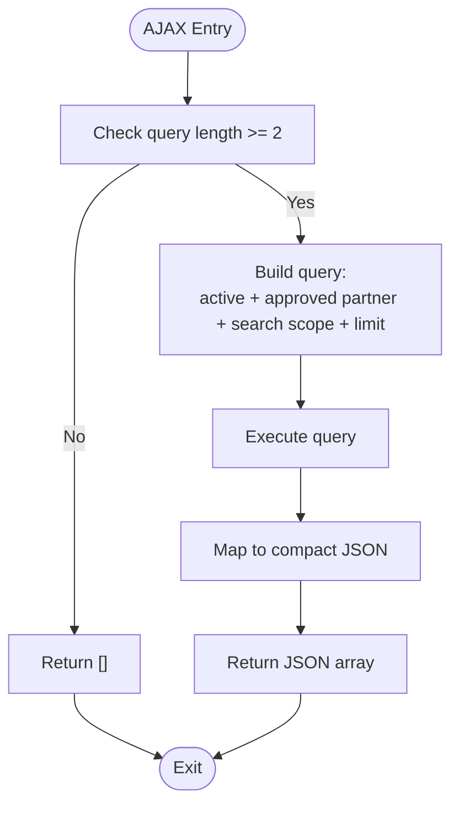
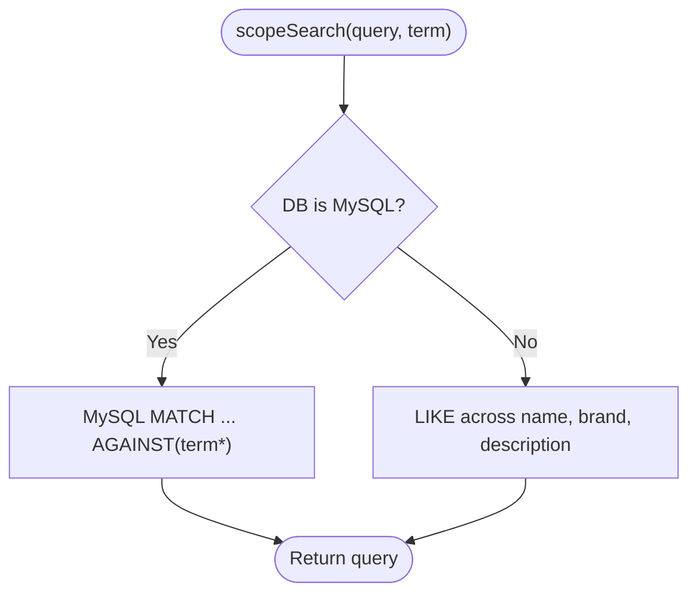
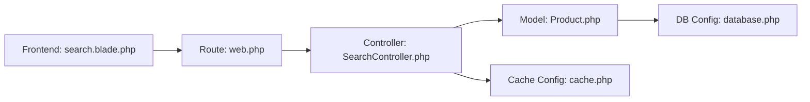

# Auto-Complete and Suggestions

<cite>
**Referenced Files in This Document**
- [search.blade.php](file://resources/views/catalog/search.blade.php)
- [SearchController.php](file://app/Http/Controllers/SearchController.php)
- [web.php](file://routes/web.php)
- [Product.php](file://app/Models/Product.php)
- [database.php](file://config/database.php)
- [cache.php](file://config/cache.php)
- [catalog.php](file://config/catalog.php)
</cite>

## Table of Contents
1. [Introduction](#introduction)
2. [Project Structure](#project-structure)
3. [Core Components](#core-components)
4. [Architecture Overview](#architecture-overview)
5. [Detailed Component Analysis](#detailed-component-analysis)
6. [Dependency Analysis](#dependency-analysis)
7. [Performance Considerations](#performance-considerations)
8. [Troubleshooting Guide](#troubleshooting-guide)
9. [Conclusion](#conclusion)

## Introduction
This document explains the auto-complete and search suggestion system implemented in the application. It covers the AJAX-based auto-complete flow, minimum character threshold, suggestion result formatting, and the JSON response consumed by the frontend. It also documents the current suggestion algorithm (full-text search), missing features such as popularity-based ranking and trending queries, and practical guidance for caching and performance optimization. Finally, it provides frontend integration patterns, debouncing techniques, and UX enhancements for search input fields.

## Project Structure
The auto-complete feature spans three layers:
- Frontend: A search page template with a live input handler that triggers AJAX requests.
- Backend: A controller action that validates input, executes a scoped search, and returns a compact JSON payload.
- Data Access: An Eloquent model with a database-agnostic search scope.

**Diagram sources**
- [search.blade.php:96-114](file://resources/views/catalog/search.blade.php#L96-L114)
- [web.php:54](file://routes/web.php#L54)
- [SearchController.php:33-54](file://app/Http/Controllers/SearchController.php#L33-L54)
- [Product.php:121-130](file://app/Models/Product.php#L121-L130)
- [database.php:18](file://config/database.php#L18)

**Section sources**
- [search.blade.php:96-114](file://resources/views/catalog/search.blade.php#L96-L114)
- [web.php:54](file://routes/web.php#L54)
- [SearchController.php:33-54](file://app/Http/Controllers/SearchController.php#L33-L54)
- [Product.php:121-130](file://app/Models/Product.php#L121-L130)
- [database.php:18](file://config/database.php#L18)

## Core Components
- Frontend live search handler:
  - Debounces input events with a 400 ms delay.
  - Requires a minimum of two characters before sending an AJAX request.
  - Fetches JSON from the backend endpoint and currently leaves the result unused for minimal live preview.
- Backend controller:
  - Validates query length and returns an empty array for invalid inputs.
  - Applies filters: active products and approved partner status.
  - Executes a database-agnostic search across name, brand, and description.
  - Limits results to a small set and returns a compact JSON payload.
- Data model:
  - Provides a search scope that uses MySQL full-text search when configured accordingly, otherwise falls back to LIKE conditions.

Key frontend integration pattern:
- Use a single input inside a search box container.
- Attach an input event listener.
- Debounce the handler to reduce network load.
- Send a GET request to the AJAX route with the query parameter.
- Parse the returned JSON and render suggestions.

Minimum character threshold:
- The frontend enforces a minimum of two characters before triggering the AJAX call.
- The backend also checks the query length and returns an empty array for shorter inputs.

JSON response format:
- The backend returns an array of suggestion objects with the following fields:
  - slug: Product identifier for navigation.
  - name: Product name.
  - brand: Brand name.
  - price: Formatted price string suitable for display.
  - image: Image URL derived from either a stored path or a direct URL.

Current suggestion algorithm:
- Full-text search across name, brand, and description.
- Database-agnostic behavior: MySQL uses MATCH ... AGAINST in Boolean mode; other databases use OR-combined LIKE clauses.
- No explicit popularity-based ranking or trending query integration is implemented.

**Section sources**
- [search.blade.php:96-114](file://resources/views/catalog/search.blade.php#L96-L114)
- [SearchController.php:33-54](file://app/Http/Controllers/SearchController.php#L33-L54)
- [Product.php:121-130](file://app/Models/Product.php#L121-L130)

## Architecture Overview
The auto-complete pipeline is a straightforward request-response flow with debounced client-side input handling and server-side filtering and search.

**Diagram sources**
- [search.blade.php:96-114](file://resources/views/catalog/search.blade.php#L96-L114)
- [web.php:54](file://routes/web.php#L54)
- [SearchController.php:33-54](file://app/Http/Controllers/SearchController.php#L33-L54)
- [Product.php:121-130](file://app/Models/Product.php#L121-L130)

## Detailed Component Analysis

### Frontend Live Search Handler
- Debouncing: A timeout is cleared and reset on each input event, ensuring the request fires only after the user stops typing for 400 ms.
- Minimum length: Requests are sent only when the input length is at least two characters.
- Request construction: Uses the named route for the AJAX endpoint and encodes the query parameter.
- Current rendering: The returned data is fetched but not yet rendered into a dropdown or preview.

Recommended UX enhancements:
- Render a dropdown list under the input with clickable items.
- Highlight matched terms within suggestion labels.
- Add keyboard navigation (arrow keys, Enter to select).
- Clear suggestions on focus loss or when input becomes empty.

**Section sources**
- [search.blade.php:96-114](file://resources/views/catalog/search.blade.php#L96-L114)

### Backend Controller Action (AJAX)
Responsibilities:
- Validate query length and return early with an empty array if invalid.
- Filter to active products and approved partners.
- Apply the search scope with a limit on results.
- Map the results to a compact JSON shape suitable for frontend rendering.

Response shaping:
- Returns an array of objects containing slug, name, brand, price, and image URL.
- Price formatting is handled server-side for consistent presentation.

Suggestion algorithm:
- Uses the model’s search scope, which adapts to the configured database driver.
- On MySQL, performs a full-text search with a trailing wildcard-like behavior.
- On other databases, applies OR-combined LIKE conditions against name, brand, and description.

**Diagram sources**
- [SearchController.php:33-54](file://app/Http/Controllers/SearchController.php#L33-L54)

**Section sources**
- [SearchController.php:33-54](file://app/Http/Controllers/SearchController.php#L33-L54)

### Data Model Search Scope
Behavior:
- MySQL: Uses MATCH(name, brand, description) AGAINST(? IN BOOLEAN MODE) with a trailing wildcard appended to the term.
- Other databases: Applies WHERE name LIKE %term% OR brand LIKE %term% OR description LIKE %term%.

Implications:
- Boolean full-text search on MySQL can yield faster and more flexible matches.
- LIKE fallback is inclusive but may be slower on large datasets.

**Diagram sources**
- [Product.php:121-130](file://app/Models/Product.php#L121-L130)

**Section sources**
- [Product.php:121-130](file://app/Models/Product.php#L121-L130)

### Routing
- The AJAX endpoint is registered as GET /cari/ajax with the name search.ajax.
- The frontend script uses this named route to construct the request URL.

**Section sources**
- [web.php:54](file://routes/web.php#L54)

## Dependency Analysis
The auto-complete feature depends on:
- Route registration for the AJAX endpoint.
- Controller action that orchestrates filtering, search, and response formatting.
- Model scope that adapts to the configured database driver.
- Configuration for database and cache drivers.

**Diagram sources**
- [web.php:54](file://routes/web.php#L54)
- [SearchController.php:33-54](file://app/Http/Controllers/SearchController.php#L33-L54)
- [Product.php:121-130](file://app/Models/Product.php#L121-L130)
- [database.php:18](file://config/database.php#L18)
- [cache.php:18](file://config/cache.php#L18)
- [search.blade.php:96-114](file://resources/views/catalog/search.blade.php#L96-L114)

**Section sources**
- [web.php:54](file://routes/web.php#L54)
- [SearchController.php:33-54](file://app/Http/Controllers/SearchController.php#L33-L54)
- [Product.php:121-130](file://app/Models/Product.php#L121-L130)
- [database.php:18](file://config/database.php#L18)
- [cache.php:18](file://config/cache.php#L18)
- [search.blade.php:96-114](file://resources/views/catalog/search.blade.php#L96-L114)

## Performance Considerations
Current state:
- The controller limits results to a small fixed number and returns a compact JSON payload.
- The model’s search scope adapts to the database driver, with MySQL using full-text search.

Optimization opportunities:
- Add caching for frequent queries:
  - Use the cache store configured in cache.php to memoize recent search results keyed by the query string and optional user context.
  - Set short TTLs (e.g., seconds) to balance freshness and performance.
- Indexing:
  - Ensure full-text indexes exist on name, brand, and description for MySQL.
  - Confirm appropriate indexes for LIKE queries on other databases.
- Pagination vs. auto-complete:
  - Keep suggestion lists small (already limited) to minimize payload size.
- Network efficiency:
  - Consider compressing responses if bandwidth is constrained.
- Debounce tuning:
  - Adjust the debounce interval (currently 400 ms) based on user feedback and traffic patterns.

[No sources needed since this section provides general guidance]

## Troubleshooting Guide
Common issues and resolutions:
- No suggestions appear:
  - Verify the minimum character threshold is met (>= 2) on both frontend and backend.
  - Confirm the AJAX route exists and is reachable.
- Incorrect or slow search results:
  - Check the database driver configuration and ensure the search scope is using the intended mode (MySQL full-text vs. LIKE).
  - Validate that the database contains indexed columns for the targeted fields.
- Empty response:
  - Ensure the controller returns an empty array for invalid inputs and that the frontend handles it gracefully.
- Price formatting inconsistencies:
  - Confirm the server-side formatting is applied consistently and matches locale expectations.

**Section sources**
- [SearchController.php:33-54](file://app/Http/Controllers/SearchController.php#L33-L54)
- [Product.php:121-130](file://app/Models/Product.php#L121-L130)
- [database.php:18](file://config/database.php#L18)

## Conclusion
The current auto-complete system provides a functional foundation: a debounced frontend input handler, a backend endpoint that validates input and executes a database-agnostic search, and a compact JSON response tailored for lightweight rendering. While the suggestion algorithm is robust and adaptable, it does not yet incorporate popularity-based ranking or trending query suggestions. By adding caching, optimizing indexes, and enhancing the frontend rendering and UX, the system can become more responsive and valuable for users.