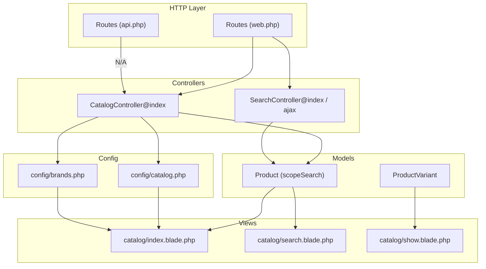
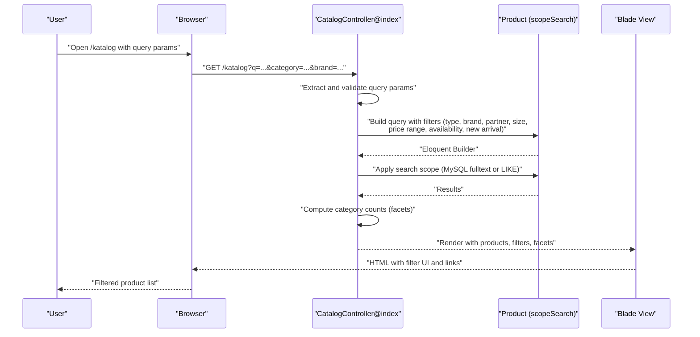
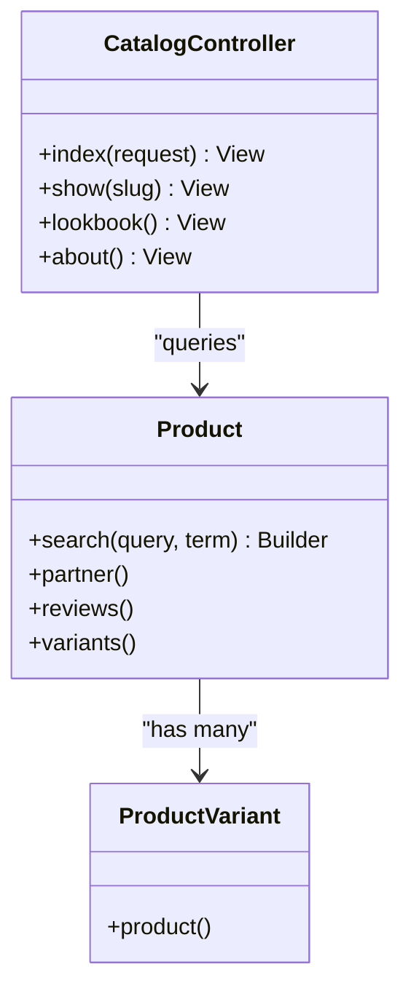
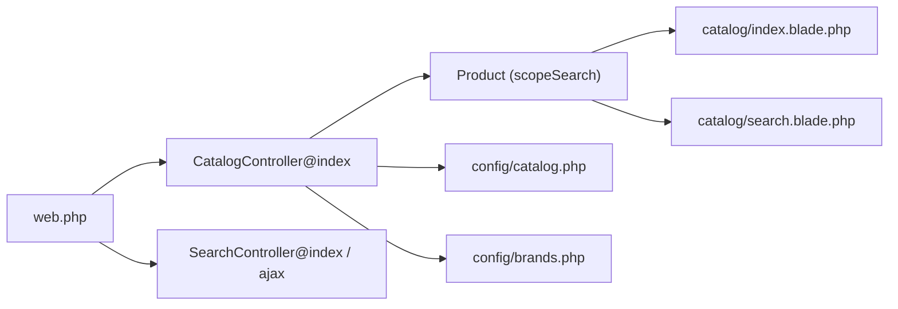

# Filter Categories and Faceted Search

<cite>
**Referenced Files in This Document**
- [CatalogController.php](file://app/Http/Controllers/CatalogController.php)
- [SearchController.php](file://app/Http/Controllers/SearchController.php)
- [Product.php](file://app/Models/Product.php)
- [ProductVariant.php](file://app/Models/ProductVariant.php)
- [catalog.php](file://config/catalog.php)
- [brands.php](file://config/brands.php)
- [2026_05_04_125734_create_products_table.php](file://database/migrations/2026_05_04_125734_create_products_table.php)
- [2026_07_01_100002_create_product_variants_table.php](file://database/migrations/2026_07_01_100002_create_product_variants_table.php)
- [web.php](file://routes/web.php)
- [api.php](file://routes/api.php)
- [index.blade.php](file://resources/views/catalog/index.blade.php)
- [search.blade.php](file://resources/views/catalog/search.blade.php)
- [show.blade.php](file://resources/views/catalog/show.blade.php)
</cite>

## Table of Contents
1. [Introduction](#introduction)
2. [Project Structure](#project-structure)
3. [Core Components](#core-components)
4. [Architecture Overview](#architecture-overview)
5. [Detailed Component Analysis](#detailed-component-analysis)
6. [Dependency Analysis](#dependency-analysis)
7. [Performance Considerations](#performance-considerations)
8. [Troubleshooting Guide](#troubleshooting-guide)
9. [Conclusion](#conclusion)

## Introduction
This document explains the filter categories and faceted search implementation for the KatalogThrift product catalog. It covers supported filter types (price range, size, brand, product type, availability), parameter handling via URL query strings, filter state persistence, dynamic facet generation, validation and constraints, filter combination logic, API endpoints, UI integration, and performance optimization recommendations.

## Project Structure
The filtering and faceted search functionality spans controller logic, model scopes, configuration-driven facets, Blade templates, and routing. Key areas:
- Controllers handle query parameter extraction, build Eloquent queries, compute facets, and pass state to views.
- Models define searchable attributes and scopes.
- Configuration files define product categories and brand assets.
- Blade templates render filter UI and apply filter state.
- Routes expose GET endpoints for catalog and search.

**Diagram sources**
- [web.php:46-54](file://routes/web.php#L46-L54)
- [api.php:17-19](file://routes/api.php#L17-L19)
- [CatalogController.php:30-82](file://app/Http/Controllers/CatalogController.php#L30-L82)
- [SearchController.php:10-54](file://app/Http/Controllers/SearchController.php#L10-L54)
- [Product.php:121-130](file://app/Models/Product.php#L121-L130)
- [ProductVariant.php:1-22](file://app/Models/ProductVariant.php#L1-L22)
- [catalog.php:14-28](file://config/catalog.php#L14-L28)
- [brands.php:25-45](file://config/brands.php#L25-L45)
- [index.blade.php:51-260](file://resources/views/catalog/index.blade.php#L51-L260)
- [search.blade.php](file://resources/views/catalog/search.blade.php)
- [show.blade.php:331-346](file://resources/views/catalog/show.blade.php#L331-L346)

**Section sources**
- [web.php:46-54](file://routes/web.php#L46-L54)
- [api.php:17-19](file://routes/api.php#L17-L19)
- [CatalogController.php:30-82](file://app/Http/Controllers/CatalogController.php#L30-L82)
- [SearchController.php:10-54](file://app/Http/Controllers/SearchController.php#L10-L54)
- [Product.php:121-130](file://app/Models/Product.php#L121-L130)
- [catalog.php:14-28](file://config/catalog.php#L14-L28)
- [brands.php:25-45](file://config/brands.php#L25-L45)
- [index.blade.php:51-260](file://resources/views/catalog/index.blade.php#L51-L260)

## Core Components
- CatalogController@index builds filtered product lists and computes facets for product types and counts.
- Product model provides a search scope supporting MySQL full-text or fallback LIKE matching.
- Configuration defines product categories and brand assets used in facets and chips.
- Blade templates render filter UI, maintain filter state in URL query strings, and present facets.

Key filter parameters handled:
- category: product type slug
- brand: brand name
- partner: partner ID
- size: clothing size
- min_price, max_price: price range bounds
- availability: available vs sold
- new_arrival: new arrival flag

**Section sources**
- [CatalogController.php:30-82](file://app/Http/Controllers/CatalogController.php#L30-L82)
- [Product.php:121-130](file://app/Models/Product.php#L121-L130)
- [catalog.php:14-28](file://config/catalog.php#L14-L28)
- [brands.php:25-45](file://config/brands.php#L25-L45)
- [index.blade.php:214-231](file://resources/views/catalog/index.blade.php#L214-L231)

## Architecture Overview
The filter pipeline follows a request-to-response flow:
- Request arrives at catalog index endpoint with optional query parameters.
- Controller extracts parameters and conditionally adds constraints to the base query.
- Controller computes facets (counts per product type) and passes filters to the view.
- Blade renders filter UI and applies current filter state to URLs and links.
- Product search uses a scoped search method for full-text or LIKE matching.

**Diagram sources**
- [CatalogController.php:30-82](file://app/Http/Controllers/CatalogController.php#L30-L82)
- [Product.php:121-130](file://app/Models/Product.php#L121-L130)
- [index.blade.php:194-240](file://resources/views/catalog/index.blade.php#L194-L240)

**Section sources**
- [CatalogController.php:30-82](file://app/Http/Controllers/CatalogController.php#L30-L82)
- [Product.php:121-130](file://app/Models/Product.php#L121-L130)
- [index.blade.php:194-240](file://resources/views/catalog/index.blade.php#L194-L240)

## Detailed Component Analysis

### Filter Parameter Handling and URL Query String Management
- Supported parameters: category, brand, partner, size, min_price, max_price, availability, new_arrival.
- Controller reads parameters via request helpers and applies conditional where clauses.
- Blade forms submit to the same route, preserving category when present and resetting others on apply or reset actions.
- Active filters are shown and can be cleared via a reset link.

```mermaid
flowchart TD
Start(["Request Received"]) --> Extract["Extract query params<br/>category, brand, partner,<br/>size, min_price, max_price,<br/>availability, new_arrival"]
Extract --> ApplyBase["Apply base constraints:<br/>is_active=true,<br/>partner approved"]
ApplyBase --> CheckCat{"category filled?"}
CheckCat --> |Yes| Cat["Add product_type filter"]
CheckCat --> |No| CheckBrand{"brand filled?"}
Cat --> CheckBrand
CheckBrand --> |Yes| Brand["Add brand filter"]
CheckBrand --> |No| CheckPartner{"partner filled?"}
Brand --> CheckPartner
CheckPartner --> |Yes| Partner["Add partner_id filter"]
CheckPartner --> |No| CheckSize{"size filled?"}
Partner --> CheckSize
CheckSize --> |Yes| Size["Add size filter"]
CheckSize --> |No| CheckMin{"min_price filled?"}
Size --> CheckMin
CheckMin --> |Yes| MinPrice["Add >= price filter"]
CheckMin --> |No| CheckMax{"max_price filled?"}
MinPrice --> CheckMax
CheckMax --> |Yes| MaxPrice["Add <= price filter"]
CheckMax --> |No| CheckAvail{"availability filled?"}
MaxPrice --> CheckAvail
CheckAvail --> |Yes| Avail["Add is_sold filter based on value"]
CheckAvail --> |No| CheckNew{"new_arrival filled?"}
Avail --> CheckNew
CheckNew --> |Yes| New["Add is_new_arrival filter"]
CheckNew --> |No| BuildEnd["Build query result"]
New --> BuildEnd
BuildEnd --> Facet["Compute category counts (facets)"]
Facet --> Render["Render view with products,<br/>filters, facets"]
```

**Diagram sources**
- [CatalogController.php:30-82](file://app/Http/Controllers/CatalogController.php#L30-L82)
- [index.blade.php:194-240](file://resources/views/catalog/index.blade.php#L194-L240)

**Section sources**
- [CatalogController.php:30-82](file://app/Http/Controllers/CatalogController.php#L30-L82)
- [index.blade.php:194-240](file://resources/views/catalog/index.blade.php#L194-L240)

### Filter Types and Faceted Search
Available filter categories:
- Price range: min_price and max_price numeric inputs.
- Size: single size selection.
- Brand: brand chips derived from product brands.
- Product type: category tabs with counts.
- Availability: dropdown for available vs sold.
- Partner: optional partner filter for curated stores.
- New arrival: boolean flag for new items.

Faceted search:
- Category counts are computed by grouping products by product_type and counting per type.
- Brand chips are generated from unique brands in the current product set.
- Category tabs link to the same route with category parameter and preserve existing filters.

**Diagram sources**
- [CatalogController.php:30-82](file://app/Http/Controllers/CatalogController.php#L30-L82)
- [Product.php:121-130](file://app/Models/Product.php#L121-L130)
- [ProductVariant.php:1-22](file://app/Models/ProductVariant.php#L1-L22)

**Section sources**
- [CatalogController.php:55-64](file://app/Http/Controllers/CatalogController.php#L55-L64)
- [index.blade.php:182-191](file://resources/views/catalog/index.blade.php#L182-L191)
- [index.blade.php:244-260](file://resources/views/catalog/index.blade.php#L244-L260)
- [catalog.php:14-28](file://config/catalog.php#L14-L28)

### Filter Validation, Constraints, and Combination Logic
Validation and constraints:
- Numeric price filters cast to integers for comparison.
- Availability filter toggles is_sold based on the selected option.
- Optional filters are applied only when present.
- Combined filters are additive; later conditions append to the base query.

Combination logic:
- Base query enforces active status and approved partner status.
- Additional filters are chained; order does not change semantics due to Eloquent builder behavior.
- Category and brand filters are mutually compatible with price and availability filters.

**Section sources**
- [CatalogController.php:36-47](file://app/Http/Controllers/CatalogController.php#L36-L47)
- [index.blade.php:214-231](file://resources/views/catalog/index.blade.php#L214-L231)

### Filter API Endpoints
Public endpoints:
- GET /katalog — Catalog index with filters and facets.
- GET /cari — Search results page.
- GET /cari/ajax — AJAX search suggestions.

These endpoints support URL query string parameters for filtering and faceting.

**Section sources**
- [web.php:46-54](file://routes/web.php#L46-L54)
- [SearchController.php:10-54](file://app/Http/Controllers/SearchController.php#L10-L54)

### Filter UI Component Integration
UI components:
- Filter bar with inputs for min/max price and availability dropdown.
- Category tabs with counts and active state.
- Brand chips with optional logos sourced from configuration.
- Reset and apply buttons to manage filter state.

State persistence:
- Current filters are passed to the view and rendered in inputs.
- Links preserve existing filters while adding/removing specific ones.

**Section sources**
- [index.blade.php:51-260](file://resources/views/catalog/index.blade.php#L51-L260)
- [brands.php:25-45](file://config/brands.php#L25-L45)

### Search Scope Implementation
The Product model’s search scope adapts to the configured database driver:
- MySQL: uses full-text boolean mode with wildcard expansion.
- Other databases: falls back to LIKE matching across name, brand, and description.

This enables fast text search and integrates seamlessly with filter queries.

**Section sources**
- [Product.php:121-130](file://app/Models/Product.php#L121-L130)
- [SearchController.php:16-21](file://app/Http/Controllers/SearchController.php#L16-L21)

## Dependency Analysis
- CatalogController depends on Product model and configuration for product types and brand assets.
- Views depend on controller-provided data arrays (products, filters, category counts).
- Routes bind URLs to controller actions.

**Diagram sources**
- [web.php:46-54](file://routes/web.php#L46-L54)
- [CatalogController.php:30-82](file://app/Http/Controllers/CatalogController.php#L30-L82)
- [SearchController.php:10-54](file://app/Http/Controllers/SearchController.php#L10-L54)
- [Product.php:121-130](file://app/Models/Product.php#L121-L130)
- [catalog.php:14-28](file://config/catalog.php#L14-L28)
- [brands.php:25-45](file://config/brands.php#L25-L45)
- [index.blade.php:194-240](file://resources/views/catalog/index.blade.php#L194-L240)
- [search.blade.php](file://resources/views/catalog/search.blade.php)

**Section sources**
- [web.php:46-54](file://routes/web.php#L46-L54)
- [CatalogController.php:30-82](file://app/Http/Controllers/CatalogController.php#L30-L82)
- [SearchController.php:10-54](file://app/Http/Controllers/SearchController.php#L10-L54)
- [Product.php:121-130](file://app/Models/Product.php#L121-L130)
- [catalog.php:14-28](file://config/catalog.php#L14-L28)
- [brands.php:25-45](file://config/brands.php#L25-L45)
- [index.blade.php:194-240](file://resources/views/catalog/index.blade.php#L194-L240)
- [search.blade.php](file://resources/views/catalog/search.blade.php)

## Performance Considerations
- Database indexing recommendations:
  - Indexes on frequently filtered columns improve query performance:
    - products(product_type)
    - products(brand)
    - products(partner_id)
    - products(size)
    - products(price)
    - products(is_sold)
    - products(is_active)
    - products(is_new_arrival)
    - products(updated_at) or created_at for ordering
  - Composite indexes for common filter combinations (e.g., product_type + is_active, price range + is_active).
- Full-text search:
  - MySQL full-text indexes on name, brand, description accelerate search scope performance.
- Pagination:
  - Use cursor-based or offset pagination for large result sets to avoid deep pagination costs.
- Query building:
  - Keep filter conditions selective and avoid N+1 queries by eager-loading related data (already done via with('partner')).
- Caching:
  - Cache category counts and brand lists for static facets to reduce repeated aggregation queries.
- Frontend:
  - Debounce AJAX search requests and limit suggestion results to reduce server load.

[No sources needed since this section provides general guidance]

## Troubleshooting Guide
Common issues and resolutions:
- Filters not applying:
  - Ensure query parameters are present and non-empty before applying where clauses.
  - Confirm availability filter values match expected options.
- Unexpected empty results:
  - Verify base constraints (is_active and approved partner) align with data.
  - Check price filters are numeric and within valid ranges.
- Facet counts incorrect:
  - Confirm aggregation query groups by product_type and filters by is_active and approved partner.
- Search yields no results:
  - Validate database driver and existence of full-text indexes for MySQL.
  - For non-MySQL, confirm LIKE fallback matches expected terms.

**Section sources**
- [CatalogController.php:30-82](file://app/Http/Controllers/CatalogController.php#L30-L82)
- [Product.php:121-130](file://app/Models/Product.php#L121-L130)

## Conclusion
The filter and faceted search implementation leverages a clean separation of concerns: controllers assemble filter logic, models provide search capabilities, configuration drives facets, and views render interactive UI with persistent state. By enforcing constraints, combining filters additively, and optimizing database access, the system delivers responsive filtering across product types, brands, sizes, prices, and availability.