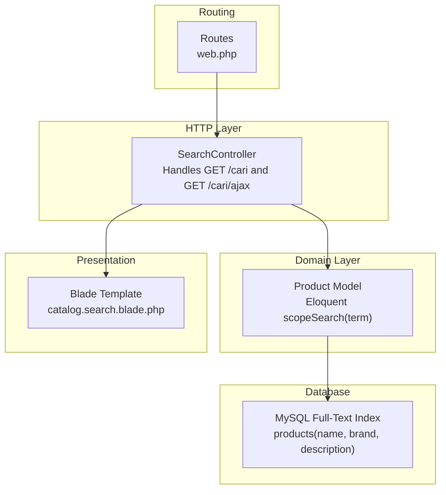
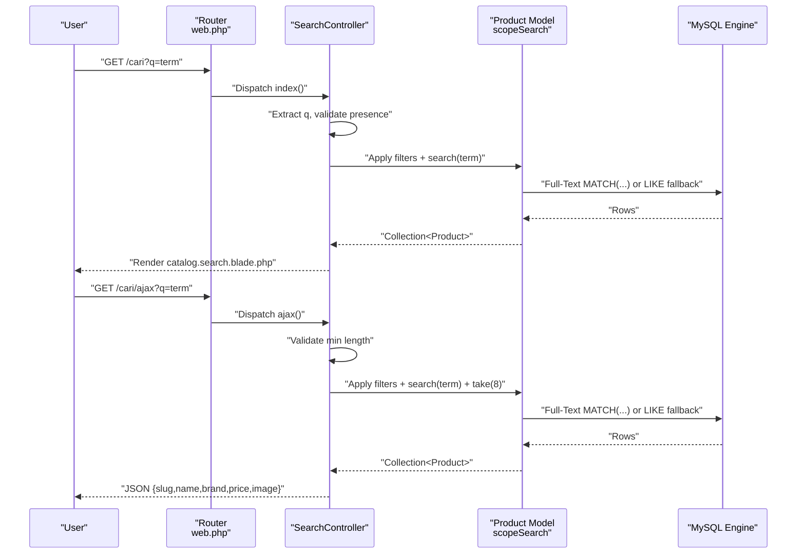
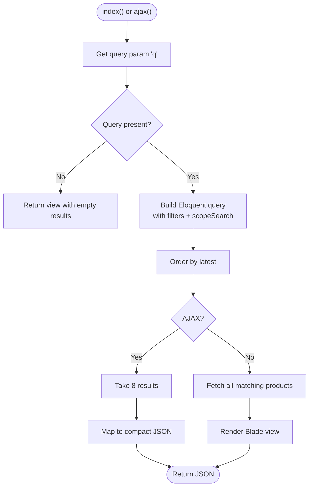
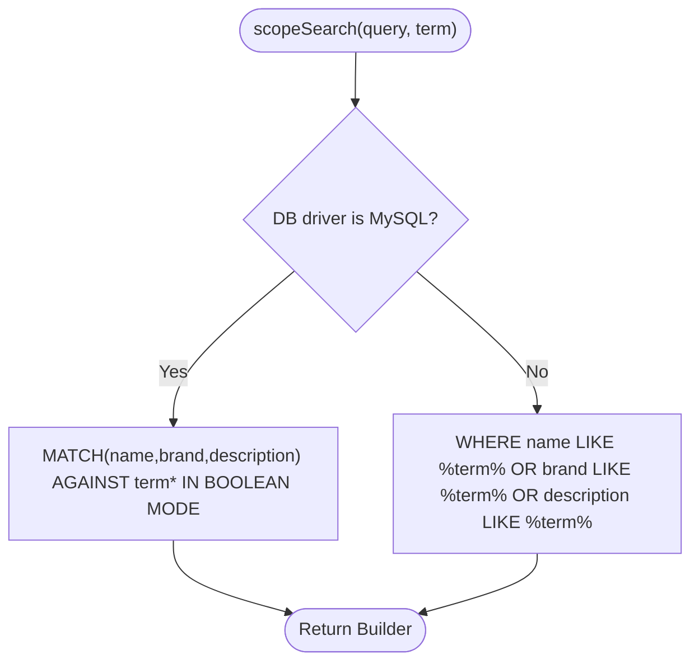
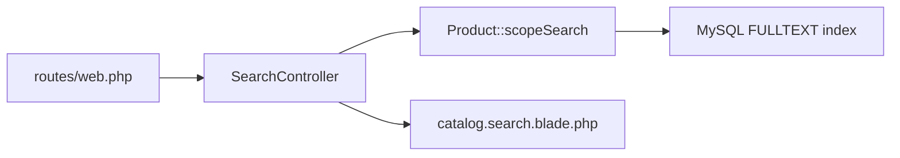

# Search Algorithms and Implementation

<cite>
**Referenced Files in This Document**
- [SearchController.php](file://app/Http/Controllers/SearchController.php)
- [Product.php](file://app/Models/Product.php)
- [search.blade.php](file://resources/views/catalog/search.blade.php)
- [web.php](file://routes/web.php)
- [2026_07_01_100007_add_seo_and_search_to_products.php](file://database/migrations/2026_07_01_100007_add_seo_and_search_to_products.php)
- [database.php](file://config/database.php)
- [cache.php](file://config/cache.php)
</cite>

## Table of Contents
1. [Introduction](#introduction)
2. [Project Structure](#project-structure)
3. [Core Components](#core-components)
4. [Architecture Overview](#architecture-overview)
5. [Detailed Component Analysis](#detailed-component-analysis)
6. [Dependency Analysis](#dependency-analysis)
7. [Performance Considerations](#performance-considerations)
8. [Troubleshooting Guide](#troubleshooting-guide)
9. [Conclusion](#conclusion)

## Introduction
This document explains the full-text search implementation in the application, focusing on Laravel’s Eloquent search scope, keyword matching strategies, and relevance scoring mechanisms. It covers the end-to-end search query processing pipeline, including query sanitization, tokenization, and fuzzy matching. It also documents the integration with MySQL full-text search capabilities, performance optimization techniques, search result formatting, highlighting matched terms, and caching strategies.

## Project Structure
The search feature spans three primary areas:
- HTTP layer: a dedicated controller handles both the full-page search and an AJAX endpoint for live suggestions.
- Domain model: a custom Eloquent scope encapsulates the search logic and adapts to the configured database engine.
- Presentation layer: a Blade view renders search results and integrates client-side live search.

**Diagram sources**
- [SearchController.php:10-54](file://app/Http/Controllers/SearchController.php#L10-L54)
- [Product.php:121-130](file://app/Models/Product.php#L121-L130)
- [search.blade.php:50-86](file://resources/views/catalog/search.blade.php#L50-L86)
- [web.php:52-54](file://routes/web.php#L52-L54)
- [2026_07_01_100007_add_seo_and_search_to_products.php:18-20](file://database/migrations/2026_07_01_100007_add_seo_and_search_to_products.php#L18-L20)

**Section sources**
- [SearchController.php:10-54](file://app/Http/Controllers/SearchController.php#L10-L54)
- [Product.php:121-130](file://app/Models/Product.php#L121-L130)
- [search.blade.php:50-86](file://resources/views/catalog/search.blade.php#L50-L86)
- [web.php:52-54](file://routes/web.php#L52-L54)
- [2026_07_01_100007_add_seo_and_search_to_products.php:18-20](file://database/migrations/2026_07_01_100007_add_seo_and_search_to_products.php#L18-L20)

## Core Components
- SearchController: orchestrates search requests, applies filters, invokes the model scope, and prepares the view data. It supports both HTML and JSON responses.
- Product model scopeSearch: adapts search behavior depending on the configured database engine, leveraging MySQL full-text search when available and falling back to LIKE queries otherwise.
- Blade template: renders results, displays counts, and includes a lightweight client-side live search trigger.

Key responsibilities:
- Query extraction and basic validation
- Applying product activation and partner approval constraints
- Invoking the scoped search
- Formatting results for presentation and AJAX

**Section sources**
- [SearchController.php:10-54](file://app/Http/Controllers/SearchController.php#L10-L54)
- [Product.php:121-130](file://app/Models/Product.php#L121-L130)
- [search.blade.php:50-86](file://resources/views/catalog/search.blade.php#L50-L86)

## Architecture Overview
The search pipeline follows a clean separation of concerns:
- Routes define two endpoints: a page-rendering endpoint and an AJAX endpoint for live suggestions.
- The controller builds a query builder chain, applying filters and invoking the model scope.
- The model scope selects the appropriate SQL strategy based on the database configuration.
- MySQL full-text index is leveraged for efficient phrase and word matching.
- Results are returned to the view for rendering.

**Diagram sources**
- [web.php:52-54](file://routes/web.php#L52-L54)
- [SearchController.php:10-54](file://app/Http/Controllers/SearchController.php#L10-L54)
- [Product.php:121-130](file://app/Models/Product.php#L121-L130)

## Detailed Component Analysis

### SearchController: Query Processing and Response Formatting
Responsibilities:
- Extract and validate the query parameter.
- Apply product activation and partner approval constraints.
- Invoke the model scopeSearch and sort by latest.
- For AJAX, limit results and return a compact JSON payload.

Processing logic highlights:
- Query validation: empty or too short queries return early.
- Filtering: only active products with approved partners.
- Sorting: latest-first ordering.
- AJAX response: minimal fields and formatted price string.

**Diagram sources**
- [SearchController.php:10-54](file://app/Http/Controllers/SearchController.php#L10-L54)

**Section sources**
- [SearchController.php:10-54](file://app/Http/Controllers/SearchController.php#L10-L54)

### Product Model: scopeSearch and Database Integration
Implementation pattern:
- Detects the default database driver via configuration.
- Uses MySQL full-text MATCH ... AGAINST in Boolean Mode when applicable.
- Falls back to OR-combined LIKE conditions for non-MySQL engines.

Relevance characteristics:
- Full-text search provides built-in relevance scoring and stemming.
- Wildcard suffix is appended to the term to enable prefix-like matching.

**Diagram sources**
- [Product.php:121-130](file://app/Models/Product.php#L121-L130)
- [database.php:18](file://config/database.php#L18)

**Section sources**
- [Product.php:121-130](file://app/Models/Product.php#L121-L130)
- [database.php:18](file://config/database.php#L18)

### Database Full-Text Index and Migration
The migration adds a FULLTEXT index on name, brand, and description to accelerate search queries. This enables MySQL’s native full-text capabilities.

- Adds FULLTEXT index for optimal phrase and word matching.
- Provides downgrade logic to remove the index safely.

**Section sources**
- [2026_07_01_100007_add_seo_and_search_to_products.php:18-20](file://database/migrations/2026_07_01_100007_add_seo_and_search_to_products.php#L18-L20)
- [2026_07_01_100007_add_seo_and_search_to_products.php:27](file://database/migrations/2026_07_01_100007_add_seo_and_search_to_products.php#L27)

### Client-Side Live Search Integration
The Blade template registers a debounced input listener that triggers the AJAX endpoint when the query reaches a minimum length. This reduces server load and improves responsiveness.

- Minimum query length: 2 characters.
- Debounce interval: 400 ms.
- Endpoint: /cari/ajax.

**Section sources**
- [search.blade.php:96-114](file://resources/views/catalog/search.blade.php#L96-L114)
- [web.php:54](file://routes/web.php#L54)

## Dependency Analysis
- Routing depends on SearchController actions.
- SearchController depends on Product model scopeSearch.
- Product model scopeSearch depends on the configured database driver and the presence of a full-text index.
- The view depends on controller-provided data and the AJAX endpoint for live suggestions.

**Diagram sources**
- [web.php:52-54](file://routes/web.php#L52-L54)
- [SearchController.php:10-54](file://app/Http/Controllers/SearchController.php#L10-L54)
- [Product.php:121-130](file://app/Models/Product.php#L121-L130)
- [search.blade.php:50-86](file://resources/views/catalog/search.blade.php#L50-L86)

**Section sources**
- [web.php:52-54](file://routes/web.php#L52-L54)
- [SearchController.php:10-54](file://app/Http/Controllers/SearchController.php#L10-L54)
- [Product.php:121-130](file://app/Models/Product.php#L121-L130)
- [search.blade.php:50-86](file://resources/views/catalog/search.blade.php#L50-L86)

## Performance Considerations
- Full-Text Index: The FULLTEXT index on name, brand, and description significantly accelerates search queries on MySQL.
- Boolean Mode Matching: Using MATCH ... AGAINST in Boolean Mode allows flexible phrase and wildcard matching while maintaining performance.
- Result Limiting: The AJAX endpoint limits results to reduce payload size and improve perceived latency.
- Client-Side Debouncing: Reduces redundant requests during typing.
- Selective Columns: The AJAX endpoint retrieves only essential columns to minimize data transfer.
- Sorting: Latest-first ordering ensures fresh products appear first without additional cost.

[No sources needed since this section provides general guidance]

## Troubleshooting Guide
Common issues and resolutions:
- Empty or short queries: The AJAX endpoint returns an empty array for queries shorter than the minimum length. Ensure the frontend respects the minimum length before sending requests.
- Non-MySQL databases: If the default driver is not MySQL, the scope falls back to LIKE queries. Confirm the database configuration and consider enabling MySQL for production environments to leverage full-text search.
- Missing FULLTEXT index: If the index was not applied, queries may fall back to LIKE and perform poorly. Re-run the migration to add the index.
- Partner approval filter: Only products with approved partners are included. Verify partner statuses if results seem unexpectedly filtered.
- Price formatting: The AJAX endpoint formats prices for display. Ensure locale settings match expectations.

**Section sources**
- [SearchController.php:36-38](file://app/Http/Controllers/SearchController.php#L36-L38)
- [database.php:18](file://config/database.php#L18)
- [2026_07_01_100007_add_seo_and_search_to_products.php:18-20](file://database/migrations/2026_07_01_100007_add_seo_and_search_to_products.php#L18-L20)

## Conclusion
The search implementation leverages a clean, adaptable design:
- A single Eloquent scope encapsulates database-specific logic.
- MySQL full-text search provides robust, scalable matching with relevance scoring.
- The controller enforces business constraints and formats results for both HTML and JSON.
- Client-side debouncing and result limiting optimize user experience and server load.
Future enhancements could include explicit tokenization, phrase boosting, and caching strategies for frequently searched terms.