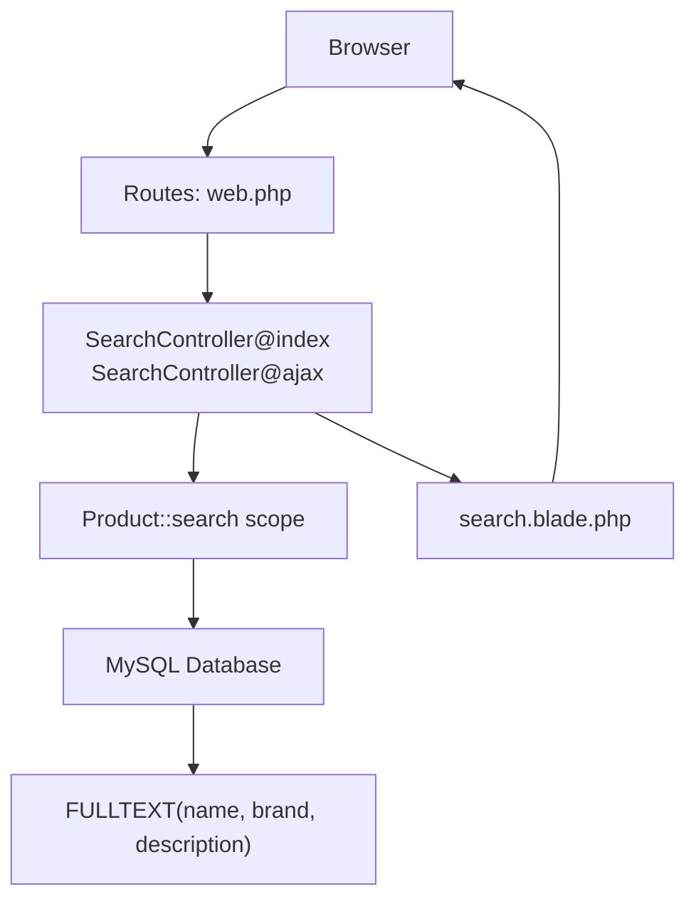
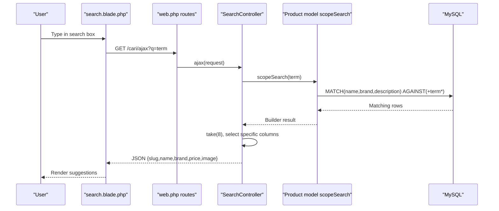
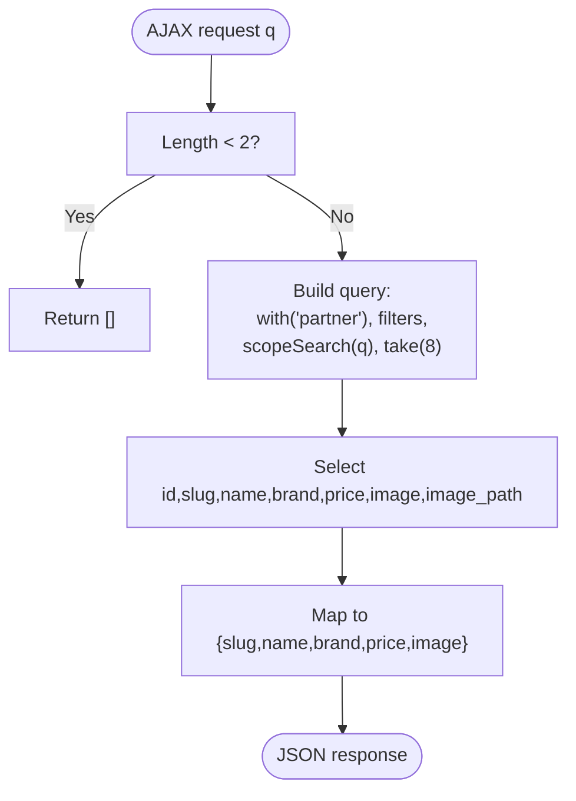
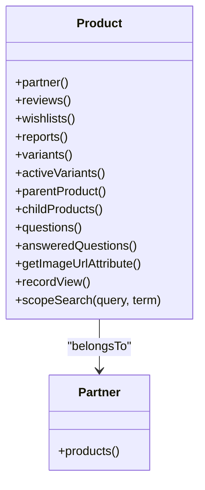
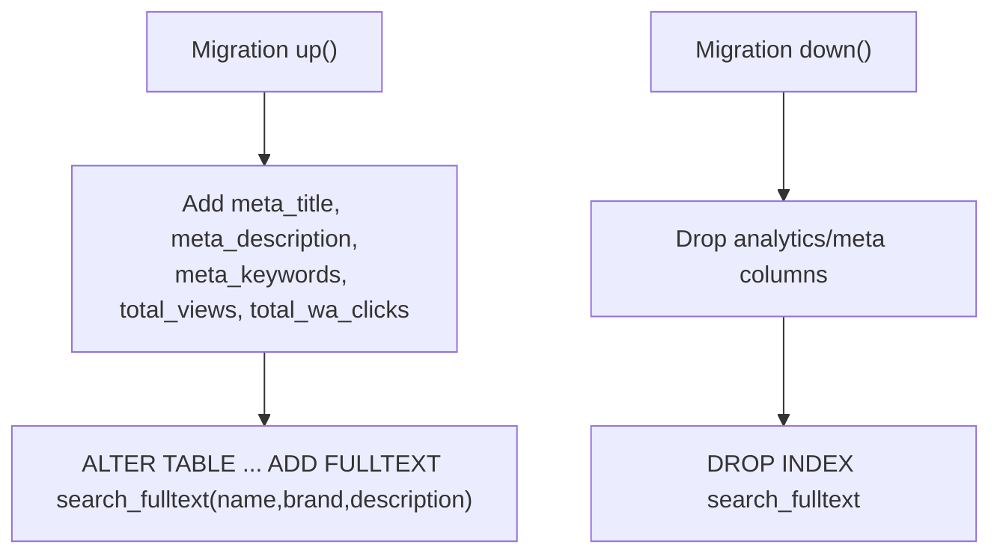
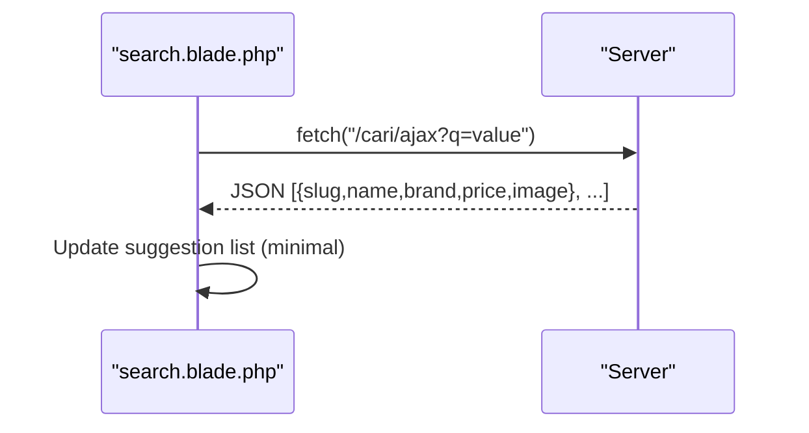
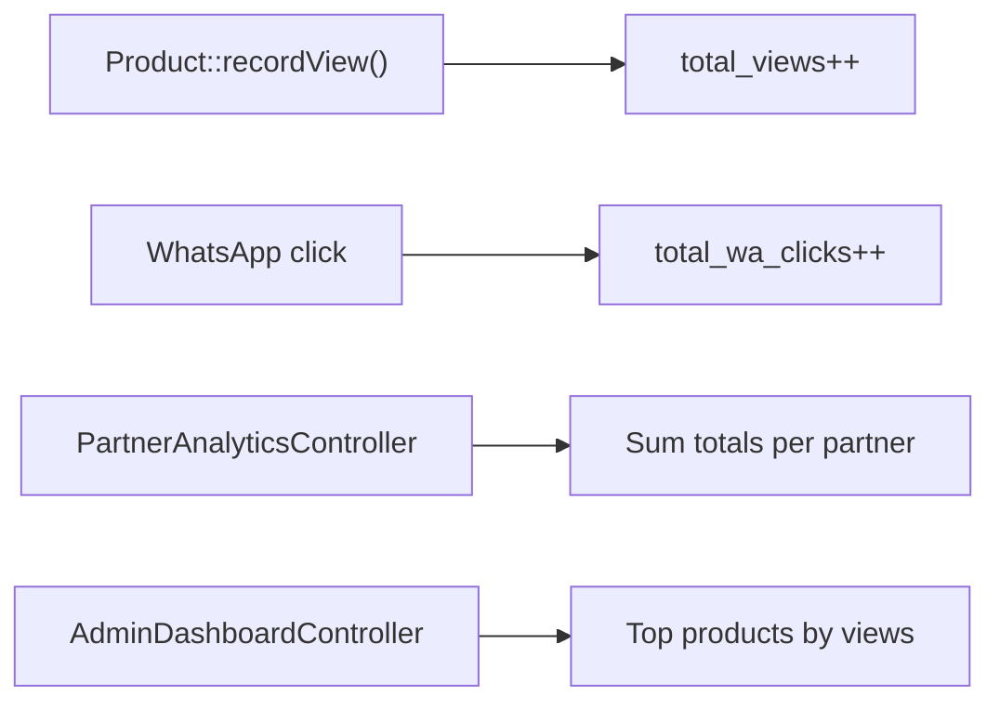
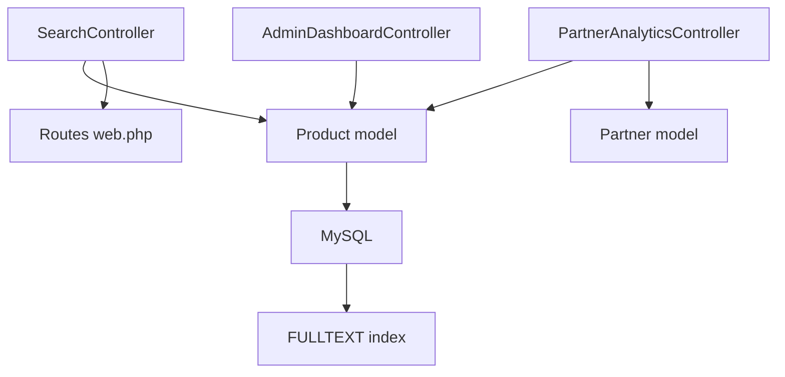

# Search Performance and Optimization

<cite>
**Referenced Files in This Document**
- [SearchController.php](file://app/Http/Controllers/SearchController.php)
- [Product.php](file://app/Models/Product.php)
- [2026_07_01_100007_add_seo_and_search_to_products.php](file://database/migrations/2026_07_01_100007_add_seo_and_search_to_products.php)
- [cache.php](file://config/cache.php)
- [database.php](file://config/database.php)
- [search.blade.php](file://resources/views/catalog/search.blade.php)
- [web.php](file://routes/web.php)
- [PartnerAnalyticsController.php](file://app/Http/Controllers/Partner/PartnerAnalyticsController.php)
- [AdminDashboardController.php](file://app/Http/Controllers/AdminDashboardController.php)
- [Product.php](file://app/Models/Product.php)
- [Partner.php](file://app/Models/Partner.php)
- [app.php](file://config/app.php)
</cite>

## Table of Contents
1. [Introduction](#introduction)
2. [Project Structure](#project-structure)
3. [Core Components](#core-components)
4. [Architecture Overview](#architecture-overview)
5. [Detailed Component Analysis](#detailed-component-analysis)
6. [Dependency Analysis](#dependency-analysis)
7. [Performance Considerations](#performance-considerations)
8. [Troubleshooting Guide](#troubleshooting-guide)
9. [Conclusion](#conclusion)
10. [Appendices](#appendices)

## Introduction
This document focuses on search performance optimization and database efficiency for a large-scale product catalog. It covers indexing strategies for search columns, full-text search optimization, query performance tuning, caching mechanisms for frequently searched terms and search results, CDN optimization for product images, database query optimization techniques, eager loading strategies, pagination performance considerations, and search analytics implementation for popular queries and search volume monitoring. The goal is to provide practical guidance grounded in the repository’s existing implementation.

## Project Structure
The search functionality is centered around:
- A dedicated controller that orchestrates search requests and AJAX suggestions
- An Eloquent model with a polymorphic search scope supporting MySQL full-text and fallback LIKE conditions
- A migration that adds full-text indexes and analytics counters
- Blade templates rendering search results and live suggestions
- Routing exposing GET and AJAX endpoints for search
- Analytics controllers leveraging counters to track popularity and engagement

**Diagram sources**
- [web.php:52-54](file://routes/web.php#L52-L54)
- [SearchController.php:10-31](file://app/Http/Controllers/SearchController.php#L10-L31)
- [SearchController.php:33-54](file://app/Http/Controllers/SearchController.php#L33-L54)
- [Product.php:121-130](file://app/Models/Product.php#L121-L130)
- [2026_07_01_100007_add_seo_and_search_to_products.php:18-20](file://database/migrations/2026_07_01_100007_add_seo_and_search_to_products.php#L18-L20)
- [search.blade.php:49-53](file://resources/views/catalog/search.blade.php#L49-L53)

**Section sources**
- [web.php:52-54](file://routes/web.php#L52-L54)
- [SearchController.php:10-31](file://app/Http/Controllers/SearchController.php#L10-L31)
- [SearchController.php:33-54](file://app/Http/Controllers/SearchController.php#L33-L54)
- [Product.php:121-130](file://app/Models/Product.php#L121-L130)
- [2026_07_01_100007_add_seo_and_search_to_products.php:18-20](file://database/migrations/2026_07_01_100007_add_seo_and_search_to_products.php#L18-L20)
- [search.blade.php:49-53](file://resources/views/catalog/search.blade.php#L49-L53)

## Core Components
- SearchController: Handles both HTML search results and AJAX suggestions. Applies eager loading, filtering by activity and partner approval, and delegates search logic to the model scope.
- Product model: Provides a scopeSearch that switches between MySQL MATCH AGAINST and LIKE fallback depending on the configured database driver. Also exposes image URL resolution and analytics counters.
- Migration: Adds FULLTEXT index on name, brand, and description and analytics columns (total_views, total_wa_clicks).
- Blade template: Renders search results and includes a minimal live search debounce mechanism.
- Routing: Exposes GET /cari and GET /cari/ajax endpoints.

Key implementation references:
- [SearchController@index:10-31](file://app/Http/Controllers/SearchController.php#L10-L31)
- [SearchController@ajax:33-54](file://app/Http/Controllers/SearchController.php#L33-L54)
- [Product::scopeSearch:121-130](file://app/Models/Product.php#L121-L130)
- [Migration adding FULLTEXT index:18-20](file://database/migrations/2026_07_01_100007_add_seo_and_search_to_products.php#L18-L20)
- [Blade live search script:96-114](file://resources/views/catalog/search.blade.php#L96-L114)

**Section sources**
- [SearchController.php:10-31](file://app/Http/Controllers/SearchController.php#L10-L31)
- [SearchController.php:33-54](file://app/Http/Controllers/SearchController.php#L33-L54)
- [Product.php:121-130](file://app/Models/Product.php#L121-L130)
- [2026_07_01_100007_add_seo_and_search_to_products.php:18-20](file://database/migrations/2026_07_01_100007_add_seo_and_search_to_products.php#L18-L20)
- [search.blade.php:96-114](file://resources/views/catalog/search.blade.php#L96-L114)

## Architecture Overview
The search pipeline integrates client-side debounced input, server-side search scopes, and analytics counters. The AJAX endpoint limits suggestions to reduce payload and latency.

**Diagram sources**
- [search.blade.php:104-111](file://resources/views/catalog/search.blade.php#L104-L111)
- [web.php:54](file://routes/web.php#L54)
- [SearchController.php:33-54](file://app/Http/Controllers/SearchController.php#L33-L54)
- [Product.php:121-130](file://app/Models/Product.php#L121-L130)

## Detailed Component Analysis

### SearchController: Query orchestration and AJAX suggestions
- Index action:
  - Validates query presence
  - Applies eager loading of partner relationship
  - Filters by product activity and approved partner status
  - Delegates search to Product::search scope
  - Orders by latest and returns a view with results
- AJAX action:
  - Enforces minimum length threshold
  - Applies same filters and scope
  - Limits results to a small set and selects only essential columns
  - Returns compact JSON for rendering lightweight suggestions

**Diagram sources**
- [SearchController.php:33-54](file://app/Http/Controllers/SearchController.php#L33-L54)

**Section sources**
- [SearchController.php:10-31](file://app/Http/Controllers/SearchController.php#L10-L31)
- [SearchController.php:33-54](file://app/Http/Controllers/SearchController.php#L33-L54)

### Product model: Search scope and attributes
- scopeSearch:
  - Uses MySQL MATCH AGAINST for Boolean search when the default database is MySQL
  - Falls back to ORed LIKE conditions on name, brand, and description for other databases
- Image URL resolution:
  - Resolves Storage URL when image_path exists; otherwise uses raw image field
- Analytics counters:
  - total_views and total_wa_clicks are tracked per product
- Eager-loaded relationships:
  - partner, variants, reviews, reports, and others support downstream analytics and rendering

**Diagram sources**
- [Product.php:36-130](file://app/Models/Product.php#L36-L130)

**Section sources**
- [Product.php:121-130](file://app/Models/Product.php#L121-L130)
- [Product.php:96-102](file://app/Models/Product.php#L96-L102)
- [Product.php:115-119](file://app/Models/Product.php#L115-L119)

### Database migration: FULLTEXT index and analytics columns
- Adds FULLTEXT index on name, brand, description to accelerate phrase and word matching
- Introduces analytics counters for views and WhatsApp clicks on products and partners
- Provides downgrade logic to remove columns and index

**Diagram sources**
- [2026_07_01_100007_add_seo_and_search_to_products.php:8-29](file://database/migrations/2026_07_01_100007_add_seo_and_search_to_products.php#L8-L29)

**Section sources**
- [2026_07_01_100007_add_seo_and_search_to_products.php:18-20](file://database/migrations/2026_07_01_100007_add_seo_and_search_to_products.php#L18-L20)
- [2026_07_01_100007_add_seo_and_search_to_products.php:22-28](file://database/migrations/2026_07_01_100007_add_seo_and_search_to_products.php#L22-L28)

### Blade template: Live search and result rendering
- Includes a minimal live search debounce that triggers an AJAX call when input length reaches two characters
- Renders product cards with lazy loading and computed image URLs
- Provides a static search form for full-page results

**Diagram sources**
- [search.blade.php:96-114](file://resources/views/catalog/search.blade.php#L96-L114)
- [web.php:54](file://routes/web.php#L54)
- [SearchController.php:33-54](file://app/Http/Controllers/SearchController.php#L33-L54)

**Section sources**
- [search.blade.php:49-53](file://resources/views/catalog/search.blade.php#L49-L53)
- [search.blade.php:96-114](file://resources/views/catalog/search.blade.php#L96-L114)

### Analytics: Popular queries and search volume monitoring
- Product-level counters:
  - total_views incremented per view
  - total_wa_clicks for engagement tracking
- Partner-level analytics:
  - Aggregated totals and daily breakdowns for views and WhatsApp clicks
  - Top products by views for dashboards
- Admin dashboard:
  - Top partners and top products by views for system-wide insights

**Diagram sources**
- [Product.php:115-119](file://app/Models/Product.php#L115-L119)
- [PartnerAnalyticsController.php:22-41](file://app/Http/Controllers/Partner/PartnerAnalyticsController.php#L22-L41)
- [AdminDashboardController.php:38-64](file://app/Http/Controllers/AdminDashboardController.php#L38-L64)

**Section sources**
- [Product.php:115-119](file://app/Models/Product.php#L115-L119)
- [PartnerAnalyticsController.php:22-41](file://app/Http/Controllers/Partner/PartnerAnalyticsController.php#L22-L41)
- [AdminDashboardController.php:38-64](file://app/Http/Controllers/AdminDashboardController.php#L38-L64)

## Dependency Analysis
- SearchController depends on Product model scopeSearch and Eloquent relationships
- Product model depends on database driver configuration to choose MATCH vs LIKE
- Migration defines the index and counters used by Product scopeSearch and analytics
- Routes connect client requests to SearchController actions
- Analytics controllers depend on Product and Partner models’ counters

**Diagram sources**
- [SearchController.php:10-31](file://app/Http/Controllers/SearchController.php#L10-L31)
- [Product.php:121-130](file://app/Models/Product.php#L121-L130)
- [2026_07_01_100007_add_seo_and_search_to_products.php:18-20](file://database/migrations/2026_07_01_100007_add_seo_and_search_to_products.php#L18-L20)
- [web.php:52-54](file://routes/web.php#L52-L54)
- [PartnerAnalyticsController.php:17-58](file://app/Http/Controllers/Partner/PartnerAnalyticsController.php#L17-L58)
- [AdminDashboardController.php:38-64](file://app/Http/Controllers/AdminDashboardController.php#L38-L64)

**Section sources**
- [SearchController.php:10-31](file://app/Http/Controllers/SearchController.php#L10-L31)
- [Product.php:121-130](file://app/Models/Product.php#L121-L130)
- [2026_07_01_100007_add_seo_and_search_to_products.php:18-20](file://database/migrations/2026_07_01_100007_add_seo_and_search_to_products.php#L18-L20)
- [web.php:52-54](file://routes/web.php#L52-L54)
- [PartnerAnalyticsController.php:17-58](file://app/Http/Controllers/Partner/PartnerAnalyticsController.php#L17-L58)
- [AdminDashboardController.php:38-64](file://app/Http/Controllers/AdminDashboardController.php#L38-L64)

## Performance Considerations
- Database indexing strategies
  - FULLTEXT index on name, brand, description accelerates phrase and word matching; ensure it remains aligned with content growth and collation
  - Consider composite indexes for frequent filter combinations (e.g., is_active, partner approval status)
- Full-text search optimization
  - MATCH AGAINST supports Boolean mode; tune search terms and consider relevance scoring for ranking
  - LIKE fallback ensures compatibility but is less efficient; keep it for non-MySQL environments
- Query performance tuning
  - Use select only the needed columns in AJAX suggestions to minimize payload
  - Apply eager loading to avoid N+1 queries when rendering product cards
  - Filter early (is_active, partner status) to reduce result sets
- Caching mechanisms
  - Frequently searched terms: cache normalized query keys with TTL to reduce repeated database scans
  - Search result caching: cache paginated result sets keyed by query, filters, and page number
  - CDN optimization for product images: serve images via CDN to reduce origin load and improve latency
- Eager loading strategies
  - Already leveraged in SearchController for partner relationship; extend to variants/reviews if needed for analytics
- Pagination performance considerations
  - Use simple pagination or cursor pagination for large catalogs to reduce offset overhead
  - Limit AJAX suggestions to small fixed counts to maintain responsiveness
- Search analytics
  - Track popular queries and search volume to inform index tuning and content strategy
  - Monitor average response times and error rates for search endpoints

[No sources needed since this section provides general guidance]

## Troubleshooting Guide
- Search returns no results
  - Verify FULLTEXT index exists and is built on the target columns
  - Confirm database driver configuration matches the intended search behavior
- Slow search performance
  - Ensure filters (is_active, partner status) are applied before scopeSearch
  - Limit returned columns and result sizes for AJAX suggestions
- Incorrect image URLs
  - Confirm image_path availability and Storage configuration
- Analytics counters not incrementing
  - Ensure recordView() is invoked on product view routes
  - Verify counters exist in the database schema

**Section sources**
- [2026_07_01_100007_add_seo_and_search_to_products.php:18-20](file://database/migrations/2026_07_01_100007_add_seo_and_search_to_products.php#L18-L20)
- [Product.php:121-130](file://app/Models/Product.php#L121-L130)
- [Product.php:96-102](file://app/Models/Product.php#L96-L102)
- [Product.php:115-119](file://app/Models/Product.php#L115-L119)

## Conclusion
The repository implements a robust foundation for search performance and database efficiency:
- A MySQL-aware search scope with FULLTEXT indexing and a LIKE fallback
- Eager loading and filtered queries in the controller
- Analytics counters enabling popularity and engagement tracking
- Lightweight AJAX suggestions to improve perceived performance

To scale further, augment caching for hot queries, expand composite indexes, adopt cursor pagination, and integrate CDN for images. Continuously monitor search analytics to refine indexes and optimize for real-world query patterns.

[No sources needed since this section summarizes without analyzing specific files]

## Appendices

### Benchmarking and metrics collection
- Endpoint-level metrics: response time, throughput, error rate for /cari and /cari/ajax
- Database metrics: query execution time, index usage, buffer pool hit ratio
- Application metrics: cache hit rate, CDN hit rate, origin bandwidth utilization
- Business metrics: search volume trends, popular queries, conversion from search to purchase

[No sources needed since this section provides general guidance]