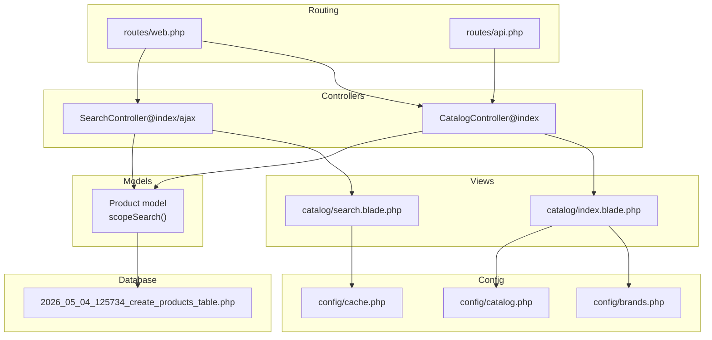
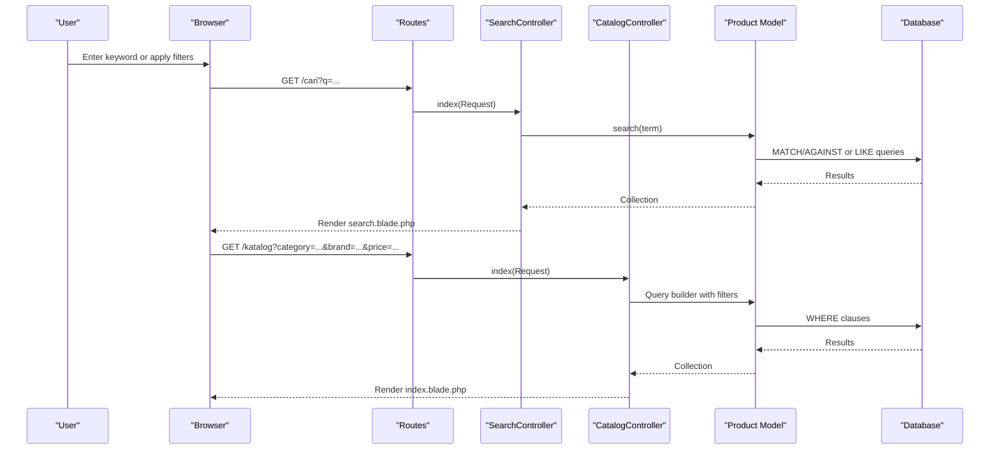
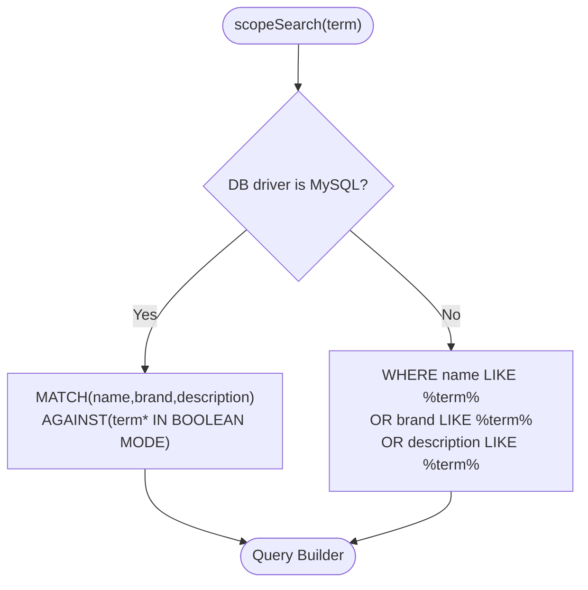
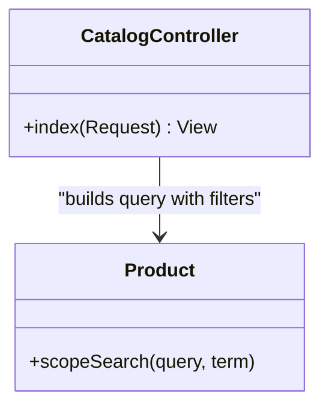
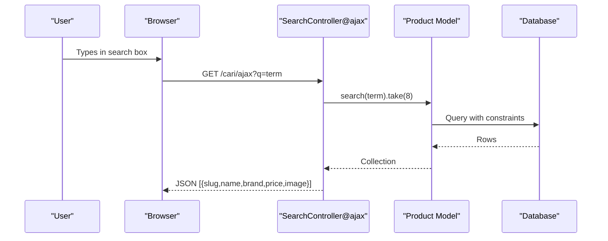
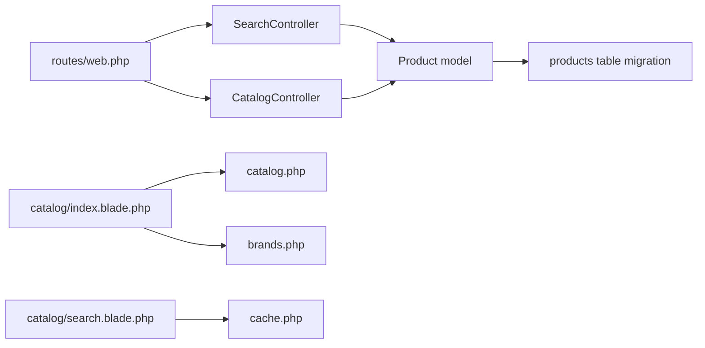

# Search and Filtering System

<cite>
**Referenced Files in This Document**
- [SearchController.php](file://app/Http/Controllers/SearchController.php)
- [CatalogController.php](file://app/Http/Controllers/CatalogController.php)
- [Product.php](file://app/Models/Product.php)
- [web.php](file://routes/web.php)
- [api.php](file://routes/api.php)
- [index.blade.php](file://resources/views/catalog/index.blade.php)
- [search.blade.php](file://resources/views/catalog/search.blade.php)
- [catalog.php](file://config/catalog.php)
- [brands.php](file://config/brands.php)
- [cache.php](file://config/cache.php)
- [2026_05_04_125734_create_products_table.php](file://database/migrations/2026_05_04_125734_create_products_table.php)
</cite>

## Table of Contents
1. [Introduction](#introduction)
2. [Project Structure](#project-structure)
3. [Core Components](#core-components)
4. [Architecture Overview](#architecture-overview)
5. [Detailed Component Analysis](#detailed-component-analysis)
6. [Dependency Analysis](#dependency-analysis)
7. [Performance Considerations](#performance-considerations)
8. [Troubleshooting Guide](#troubleshooting-guide)
9. [Conclusion](#conclusion)
10. [Appendices](#appendices)

## Introduction
This document describes the product search and filtering system implemented in the application. It covers the search algorithm, keyword matching, relevance scoring, filter categories (price range, size, brand, product type, availability), faceted search, auto-complete suggestions, and search history tracking. It also documents advanced filtering, custom search queries, saved search preferences, performance optimization, caching strategies, database indexing requirements, analytics, popularity tracking, and result personalization. Practical examples of API usage, filter implementation, and performance tuning are included via file references.

## Project Structure
The search and filtering system spans routing, controllers, models, Blade templates, configuration, and database migrations:
- Routes define endpoints for search and catalog filters.
- Controllers orchestrate query building and rendering.
- Eloquent model scopes implement keyword search logic.
- Blade templates render filters and facets.
- Configuration files define product types, brand logos, and cache settings.
- Migrations define searchable attributes and indexes.

**Diagram sources**
- [web.php:52-54](file://routes/web.php#L52-L54)
- [api.php:17-19](file://routes/api.php#L17-L19)
- [SearchController.php:10-31](file://app/Http/Controllers/SearchController.php#L10-L31)
- [CatalogController.php:30-82](file://app/Http/Controllers/CatalogController.php#L30-L82)
- [Product.php:121-130](file://app/Models/Product.php#L121-L130)
- [index.blade.php:193-240](file://resources/views/catalog/index.blade.php#L193-L240)
- [search.blade.php:50-53](file://resources/views/catalog/search.blade.php#L50-L53)
- [catalog.php:14-28](file://config/catalog.php#L14-L28)
- [brands.php:25-45](file://config/brands.php#L25-L45)
- [cache.php:18-111](file://config/cache.php#L18-L111)
- [2026_05_04_125734_create_products_table.php:14-26](file://database/migrations/2026_05_04_125734_create_products_table.php#L14-L26)

**Section sources**
- [web.php:52-54](file://routes/web.php#L52-L54)
- [api.php:17-19](file://routes/api.php#L17-L19)
- [SearchController.php:10-31](file://app/Http/Controllers/SearchController.php#L10-L31)
- [CatalogController.php:30-82](file://app/Http/Controllers/CatalogController.php#L30-L82)
- [Product.php:121-130](file://app/Models/Product.php#L121-L130)
- [index.blade.php:193-240](file://resources/views/catalog/index.blade.php#L193-L240)
- [search.blade.php:50-53](file://resources/views/catalog/search.blade.php#L50-L53)
- [catalog.php:14-28](file://config/catalog.php#L14-L28)
- [brands.php:25-45](file://config/brands.php#L25-L45)
- [cache.php:18-111](file://config/cache.php#L18-L111)
- [2026_05_04_125734_create_products_table.php:14-26](file://database/migrations/2026_05_04_125734_create_products_table.php#L14-L26)

## Core Components
- SearchController: Implements GET search and AJAX auto-complete endpoints. Applies activation and approval constraints, delegates keyword search to the model scope, and formats JSON results.
- CatalogController: Implements faceted filtering for category, brand, partner, size, price range, availability, and new arrival flags. Builds filtered product lists and exposes counts and selectable options to the view.
- Product model: Provides a scopeSearch that adapts to the configured database driver (MySQL full-text vs fallback LIKE).
- Blade templates: Render filter forms, brand chips, and facet counts. Provide client-side brand chip toggling and a minimal live search hook.
- Configuration: Defines product types, brand logos, and cache driver settings.

**Section sources**
- [SearchController.php:10-31](file://app/Http/Controllers/SearchController.php#L10-L31)
- [SearchController.php:33-54](file://app/Http/Controllers/SearchController.php#L33-L54)
- [CatalogController.php:30-82](file://app/Http/Controllers/CatalogController.php#L30-L82)
- [Product.php:121-130](file://app/Models/Product.php#L121-L130)
- [index.blade.php:193-240](file://resources/views/catalog/index.blade.php#L193-L240)
- [search.blade.php:96-114](file://resources/views/catalog/search.blade.php#L96-L114)
- [catalog.php:14-28](file://config/catalog.php#L14-L28)
- [brands.php:25-45](file://config/brands.php#L25-L45)

## Architecture Overview
The system supports two primary flows:
- Keyword search: GET /cari?q=... returns a page with matched products.
- Faceted filtering: GET /katalog with query parameters returns filtered product grids.

**Diagram sources**
- [web.php:52-54](file://routes/web.php#L52-L54)
- [SearchController.php:10-31](file://app/Http/Controllers/SearchController.php#L10-L31)
- [CatalogController.php:30-82](file://app/Http/Controllers/CatalogController.php#L30-L82)
- [Product.php:121-130](file://app/Models/Product.php#L121-L130)

## Detailed Component Analysis

### Search Algorithm and Keyword Matching
- The Product model defines a scopeSearch that:
  - Uses MySQL full-text boolean mode MATCH(... AGAINST(? IN BOOLEAN MODE)) when the default database is MySQL.
  - Falls back to OR’ed LIKE conditions on name, brand, and description for other drivers.
- SearchController applies:
  - is_active = true constraint.
  - Partner approval check via whereHas('partner', ... approved).
  - Latest ordering.
  - AJAX endpoint limits results and selects essential columns.

**Diagram sources**
- [Product.php:121-130](file://app/Models/Product.php#L121-L130)

**Section sources**
- [Product.php:121-130](file://app/Models/Product.php#L121-L130)
- [SearchController.php:16-21](file://app/Http/Controllers/SearchController.php#L16-L21)
- [SearchController.php:40-45](file://app/Http/Controllers/SearchController.php#L40-L45)

### Relevance Scoring
- MySQL full-text boolean mode is used for keyword matching. While explicit score fields are not present in the model, the underlying full-text ranking is leveraged implicitly by the database engine. No custom scoring logic is implemented in code.

**Section sources**
- [Product.php:124-126](file://app/Models/Product.php#L124-L126)

### Filter Categories and Faceted Search
- CatalogController builds queries from the following request parameters:
  - category: product_type
  - brand: brand
  - partner: partner_id
  - size: size
  - min_price: price >= value
  - max_price: price <= value
  - availability: is_sold true/false
  - new_arrival: is_new_arrival true
- The view renders:
  - Category tabs with counts per product type.
  - A filter bar with dropdowns/selects for partner, size, min/max price, and availability.
  - Brand chips with optional logos, toggled client-side.
- Additional counts and selectable options are computed for size and partner lists.

**Diagram sources**
- [CatalogController.php:30-82](file://app/Http/Controllers/CatalogController.php#L30-L82)
- [Product.php:121-130](file://app/Models/Product.php#L121-L130)

**Section sources**
- [CatalogController.php:36-47](file://app/Http/Controllers/CatalogController.php#L36-L47)
- [index.blade.php:193-240](file://resources/views/catalog/index.blade.php#L193-L240)
- [index.blade.php:242-264](file://resources/views/catalog/index.blade.php#L242-L264)
- [catalog.php:14-28](file://config/catalog.php#L14-L28)

### Auto-Complete Suggestions
- SearchController ajax endpoint:
  - Requires minimum query length.
  - Returns a limited set of product fields (slug, name, brand, formatted price, image URL).
- Front-end search.blade template includes a minimal live search hook that triggers the AJAX endpoint after a debounce.

**Diagram sources**
- [SearchController.php:33-54](file://app/Http/Controllers/SearchController.php#L33-L54)
- [search.blade.php:96-114](file://resources/views/catalog/search.blade.php#L96-L114)

**Section sources**
- [SearchController.php:33-54](file://app/Http/Controllers/SearchController.php#L33-L54)
- [search.blade.php:96-114](file://resources/views/catalog/search.blade.php#L96-L114)

### Search History Tracking
- No server-side search history persistence is implemented in the current codebase. Search queries are processed as ad-hoc requests without storing historical terms.

**Section sources**
- [SearchController.php:10-31](file://app/Http/Controllers/SearchController.php#L10-L31)
- [CatalogController.php:30-82](file://app/Http/Controllers/CatalogController.php#L30-L82)

### Advanced Filtering Options and Custom Queries
- Custom filters are supported via query parameters in the catalog endpoint. The controller conditionally applies filters based on presence of parameters.
- The view exposes dynamic links to switch categories and maintain existing filters.

**Section sources**
- [CatalogController.php:36-47](file://app/Http/Controllers/CatalogController.php#L36-L47)
- [index.blade.php:177-189](file://resources/views/catalog/index.blade.php#L177-L189)

### Saved Search Preferences
- No saved search preferences or user profiles are implemented in the current codebase. Users can apply filters per session, but preferences are not persisted.

**Section sources**
- [index.blade.php:193-240](file://resources/views/catalog/index.blade.php#L193-L240)

### Search Analytics, Popular Queries, and Personalization
- No analytics, popular query tracking, or personalization logic is implemented in the current codebase. Views increment product view counters independently, but there is no centralized search analytics pipeline.

**Section sources**
- [Product.php:115-119](file://app/Models/Product.php#L115-L119)
- [CatalogController.php:84-146](file://app/Http/Controllers/CatalogController.php#L84-L146)

## Dependency Analysis
- Controllers depend on the Product model’s scopeSearch and relationships.
- Views depend on configuration arrays for product types and brand logos.
- Routes connect URLs to controllers.
- Database migrations define searchable columns and indexes.

**Diagram sources**
- [web.php:52-54](file://routes/web.php#L52-L54)
- [SearchController.php:10-31](file://app/Http/Controllers/SearchController.php#L10-L31)
- [CatalogController.php:30-82](file://app/Http/Controllers/CatalogController.php#L30-L82)
- [Product.php:121-130](file://app/Models/Product.php#L121-L130)
- [2026_05_04_125734_create_products_table.php:14-26](file://database/migrations/2026_05_04_125734_create_products_table.php#L14-L26)
- [index.blade.php:193-240](file://resources/views/catalog/index.blade.php#L193-L240)
- [search.blade.php:50-53](file://resources/views/catalog/search.blade.php#L50-L53)
- [catalog.php:14-28](file://config/catalog.php#L14-L28)
- [brands.php:25-45](file://config/brands.php#L25-L45)
- [cache.php:18-111](file://config/cache.php#L18-L111)

**Section sources**
- [web.php:52-54](file://routes/web.php#L52-L54)
- [SearchController.php:10-31](file://app/Http/Controllers/SearchController.php#L10-L31)
- [CatalogController.php:30-82](file://app/Http/Controllers/CatalogController.php#L30-L82)
- [Product.php:121-130](file://app/Models/Product.php#L121-L130)
- [2026_05_04_125734_create_products_table.php:14-26](file://database/migrations/2026_05_04_125734_create_products_table.php#L14-L26)
- [index.blade.php:193-240](file://resources/views/catalog/index.blade.php#L193-L240)
- [search.blade.php:50-53](file://resources/views/catalog/search.blade.php#L50-L53)
- [catalog.php:14-28](file://config/catalog.php#L14-L28)
- [brands.php:25-45](file://config/brands.php#L25-L45)
- [cache.php:18-111](file://config/cache.php#L18-L111)

## Performance Considerations
- Database driver adaptation: The scopeSearch switches to MySQL full-text for optimal keyword matching when applicable.
- Constraints: Both search endpoints enforce is_active=true and partner approval checks to reduce result sets early.
- Selective columns: The AJAX endpoint limits returned columns to reduce payload size.
- Indexing recommendations:
  - Full-text index on name, brand, description for MySQL.
  - Indexes on frequently filtered columns: product_type, brand, partner_id, size, price, is_sold, is_active, is_new_arrival.
  - Composite indexes for common filter combinations (e.g., product_type + brand, price range + availability).
- Caching:
  - Configure cache driver via CACHE_DRIVER and CACHE_PREFIX for improved performance.
  - Consider caching popular category counts and brand lists rendered in views.
- Pagination:
  - Current implementation loads all matching records. Introduce pagination for large result sets in both search and catalog endpoints.
- Debounce:
  - Front-end debounces input events for live search to limit AJAX calls.

**Section sources**
- [Product.php:124-129](file://app/Models/Product.php#L124-L129)
- [SearchController.php:16-21](file://app/Http/Controllers/SearchController.php#L16-L21)
- [SearchController.php:40-45](file://app/Http/Controllers/SearchController.php#L40-L45)
- [cache.php:18-111](file://config/cache.php#L18-L111)
- [index.blade.php:96-114](file://resources/views/catalog/index.blade.php#L96-L114)

## Troubleshooting Guide
- Empty search results:
  - Ensure is_active is true and partner status is approved.
  - Verify database driver and that full-text indexes exist for MySQL.
- Incorrect or low-quality matches:
  - Confirm full-text boolean mode is active on MySQL.
  - Consider adding stopword handling and phrase searches if needed.
- AJAX suggestions not appearing:
  - Confirm minimum query length threshold and that the endpoint is reachable.
  - Check browser console for network errors.
- Filter not applied:
  - Verify query parameters are passed and controller conditions are met.
  - Ensure brand and size values match stored values (case-sensitive).

**Section sources**
- [SearchController.php:33-54](file://app/Http/Controllers/SearchController.php#L33-L54)
- [SearchController.php:10-31](file://app/Http/Controllers/SearchController.php#L10-L31)
- [CatalogController.php:36-47](file://app/Http/Controllers/CatalogController.php#L36-L47)
- [Product.php:124-129](file://app/Models/Product.php#L124-L129)

## Conclusion
The system provides a practical combination of keyword search and faceted filtering tailored for a multi-vendor thrift catalog. It leverages MySQL full-text capabilities when available, enforces activation and approval constraints, and offers a lightweight auto-complete experience. Areas for enhancement include persisted search history, analytics and personalization, pagination, and targeted database indexing for improved performance.

## Appendices

### API Usage Examples
- Search page: GET /cari?q={term}
- Auto-complete: GET /cari/ajax?q={term} (minimum length enforced)
- Catalog filters: GET /katalog?category={type}&brand={brand}&partner={id}&size={size}&min_price={amt}&max_price={amt}&availability={available|sold}&new_arrival={1}

**Section sources**
- [web.php:52-54](file://routes/web.php#L52-L54)
- [SearchController.php:10-31](file://app/Http/Controllers/SearchController.php#L10-L31)
- [SearchController.php:33-54](file://app/Http/Controllers/SearchController.php#L33-L54)
- [CatalogController.php:36-47](file://app/Http/Controllers/CatalogController.php#L36-L47)

### Filter Implementation Notes
- Brand chips: Client-side toggle on catalog index page.
- Availability: Converts “sold” to is_sold=true, otherwise is_sold=false.
- Price range: Uses >= and <= comparisons.
- New arrival: Filters by is_new_arrival flag.

**Section sources**
- [index.blade.php:242-264](file://resources/views/catalog/index.blade.php#L242-L264)
- [index.blade.php:224-231](file://resources/views/catalog/index.blade.php#L224-L231)
- [index.blade.php:216-223](file://resources/views/catalog/index.blade.php#L216-L223)
- [CatalogController.php:42-47](file://app/Http/Controllers/CatalogController.php#L42-L47)

### Performance Tuning Techniques
- Enable MySQL full-text indexes on name, brand, description.
- Add indexes on product_type, brand, partner_id, size, price, is_sold, is_active, is_new_arrival.
- Use pagination for search and catalog endpoints.
- Cache category counts and brand lists.
- Tune cache driver and prefix via environment variables.

**Section sources**
- [Product.php:124-129](file://app/Models/Product.php#L124-L129)
- [cache.php:18-111](file://config/cache.php#L18-L111)
- [2026_05_04_125734_create_products_table.php:14-26](file://database/migrations/2026_05_04_125734_create_products_table.php#L14-L26)