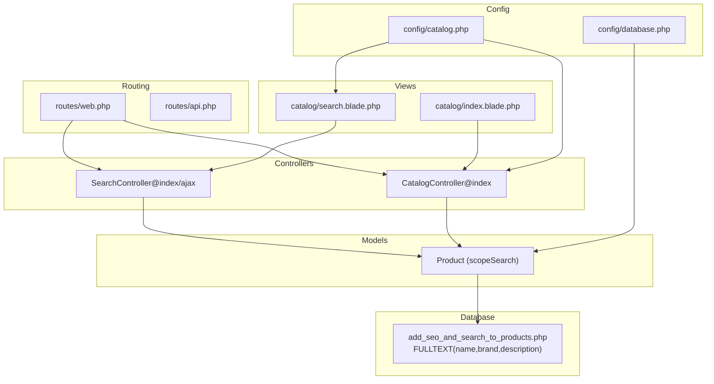
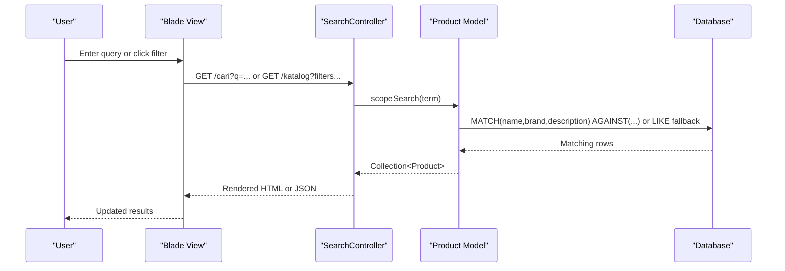
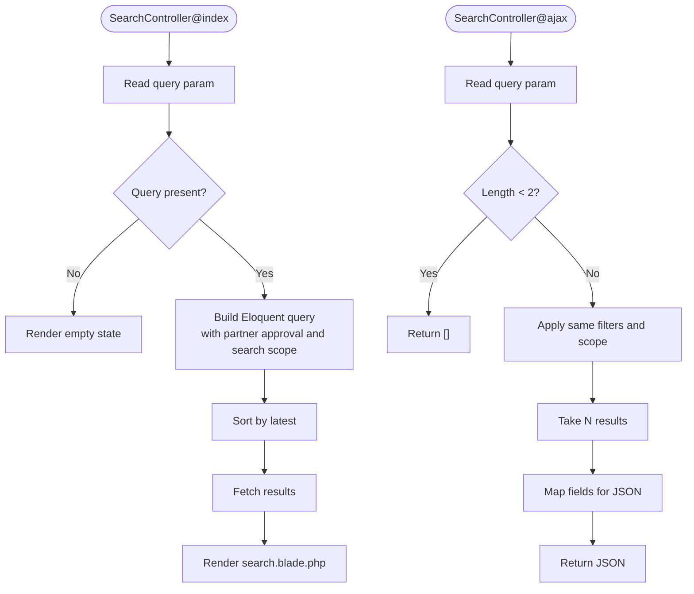
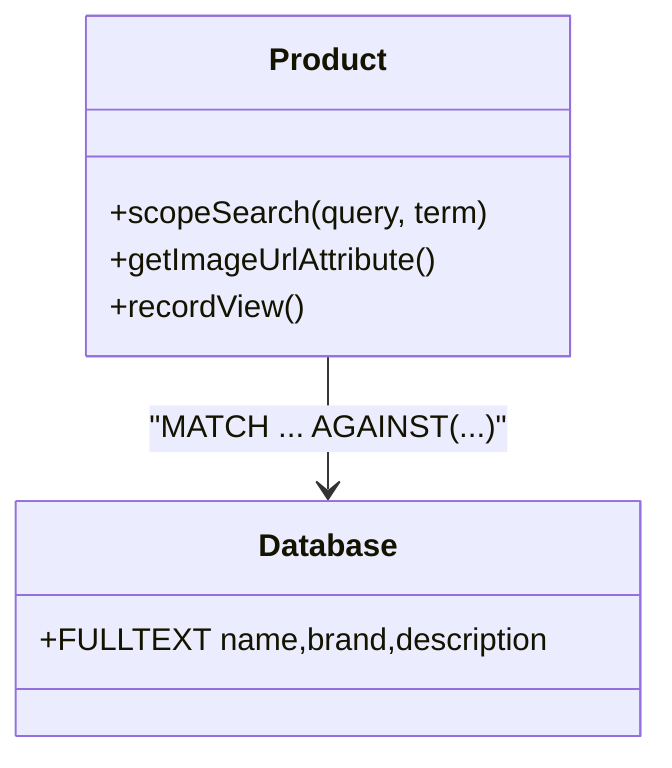
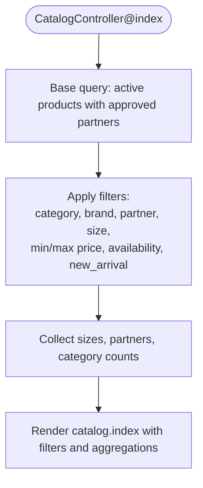
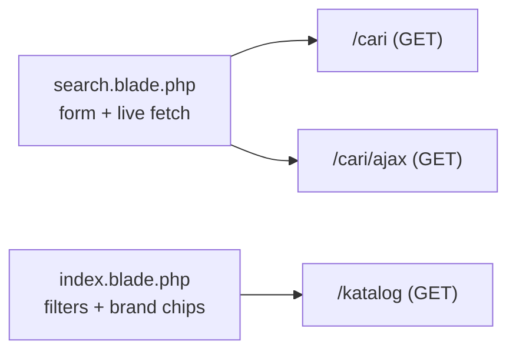
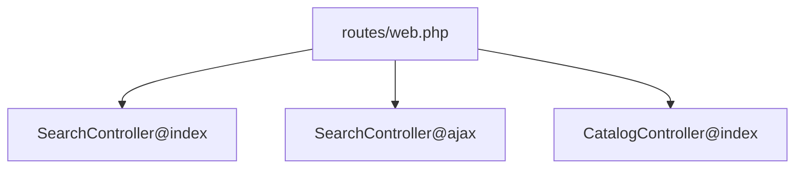
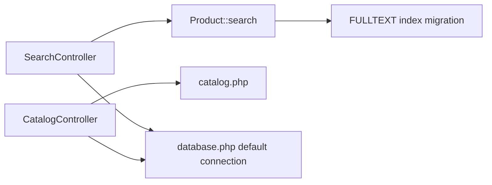

# Search and Discovery

<cite>
**Referenced Files in This Document**
- [SearchController.php](file://app/Http/Controllers/SearchController.php)
- [Product.php](file://app/Models/Product.php)
- [web.php](file://routes/web.php)
- [api.php](file://routes/api.php)
- [search.blade.php](file://resources/views/catalog/search.blade.php)
- [index.blade.php](file://resources/views/catalog/index.blade.php)
- [2026_07_01_100007_add_seo_and_search_to_products.php](file://database/migrations/2026_07_01_100007_add_seo_and_search_to_products.php)
- [database.php](file://config/database.php)
- [catalog.php](file://config/catalog.php)
- [CatalogController.php](file://app/Http/Controllers/CatalogController.php)
- [AdminDashboardController.php](file://app/Http/Controllers/AdminDashboardController.php)
- [PartnerAnalyticsController.php](file://app/Http/Controllers/Partner/PartnerAnalyticsController.php)
</cite>

## Table of Contents
1. [Introduction](#introduction)
2. [Project Structure](#project-structure)
3. [Core Components](#core-components)
4. [Architecture Overview](#architecture-overview)
5. [Detailed Component Analysis](#detailed-component-analysis)
6. [Dependency Analysis](#dependency-analysis)
7. [Performance Considerations](#performance-considerations)
8. [Troubleshooting Guide](#troubleshooting-guide)
9. [Conclusion](#conclusion)
10. [Appendices](#appendices)

## Introduction
This document explains KatalogThrift’s search and discovery capabilities. It covers full-text search, faceted filtering, browse-by features, autocomplete and suggestions, ranking and relevance, analytics and performance monitoring, API endpoints, pagination strategies, and result caching. Practical examples and optimization techniques are included to help developers implement robust search experiences.

## Project Structure
Search and discovery spans routing, controllers, models, views, and configuration. The primary entry points are:
- Web routes for search and catalog browsing
- A dedicated SearchController for search queries and AJAX suggestions
- A Product model with a custom search scope
- Blade templates for search and catalog pages
- Database migration adding full-text indexes
- Configuration for product categories and catalog metadata

**Diagram sources**
- [web.php:52-54](file://routes/web.php#L52-L54)
- [api.php:17-19](file://routes/api.php#L17-L19)
- [SearchController.php:10-31](file://app/Http/Controllers/SearchController.php#L10-L31)
- [SearchController.php:33-54](file://app/Http/Controllers/SearchController.php#L33-L54)
- [CatalogController.php:30-82](file://app/Http/Controllers/CatalogController.php#L30-L82)
- [Product.php:121-130](file://app/Models/Product.php#L121-L130)
- [search.blade.php:50-53](file://resources/views/catalog/search.blade.php#L50-L53)
- [index.blade.php:175-190](file://resources/views/catalog/index.blade.php#L175-L190)
- [2026_07_01_100007_add_seo_and_search_to_products.php:18-19](file://database/migrations/2026_07_01_100007_add_seo_and_search_to_products.php#L18-L19)
- [database.php:18](file://config/database.php#L18)
- [catalog.php:14-28](file://config/catalog.php#L14-L28)

**Section sources**
- [web.php:52-54](file://routes/web.php#L52-L54)
- [api.php:17-19](file://routes/api.php#L17-L19)
- [SearchController.php:10-31](file://app/Http/Controllers/SearchController.php#L10-L31)
- [SearchController.php:33-54](file://app/Http/Controllers/SearchController.php#L33-L54)
- [CatalogController.php:30-82](file://app/Http/Controllers/CatalogController.php#L30-L82)
- [Product.php:121-130](file://app/Models/Product.php#L121-L130)
- [search.blade.php:50-53](file://resources/views/catalog/search.blade.php#L50-L53)
- [index.blade.php:175-190](file://resources/views/catalog/index.blade.php#L175-L190)
- [2026_07_01_100007_add_seo_and_search_to_products.php:18-19](file://database/migrations/2026_07_01_100007_add_seo_and_search_to_products.php#L18-L19)
- [database.php:18](file://config/database.php#L18)
- [catalog.php:14-28](file://config/catalog.php#L14-L28)

## Core Components
- SearchController: Handles GET search and AJAX autocomplete requests, applies filters, and renders results.
- Product model: Provides a scopeSearch that adapts to MySQL vs non-MySQL environments and integrates with a full-text index.
- CatalogController: Implements faceted filtering and browse-by features (category, brand, partner, price range, availability, size, new arrival).
- Views: Search page with a live suggestion trigger and catalog page with filter UI and brand chips.
- Database migration: Adds full-text index on name, brand, and description.
- Configuration: Defines product categories and catalog metadata used in filters and presentation.

**Section sources**
- [SearchController.php:10-31](file://app/Http/Controllers/SearchController.php#L10-L31)
- [SearchController.php:33-54](file://app/Http/Controllers/SearchController.php#L33-L54)
- [Product.php:121-130](file://app/Models/Product.php#L121-L130)
- [CatalogController.php:30-82](file://app/Http/Controllers/CatalogController.php#L30-L82)
- [search.blade.php:96-114](file://resources/views/catalog/search.blade.php#L96-L114)
- [index.blade.php:193-240](file://resources/views/catalog/index.blade.php#L193-L240)
- [2026_07_01_100007_add_seo_and_search_to_products.php:18-19](file://database/migrations/2026_07_01_100007_add_seo_and_search_to_products.php#L18-L19)
- [catalog.php:14-28](file://config/catalog.php#L14-L28)

## Architecture Overview
End-to-end flow for search and discovery:
- Users enter a query on the search page or apply filters on the catalog page.
- SearchController executes a full-text search via Product::search and returns either HTML or JSON.
- CatalogController builds filtered product lists using Eloquent constraints and exposes counts and facets.
- Views render results and filter UI; AJAX endpoint powers minimal live suggestions.

**Diagram sources**
- [web.php:52-54](file://routes/web.php#L52-L54)
- [SearchController.php:10-31](file://app/Http/Controllers/SearchController.php#L10-L31)
- [SearchController.php:33-54](file://app/Http/Controllers/SearchController.php#L33-L54)
- [Product.php:121-130](file://app/Models/Product.php#L121-L130)
- [search.blade.php:50-53](file://resources/views/catalog/search.blade.php#L50-L53)

## Detailed Component Analysis

### SearchController
Responsibilities:
- Index action: Executes full-text search, applies active/approved partner constraints, sorts by latest, and renders the search page.
- Ajax action: Returns top-N product suggestions for live preview with minimal fields.

Key behaviors:
- Query validation and minimum length gating for AJAX.
- Partner approval constraint ensures only approved stores appear in results.
- Latest ordering provides recency bias.

**Diagram sources**
- [SearchController.php:10-31](file://app/Http/Controllers/SearchController.php#L10-L31)
- [SearchController.php:33-54](file://app/Http/Controllers/SearchController.php#L33-L54)

**Section sources**
- [SearchController.php:10-31](file://app/Http/Controllers/SearchController.php#L10-L31)
- [SearchController.php:33-54](file://app/Http/Controllers/SearchController.php#L33-L54)

### Product Model: scopeSearch
Implementation:
- Uses MySQL full-text index when the default connection is MySQL.
- Falls back to OR’d LIKE conditions for other databases.
- Integrates with the full-text index migration.

**Diagram sources**
- [Product.php:121-130](file://app/Models/Product.php#L121-L130)
- [2026_07_01_100007_add_seo_and_search_to_products.php:18-19](file://database/migrations/2026_07_01_100007_add_seo_and_search_to_products.php#L18-L19)

**Section sources**
- [Product.php:121-130](file://app/Models/Product.php#L121-L130)
- [2026_07_01_100007_add_seo_and_search_to_products.php:18-19](file://database/migrations/2026_07_01_100007_add_seo_and_search_to_products.php#L18-L19)

### CatalogController: Faceted Filtering and Browse-by
Capabilities:
- Filters by category, brand, partner, size, price range, availability, and new arrival flag.
- Aggregates category counts and collects distinct sizes and partners for UI.
- Presents curated pairings and related products on the product detail page.

**Diagram sources**
- [CatalogController.php:30-82](file://app/Http/Controllers/CatalogController.php#L30-L82)
- [index.blade.php:193-240](file://resources/views/catalog/index.blade.php#L193-L240)

**Section sources**
- [CatalogController.php:30-82](file://app/Http/Controllers/CatalogController.php#L30-L82)
- [index.blade.php:193-240](file://resources/views/catalog/index.blade.php#L193-L240)

### Views: Search and Catalog Pages
- Search page: Includes a form posting to the search route and a minimal live suggestion trigger via fetch to the AJAX endpoint.
- Catalog page: Provides category tabs, filter bar, and brand chips for interactive filtering.

**Diagram sources**
- [search.blade.php:50-53](file://resources/views/catalog/search.blade.php#L50-L53)
- [search.blade.php:96-114](file://resources/views/catalog/search.blade.php#L96-L114)
- [index.blade.php:175-190](file://resources/views/catalog/index.blade.php#L175-L190)
- [index.blade.php:193-240](file://resources/views/catalog/index.blade.php#L193-L240)

**Section sources**
- [search.blade.php:50-53](file://resources/views/catalog/search.blade.php#L50-L53)
- [search.blade.php:96-114](file://resources/views/catalog/search.blade.php#L96-L114)
- [index.blade.php:175-190](file://resources/views/catalog/index.blade.php#L175-L190)
- [index.blade.php:193-240](file://resources/views/catalog/index.blade.php#L193-L240)

### Routing
- GET /cari → SearchController@index
- GET /cari/ajax → SearchController@ajax
- GET /katalog → CatalogController@index

**Diagram sources**
- [web.php:52-54](file://routes/web.php#L52-L54)

**Section sources**
- [web.php:52-54](file://routes/web.php#L52-L54)

## Dependency Analysis
- SearchController depends on Product::search and partner approval constraints.
- Product::search depends on the configured database connection and the presence of a full-text index.
- CatalogController depends on configuration for product types and aggregates counts for UI.
- Views depend on controllers passing filtered datasets and on configuration for labels and links.

**Diagram sources**
- [SearchController.php:10-31](file://app/Http/Controllers/SearchController.php#L10-L31)
- [Product.php:121-130](file://app/Models/Product.php#L121-L130)
- [2026_07_01_100007_add_seo_and_search_to_products.php:18-19](file://database/migrations/2026_07_01_100007_add_seo_and_search_to_products.php#L18-L19)
- [database.php:18](file://config/database.php#L18)
- [catalog.php:14-28](file://config/catalog.php#L14-L28)

**Section sources**
- [SearchController.php:10-31](file://app/Http/Controllers/SearchController.php#L10-L31)
- [Product.php:121-130](file://app/Models/Product.php#L121-L130)
- [2026_07_01_100007_add_seo_and_search_to_products.php:18-19](file://database/migrations/2026_07_01_100007_add_seo_and_search_to_products.php#L18-L19)
- [database.php:18](file://config/database.php#L18)
- [catalog.php:14-28](file://config/catalog.php#L14-L28)

## Performance Considerations
- Full-text indexing: The migration adds a full-text index on name, brand, and description to accelerate MATCH queries on MySQL.
- Connection-aware search: The scopeSearch branch chooses MATCH for MySQL and LIKE fallback otherwise, ensuring portability.
- Lightweight AJAX payload: The AJAX endpoint limits fields and caps result count to reduce bandwidth and parsing overhead.
- Sorting and filtering: Latest ordering and targeted WHERE clauses minimize result sets early.
- Pagination: Current implementation uses get(). For large catalogs, switch to paginate() to limit per-page results and enable cursor-based navigation.

Recommendations:
- Add database indexes for frequently filtered columns (e.g., price, size, product_type, is_sold).
- Enable query caching for stable filter combinations (e.g., popular category+brand combinations).
- Consider Redis caching for hot queries and autocomplete terms.
- Monitor slow query logs and optimize complex filter combinations.

[No sources needed since this section provides general guidance]

## Troubleshooting Guide
Common issues and resolutions:
- No results returned:
  - Verify the default database connection is MySQL; scopeSearch falls back to LIKE otherwise.
  - Confirm the full-text index exists on the products table.
- Incorrect or low-quality results:
  - Ensure query normalization (lowercasing, trimming) and consider stemming or stop-word removal at ingestion time.
  - Adjust ranking factors (e.g., recency boost) by modifying ordering or introducing calculated scores.
- Autocomplete not triggering:
  - Check the minimum query length threshold in the AJAX action.
  - Inspect the live fetch call in the search view for correct route and parameter encoding.
- Filter UI not working:
  - Ensure filter parameters are passed through the catalog route and applied in CatalogController.
  - Confirm brand chips JavaScript toggles visibility correctly.

**Section sources**
- [Product.php:121-130](file://app/Models/Product.php#L121-L130)
- [2026_07_01_100007_add_seo_and_search_to_products.php:18-19](file://database/migrations/2026_07_01_100007_add_seo_and_search_to_products.php#L18-L19)
- [SearchController.php:33-54](file://app/Http/Controllers/SearchController.php#L33-L54)
- [search.blade.php:96-114](file://resources/views/catalog/search.blade.php#L96-L114)
- [index.blade.php:193-240](file://resources/views/catalog/index.blade.php#L193-L240)

## Conclusion
KatalogThrift’s search and discovery system combines a MySQL full-text index with a flexible Eloquent-based search scope, a robust faceted filter interface, and lightweight autocomplete. By leveraging configuration-driven categories, partner approvals, and view-layer interactivity, the system supports efficient discovery across a multi-vendor thrift catalog. Extending performance with pagination, caching, and targeted indexes will further improve responsiveness and scalability.

[No sources needed since this section summarizes without analyzing specific files]

## Appendices

### Search API Endpoints
- GET /cari?q={term}
  - Purpose: Render search results page
  - Filters: Active products, approved partners, full-text search, latest order
- GET /cari/ajax?q={term}
  - Purpose: Return JSON suggestions for live preview
  - Constraints: Minimum query length, active products, approved partners, capped results

**Section sources**
- [web.php:52-54](file://routes/web.php#L52-L54)
- [SearchController.php:10-31](file://app/Http/Controllers/SearchController.php#L10-L31)
- [SearchController.php:33-54](file://app/Http/Controllers/SearchController.php#L33-L54)

### Pagination Strategies
- Replace get() with paginate() in controllers to:
  - Limit per-page results
  - Enable URL-friendly pagination links
  - Reduce memory footprint for large result sets

**Section sources**
- [SearchController.php:10-31](file://app/Http/Controllers/SearchController.php#L10-L31)
- [SearchController.php:33-54](file://app/Http/Controllers/SearchController.php#L33-L54)
- [CatalogController.php:30-82](file://app/Http/Controllers/CatalogController.php#L30-L82)

### Result Caching
- Cache search results keyed by normalized query and filters for:
  - Stable filter combinations
  - Autocomplete suggestions
- Use cache invalidation on product updates or approvals

[No sources needed since this section provides general guidance]

### Search Analytics and Monitoring
- Track:
  - Query volume and top terms
  - Click-through rates on results
  - Timeouts and slow queries
- Use metrics to tune:
  - Ranking weights
  - Autocomplete thresholds
  - Index coverage

**Section sources**
- [AdminDashboardController.php:38-66](file://app/Http/Controllers/AdminDashboardController.php#L38-L66)
- [PartnerAnalyticsController.php:17-59](file://app/Http/Controllers/Partner/PartnerAnalyticsController.php#L17-L59)

### Practical Examples
- Implementing faceted filtering:
  - Use CatalogController@index to apply category, brand, partner, size, price, availability, and new arrival filters.
- Optimizing search ranking:
  - Introduce a calculated score combining full-text relevance and recency, then order by score desc.
- Enabling autocomplete:
  - On input events, debounce and call /cari/ajax, then render minimal suggestions.

**Section sources**
- [CatalogController.php:30-82](file://app/Http/Controllers/CatalogController.php#L30-L82)
- [search.blade.php:96-114](file://resources/views/catalog/search.blade.php#L96-L114)
- [SearchController.php:33-54](file://app/Http/Controllers/SearchController.php#L33-L54)