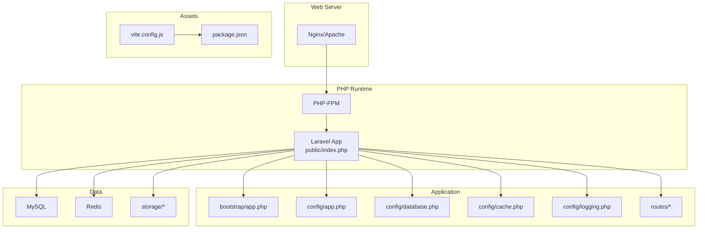
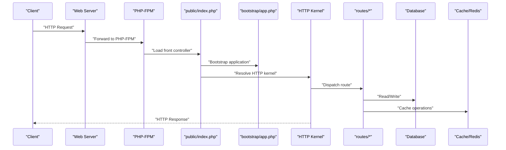
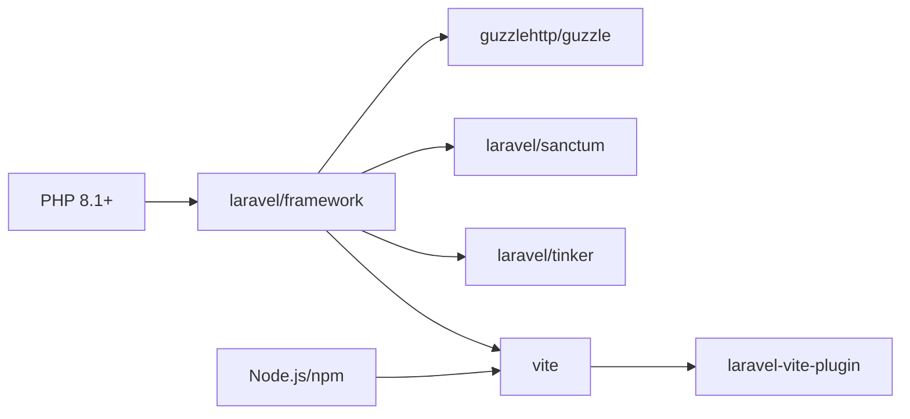

# Deployment Procedures

<cite>
**Referenced Files in This Document**
- [composer.json](file://composer.json)
- [package.json](file://package.json)
- [vite.config.js](file://vite.config.js)
- [config/app.php](file://config/app.php)
- [config/database.php](file://config/database.php)
- [config/cache.php](file://config/cache.php)
- [config/logging.php](file://config/logging.php)
- [bootstrap/app.php](file://bootstrap/app.php)
- [public/index.php](file://public/index.php)
- [routes/web.php](file://routes/web.php)
- [routes/api.php](file://routes/api.php)
- [database/migrations/2014_10_12_000000_create_users_table.php](file://database/migrations/2014_10_12_000000_create_users_table.php)
- [database/migrations/2026_05_04_125734_create_products_table.php](file://database/migrations/2026_05_04_125734_create_products_table.php)
- [database/migrations/2026_05_24_093628_create_outfits_table.php](file://database/migrations/2026_05_24_093628_create_outfits_table.php)
</cite>

## Table of Contents
1. [Introduction](#introduction)
2. [Project Structure](#project-structure)
3. [Core Components](#core-components)
4. [Architecture Overview](#architecture-overview)
5. [Detailed Component Analysis](#detailed-component-analysis)
6. [Dependency Analysis](#dependency-analysis)
7. [Performance Considerations](#performance-considerations)
8. [Troubleshooting Guide](#troubleshooting-guide)
9. [Conclusion](#conclusion)
10. [Appendices](#appendices)

## Introduction
This document provides comprehensive deployment procedures for KatalogThrift. It covers production environment setup, configuration management, database migration, asset compilation, cache warming, monitoring and logging, performance tuning, rollback and disaster recovery, and step-by-step deployment checklists. It also includes guidance for manual, CI/CD, and Docker-based deployments.

## Project Structure
KatalogThrift is a Laravel application with a frontend built using Vite. The deployment pipeline involves:
- Backend runtime: PHP 8.1+ with Laravel framework
- Asset pipeline: Vite for build and refresh during development
- Database: MySQL (default) with migrations
- Caching: File-based by default; Redis recommended for production
- Logging: Daily file rotation by default; Slack/Papertrail integrations available
- Web server: Nginx/Apache serving the public/index.php front controller



**Diagram sources**
- [public/index.php:1-56](file://public/index.php#L1-L56)
- [bootstrap/app.php:1-56](file://bootstrap/app.php#L1-L56)
- [config/app.php:1-189](file://config/app.php#L1-L189)
- [config/database.php:1-152](file://config/database.php#L1-L152)
- [config/cache.php:1-112](file://config/cache.php#L1-L112)
- [config/logging.php:1-132](file://config/logging.php#L1-L132)
- [routes/web.php:1-240](file://routes/web.php#L1-L240)
- [routes/api.php:1-20](file://routes/api.php#L1-L20)
- [vite.config.js:1-12](file://vite.config.js#L1-L12)
- [package.json:1-14](file://package.json#L1-L14)

**Section sources**
- [public/index.php:1-56](file://public/index.php#L1-L56)
- [bootstrap/app.php:1-56](file://bootstrap/app.php#L1-L56)
- [config/app.php:1-189](file://config/app.php#L1-L189)
- [config/database.php:1-152](file://config/database.php#L1-L152)
- [config/cache.php:1-112](file://config/cache.php#L1-L112)
- [config/logging.php:1-132](file://config/logging.php#L1-L132)
- [routes/web.php:1-240](file://routes/web.php#L1-L240)
- [routes/api.php:1-20](file://routes/api.php#L1-L20)
- [vite.config.js:1-12](file://vite.config.js#L1-L12)
- [package.json:1-14](file://package.json#L1-L14)

## Core Components
- PHP and Laravel runtime: PHP 8.1+ with Laravel framework and Sanctum for API authentication
- Database connectivity: MySQL by default; PostgreSQL and SQL Server drivers included
- Caching: File-based default; Redis recommended for production scalability
- Logging: Daily file rotation; optional Slack and Papertrail integrations
- Asset pipeline: Vite with Laravel Vite plugin for dev/build
- Front controller: public/index.php bootstraps the application and routes requests

Key configuration touchpoints:
- Application environment, debug mode, encryption key, and maintenance driver
- Database connections (mysql, pgsql, sqlsrv, sqlite)
- Cache drivers and prefixes
- Logging channels and levels
- Routes for web and API

**Section sources**
- [composer.json:1-67](file://composer.json#L1-L67)
- [config/app.php:1-189](file://config/app.php#L1-L189)
- [config/database.php:1-152](file://config/database.php#L1-L152)
- [config/cache.php:1-112](file://config/cache.php#L1-L112)
- [config/logging.php:1-132](file://config/logging.php#L1-L132)
- [routes/web.php:1-240](file://routes/web.php#L1-L240)
- [routes/api.php:1-20](file://routes/api.php#L1-L20)

## Architecture Overview
The runtime architecture follows a standard Laravel front-controller pattern:
- Web server forwards requests to public/index.php
- Bootstrap initializes the Laravel application container
- HTTP kernel handles routing and middleware
- Controllers and models interact with configured database and cache/log systems



**Diagram sources**
- [public/index.php:1-56](file://public/index.php#L1-L56)
- [bootstrap/app.php:1-56](file://bootstrap/app.php#L1-L56)
- [routes/web.php:1-240](file://routes/web.php#L1-L240)
- [routes/api.php:1-20](file://routes/api.php#L1-L20)
- [config/database.php:1-152](file://config/database.php#L1-L152)
- [config/cache.php:1-112](file://config/cache.php#L1-L112)

## Detailed Component Analysis

### Production Environment Setup
- Server requirements
  - PHP 8.1+ with opcache enabled
  - PDO extensions for chosen database driver
  - OpenSSL, Mbstring, Tokenizer, XML, Ctype, JSON, PCRE
  - Optional: Redis PHP client for Redis cache/session
- Web server
  - Nginx or Apache configured to serve public/
  - Point document root to public/ and deny access to internal directories
- PHP-FPM pool
  - Tune pm.* settings for worker processes and memory limits
- OS-level
  - UTC timezone
  - Proper umask and secure permissions on storage/logs

Security hardening checklist:
- Disable PHP debug output in production
- Set APP_DEBUG=false
- Rotate logs daily with retention policy
- Enforce HTTPS and HSTS
- Restrict file permissions on storage and bootstrap/cache
- Use strong APP_KEY and database credentials

**Section sources**
- [composer.json:7-13](file://composer.json#L7-L13)
- [config/app.php:32](file://config/app.php#L32)
- [config/app.php:45](file://config/app.php#L45)
- [config/logging.php:68-74](file://config/logging.php#L68-L74)

### Database Configuration and Migrations
- Default connection is mysql; adjust DB_* environment variables accordingly
- SSL/TLS support for MySQL via optional attributes
- Redis client and prefix configurable for cache and session separation
- Migrations define core entities: users, products, outfits, and related tables

Recommended production steps:
- Provision MySQL instance and create dedicated database and user
- Set DB_CONNECTION=mysql and provide host/port/database/credentials
- For high availability, use managed MySQL with read replicas and backups
- Enable binary logging for point-in-time recovery

```mermaid
erDiagram
USERS {
bigint id PK
string name
string email UK
timestamp email_verified_at
string password
string remember_token
timestamps
}
PRODUCTS {
bigint id PK
string slug UK
string name
string brand
int price
string size
string condition
text description
string image
boolean is_active
timestamps
}
OUTFITS {
bigint id PK
string title
text description
string style_type
enum created_by_type
bigint created_by_id
string cover_image
boolean is_active
timestamps
}
USERS ||--o{ OUTFITS : "created_by_type/created_by_id"
PRODUCTS ||--o{ OUTFITS : "referenced via outfit items"
```

**Diagram sources**
- [database/migrations/2014_10_12_000000_create_users_table.php:14-22](file://database/migrations/2014_10_12_000000_create_users_table.php#L14-L22)
- [database/migrations/2026_05_04_125734_create_products_table.php:14-26](file://database/migrations/2026_05_04_125734_create_products_table.php#L14-L26)
- [database/migrations/2026_05_24_093628_create_outfits_table.php:11-21](file://database/migrations/2026_05_24_093628_create_outfits_table.php#L11-L21)

**Section sources**
- [config/database.php:18](file://config/database.php#L18)
- [config/database.php:46-64](file://config/database.php#L46-L64)
- [config/database.php:122-149](file://config/database.php#L122-L149)
- [database/migrations/2014_10_12_000000_create_users_table.php:1-33](file://database/migrations/2014_10_12_000000_create_users_table.php#L1-L33)
- [database/migrations/2026_05_04_125734_create_products_table.php:1-37](file://database/migrations/2026_05_04_125734_create_products_table.php#L1-L37)
- [database/migrations/2026_05_24_093628_create_outfits_table.php:1-29](file://database/migrations/2026_05_24_093628_create_outfits_table.php#L1-L29)

### Environment Variable Management
Critical variables to define per environment:
- Application
  - APP_ENV, APP_DEBUG, APP_URL, APP_KEY
  - LOG_CHANNEL, LOG_LEVEL
- Database
  - DB_CONNECTION, DB_HOST, DB_PORT, DB_DATABASE, DB_USERNAME, DB_PASSWORD
  - Optional: DATABASE_URL, MYSQL_ATTR_SSL_CA
- Cache
  - CACHE_DRIVER, REDIS_* (when using Redis)
- Logging
  - LOG_SLACK_WEBHOOK_URL, PAPERTRAIL_URL, PAPERTRAIL_PORT
- Session
  - SESSION_DRIVER, SESSION_LIFETIME

Best practices:
- Store secrets in OS-level secret managers or encrypted vaults
- Never commit .env to version control
- Use distinct CACHE_PREFIX per environment to prevent key collisions

**Section sources**
- [config/app.php:19](file://config/app.php#L19)
- [config/app.php:32](file://config/app.php#L32)
- [config/app.php:45](file://config/app.php#L45)
- [config/app.php:58](file://config/app.php#L58)
- [config/app.php:125](file://config/app.php#L125)
- [config/database.php:18](file://config/database.php#L18)
- [config/database.php:48-53](file://config/database.php#L48-L53)
- [config/cache.php:18](file://config/cache.php#L18)
- [config/cache.php:124-129](file://config/cache.php#L124-L129)
- [config/logging.php:21](file://config/logging.php#L21)
- [config/logging.php:78](file://config/logging.php#L78)
- [config/logging.php:90-94](file://config/logging.php#L90-L94)

### Configuration Optimization
- PHP runtime
  - opcache.enable=1, opcache.memory_consumption=N, realpath_cache_size=N
  - realpath_cache_ttl=N
- Laravel
  - Optimize autoload (already configured)
  - Use Redis for cache/session for multi-node deployments
  - Set APP_ENV=production and APP_DEBUG=false
- Web server
  - Enable gzip/HTTP/2
  - Configure static asset caching headers

**Section sources**
- [composer.json:55-65](file://composer.json#L55-L65)
- [config/cache.php:77-81](file://config/cache.php#L77-L81)
- [config/app.php:32](file://config/app.php#L32)
- [config/app.php:45](file://config/app.php#L45)

### Security Hardening Procedures
- Application
  - Generate and store APP_KEY securely
  - Use HTTPS enforced via web server and APP_URL
  - Limit debug visibility; disable detailed errors in production
- Database
  - Use least-privilege accounts
  - Enable TLS for connections where applicable
- Logging
  - Ship logs to centralized systems; restrict local log access
- Assets
  - Build assets with Vite in production and serve hashed filenames

**Section sources**
- [config/app.php:125](file://config/app.php#L125)
- [config/app.php:58](file://config/app.php#L58)
- [config/database.php:61-63](file://config/database.php#L61-L63)
- [config/logging.php:78](file://config/logging.php#L78)
- [config/logging.php:90-94](file://config/logging.php#L90-L94)

### Deployment Workflows

#### Manual Deployment
- Pre-deploy checks
  - Confirm PHP 8.1+, required extensions, and writable storage/logs
  - Validate .env correctness and connectivity to DB/Redis
- Steps
  - Upload application files
  - Install/update dependencies (Composer, npm/yarn)
  - Generate optimized autoloader and keys
  - Run database migrations
  - Compile assets with Vite production build
  - Warm cache and routes
  - Clear and rebuild caches
  - Restart PHP-FPM and reload web server
- Post-deploy verification
  - Health check endpoints
  - Basic smoke tests for key routes
  - Confirm cache and logging are functioning

**Section sources**
- [composer.json:35-48](file://composer.json#L35-L48)
- [package.json:4-6](file://package.json#L4-L6)
- [vite.config.js:4-11](file://vite.config.js#L4-L11)
- [config/cache.php:18](file://config/cache.php#L18)
- [config/app.php:142-145](file://config/app.php#L142-L145)

#### CI/CD Pipeline
- Stages
  - Install PHP and Composer dependencies
  - Install Node.js and npm/yarn dependencies
  - Run linters and tests
  - Build assets (Vite production build)
  - Deploy artifacts to target servers
  - Execute database migrations
  - Warm caches and restart services
- Secrets
  - Store APP_KEY, database credentials, and cloud credentials in CI/CD vaults
- Rollback
  - Keep previous artifact and database dump for quick rollback

**Section sources**
- [composer.json:14-22](file://composer.json#L14-L22)
- [package.json:4-6](file://package.json#L4-L6)
- [vite.config.js:4-11](file://vite.config.js#L4-L11)

#### Docker Deployment
- Multi-stage build
  - Build assets with Node stage
  - Copy compiled assets to PHP stage
  - Install PHP dependencies and optimize
- Containers
  - Separate PHP-FPM, Nginx, MySQL, and Redis containers
  - Use persistent volumes for storage and uploads
- Orchestration
  - Compose or Kubernetes with health checks and rolling updates

[No sources needed since this section provides general guidance]

### Database Migration Procedures
- Pre-migration
  - Back up database
  - Test migration on staging
- Execution
  - Run migrations in order; monitor for long-running locks
  - Use transactions for destructive changes when possible
- Post-migration
  - Re-index/search if applicable
  - Validate data integrity and referential constraints

**Section sources**
- [config/database.php:109](file://config/database.php#L109)
- [database/migrations/2014_10_12_000000_create_users_table.php:1-33](file://database/migrations/2014_10_12_000000_create_users_table.php#L1-L33)
- [database/migrations/2026_05_04_125734_create_products_table.php:1-37](file://database/migrations/2026_05_04_125734_create_products_table.php#L1-L37)
- [database/migrations/2026_05_24_093628_create_outfits_table.php:1-29](file://database/migrations/2026_05_24_093628_create_outfits_table.php#L1-L29)

### Asset Compilation
- Use Vite production build to compile assets
- Commit hashed assets to production for cache-busting
- Ensure public/index.php serves compiled assets

**Section sources**
- [package.json:4-6](file://package.json#L4-L6)
- [vite.config.js:4-11](file://vite.config.js#L4-L11)
- [public/index.php:1-56](file://public/index.php#L1-L56)

### Cache Warming Strategies
- Warm routes and frequently accessed pages after deploy
- Preload cache entries for product catalogs and featured content
- Use Redis-backed cache for session and application cache

**Section sources**
- [config/cache.php:18](file://config/cache.php#L18)
- [config/cache.php:77-81](file://config/cache.php#L77-L81)

### Monitoring Setup and Log Rotation
- Daily log rotation with retention
- Optional Slack and Papertrail integrations
- Monitor PHP-FPM and web server metrics

**Section sources**
- [config/logging.php:68-74](file://config/logging.php#L68-L74)
- [config/logging.php:76-95](file://config/logging.php#L76-L95)

### Performance Optimization Techniques
- Use Redis for cache and sessions
- Enable opcache and tune PHP-FPM
- Serve static assets via CDN/Nginx
- Minimize view rendering overhead

**Section sources**
- [config/cache.php:77-81](file://config/cache.php#L77-L81)
- [config/app.php:73](file://config/app.php#L73)

### Rollback Procedures, Backup Strategies, and Disaster Recovery
- Rollback
  - Revert to last known-good artifact
  - Rollback database to prior migration state
  - Restore logs and cached assets if needed
- Backup
  - Database dumps and binary logs
  - Persistent volume snapshots for uploads and cache
- DR
  - Geo-redundant database replicas
  - Immutable infrastructure with blue/green deployments

**Section sources**
- [config/database.php:109](file://config/database.php#L109)

### Troubleshooting Common Deployment Issues
- Application fails to start
  - Verify APP_KEY and .env correctness
  - Check storage permissions
- Database connection errors
  - Validate DB_* variables and network connectivity
- Asset loading failures
  - Confirm Vite build and public path configuration
- Cache/session issues
  - Switch to Redis-backed cache for multi-node environments

**Section sources**
- [config/app.php:125](file://config/app.php#L125)
- [config/database.php:48-53](file://config/database.php#L48-L53)
- [config/cache.php:77-81](file://config/cache.php#L77-L81)
- [public/index.php:19-21](file://public/index.php#L19-L21)

### Scaling Considerations and Load Balancing
- Stateless application servers behind a load balancer
- Shared Redis for cache/session
- Read replicas for database reads
- CDN for static assets

**Section sources**
- [config/cache.php:77-81](file://config/cache.php#L77-L81)
- [config/database.php:18](file://config/database.php#L18)

### Step-by-Step Deployment Checklist
- Pre-flight
  - Confirm environment variables and secrets
  - Verify database and Redis connectivity
- Deploy
  - Upload code and install dependencies
  - Run migrations
  - Build assets
  - Warm cache and routes
  - Restart services
- Verification
  - Smoke tests for key routes
  - Health checks and logs review
  - Performance benchmarks

**Section sources**
- [composer.json:35-48](file://composer.json#L35-L48)
- [package.json:4-6](file://package.json#L4-L6)
- [vite.config.js:4-11](file://vite.config.js#L4-L11)
- [config/cache.php:18](file://config/cache.php#L18)
- [routes/web.php:1-240](file://routes/web.php#L1-L240)

## Dependency Analysis
Runtime dependencies and their roles:
- Laravel framework: core application lifecycle and routing
- Guzzle: HTTP client for external services
- Sanctum: API authentication
- Vite/Laravel Vite Plugin: asset pipeline
- PDO drivers: database connectivity



**Diagram sources**
- [composer.json:7-13](file://composer.json#L7-L13)
- [package.json:8-12](file://package.json#L8-L12)
- [vite.config.js:4-11](file://vite.config.js#L4-L11)

**Section sources**
- [composer.json:1-67](file://composer.json#L1-L67)
- [package.json:1-14](file://package.json#L1-L14)
- [vite.config.js:1-12](file://vite.config.js#L1-L12)

## Performance Considerations
- PHP opcache and PHP-FPM tuning
- Redis-backed cache and sessions
- Database connection pooling and read replicas
- Static asset compression and CDN delivery
- Minimize heavy queries and enable indexing

[No sources needed since this section provides general guidance]

## Troubleshooting Guide
Common issues and resolutions:
- Maintenance mode
  - Remove maintenance file or use maintenance commands
- Cache and config not updating
  - Clear and rebuild caches after deployment
- Database connectivity
  - Validate DB_* variables and firewall rules
- Asset 404 errors
  - Ensure production build was executed and files are served from public/

**Section sources**
- [public/index.php:19-21](file://public/index.php#L19-L21)
- [config/app.php:142-145](file://config/app.php#L142-L145)
- [config/cache.php:18](file://config/cache.php#L18)

## Conclusion
This guide outlines a robust deployment strategy for KatalogThrift, covering environment setup, configuration, database migrations, asset compilation, caching, monitoring, and operational resilience. By following the procedures and checklists herein, teams can achieve reliable, scalable, and secure deployments across manual, CI/CD, and containerized environments.

## Appendices
- API route reference
  - Sanctum-protected endpoint returns authenticated user

**Section sources**
- [routes/api.php:17-19](file://routes/api.php#L17-L19)