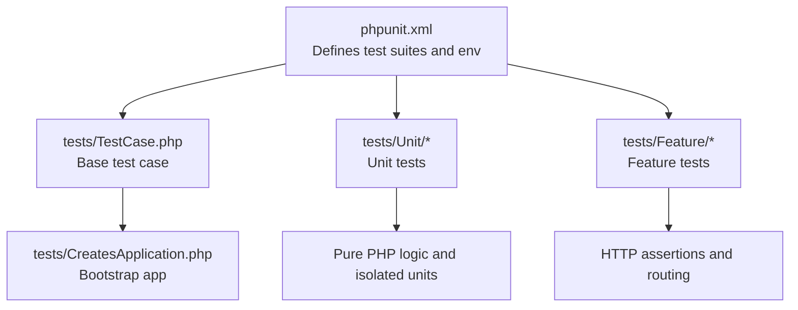
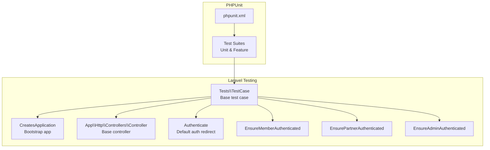
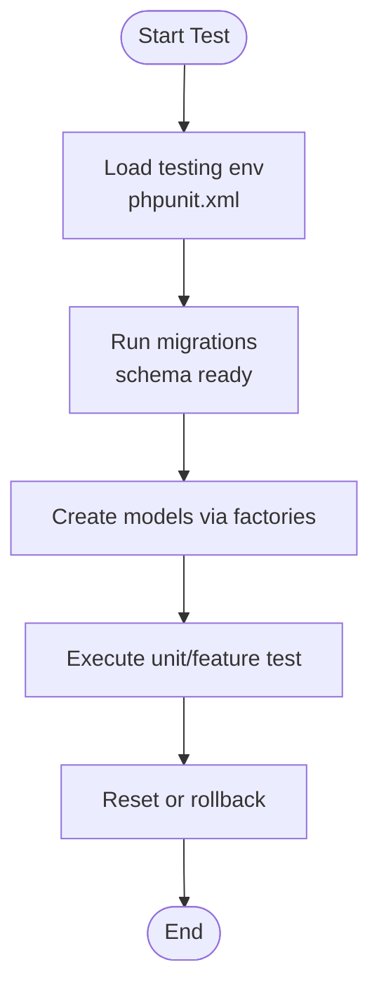
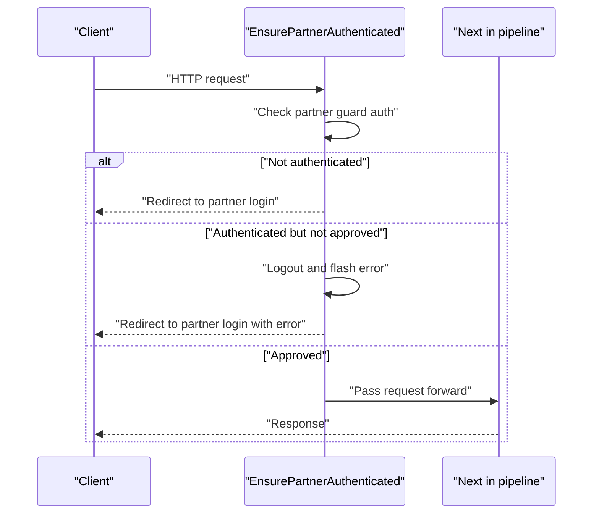
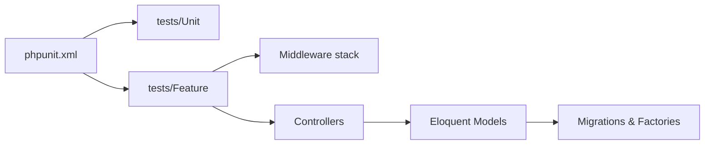

# Testing Strategy

<cite>
**Referenced Files in This Document**
- [phpunit.xml](file://phpunit.xml)
- [composer.json](file://composer.json)
- [tests/TestCase.php](file://tests/TestCase.php)
- [tests/CreatesApplication.php](file://tests/CreatesApplication.php)
- [tests/Feature/ExampleTest.php](file://tests/Feature/ExampleTest.php)
- [tests/Unit/ExampleTest.php](file://tests/Unit/ExampleTest.php)
- [database/factories/UserFactory.php](file://database/factories/UserFactory.php)
- [database/migrations/2014_10_12_000000_create_users_table.php](file://database/migrations/2014_10_12_000000_create_users_table.php)
- [database/seeders/DatabaseSeeder.php](file://database/seeders/DatabaseSeeder.php)
- [app/Http/Controllers/Controller.php](file://app/Http/Controllers/Controller.php)
- [app/Http/Middleware/Authenticate.php](file://app/Http/Middleware/Authenticate.php)
- [app/Http/Middleware/EnsureMemberAuthenticated.php](file://app/Http/Middleware/EnsureMemberAuthenticated.php)
- [app/Http/Middleware/EnsurePartnerAuthenticated.php](file://app/Http/Middleware/EnsurePartnerAuthenticated.php)
- [app/Http/Middleware/EnsureAdminAuthenticated.php](file://app/Http/Middleware/EnsureAdminAuthenticated.php)
</cite>

## Table of Contents
1. [Introduction](#introduction)
2. [Project Structure](#project-structure)
3. [Core Components](#core-components)
4. [Architecture Overview](#architecture-overview)
5. [Detailed Component Analysis](#detailed-component-analysis)
6. [Dependency Analysis](#dependency-analysis)
7. [Performance Considerations](#performance-considerations)
8. [Security Testing](#security-testing)
9. [Regression Testing](#regression-testing)
10. [Troubleshooting Guide](#troubleshooting-guide)
11. [Conclusion](#conclusion)
12. [Appendices](#appendices)

## Introduction
This document defines a comprehensive testing strategy for KatalogThrift, grounded in the existing Laravel application structure. It covers unit and feature testing with PHPUnit, test database setup via Eloquent factories and seeders, and best practices for controllers, middleware, authentication flows, and API endpoints. It also outlines configuration options, environment-specific testing, and CI readiness, along with guidance for performance, security, and regression testing.

## Project Structure
KatalogThrift follows Laravel’s conventional testing layout with separate suites for Unit and Feature tests, a shared base TestCase, and a trait to bootstrap the application. PHPUnit configuration sets the testing environment and several drivers to in-memory or synchronous defaults suitable for fast, deterministic runs.

**Diagram sources**
- [phpunit.xml:1-33](file://phpunit.xml#L1-L33)
- [tests/TestCase.php:1-11](file://tests/TestCase.php#L1-L11)
- [tests/CreatesApplication.php:1-22](file://tests/CreatesApplication.php#L1-L22)

**Section sources**
- [phpunit.xml:1-33](file://phpunit.xml#L1-L33)
- [tests/TestCase.php:1-11](file://tests/TestCase.php#L1-L11)
- [tests/CreatesApplication.php:1-22](file://tests/CreatesApplication.php#L1-L22)

## Core Components
- Test bootstrap and base case
  - The base TestCase extends Laravel’s framework test case and uses the CreatesApplication trait to load the application and run bootstrappers.
  - This ensures consistent environment setup for all tests, including service container resolution and route registration.

- PHPUnit configuration
  - Two test suites are defined: Unit and Feature.
  - Environment variables set APP_ENV to testing and configure cache, mail, queue, session, and related observability features to in-memory or synchronous modes for reliability.

- Example tests
  - A minimal Feature test validates a successful response from the root route.
  - A minimal Unit test asserts a basic boolean condition.

- Factories and migrations
  - Eloquent factories enable deterministic model creation for tests.
  - Migrations define the schema for the test database, ensuring consistent state across test runs.

- Seeders
  - Seeders can populate initial data for integration-style tests; the default seeder is currently empty and can be extended as needed.

**Section sources**
- [tests/TestCase.php:1-11](file://tests/TestCase.php#L1-L11)
- [tests/CreatesApplication.php:1-22](file://tests/CreatesApplication.php#L1-L22)
- [phpunit.xml:1-33](file://phpunit.xml#L1-L33)
- [tests/Feature/ExampleTest.php:1-20](file://tests/Feature/ExampleTest.php#L1-L20)
- [tests/Unit/ExampleTest.php:1-17](file://tests/Unit/ExampleTest.php#L1-L17)
- [database/factories/UserFactory.php:1-45](file://database/factories/UserFactory.php#L1-L45)
- [database/migrations/2014_10_12_000000_create_users_table.php:1-33](file://database/migrations/2014_10_12_000000_create_users_table.php#L1-L33)
- [database/seeders/DatabaseSeeder.php:1-23](file://database/seeders/DatabaseSeeder.php#L1-L23)

## Architecture Overview
The testing architecture centers on Laravel’s testing traits and helpers, with PHPUnit orchestrating test discovery and execution. Feature tests leverage HTTP client helpers to validate controller responses and middleware behavior. Unit tests isolate logic and dependencies using mocks and stubs.

**Diagram sources**
- [phpunit.xml:1-33](file://phpunit.xml#L1-L33)
- [tests/TestCase.php:1-11](file://tests/TestCase.php#L1-L11)
- [tests/CreatesApplication.php:1-22](file://tests/CreatesApplication.php#L1-L22)
- [app/Http/Controllers/Controller.php:1-13](file://app/Http/Controllers/Controller.php#L1-L13)
- [app/Http/Middleware/Authenticate.php:1-18](file://app/Http/Middleware/Authenticate.php#L1-L18)
- [app/Http/Middleware/EnsureMemberAuthenticated.php:1-21](file://app/Http/Middleware/EnsureMemberAuthenticated.php#L1-L21)
- [app/Http/Middleware/EnsurePartnerAuthenticated.php:1-28](file://app/Http/Middleware/EnsurePartnerAuthenticated.php#L1-L28)
- [app/Http/Middleware/EnsureAdminAuthenticated.php:1-25](file://app/Http/Middleware/EnsureAdminAuthenticated.php#L1-L25)

## Detailed Component Analysis

### Unit Testing Strategy
- Test organization
  - Place unit tests under tests/Unit and use namespaces aligned with application namespaces.
  - Keep tests focused on single units of logic; avoid heavy I/O.

- Mocking strategies
  - Use framework-provided mocking helpers to stub external services or collaborators.
  - For dependency injection testing, mock interfaces or fakes injected into classes under test.

- Assertion patterns
  - Prefer expressive assertions for readability and maintainability.
  - Combine logical checks with type and shape validations.

- Practical example pattern
  - Create a unit test class extending the base TestCase and assert outcomes without hitting the database or HTTP stack.

**Section sources**
- [tests/Unit/ExampleTest.php:1-17](file://tests/Unit/ExampleTest.php#L1-L17)
- [tests/TestCase.php:1-11](file://tests/TestCase.php#L1-L11)

### Feature Testing Strategy
- End-to-end validation
  - Feature tests exercise HTTP requests, middleware, controllers, and responses.
  - Use the base TestCase to issue requests and assert status codes, JSON shapes, redirects, and session flashes.

- Route and controller validation
  - Validate that routes return expected responses and that controller actions behave as intended.
  - Assert that middleware enforces authentication and authorization policies.

- Practical example pattern
  - Issue an HTTP request in a Feature test and assert a successful response status.

**Section sources**
- [tests/Feature/ExampleTest.php:1-20](file://tests/Feature/ExampleTest.php#L1-L20)
- [app/Http/Middleware/Authenticate.php:1-18](file://app/Http/Middleware/Authenticate.php#L1-L18)

### Test Database Setup, Factories, and Seeders
- Database setup
  - PHPUnit configuration sets the environment to testing and disables persistent caches and queues for determinism.
  - Use migrations to build the schema for the test database.

- Factories
  - Eloquent factories provide deterministic model creation with default attributes and optional states.
  - Factories are ideal for generating test users, products, and other domain entities.

- Seeders
  - Seeders can populate initial data for integration tests; extend the default seeder to include relevant datasets.

**Diagram sources**
- [phpunit.xml:20-31](file://phpunit.xml#L20-L31)
- [database/migrations/2014_10_12_000000_create_users_table.php:1-33](file://database/migrations/2014_10_12_000000_create_users_table.php#L1-L33)
- [database/factories/UserFactory.php:1-45](file://database/factories/UserFactory.php#L1-L45)
- [database/seeders/DatabaseSeeder.php:1-23](file://database/seeders/DatabaseSeeder.php#L1-L23)

**Section sources**
- [phpunit.xml:20-31](file://phpunit.xml#L20-L31)
- [database/migrations/2014_10_12_000000_create_users_table.php:1-33](file://database/migrations/2014_10_12_000000_create_users_table.php#L1-L33)
- [database/factories/UserFactory.php:1-45](file://database/factories/UserFactory.php#L1-L45)
- [database/seeders/DatabaseSeeder.php:1-23](file://database/seeders/DatabaseSeeder.php#L1-L23)

### Testing Best Practices for Laravel Applications
- Dependency injection testing
  - Inject dependencies via constructors or method parameters; mock or stub them in tests to isolate behavior.
  - Favor interface-based injection to simplify mocking.

- Model relationship testing
  - Use factories to create related models and assert relationships via foreign keys and Eloquent accessors.
  - Validate cascading behavior and constraint enforcement through database assertions.

- Controller and middleware testing
  - Test controller actions with authenticated and unauthenticated contexts.
  - Validate middleware redirection and error messages for unauthorized access.

- Assertions and readability
  - Prefer response assertions (status, JSON shape) and session/assertive helpers.
  - Keep assertions close to the action under test for clarity.

**Section sources**
- [app/Http/Controllers/Controller.php:1-13](file://app/Http/Controllers/Controller.php#L1-L13)
- [app/Http/Middleware/Authenticate.php:1-18](file://app/Http/Middleware/Authenticate.php#L1-L18)
- [app/Http/Middleware/EnsureMemberAuthenticated.php:1-21](file://app/Http/Middleware/EnsureMemberAuthenticated.php#L1-L21)
- [app/Http/Middleware/EnsurePartnerAuthenticated.php:1-28](file://app/Http/Middleware/EnsurePartnerAuthenticated.php#L1-L28)
- [app/Http/Middleware/EnsureAdminAuthenticated.php:1-25](file://app/Http/Middleware/EnsureAdminAuthenticated.php#L1-L25)

### Practical Examples

#### Testing Controllers
- Pattern
  - Instantiate the controller in a Feature test.
  - Call action methods with mocked request objects or via HTTP requests.
  - Assert response status, rendered views, or returned data transfer objects.

- Reference
  - Use the base TestCase to issue requests and assert outcomes.

**Section sources**
- [tests/Feature/ExampleTest.php:1-20](file://tests/Feature/ExampleTest.php#L1-L20)
- [tests/TestCase.php:1-11](file://tests/TestCase.php#L1-L11)

#### Testing Middleware
- Authentication middleware
  - Validate that unauthenticated requests are redirected appropriately based on request type (web vs JSON).

- Role-based middleware
  - Ensure member/partner/admin middleware enforce authentication and authorization, including approval checks for partner accounts.

**Diagram sources**
- [app/Http/Middleware/EnsurePartnerAuthenticated.php:1-28](file://app/Http/Middleware/EnsurePartnerAuthenticated.php#L1-L28)

**Section sources**
- [app/Http/Middleware/Authenticate.php:1-18](file://app/Http/Middleware/Authenticate.php#L1-L18)
- [app/Http/Middleware/EnsureMemberAuthenticated.php:1-21](file://app/Http/Middleware/EnsureMemberAuthenticated.php#L1-L21)
- [app/Http/Middleware/EnsurePartnerAuthenticated.php:1-28](file://app/Http/Middleware/EnsurePartnerAuthenticated.php#L1-L28)
- [app/Http/Middleware/EnsureAdminAuthenticated.php:1-25](file://app/Http/Middleware/EnsureAdminAuthenticated.php#L1-L25)

#### Testing Authentication Flows
- Web login flow
  - Simulate submission of credentials and assert redirects to expected destinations or session flags for admin guards.

- API authentication flow
  - Use Laravel Sanctum tokens for API tests; assert token-based authentication and protected endpoint responses.

- CSRF and cookies
  - Validate CSRF protection and cookie handling in web routes.

**Section sources**
- [app/Http/Middleware/VerifyCsrfToken.php](file://app/Http/Middleware/VerifyCsrfToken.php)
- [config/sanctum.php](file://config/sanctum.php)

#### Testing API Endpoints
- Request/response patterns
  - Issue HTTP requests in Feature tests and assert status codes, JSON structure, pagination, and headers.
  - Validate error responses for invalid inputs and authorization failures.

- Route coverage
  - Ensure all API routes are exercised by tests, including GET, POST, PUT, DELETE, and OPTIONS.

**Section sources**
- [routes/api.php](file://routes/api.php)
- [tests/Feature/ExampleTest.php:1-20](file://tests/Feature/ExampleTest.php#L1-L20)

### Test Configuration Options and Environment-Specific Testing
- Environment variables
  - APP_ENV is set to testing.
  - CACHE_DRIVER, QUEUE_CONNECTION, SESSION_DRIVER are configured for in-memory or synchronous behavior.
  - MAIL_MAILER is set to array to prevent actual mail sending.
  - Observability toggles (PULSE_ENABLED, TELESCOPE_ENABLED) are disabled to reduce noise.

- Database configuration
  - The commented sqlite in-memory options indicate support for ephemeral databases during testing.
  - Use migrations and factories to manage schema and fixtures per test suite.

- Composer scripts and autoload
  - Autoload-dev maps the Tests namespace for test classes.
  - Scripts handle key generation and asset publishing during development and CI.

**Section sources**
- [phpunit.xml:20-31](file://phpunit.xml#L20-L31)
- [composer.json:14-22](file://composer.json#L14-L22)
- [composer.json:30-34](file://composer.json#L30-L34)

### Continuous Integration Setup
- Test command
  - Run phpunit via Composer scripts or directly to execute both Unit and Feature suites.

- Artifacts and caching
  - Configure CI to cache Composer dependencies and Laravel bootstrap artifacts for faster builds.

- Parallelization
  - Split tests across jobs to improve feedback speed while maintaining isolation.

[No sources needed since this section provides general guidance]

## Dependency Analysis
The testing stack depends on PHPUnit, Laravel’s testing traits, and the application bootstrap. Middleware and controllers are central integration points for tests.

**Diagram sources**
- [phpunit.xml:7-14](file://phpunit.xml#L7-L14)
- [app/Http/Controllers/Controller.php:1-13](file://app/Http/Controllers/Controller.php#L1-L13)
- [database/migrations/2014_10_12_000000_create_users_table.php:1-33](file://database/migrations/2014_10_12_000000_create_users_table.php#L1-L33)
- [database/factories/UserFactory.php:1-45](file://database/factories/UserFactory.php#L1-L45)

**Section sources**
- [phpunit.xml:7-14](file://phpunit.xml#L7-L14)
- [app/Http/Controllers/Controller.php:1-13](file://app/Http/Controllers/Controller.php#L1-L13)
- [database/migrations/2014_10_12_000000_create_users_table.php:1-33](file://database/migrations/2014_10_12_000000_create_users_table.php#L1-L33)
- [database/factories/UserFactory.php:1-45](file://database/factories/UserFactory.php#L1-L45)

## Performance Considerations
- Use in-memory drivers for cache, session, and queue to minimize overhead.
- Keep tests small and fast; avoid unnecessary database writes.
- Reuse factories and seeds judiciously; prefer lightweight model states.
- Consider test isolation strategies (refresh database per test) when needed for correctness.

[No sources needed since this section provides general guidance]

## Security Testing
- CSRF protection
  - Validate that forms and state-changing requests require CSRF tokens.

- Authentication and authorization
  - Confirm middleware redirects unauthenticated users and denies access to protected routes.
  - For role-based guards, assert approval checks and logout behavior.

- Input validation
  - Assert that invalid inputs produce appropriate error responses and do not cause unexpected behavior.

**Section sources**
- [app/Http/Middleware/VerifyCsrfToken.php](file://app/Http/Middleware/VerifyCsrfToken.php)
- [app/Http/Middleware/Authenticate.php:1-18](file://app/Http/Middleware/Authenticate.php#L1-L18)
- [app/Http/Middleware/EnsurePartnerAuthenticated.php:1-28](file://app/Http/Middleware/EnsurePartnerAuthenticated.php#L1-L28)

## Regression Testing
- Maintain a growing suite of Feature tests covering critical user journeys.
- Add Unit tests for complex business logic to prevent logic regressions.
- Use factories to reproduce real-world scenarios consistently across runs.

[No sources needed since this section provides general guidance]

## Troubleshooting Guide
- Environment mismatch
  - Ensure APP_ENV is testing and related drivers are set for deterministic behavior.

- Database state issues
  - Use migrations and factories to reset schema and fixtures between tests.

- Authentication failures
  - Verify middleware behavior and session flags for admin guards; confirm partner approval logic.

- Missing dependencies
  - Confirm Composer dev dependencies are installed and autoload-dev is configured.

**Section sources**
- [phpunit.xml:20-31](file://phpunit.xml#L20-L31)
- [composer.json:14-22](file://composer.json#L14-L22)
- [composer.json:30-34](file://composer.json#L30-L34)
- [app/Http/Middleware/EnsureAdminAuthenticated.php:1-25](file://app/Http/Middleware/EnsureAdminAuthenticated.php#L1-L25)
- [app/Http/Middleware/EnsurePartnerAuthenticated.php:1-28](file://app/Http/Middleware/EnsurePartnerAuthenticated.php#L1-L28)

## Conclusion
KatalogThrift’s testing foundation leverages Laravel’s robust testing traits and PHPUnit’s flexibility. By structuring tests around Unit and Feature categories, using factories and seeders for deterministic data, and validating middleware and controller behavior, teams can achieve reliable, maintainable, and fast test suites. Extending the strategy with CI-friendly configurations and comprehensive coverage of authentication, API endpoints, and model relationships will strengthen confidence across releases.

[No sources needed since this section summarizes without analyzing specific files]

## Appendices
- Additional test files to create
  - Feature tests for key routes and controllers.
  - Unit tests for services and policies.
  - Model relationship tests using factories.
  - API tests for authenticated endpoints.

- Suggested enhancements
  - Enable sqlite in-memory database for faster runs.
  - Integrate PestPHP for expressive BDD-style tests alongside PHPUnit.

[No sources needed since this section provides general guidance]