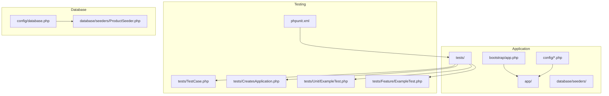
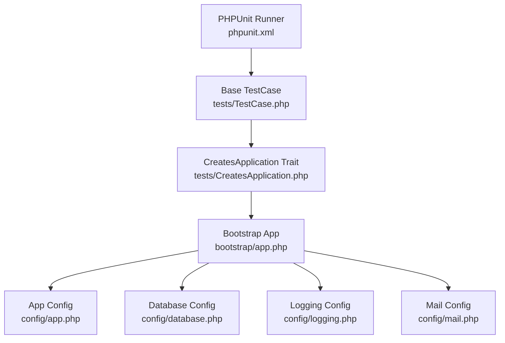
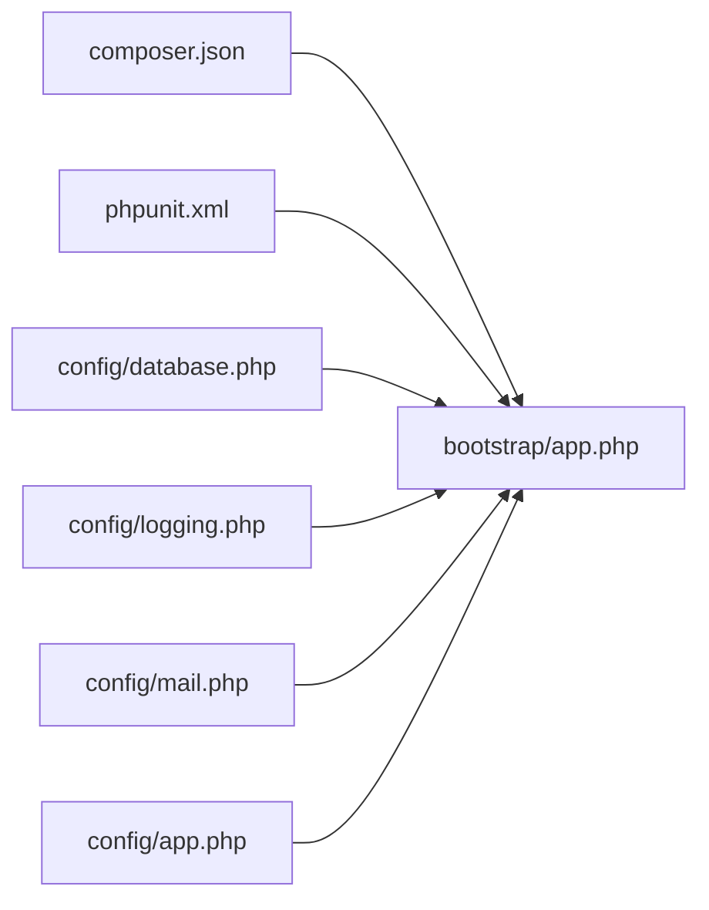
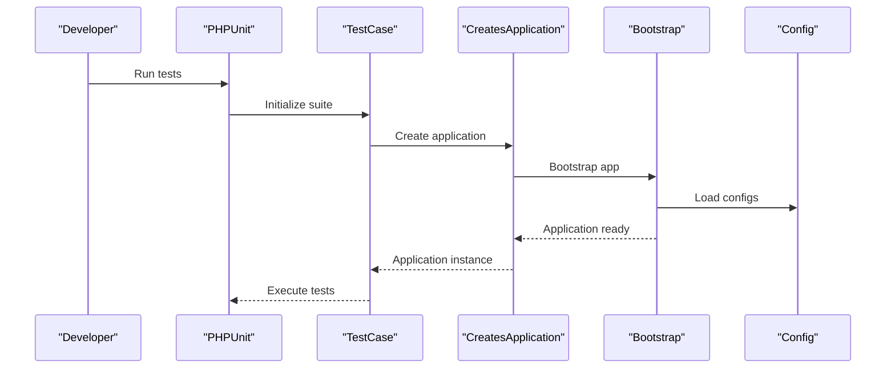

# Testing and Deployment

<cite>
**Referenced Files in This Document**
- [composer.json](file://composer.json)
- [phpunit.xml](file://phpunit.xml)
- [config/database.php](file://config/database.php)
- [config/app.php](file://config/app.php)
- [config/logging.php](file://config/logging.php)
- [config/mail.php](file://config/mail.php)
- [tests/TestCase.php](file://tests/TestCase.php)
- [tests/CreatesApplication.php](file://tests/CreatesApplication.php)
- [tests/Unit/ExampleTest.php](file://tests/Unit/ExampleTest.php)
- [tests/Feature/ExampleTest.php](file://tests/Feature/ExampleTest.php)
- [database/seeders/ProductSeeder.php](file://database/seeders/ProductSeeder.php)
- [bootstrap/app.php](file://bootstrap/app.php)
- [vendor/laravel/sail/runtimes/8.1/Dockerfile](file://vendor/laravel/sail/runtimes/8.1/Dockerfile)
- [.editorconfig](file://.editorconfig)
</cite>

## Table of Contents
1. [Introduction](#introduction)
2. [Project Structure](#project-structure)
3. [Core Components](#core-components)
4. [Architecture Overview](#architecture-overview)
5. [Detailed Component Analysis](#detailed-component-analysis)
6. [Dependency Analysis](#dependency-analysis)
7. [Performance Considerations](#performance-considerations)
8. [Troubleshooting Guide](#troubleshooting-guide)
9. [Conclusion](#conclusion)
10. [Appendices](#appendices)

## Introduction
This document provides comprehensive guidance for testing and deployment of KatalogThrift. It covers unit and feature testing strategies, test database configuration, continuous integration readiness, production deployment procedures, environment configuration, infrastructure requirements, monitoring and logging, performance tracking, rollback and disaster recovery, security hardening, and practical examples for test writing, deployment automation, and operational monitoring.

## Project Structure
KatalogThrift follows a standard Laravel application layout with dedicated directories for application code, configuration, database migrations and seeders, tests, and public assets. The testing setup is configured via PHPUnit with two suites (Unit and Feature), and the application boots through a centralized bootstrap file. Laravel Sail runtime images are included for containerized environments.

**Diagram sources**
- [bootstrap/app.php:14-55](file://bootstrap/app.php#L14-L55)
- [phpunit.xml:7-19](file://phpunit.xml#L7-L19)
- [tests/TestCase.php:7-10](file://tests/TestCase.php#L7-L10)
- [tests/CreatesApplication.php:8-21](file://tests/CreatesApplication.php#L8-L21)
- [tests/Unit/ExampleTest.php:7-16](file://tests/Unit/ExampleTest.php#L7-L16)
- [tests/Feature/ExampleTest.php:8-19](file://tests/Feature/ExampleTest.php#L8-L19)
- [config/database.php:18-96](file://config/database.php#L18-L96)
- [database/seeders/ProductSeeder.php:8-26](file://database/seeders/ProductSeeder.php#L8-L26)

**Section sources**
- [composer.json:1-67](file://composer.json#L1-L67)
- [phpunit.xml:1-33](file://phpunit.xml#L1-L33)
- [bootstrap/app.php:14-55](file://bootstrap/app.php#L14-L55)
- [config/database.php:18-96](file://config/database.php#L18-L96)
- [tests/TestCase.php:7-10](file://tests/TestCase.php#L7-L10)
- [tests/CreatesApplication.php:8-21](file://tests/CreatesApplication.php#L8-L21)
- [tests/Unit/ExampleTest.php:7-16](file://tests/Unit/ExampleTest.php#L7-L16)
- [tests/Feature/ExampleTest.php:8-19](file://tests/Feature/ExampleTest.php#L8-L19)
- [database/seeders/ProductSeeder.php:8-26](file://database/seeders/ProductSeeder.php#L8-L26)

## Core Components
- Testing framework and suites:
  - PHPUnit configured with Unit and Feature test suites and environment overrides for testing.
- Application bootstrap and kernel bindings:
  - Centralized application bootstrap and kernel bindings for HTTP and console.
- Configuration:
  - Database connections (MySQL, PostgreSQL, SQL Server, SQLite), Redis, logging, mailers, and application settings.
- Test harness:
  - Base TestCase and CreatesApplication trait to bootstrap the application for tests.
- Seeders:
  - ProductSeeder demonstrates seeding product data from configuration.

Key implementation references:
- [phpunit.xml:7-31](file://phpunit.xml#L7-L31)
- [bootstrap/app.php:29-42](file://bootstrap/app.php#L29-L42)
- [config/database.php:18-96](file://config/database.php#L18-L96)
- [config/logging.php:21-74](file://config/logging.php#L21-L74)
- [config/mail.php:36-88](file://config/mail.php#L36-L88)
- [tests/TestCase.php:7-10](file://tests/TestCase.php#L7-L10)
- [tests/CreatesApplication.php:8-21](file://tests/CreatesApplication.php#L8-L21)
- [database/seeders/ProductSeeder.php:8-26](file://database/seeders/ProductSeeder.php#L8-L26)

**Section sources**
- [phpunit.xml:7-31](file://phpunit.xml#L7-L31)
- [bootstrap/app.php:29-42](file://bootstrap/app.php#L29-L42)
- [config/database.php:18-96](file://config/database.php#L18-L96)
- [config/logging.php:21-74](file://config/logging.php#L21-L74)
- [config/mail.php:36-88](file://config/mail.php#L36-L88)
- [tests/TestCase.php:7-10](file://tests/TestCase.php#L7-L10)
- [tests/CreatesApplication.php:8-21](file://tests/CreatesApplication.php#L8-L21)
- [database/seeders/ProductSeeder.php:8-26](file://database/seeders/ProductSeeder.php#L8-L26)

## Architecture Overview
The testing and deployment architecture centers around Laravel’s testing utilities and configuration, with optional containerization via Laravel Sail. The application loads configuration, binds kernels, and executes tests against in-memory or ephemeral databases. Logging and mailer configurations support local and CI-friendly operation.

**Diagram sources**
- [phpunit.xml:4-31](file://phpunit.xml#L4-L31)
- [tests/TestCase.php:7-10](file://tests/TestCase.php#L7-L10)
- [tests/CreatesApplication.php:8-21](file://tests/CreatesApplication.php#L8-L21)
- [bootstrap/app.php:14-55](file://bootstrap/app.php#L14-L55)
- [config/database.php:18-96](file://config/database.php#L18-L96)
- [config/app.php:32-45](file://config/app.php#L32-L45)
- [config/logging.php:21-74](file://config/logging.php#L21-L74)
- [config/mail.php:36-88](file://config/mail.php#L36-L88)

## Detailed Component Analysis

### Unit Testing Strategy
- Purpose: Validate isolated logic and model behaviors.
- Setup: Extends the base TestCase and relies on the CreatesApplication trait to bootstrap the application.
- Execution: PHPUnit discovers tests under tests/Unit.

Recommended practices:
- Keep tests deterministic; avoid external dependencies.
- Use factories and minimal fixtures.
- Assert clear outcomes and edge cases.

References:
- [tests/Unit/ExampleTest.php:7-16](file://tests/Unit/ExampleTest.php#L7-L16)
- [tests/TestCase.php:7-10](file://tests/TestCase.php#L7-L10)
- [tests/CreatesApplication.php:8-21](file://tests/CreatesApplication.php#L8-L21)
- [phpunit.xml:8-10](file://phpunit.xml#L8-L10)

**Section sources**
- [tests/Unit/ExampleTest.php:7-16](file://tests/Unit/ExampleTest.php#L7-L16)
- [tests/TestCase.php:7-10](file://tests/TestCase.php#L7-L10)
- [tests/CreatesApplication.php:8-21](file://tests/CreatesApplication.php#L8-L21)
- [phpunit.xml:8-10](file://phpunit.xml#L8-L10)

### Feature Testing Approach
- Purpose: Validate end-to-end HTTP interactions and route responses.
- Setup: Extends the base TestCase; uses HTTP client helpers to assert response status and content.
- Execution: PHPUnit discovers tests under tests/Feature.

Recommended practices:
- Use database transactions or refresh strategy for isolation.
- Mock external services where appropriate.
- Cover critical user journeys and error paths.

References:
- [tests/Feature/ExampleTest.php:8-19](file://tests/Feature/ExampleTest.php#L8-L19)
- [phpunit.xml:11-13](file://phpunit.xml#L11-L13)

**Section sources**
- [tests/Feature/ExampleTest.php:8-19](file://tests/Feature/ExampleTest.php#L8-L19)
- [phpunit.xml:11-13](file://phpunit.xml#L11-L13)

### Test Database Configuration
- Default connection: MySQL, configurable via environment variables.
- SQLite support: Included for in-memory or file-backed testing.
- Environment overrides: PHPUnit sets drivers and thresholds for faster, deterministic runs.

Key configuration references:
- [config/database.php:18](file://config/database.php#L18)
- [config/database.php:36-96](file://config/database.php#L36-L96)
- [phpunit.xml:20-31](file://phpunit.xml#L20-L31)

Operational tips:
- For CI, prefer SQLite memory database by uncommenting the relevant environment overrides in phpunit.xml.
- Ensure foreign key constraints are enabled during testing if your logic depends on referential integrity.

**Section sources**
- [config/database.php:18](file://config/database.php#L18)
- [config/database.php:36-96](file://config/database.php#L36-L96)
- [phpunit.xml:20-31](file://phpunit.xml#L20-L31)

### Continuous Integration Setup
- Test discovery: PHPUnit scans tests/Unit and tests/Feature.
- Environment: APP_ENV is set to testing; cache, session, and queue drivers optimized for tests.
- Mailer: Array driver prevents actual mail delivery during tests.

References:
- [phpunit.xml:7-19](file://phpunit.xml#L7-L19)
- [phpunit.xml:20-31](file://phpunit.xml#L20-L31)

CI pipeline suggestions:
- Install dependencies via Composer.
- Prepare test database (SQLite memory or ephemeral MySQL/PostgreSQL).
- Run PHPUnit with coverage reporting.
- Fail on test failures and enforce minimum coverage thresholds.

**Section sources**
- [phpunit.xml:7-19](file://phpunit.xml#L7-L19)
- [phpunit.xml:20-31](file://phpunit.xml#L20-L31)

### Automated Testing Pipelines
- Composer scripts: Provide hooks for post-install and post-update actions.
- Scripts commonly used in CI: install dependencies, generate keys, publish assets.

References:
- [composer.json:35-48](file://composer.json#L35-L48)

**Section sources**
- [composer.json:35-48](file://composer.json#L35-L48)

### Quality Assurance Processes
- Code style: EditorConfig enforces consistent formatting across contributors.
- Static analysis and formatting: Pint is available as a dev dependency.

References:
- [.editorconfig:1-18](file://.editorconfig#L1-L18)
- [composer.json:14-22](file://composer.json#L14-L22)

**Section sources**
- [.editorconfig:1-18](file://.editorconfig#L1-L18)
- [composer.json:14-22](file://composer.json#L14-L22)

### Production Deployment Procedures
- Environment configuration:
  - Application environment and debug mode are controlled via config/app.php.
  - Database and Redis connections are environment-driven.
- Containerization:
  - Laravel Sail runtime image for PHP 8.1 is available for containerized deployments.

References:
- [config/app.php:32-45](file://config/app.php#L32-L45)
- [config/database.php:18-96](file://config/database.php#L18-L96)
- [vendor/laravel/sail/runtimes/8.1/Dockerfile:14-16](file://vendor/laravel/sail/runtimes/8.1/Dockerfile#L14-L16)

Deployment steps (high level):
- Build artifacts and install dependencies.
- Prepare database (migrate and seed if needed).
- Configure environment variables (APP_ENV, DB_*).
- Start application server (e.g., PHP built-in server or reverse proxy to workers).
- Health checks and readiness probes.

**Section sources**
- [config/app.php:32-45](file://config/app.php#L32-L45)
- [config/database.php:18-96](file://config/database.php#L18-L96)
- [vendor/laravel/sail/runtimes/8.1/Dockerfile:14-16](file://vendor/laravel/sail/runtimes/8.1/Dockerfile#L14-L16)

### Environment Configuration
- Application environment and debug mode:
  - Controlled by APP_ENV and APP_DEBUG.
- Database connectivity:
  - DB_CONNECTION selects the active connection; defaults to MySQL.
- Redis:
  - Redis client and cluster options are configurable.
- Logging:
  - Default channel and daily rotation settings.
- Mail:
  - Multiple mailers; array driver suitable for testing.

References:
- [config/app.php:32-45](file://config/app.php#L32-L45)
- [config/database.php:18-96](file://config/database.php#L18-L96)
- [config/database.php:122-149](file://config/database.php#L122-L149)
- [config/logging.php:21-74](file://config/logging.php#L21-L74)
- [config/mail.php:36-88](file://config/mail.php#L36-L88)

**Section sources**
- [config/app.php:32-45](file://config/app.php#L32-L45)
- [config/database.php:18-96](file://config/database.php#L18-L96)
- [config/database.php:122-149](file://config/database.php#L122-L149)
- [config/logging.php:21-74](file://config/logging.php#L21-L74)
- [config/mail.php:36-88](file://config/mail.php#L36-L88)

### Infrastructure Requirements
- PHP runtime aligned with Laravel 10 requirements.
- Database: MySQL, PostgreSQL, SQL Server, or SQLite.
- Optional: Redis for caching and queues.
- Container runtime: PHP 8.1 runtime image provided by Laravel Sail.

References:
- [composer.json:8-12](file://composer.json#L8-L12)
- [config/database.php:36-96](file://config/database.php#L36-L96)
- [config/database.php:122-149](file://config/database.php#L122-L149)
- [vendor/laravel/sail/runtimes/8.1/Dockerfile:1-72](file://vendor/laravel/sail/runtimes/8.1/Dockerfile#L1-L72)

**Section sources**
- [composer.json:8-12](file://composer.json#L8-L12)
- [config/database.php:36-96](file://config/database.php#L36-L96)
- [config/database.php:122-149](file://config/database.php#L122-L149)
- [vendor/laravel/sail/runtimes/8.1/Dockerfile:1-72](file://vendor/laravel/sail/runtimes/8.1/Dockerfile#L1-L72)

### Monitoring, Logs, and Performance Tracking
- Logging:
  - Default stack channel with single or daily rotating files.
  - Level controlled by LOG_LEVEL.
- Performance:
  - Queue connection set to sync for simplicity; adjust for production throughput.
  - Consider Redis for queues and cache.

References:
- [config/logging.php:21-74](file://config/logging.php#L21-L74)
- [phpunit.xml:27-29](file://phpunit.xml#L27-L29)

Monitoring recommendations:
- Integrate structured logging to external systems (e.g., ELK, CloudWatch).
- Track request latency, error rates, and queue backlog.
- Enable profiling for slow queries and long-tail responses.

**Section sources**
- [config/logging.php:21-74](file://config/logging.php#L21-L74)
- [phpunit.xml:27-29](file://phpunit.xml#L27-L29)

### Rollback, Backup, and Disaster Recovery
- Database backups:
  - Maintain regular logical backups of MySQL/PostgreSQL.
  - Use point-in-time recovery where supported.
- Rollback strategy:
  - Tag releases; keep previous artifact and database migration scripts.
  - Revert to last known good migration and artifact.
- Disaster recovery:
  - Replicate database and application state across regions.
  - Automate failover and health checks.

Note: These are operational recommendations derived from the configuration and common practices; no specific implementation is present in the repository.

### Security Hardening, Vulnerability Scanning, and Compliance
- Security considerations:
  - Enforce HTTPS and secure cookies in production.
  - Rotate APP_KEY regularly.
  - Limit exposure of debug information.
- Vulnerability scanning:
  - Integrate static analysis and dependency scanning in CI.
  - Keep dependencies updated per security advisories.
- Compliance:
  - Align logging retention with policy (e.g., GDPR).
  - Restrict access to logs and credentials.

Note: These are general best practices; no specific security configuration is present in the repository.

### Practical Examples

#### Writing a Unit Test
- Extend the base TestCase.
- Place the file under tests/Unit.
- Reference: [tests/Unit/ExampleTest.php:7-16](file://tests/Unit/ExampleTest.php#L7-L16)

#### Writing a Feature Test
- Extend the base TestCase.
- Use HTTP helpers to assert responses.
- Reference: [tests/Feature/ExampleTest.php:8-19](file://tests/Feature/ExampleTest.php#L8-L19)

#### Running Tests Locally
- Use Composer scripts to prepare the environment.
- References:
  - [composer.json:35-48](file://composer.json#L35-L48)
  - [phpunit.xml:4](file://phpunit.xml#L4)

#### Seeding Test Data
- Use seeders to populate known datasets.
- Reference: [database/seeders/ProductSeeder.php:8-26](file://database/seeders/ProductSeeder.php#L8-L26)

#### Containerized Development
- Use the provided PHP 8.1 runtime image for consistent environments.
- Reference: [vendor/laravel/sail/runtimes/8.1/Dockerfile:14-16](file://vendor/laravel/sail/runtimes/8.1/Dockerfile#L14-L16)

## Dependency Analysis
The testing and deployment ecosystem relies on Composer-managed dependencies and Laravel’s configuration system. PHPUnit orchestrates test execution, while configuration files define runtime behavior for databases, logging, and mailers.

**Diagram sources**
- [composer.json:35-48](file://composer.json#L35-L48)
- [phpunit.xml:4-31](file://phpunit.xml#L4-L31)
- [config/database.php:18-96](file://config/database.php#L18-L96)
- [config/logging.php:21-74](file://config/logging.php#L21-L74)
- [config/mail.php:36-88](file://config/mail.php#L36-L88)
- [config/app.php:32-45](file://config/app.php#L32-L45)
- [bootstrap/app.php:14-55](file://bootstrap/app.php#L14-L55)

**Section sources**
- [composer.json:35-48](file://composer.json#L35-L48)
- [phpunit.xml:4-31](file://phpunit.xml#L4-L31)
- [config/database.php:18-96](file://config/database.php#L18-L96)
- [config/logging.php:21-74](file://config/logging.php#L21-L74)
- [config/mail.php:36-88](file://config/mail.php#L36-L88)
- [config/app.php:32-45](file://config/app.php#L32-L45)
- [bootstrap/app.php:14-55](file://bootstrap/app.php#L14-L55)

## Performance Considerations
- Database:
  - Prefer prepared statements and limit N+1 queries.
  - Use indexing on frequently filtered columns.
- Caching:
  - Leverage Redis for cache and sessions.
- Queues:
  - Switch from sync to background workers for heavy jobs.
- Logging:
  - Use daily rotation and appropriate log levels to reduce I/O overhead.

[No sources needed since this section provides general guidance]

## Troubleshooting Guide
Common issues and resolutions:
- Tests failing due to environment mismatch:
  - Ensure APP_ENV is set to testing and drivers are optimized for tests.
  - References: [phpunit.xml:20-31](file://phpunit.xml#L20-L31)
- Database connectivity errors:
  - Verify DB_CONNECTION and credentials; confirm drivers are installed.
  - References: [config/database.php:18-96](file://config/database.php#L18-L96)
- Logging not captured:
  - Confirm LOG_CHANNEL and LOG_LEVEL; check file permissions.
  - References: [config/logging.php:21-74](file://config/logging.php#L21-L74)
- Mail not delivered in tests:
  - Use array mailer to prevent actual delivery.
  - References: [config/mail.php:78-80](file://config/mail.php#L78-L80)

**Section sources**
- [phpunit.xml:20-31](file://phpunit.xml#L20-L31)
- [config/database.php:18-96](file://config/database.php#L18-L96)
- [config/logging.php:21-74](file://config/logging.php#L21-L74)
- [config/mail.php:78-80](file://config/mail.php#L78-L80)

## Conclusion
KatalogThrift’s testing and deployment foundation leverages Laravel’s robust configuration and testing utilities. By aligning environment settings, optimizing database and logging behavior, and adopting containerized workflows, teams can achieve reliable CI/CD, predictable deployments, and strong observability. Apply the recommended practices for security, performance, and disaster recovery to maintain a resilient platform.

[No sources needed since this section summarizes without analyzing specific files]

## Appendices

### Appendix A: Test Execution Flow

**Diagram sources**
- [phpunit.xml:4-19](file://phpunit.xml#L4-L19)
- [tests/TestCase.php:7-10](file://tests/TestCase.php#L7-L10)
- [tests/CreatesApplication.php:8-21](file://tests/CreatesApplication.php#L8-L21)
- [bootstrap/app.php:14-55](file://bootstrap/app.php#L14-L55)