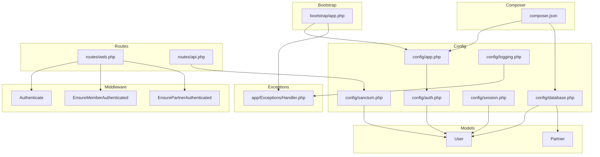
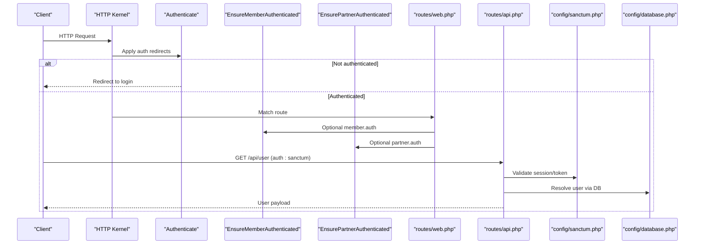
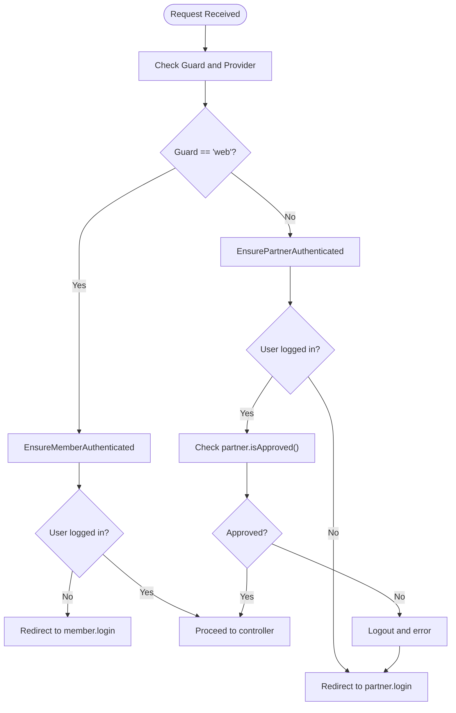
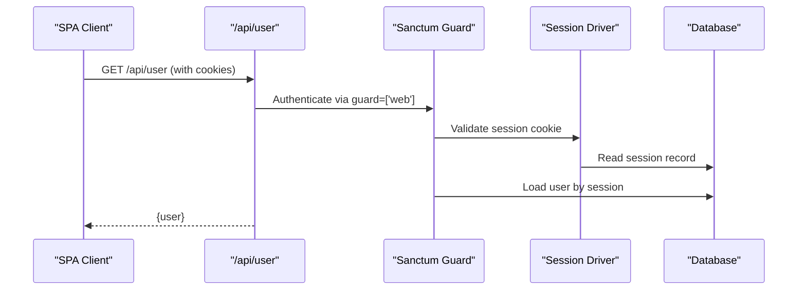
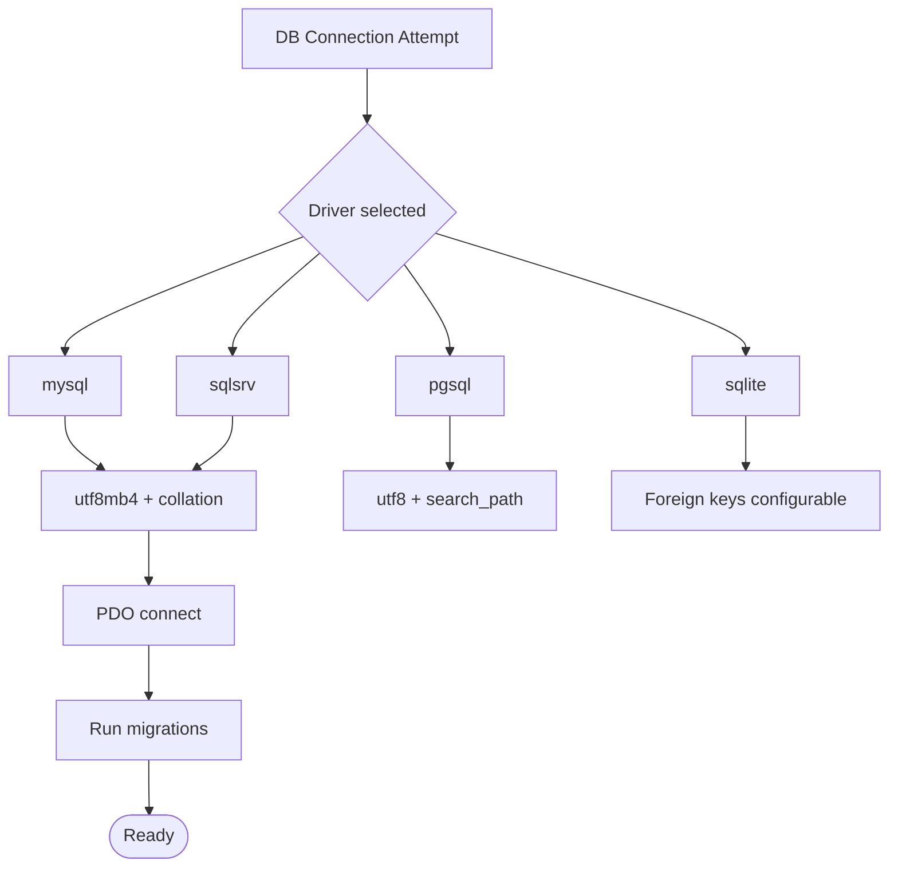
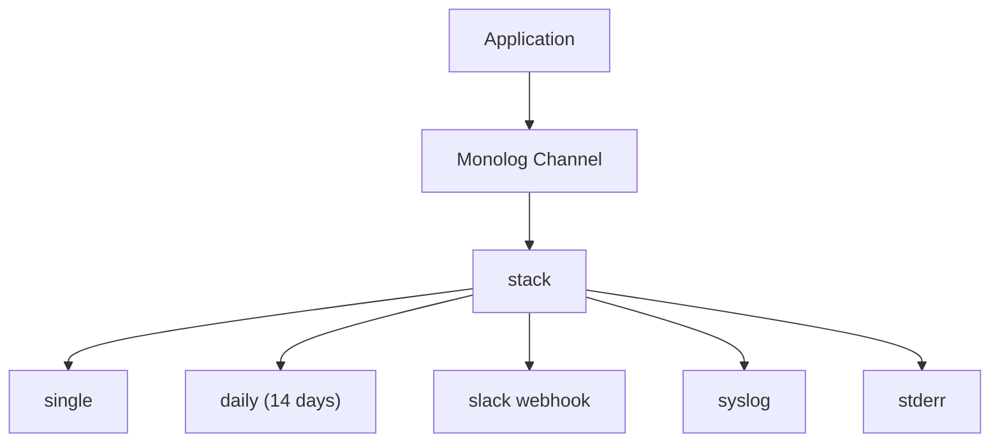
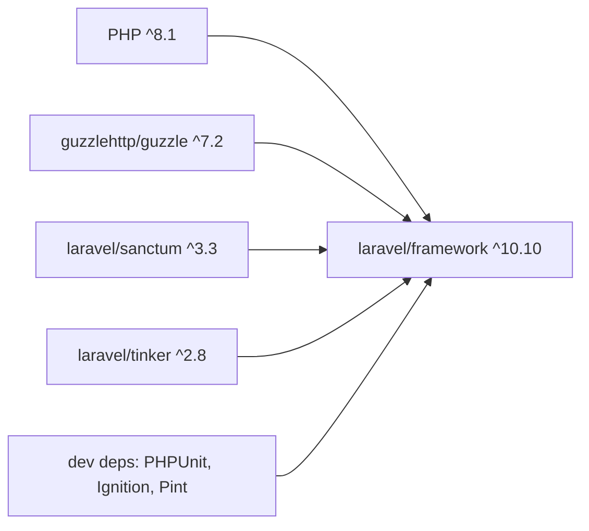

# Troubleshooting and FAQ

<cite>
**Referenced Files in This Document**
- [composer.json](file://composer.json)
- [README.md](file://README.md)
- [bootstrap/app.php](file://bootstrap/app.php)
- [config/app.php](file://config/app.php)
- [config/auth.php](file://config/auth.php)
- [config/sanctum.php](file://config/sanctum.php)
- [config/session.php](file://config/session.php)
- [config/database.php](file://config/database.php)
- [config/logging.php](file://config/logging.php)
- [app/Exceptions/Handler.php](file://app/Exceptions/Handler.php)
- [app/Http/Middleware/Authenticate.php](file://app/Http/Middleware/Authenticate.php)
- [app/Http/Middleware/EnsureMemberAuthenticated.php](file://app/Http/Middleware/EnsureMemberAuthenticated.php)
- [app/Http/Middleware/EnsurePartnerAuthenticated.php](file://app/Http/Middleware/EnsurePartnerAuthenticated.php)
- [app/Models/User.php](file://app/Models/User.php)
- [app/Models/Partner.php](file://app/Models/Partner.php)
- [routes/web.php](file://routes/web.php)
- [routes/api.php](file://routes/api.php)
</cite>

## Table of Contents
1. [Introduction](#introduction)
2. [Project Structure](#project-structure)
3. [Core Components](#core-components)
4. [Architecture Overview](#architecture-overview)
5. [Detailed Component Analysis](#detailed-component-analysis)
6. [Dependency Analysis](#dependency-analysis)
7. [Performance Considerations](#performance-considerations)
8. [Troubleshooting Guide](#troubleshooting-guide)
9. [Conclusion](#conclusion)
10. [Appendices](#appendices)

## Introduction
This Troubleshooting and FAQ document provides practical guidance for diagnosing and resolving common issues in KatalogThrift. It covers installation and environment setup, configuration pitfalls, runtime errors, authentication and authorization problems, database connectivity and migrations, logging and diagnostics, performance tuning, security hardening, deployment concerns, and recovery procedures. The goal is to help operators maintain a stable, secure, and performant system with actionable steps and preventive measures.

## Project Structure
KatalogThrift is a Laravel application. The structure relevant to troubleshooting includes:
- Configuration: app, auth, sanctum, session, database, logging
- Bootstrap and exception handling
- Middleware for authentication and role gating
- Models for User and Partner
- Web and API route groups
- Composer-managed dependencies

**Diagram sources**
- [bootstrap/app.php:14-42](file://bootstrap/app.php#L14-L42)
- [config/app.php:18-189](file://config/app.php#L18-L189)
- [config/auth.php:16-119](file://config/auth.php#L16-L119)
- [config/sanctum.php:18-81](file://config/sanctum.php#L18-L81)
- [config/session.php:21-214](file://config/session.php#L21-L214)
- [config/database.php:18-151](file://config/database.php#L18-L151)
- [config/logging.php:21-131](file://config/logging.php#L21-L131)
- [app/Exceptions/Handler.php:8-30](file://app/Exceptions/Handler.php#L8-L30)
- [app/Http/Middleware/Authenticate.php:8-17](file://app/Http/Middleware/Authenticate.php#L8-L17)
- [app/Http/Middleware/EnsureMemberAuthenticated.php:9-20](file://app/Http/Middleware/EnsureMemberAuthenticated.php#L9-L20)
- [app/Http/Middleware/EnsurePartnerAuthenticated.php:9-27](file://app/Http/Middleware/EnsurePartnerAuthenticated.php#L9-L27)
- [app/Models/User.php:10-131](file://app/Models/User.php#L10-L131)
- [app/Models/Partner.php:8-123](file://app/Models/Partner.php#L8-L123)
- [routes/web.php:44-240](file://routes/web.php#L44-L240)
- [routes/api.php:17-19](file://routes/api.php#L17-L19)
- [composer.json:7-22](file://composer.json#L7-L22)

**Section sources**
- [bootstrap/app.php:14-42](file://bootstrap/app.php#L14-L42)
- [config/app.php:18-189](file://config/app.php#L18-L189)
- [config/auth.php:16-119](file://config/auth.php#L16-L119)
- [config/sanctum.php:18-81](file://config/sanctum.php#L18-L81)
- [config/session.php:21-214](file://config/session.php#L21-L214)
- [config/database.php:18-151](file://config/database.php#L18-L151)
- [config/logging.php:21-131](file://config/logging.php#L21-L131)
- [app/Exceptions/Handler.php:8-30](file://app/Exceptions/Handler.php#L8-L30)
- [app/Http/Middleware/Authenticate.php:8-17](file://app/Http/Middleware/Authenticate.php#L8-L17)
- [app/Http/Middleware/EnsureMemberAuthenticated.php:9-20](file://app/Http/Middleware/EnsureMemberAuthenticated.php#L9-L20)
- [app/Http/Middleware/EnsurePartnerAuthenticated.php:9-27](file://app/Http/Middleware/EnsurePartnerAuthenticated.php#L9-L27)
- [app/Models/User.php:10-131](file://app/Models/User.php#L10-L131)
- [app/Models/Partner.php:8-123](file://app/Models/Partner.php#L8-L123)
- [routes/web.php:44-240](file://routes/web.php#L44-L240)
- [routes/api.php:17-19](file://routes/api.php#L17-L19)
- [composer.json:7-22](file://composer.json#L7-L22)

## Core Components
- Application bootstrap binds kernel and exception handler singletons.
- Authentication uses session guards and Eloquent provider; Sanctum supports stateful domains and middleware.
- Session configuration controls driver, lifetime, cookie attributes, and stores.
- Database configuration supports sqlite, mysql, pgsql, sqlsrv with charset/collation and SSL options.
- Logging supports stack/single/daily/slack/syslog/errorlog and processors.
- Exception handler defines sensitive input flashing policy.
- Middleware enforces authentication and role checks for member/partner.
- Models define roles, relationships, and gamification helpers.

**Section sources**
- [bootstrap/app.php:29-42](file://bootstrap/app.php#L29-L42)
- [config/auth.php:16-119](file://config/auth.php#L16-L119)
- [config/sanctum.php:18-81](file://config/sanctum.php#L18-L81)
- [config/session.php:21-214](file://config/session.php#L21-L214)
- [config/database.php:36-96](file://config/database.php#L36-L96)
- [config/logging.php:54-131](file://config/logging.php#L54-L131)
- [app/Exceptions/Handler.php:15-19](file://app/Exceptions/Handler.php#L15-L19)
- [app/Http/Middleware/Authenticate.php:13-16](file://app/Http/Middleware/Authenticate.php#L13-L16)
- [app/Http/Middleware/EnsureMemberAuthenticated.php:13-16](file://app/Http/Middleware/EnsureMemberAuthenticated.php#L13-L16)
- [app/Http/Middleware/EnsurePartnerAuthenticated.php:13-23](file://app/Http/Middleware/EnsurePartnerAuthenticated.php#L13-L23)
- [app/Models/User.php:14-26](file://app/Models/User.php#L14-L26)
- [app/Models/Partner.php:10-26](file://app/Models/Partner.php#L10-L26)

## Architecture Overview
The runtime flow integrates HTTP requests through middleware, resolves routes, authenticates users, and interacts with models and database. Sanctum enables stateful API authentication for SPA domains.

**Diagram sources**
- [routes/web.php:89-116](file://routes/web.php#L89-L116)
- [routes/web.php:119-167](file://routes/web.php#L119-L167)
- [routes/api.php:17-19](file://routes/api.php#L17-L19)
- [config/sanctum.php:18-81](file://config/sanctum.php#L18-L81)
- [config/database.php:18-151](file://config/database.php#L18-L151)
- [app/Http/Middleware/Authenticate.php:13-16](file://app/Http/Middleware/Authenticate.php#L13-L16)
- [app/Http/Middleware/EnsureMemberAuthenticated.php:13-16](file://app/Http/Middleware/EnsureMemberAuthenticated.php#L13-L16)
- [app/Http/Middleware/EnsurePartnerAuthenticated.php:13-23](file://app/Http/Middleware/EnsurePartnerAuthenticated.php#L13-L23)

## Detailed Component Analysis

### Authentication and Authorization Flow
Common issues include incorrect guards, missing stateful domains, session misconfiguration, and partner approval checks.

**Diagram sources**
- [config/auth.php:38-47](file://config/auth.php#L38-L47)
- [app/Http/Middleware/EnsureMemberAuthenticated.php:13-16](file://app/Http/Middleware/EnsureMemberAuthenticated.php#L13-L16)
- [app/Http/Middleware/EnsurePartnerAuthenticated.php:13-23](file://app/Http/Middleware/EnsurePartnerAuthenticated.php#L13-L23)
- [app/Models/Partner.php:72-75](file://app/Models/Partner.php#L72-L75)

**Section sources**
- [config/auth.php:16-119](file://config/auth.php#L16-L119)
- [app/Http/Middleware/EnsureMemberAuthenticated.php:9-20](file://app/Http/Middleware/EnsureMemberAuthenticated.php#L9-L20)
- [app/Http/Middleware/EnsurePartnerAuthenticated.php:9-27](file://app/Http/Middleware/EnsurePartnerAuthenticated.php#L9-L27)
- [app/Models/Partner.php:72-75](file://app/Models/Partner.php#L72-L75)

### API Authentication via Sanctum
Issues often stem from stateful domains, middleware chain, and token expiration.

**Diagram sources**
- [routes/api.php:17-19](file://routes/api.php#L17-L19)
- [config/sanctum.php:36-81](file://config/sanctum.php#L36-L81)
- [config/session.php:21-214](file://config/session.php#L21-L214)
- [config/database.php:18-151](file://config/database.php#L18-L151)

**Section sources**
- [routes/api.php:17-19](file://routes/api.php#L17-L19)
- [config/sanctum.php:18-81](file://config/sanctum.php#L18-L81)
- [config/session.php:21-214](file://config/session.php#L21-L214)
- [config/database.php:18-151](file://config/database.php#L18-L151)

### Database Connectivity and Migrations
Issues commonly involve wrong credentials, missing drivers, charset/collation mismatches, and migration repository table.

**Diagram sources**
- [config/database.php:36-96](file://config/database.php#L36-L96)

**Section sources**
- [config/database.php:18-151](file://config/database.php#L18-L151)

### Logging and Diagnostics
Default stack uses a single log file with daily rotation. Configure Slack or syslog for centralized logging.

**Diagram sources**
- [config/logging.php:54-131](file://config/logging.php#L54-L131)

**Section sources**
- [config/logging.php:21-131](file://config/logging.php#L21-L131)

## Dependency Analysis
External dependencies include Laravel framework, Sanctum, Tinker, Guzzle, and development/testing tools. Ensure PHP version compatibility and proper autoload generation.

**Diagram sources**
- [composer.json:7-22](file://composer.json#L7-L22)

**Section sources**
- [composer.json:7-66](file://composer.json#L7-L66)

## Performance Considerations
- Database
  - Use utf8mb4 with proper indexes for high-cardinality columns.
  - Enable foreign key constraints for integrity where applicable.
  - Tune charset/collation per driver.
- Sessions
  - Prefer redis or database sessions for scale.
  - Adjust lifetime and lottery ratios.
- Logging
  - Use daily rotation and lower verbosity in production.
  - Offload to syslog or external services for high throughput.
- Caching and Queues
  - Ensure cache client and queue workers are configured and monitored.
- Monitoring
  - Track response times, error rates, and resource utilization.

[No sources needed since this section provides general guidance]

## Troubleshooting Guide

### Installation and Environment Setup
- Symptom: Composer install fails or autoload not found.
  - Resolution: Ensure PHP version matches requirement, run autoloader dump, and publish assets if needed.
  - References: [composer.json:8](file://composer.json#L8), [composer.json:35-48](file://composer.json#L35-L48)

- Symptom: APP_KEY missing or invalid.
  - Resolution: Generate application key and verify .env.
  - References: [config/app.php:125](file://config/app.php#L125), [composer.json:47](file://composer.json#L47)

- Symptom: Application runs but shows generic error page.
  - Resolution: Enable debug mode locally and check logs.
  - References: [config/app.php:45](file://config/app.php#L45), [config/logging.php:63-74](file://config/logging.php#L63-L74)

**Section sources**
- [composer.json:8](file://composer.json#L8)
- [composer.json:35-48](file://composer.json#L35-L48)
- [config/app.php:45](file://config/app.php#L45)
- [config/logging.php:63-74](file://config/logging.php#L63-L74)

### Configuration Problems
- Symptom: Database connection fails.
  - Resolution: Verify DB_CONNECTION, host, port, database, username, password; ensure PDO driver installed; check charset/collation.
  - References: [config/database.php:18](file://config/database.php#L18), [config/database.php:46-64](file://config/database.php#L46-L64), [config/database.php:66-79](file://config/database.php#L66-L79), [config/database.php:81-94](file://config/database.php#L81-L94)

- Symptom: Session issues (login not persisting).
  - Resolution: Confirm SESSION_DRIVER, lifetime, cookie domain/secure flags, and store configuration.
  - References: [config/session.php:21](file://config/session.php#L21), [config/session.php:34](file://config/session.php#L34), [config/session.php:158](file://config/session.php#L158), [config/session.php:171](file://config/session.php#L171)

- Symptom: CORS/API auth failing for SPA.
  - Resolution: Add frontend origins to SANCTUM_STATEFUL_DOMAINS; ensure cookies and CSRF verification pass.
  - References: [config/sanctum.php:18-22](file://config/sanctum.php#L18-L22), [config/sanctum.php:77-81](file://config/sanctum.php#L77-L81)

**Section sources**
- [config/database.php:18](file://config/database.php#L18)
- [config/database.php:46-64](file://config/database.php#L46-L64)
- [config/database.php:66-79](file://config/database.php#L66-L79)
- [config/database.php:81-94](file://config/database.php#L81-L94)
- [config/session.php:21](file://config/session.php#L21)
- [config/session.php:34](file://config/session.php#L34)
- [config/session.php:158](file://config/session.php#L158)
- [config/session.php:171](file://config/session.php#L171)
- [config/sanctum.php:18-22](file://config/sanctum.php#L18-L22)
- [config/sanctum.php:77-81](file://config/sanctum.php#L77-L81)

### Runtime Errors and Authentication Issues
- Symptom: Redirect loop to login pages.
  - Resolution: Check middleware redirectTo behavior and route names; ensure intended URL preserved.
  - References: [app/Http/Middleware/Authenticate.php:13-16](file://app/Http/Middleware/Authenticate.php#L13-L16), [routes/web.php:76-80](file://routes/web.php#L76-L80), [routes/web.php:120-122](file://routes/web.php#L120-L122)

- Symptom: Partner access denied after logout.
  - Resolution: Partner middleware checks approval; ensure user/partner records are correct.
  - References: [app/Http/Middleware/EnsurePartnerAuthenticated.php:13-23](file://app/Http/Middleware/EnsurePartnerAuthenticated.php#L13-L23), [app/Models/Partner.php:72-75](file://app/Models/Partner.php#L72-L75)

- Symptom: API returns unauthorized for SPA.
  - Resolution: Confirm cookies are sent, stateful domains include origin, and Sanctum guard is applied.
  - References: [routes/api.php:17-19](file://routes/api.php#L17-L19), [config/sanctum.php:36](file://config/sanctum.php#L36), [config/sanctum.php:18-22](file://config/sanctum.php#L18-L22)

**Section sources**
- [app/Http/Middleware/Authenticate.php:13-16](file://app/Http/Middleware/Authenticate.php#L13-L16)
- [routes/web.php:76-80](file://routes/web.php#L76-L80)
- [routes/web.php:120-122](file://routes/web.php#L120-L122)
- [app/Http/Middleware/EnsurePartnerAuthenticated.php:13-23](file://app/Http/Middleware/EnsurePartnerAuthenticated.php#L13-L23)
- [app/Models/Partner.php:72-75](file://app/Models/Partner.php#L72-L75)
- [routes/api.php:17-19](file://routes/api.php#L17-L19)
- [config/sanctum.php:36](file://config/sanctum.php#L36)
- [config/sanctum.php:18-22](file://config/sanctum.php#L18-L22)

### Database Connectivity and Migrations
- Symptom: Migration fails or table not found.
  - Resolution: Run migrations, confirm migration table exists, and check default connection.
  - References: [config/database.php:109](file://config/database.php#L109), [config/database.php:18](file://config/database.php#L18)

- Symptom: Character encoding issues.
  - Resolution: Align charset/collation with driver expectations; verify connection options.
  - References: [config/database.php:55-56](file://config/database.php#L55-L56), [config/database.php:74](file://config/database.php#L74)

**Section sources**
- [config/database.php:109](file://config/database.php#L109)
- [config/database.php:18](file://config/database.php#L18)
- [config/database.php:55-56](file://config/database.php#L55-L56)
- [config/database.php:74](file://config/database.php#L74)

### Logging and Error Diagnosis
- Symptom: No logs or insufficient detail.
  - Resolution: Set LOG_LEVEL, enable daily rotation, and integrate external channels (Slack/syslog).
  - References: [config/logging.php:21](file://config/logging.php#L21), [config/logging.php:63-74](file://config/logging.php#L63-L74), [config/logging.php:76-83](file://config/logging.php#L76-L83), [config/logging.php:108-113](file://config/logging.php#L108-L113)

- Symptom: Exceptions not reported.
  - Resolution: Customize exception handler registration and ensure reportable closures capture errors.
  - References: [app/Exceptions/Handler.php:24-29](file://app/Exceptions/Handler.php#L24-L29)

**Section sources**
- [config/logging.php:21](file://config/logging.php#L21)
- [config/logging.php:63-74](file://config/logging.php#L63-L74)
- [config/logging.php:76-83](file://config/logging.php#L76-L83)
- [config/logging.php:108-113](file://config/logging.php#L108-L113)
- [app/Exceptions/Handler.php:24-29](file://app/Exceptions/Handler.php#L24-L29)

### Performance Troubleshooting
- Symptom: Slow queries or timeouts.
  - Resolution: Add indexes, optimize joins, and tune charset/collation; monitor slow query logs.
  - References: [config/database.php:55-56](file://config/database.php#L55-L56), [config/database.php:74](file://config/database.php#L74)

- Symptom: High memory usage.
  - Resolution: Switch to redis sessions, reduce session lifetime, and monitor cache usage.
  - References: [config/session.php:21](file://config/session.php#L21), [config/session.php:34](file://config/session.php#L34)

**Section sources**
- [config/database.php:55-56](file://config/database.php#L55-L56)
- [config/database.php:74](file://config/database.php#L74)
- [config/session.php:21](file://config/session.php#L21)
- [config/session.php:34](file://config/session.php#L34)

### Security and Access Control
- Symptom: CSRF or cookie issues for SPA.
  - Resolution: Ensure Sanctum middleware includes CSRF verification and cookie encryption.
  - References: [config/sanctum.php:77-81](file://config/sanctum.php#L77-L81)

- Symptom: Insecure cookies in production.
  - Resolution: Set secure and same-site flags; configure domain and partitioned cookies if needed.
  - References: [config/session.php:171](file://config/session.php#L171), [config/session.php:199](file://config/session.php#L199), [config/session.php:212](file://config/session.php#L212)

- Symptom: Excessive sensitive data exposure.
  - Resolution: Keep hidden attributes and avoid leaking secrets; sanitize logs.
  - References: [app/Models/User.php:19-21](file://app/Models/User.php#L19-L21), [app/Exceptions/Handler.php:15-19](file://app/Exceptions/Handler.php#L15-L19)

**Section sources**
- [config/sanctum.php:77-81](file://config/sanctum.php#L77-L81)
- [config/session.php:171](file://config/session.php#L171)
- [config/session.php:199](file://config/session.php#L199)
- [config/session.php:212](file://config/session.php#L212)
- [app/Models/User.php:19-21](file://app/Models/User.php#L19-L21)
- [app/Exceptions/Handler.php:15-19](file://app/Exceptions/Handler.php#L15-L19)

### Deployment and Environment-Specific Issues
- Symptom: Production errors without debug info.
  - Resolution: Disable debug mode, increase log level, and centralize logs.
  - References: [config/app.php:45](file://config/app.php#L45), [config/logging.php:63-74](file://config/logging.php#L63-L74)

- Symptom: Asset publishing or Sail issues.
  - Resolution: Run post-update scripts and ensure vendor assets published.
  - References: [composer.json:40-42](file://composer.json#L40-L42), [composer.json:46](file://composer.json#L46)

**Section sources**
- [config/app.php:45](file://config/app.php#L45)
- [config/logging.php:63-74](file://config/logging.php#L63-L74)
- [composer.json:40-42](file://composer.json#L40-L42)
- [composer.json:46](file://composer.json#L46)

### Dependency Conflicts
- Symptom: Incompatible package versions.
  - Resolution: Pin compatible versions and update dependencies; test in staging.
  - References: [composer.json:7-22](file://composer.json#L7-L22)

**Section sources**
- [composer.json:7-22](file://composer.json#L7-L22)

### Migration and Data Recovery
- Symptom: Migration failures or inconsistent schema.
  - Resolution: Rollback problematic migrations, recreate migration table if corrupted, and re-run migrations.
  - References: [config/database.php:109](file://config/database.php#L109)

- Symptom: Data integrity issues.
  - Resolution: Validate foreign keys, re-index critical columns, and audit referential constraints.
  - References: [config/database.php:43](file://config/database.php#L43)

**Section sources**
- [config/database.php:109](file://config/database.php#L109)
- [config/database.php:43](file://config/database.php#L43)

## Conclusion
By aligning configuration with environment requirements, enforcing secure defaults, and leveraging structured logging and middleware, most issues in KatalogThrift can be diagnosed and resolved efficiently. Regular audits of authentication, sessions, database settings, and logs will sustain system health and performance.

[No sources needed since this section summarizes without analyzing specific files]

## Appendices

### Quick Reference: Common Fixes
- Generate key: [composer.json:47](file://composer.json#L47)
- Daily logs: [config/logging.php:69-74](file://config/logging.php#L69-L74)
- Session driver: [config/session.php:21](file://config/session.php#L21)
- DB charset/collation: [config/database.php:55-56](file://config/database.php#L55-L56)
- Sanctum domains: [config/sanctum.php:18-22](file://config/sanctum.php#L18-L22)
- Auth guard: [config/auth.php:16-19](file://config/auth.php#L16-L19)

**Section sources**
- [composer.json:47](file://composer.json#L47)
- [config/logging.php:69-74](file://config/logging.php#L69-L74)
- [config/session.php:21](file://config/session.php#L21)
- [config/database.php:55-56](file://config/database.php#L55-L56)
- [config/sanctum.php:18-22](file://config/sanctum.php#L18-L22)
- [config/auth.php:16-19](file://config/auth.php#L16-L19)