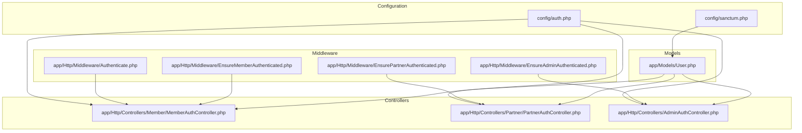
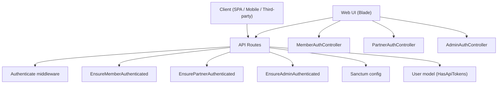
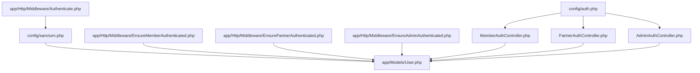

# API Authentication and Token Management

<cite>
**Referenced Files in This Document**
- [sanctum.php](file://config/sanctum.php)
- [auth.php](file://config/auth.php)
- [Authenticate.php](file://app/Http/Middleware/Authenticate.php)
- [EnsureMemberAuthenticated.php](file://app/Http/Middleware/EnsureMemberAuthenticated.php)
- [EnsurePartnerAuthenticated.php](file://app/Http/Middleware/EnsurePartnerAuthenticated.php)
- [EnsureAdminAuthenticated.php](file://app/Http/Middleware/EnsureAdminAuthenticated.php)
- [User.php](file://app/Models/User.php)
- [MemberAuthController.php](file://app/Http/Controllers/Member/MemberAuthController.php)
- [PartnerAuthController.php](file://app/Http/Controllers/Partner/PartnerAuthController.php)
- [AdminAuthController.php](file://app/Http/Controllers/AdminAuthController.php)
</cite>

## Table of Contents
1. [Introduction](#introduction)
2. [Project Structure](#project-structure)
3. [Core Components](#core-components)
4. [Architecture Overview](#architecture-overview)
5. [Detailed Component Analysis](#detailed-component-analysis)
6. [Dependency Analysis](#dependency-analysis)
7. [Performance Considerations](#performance-considerations)
8. [Troubleshooting Guide](#troubleshooting-guide)
9. [Conclusion](#conclusion)
10. [Appendices](#appendices)

## Introduction
This document explains KatalogThrift’s API authentication system built on Laravel Sanctum. It covers personal access token generation, token lifecycle, API endpoint protection, and integration patterns for mobile clients, SPAs, and third-party integrations. It also documents token scopes, expiration behavior, rate limiting, token revocation, and security best practices. Practical examples are provided via controller and middleware references, along with guidance for frontend integration, CORS configuration, and debugging authentication issues.

## Project Structure
Key authentication-related files and their roles:
- Sanctum configuration controls stateful domains, guards, expiration, token prefix, and middleware hooks.
- Authentication guards and providers define session-based authentication for web, member, and partner contexts.
- Middleware enforces authentication and role checks for members, partners, and admins.
- The User model integrates Sanctum’s token capabilities.
- Authentication controllers manage login/logout flows for member, partner, and admin contexts.

**Diagram sources**
- [sanctum.php:1-84](file://config/sanctum.php#L1-L84)
- [auth.php:1-120](file://config/auth.php#L1-L120)
- [Authenticate.php:1-18](file://app/Http/Middleware/Authenticate.php#L1-L18)
- [EnsureMemberAuthenticated.php:1-21](file://app/Http/Middleware/EnsureMemberAuthenticated.php#L1-L21)
- [EnsurePartnerAuthenticated.php:1-28](file://app/Http/Middleware/EnsurePartnerAuthenticated.php#L1-L28)
- [EnsureAdminAuthenticated.php:1-25](file://app/Http/Middleware/EnsureAdminAuthenticated.php#L1-L25)
- [User.php:1-131](file://app/Models/User.php#L1-L131)
- [MemberAuthController.php:1-129](file://app/Http/Controllers/Member/MemberAuthController.php#L1-L129)
- [PartnerAuthController.php:1-60](file://app/Http/Controllers/Partner/PartnerAuthController.php#L1-L60)
- [AdminAuthController.php:1-54](file://app/Http/Controllers/AdminAuthController.php#L1-L54)

**Section sources**
- [sanctum.php:1-84](file://config/sanctum.php#L1-L84)
- [auth.php:1-120](file://config/auth.php#L1-L120)
- [Authenticate.php:1-18](file://app/Http/Middleware/Authenticate.php#L1-L18)
- [EnsureMemberAuthenticated.php:1-21](file://app/Http/Middleware/EnsureMemberAuthenticated.php#L1-L21)
- [EnsurePartnerAuthenticated.php:1-28](file://app/Http/Middleware/EnsurePartnerAuthenticated.php#L1-L28)
- [EnsureAdminAuthenticated.php:1-25](file://app/Http/Middleware/EnsureAdminAuthenticated.php#L1-L25)
- [User.php:1-131](file://app/Models/User.php#L1-L131)
- [MemberAuthController.php:1-129](file://app/Http/Controllers/Member/MemberAuthController.php#L1-L129)
- [PartnerAuthController.php:1-60](file://app/Http/Controllers/Partner/PartnerAuthController.php#L1-L60)
- [AdminAuthController.php:1-54](file://app/Http/Controllers/AdminAuthController.php#L1-L54)

## Core Components
- Sanctum configuration
  - Stateful domains define trusted origins for cookie-based session authentication.
  - Guard selection determines which guards are consulted before falling back to bearer tokens.
  - Expiration is configured to be indefinite, allowing long-lived tokens unless overridden per-token.
  - Token prefix supports secret scanning prevention.
  - Middleware hooks enable session authentication, cookie encryption, and CSRF verification for SPA flows.

- Authentication guards and providers
  - Session-based guards for web, member, and partner contexts.
  - Eloquent provider for the User model.

- User model integration
  - The User model uses Sanctum’s HasApiTokens trait to support personal access tokens.

- Middleware enforcement
  - Global Authenticate middleware redirects unauthenticated requests appropriately.
  - Role-specific middleware ensures member/partner/admin contexts are properly validated.

- Authentication controllers
  - Member, partner, and admin controllers implement login/logout flows and integrate with respective guards.

**Section sources**
- [sanctum.php:18-81](file://config/sanctum.php#L18-L81)
- [auth.php:38-76](file://config/auth.php#L38-L76)
- [User.php:8](file://app/Models/User.php#L8)
- [Authenticate.php:13-16](file://app/Http/Middleware/Authenticate.php#L13-L16)
- [EnsureMemberAuthenticated.php:11-19](file://app/Http/Middleware/EnsureMemberAuthenticated.php#L11-L19)
- [EnsurePartnerAuthenticated.php:11-26](file://app/Http/Middleware/EnsurePartnerAuthenticated.php#L11-L26)
- [EnsureAdminAuthenticated.php:16-23](file://app/Http/Middleware/EnsureAdminAuthenticated.php#L16-L23)
- [MemberAuthController.php:23-36](file://app/Http/Controllers/Member/MemberAuthController.php#L23-L36)
- [PartnerAuthController.php:19-50](file://app/Http/Controllers/Partner/PartnerAuthController.php#L19-L50)
- [AdminAuthController.php:20-43](file://app/Http/Controllers/AdminAuthController.php#L20-L43)

## Architecture Overview
The authentication architecture combines session-based flows for web and role-specific guards with Sanctum’s personal access tokens for API clients.

**Diagram sources**
- [sanctum.php:18-81](file://config/sanctum.php#L18-L81)
- [User.php:8](file://app/Models/User.php#L8)
- [Authenticate.php:13-16](file://app/Http/Middleware/Authenticate.php#L13-L16)
- [EnsureMemberAuthenticated.php:11-19](file://app/Http/Middleware/EnsureMemberAuthenticated.php#L11-L19)
- [EnsurePartnerAuthenticated.php:11-26](file://app/Http/Middleware/EnsurePartnerAuthenticated.php#L11-L26)
- [EnsureAdminAuthenticated.php:16-23](file://app/Http/Middleware/EnsureAdminAuthenticated.php#L16-L23)
- [MemberAuthController.php:23-36](file://app/Http/Controllers/Member/MemberAuthController.php#L23-L36)
- [PartnerAuthController.php:19-50](file://app/Http/Controllers/Partner/PartnerAuthController.php#L19-L50)
- [AdminAuthController.php:20-43](file://app/Http/Controllers/AdminAuthController.php#L20-L43)

## Detailed Component Analysis

### Personal Access Tokens and Token Generation
- Token capability
  - The User model includes Sanctum’s HasApiTokens trait, enabling personal access token creation and management.

- Token creation pattern
  - Use the model’s token creation method to issue tokens with a name and optional abilities. This is the standard pattern for personal access tokens in Sanctum.

- Token lifecycle
  - Tokens are stored in the personal_access_tokens table and can be revoked or expired as needed.

- Practical example references
  - Token creation in controllers: see the token creation method on the User model.
  - Token usage in API requests: clients include Authorization header with Bearer token.

**Section sources**
- [User.php:8](file://app/Models/User.php#L8)

### Token Scopes and Abilities
- Abilities
  - Sanctum supports scoping tokens with abilities. By default, tokens are created with broad permissions, but you can restrict them to specific abilities during creation.

- Practical example references
  - Token creation with abilities: refer to the token creation method on the User model.

**Section sources**
- [User.php:8](file://app/Models/User.php#L8)

### Expiration Handling
- Global expiration
  - Sanctum configuration sets expiration to indefinite, meaning tokens do not expire automatically unless overridden per-token.

- Per-token expiration
  - Tokens can be created with explicit expiration timestamps to enforce shorter lifespans.

- Practical example references
  - Token creation with expiration: refer to the token creation method on the User model.

**Section sources**
- [sanctum.php:49](file://config/sanctum.php#L49)
- [User.php:8](file://app/Models/User.php#L8)

### Refresh Token Mechanisms
- Sanctum does not provide built-in refresh tokens.
- Recommended approach
  - Issue new tokens upon successful authentication and revoke old ones to achieve similar behavior.
  - Alternatively, implement short-lived access tokens with a separate mechanism for issuing new tokens.

**Section sources**
- [sanctum.php:49](file://config/sanctum.php#L49)
- [User.php:8](file://app/Models/User.php#L8)

### API Endpoint Protection
- Middleware enforcement
  - Apply global authentication middleware to protect API routes.
  - Use role-specific middleware to enforce member, partner, or admin access.

- Practical example references
  - Global authentication middleware: [Authenticate.php:13-16](file://app/Http/Middleware/Authenticate.php#L13-L16)
  - Member protection: [EnsureMemberAuthenticated.php:11-19](file://app/Http/Middleware/EnsureMemberAuthenticated.php#L11-L19)
  - Partner protection: [EnsurePartnerAuthenticated.php:11-26](file://app/Http/Middleware/EnsurePartnerAuthenticated.php#L11-L26)
  - Admin protection: [EnsureAdminAuthenticated.php:16-23](file://app/Http/Middleware/EnsureAdminAuthenticated.php#L16-L23)

**Section sources**
- [Authenticate.php:13-16](file://app/Http/Middleware/Authenticate.php#L13-L16)
- [EnsureMemberAuthenticated.php:11-19](file://app/Http/Middleware/EnsureMemberAuthenticated.php#L11-L19)
- [EnsurePartnerAuthenticated.php:11-26](file://app/Http/Middleware/EnsurePartnerAuthenticated.php#L11-L26)
- [EnsureAdminAuthenticated.php:16-23](file://app/Http/Middleware/EnsureAdminAuthenticated.php#L16-L23)

### Token-Based Authentication for Clients
- Mobile clients
  - Authenticate via login endpoints and store the returned token securely.
  - Include Authorization: Bearer <token> in subsequent API requests.

- SPA integration
  - Sanctum’s stateful domain configuration enables cookie-based session authentication for SPAs hosted on trusted domains.
  - For token-based APIs, use personal access tokens similarly to mobile clients.

- Third-party API access
  - Issue scoped personal access tokens with minimal required abilities.
  - Enforce revocation and rotation policies.

**Section sources**
- [sanctum.php:18-22](file://config/sanctum.php#L18-L22)
- [User.php:8](file://app/Models/User.php#L8)

### Token Revocation
- Revoke tokens
  - Remove tokens from the personal_access_tokens table or use the model’s token deletion methods.

- Practical example references
  - Token deletion: refer to the token relationship on the User model.

**Section sources**
- [User.php:8](file://app/Models/User.php#L8)

### API Rate Limiting
- Implementation
  - Use Laravel’s built-in rate limiting middleware to protect API endpoints.
  - Configure limits per route or globally.

- Practical example references
  - Apply rate limiting middleware to API routes as needed.

**Section sources**
- [sanctum.php:36](file://config/sanctum.php#L36)

### Token Storage Security
- Token prefix
  - Sanctum supports a configurable token prefix to help prevent accidental commits of tokens.

- Practical example references
  - Token prefix configuration: [sanctum.php](file://config/sanctum.php#L64)

**Section sources**
- [sanctum.php:64](file://config/sanctum.php#L64)

### CORS Configuration for API Access
- Stateful domains
  - Sanctum’s stateful domain list includes common development ports and the current application URL with port.

- Practical example references
  - Stateful domains configuration: [sanctum.php:18-22](file://config/sanctum.php#L18-L22)

**Section sources**
- [sanctum.php:18-22](file://config/sanctum.php#L18-L22)

### Debugging Authentication Issues
- Common diagnostics
  - Verify Sanctum guard configuration and stateful domains.
  - Confirm middleware chain and redirection behavior for unauthenticated requests.
  - Check role-specific middleware logic for member/partner/admin contexts.

- Practical example references
  - Global redirect behavior: [Authenticate.php:13-16](file://app/Http/Middleware/Authenticate.php#L13-L16)
  - Member guard checks: [EnsureMemberAuthenticated.php:11-19](file://app/Http/Middleware/EnsureMemberAuthenticated.php#L11-L19)
  - Partner guard checks: [EnsurePartnerAuthenticated.php:11-26](file://app/Http/Middleware/EnsurePartnerAuthenticated.php#L11-L26)
  - Admin session checks: [EnsureAdminAuthenticated.php:16-23](file://app/Http/Middleware/EnsureAdminAuthenticated.php#L16-L23)

**Section sources**
- [Authenticate.php:13-16](file://app/Http/Middleware/Authenticate.php#L13-L16)
- [EnsureMemberAuthenticated.php:11-19](file://app/Http/Middleware/EnsureMemberAuthenticated.php#L11-L19)
- [EnsurePartnerAuthenticated.php:11-26](file://app/Http/Middleware/EnsurePartnerAuthenticated.php#L11-L26)
- [EnsureAdminAuthenticated.php:16-23](file://app/Http/Middleware/EnsureAdminAuthenticated.php#L16-L23)

### Integration Patterns
- Frontend applications
  - SPA: rely on Sanctum’s session cookies for stateful flows; for token-based APIs, use personal access tokens.
  - Trusted domains: ensure frontend origin is included in Sanctum’s stateful domains.

- Mobile app authentication
  - After login, store the token securely and attach it to all authenticated requests.

- Webhook authentication
  - Use signed requests or shared secrets; avoid relying solely on bearer tokens for server-to-server webhooks.

**Section sources**
- [sanctum.php:18-22](file://config/sanctum.php#L18-L22)
- [User.php:8](file://app/Models/User.php#L8)

## Dependency Analysis
The authentication system depends on Sanctum configuration, guards/providers, middleware, and the User model.

**Diagram sources**
- [sanctum.php:18-81](file://config/sanctum.php#L18-L81)
- [auth.php:38-76](file://config/auth.php#L38-L76)
- [Authenticate.php:13-16](file://app/Http/Middleware/Authenticate.php#L13-L16)
- [EnsureMemberAuthenticated.php:11-19](file://app/Http/Middleware/EnsureMemberAuthenticated.php#L11-L19)
- [EnsurePartnerAuthenticated.php:11-26](file://app/Http/Middleware/EnsurePartnerAuthenticated.php#L11-L26)
- [EnsureAdminAuthenticated.php:16-23](file://app/Http/Middleware/EnsureAdminAuthenticated.php#L16-L23)
- [User.php:8](file://app/Models/User.php#L8)
- [MemberAuthController.php:23-36](file://app/Http/Controllers/Member/MemberAuthController.php#L23-L36)
- [PartnerAuthController.php:19-50](file://app/Http/Controllers/Partner/PartnerAuthController.php#L19-L50)
- [AdminAuthController.php:20-43](file://app/Http/Controllers/AdminAuthController.php#L20-L43)

**Section sources**
- [sanctum.php:18-81](file://config/sanctum.php#L18-L81)
- [auth.php:38-76](file://config/auth.php#L38-L76)
- [Authenticate.php:13-16](file://app/Http/Middleware/Authenticate.php#L13-L16)
- [EnsureMemberAuthenticated.php:11-19](file://app/Http/Middleware/EnsureMemberAuthenticated.php#L11-L19)
- [EnsurePartnerAuthenticated.php:11-26](file://app/Http/Middleware/EnsurePartnerAuthenticated.php#L11-L26)
- [EnsureAdminAuthenticated.php:16-23](file://app/Http/Middleware/EnsureAdminAuthenticated.php#L16-L23)
- [User.php:8](file://app/Models/User.php#L8)
- [MemberAuthController.php:23-36](file://app/Http/Controllers/Member/MemberAuthController.php#L23-L36)
- [PartnerAuthController.php:19-50](file://app/Http/Controllers/Partner/PartnerAuthController.php#L19-L50)
- [AdminAuthController.php:20-43](file://app/Http/Controllers/AdminAuthController.php#L20-L43)

## Performance Considerations
- Token lookup overhead
  - Personal access tokens require database reads; cache token validation results where appropriate.
- Expiration strategy
  - Use short-lived tokens with refresh mechanisms to reduce long-term token maintenance.
- Middleware chain
  - Keep middleware chains lean; apply only necessary middleware per route group.

[No sources needed since this section provides general guidance]

## Troubleshooting Guide
- Unauthenticated responses
  - Verify global authentication middleware and redirection behavior.
  - Check role-specific middleware for member/partner/admin contexts.

- SPA session issues
  - Ensure frontend origin is included in Sanctum’s stateful domains.
  - Confirm CSRF and cookie encryption middleware are applied as configured.

- Token not recognized
  - Confirm token exists in the personal_access_tokens table and is not expired.
  - Verify client sends Authorization: Bearer <token> header.

- Practical example references
  - Redirect behavior: [Authenticate.php:13-16](file://app/Http/Middleware/Authenticate.php#L13-L16)
  - Member guard checks: [EnsureMemberAuthenticated.php:11-19](file://app/Http/Middleware/EnsureMemberAuthenticated.php#L11-L19)
  - Partner guard checks: [EnsurePartnerAuthenticated.php:11-26](file://app/Http/Middleware/EnsurePartnerAuthenticated.php#L11-L26)
  - Admin session checks: [EnsureAdminAuthenticated.php:16-23](file://app/Http/Middleware/EnsureAdminAuthenticated.php#L16-L23)

**Section sources**
- [Authenticate.php:13-16](file://app/Http/Middleware/Authenticate.php#L13-L16)
- [EnsureMemberAuthenticated.php:11-19](file://app/Http/Middleware/EnsureMemberAuthenticated.php#L11-L19)
- [EnsurePartnerAuthenticated.php:11-26](file://app/Http/Middleware/EnsurePartnerAuthenticated.php#L11-L26)
- [EnsureAdminAuthenticated.php:16-23](file://app/Http/Middleware/EnsureAdminAuthenticated.php#L16-L23)

## Conclusion
KatalogThrift’s authentication system leverages Sanctum for robust personal access token support and session-based flows for SPAs. By configuring stateful domains, guards, and middleware, the system protects API endpoints and supports diverse client types. Implementing proper token scopes, expiration, revocation, and rate limiting ensures secure and maintainable API access. Follow the provided references to implement token creation, validation, and protection across controllers and middleware.

[No sources needed since this section summarizes without analyzing specific files]

## Appendices
- Practical examples (by reference)
  - Token creation: [User.php](file://app/Models/User.php#L8)
  - Member login/logout: [MemberAuthController.php:23-71](file://app/Http/Controllers/Member/MemberAuthController.php#L23-L71)
  - Partner login/logout: [PartnerAuthController.php:19-58](file://app/Http/Controllers/Partner/PartnerAuthController.php#L19-L58)
  - Admin login/logout: [AdminAuthController.php:20-52](file://app/Http/Controllers/AdminAuthController.php#L20-L52)
  - Global authentication middleware: [Authenticate.php:13-16](file://app/Http/Middleware/Authenticate.php#L13-L16)
  - Member role middleware: [EnsureMemberAuthenticated.php:11-19](file://app/Http/Middleware/EnsureMemberAuthenticated.php#L11-L19)
  - Partner role middleware: [EnsurePartnerAuthenticated.php:11-26](file://app/Http/Middleware/EnsurePartnerAuthenticated.php#L11-L26)
  - Admin role middleware: [EnsureAdminAuthenticated.php:16-23](file://app/Http/Middleware/EnsureAdminAuthenticated.php#L16-L23)
  - Sanctum configuration: [sanctum.php:18-81](file://config/sanctum.php#L18-L81)
  - Guards and providers: [auth.php:38-76](file://config/auth.php#L38-L76)