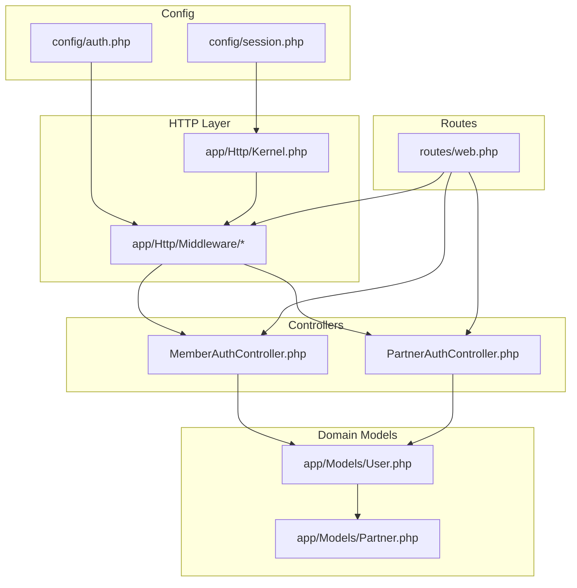
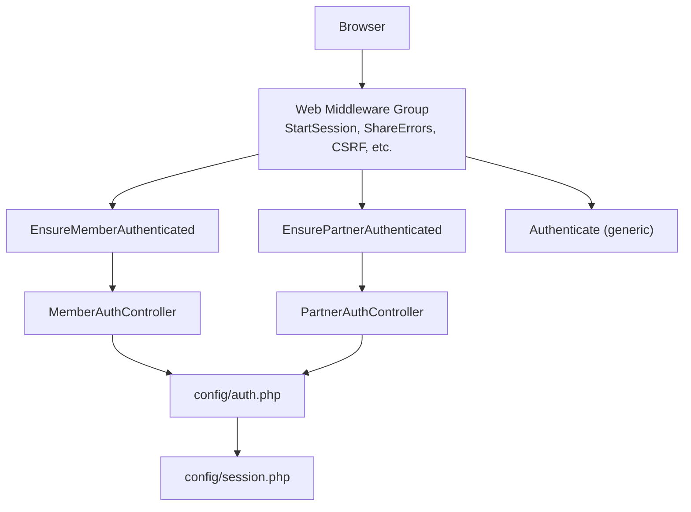
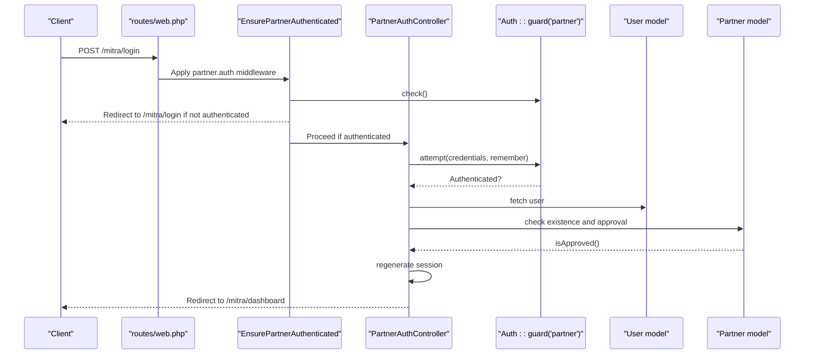
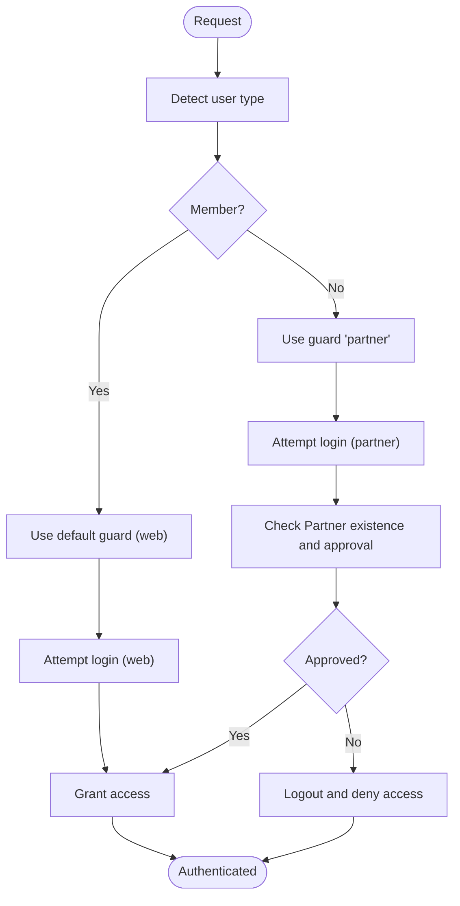
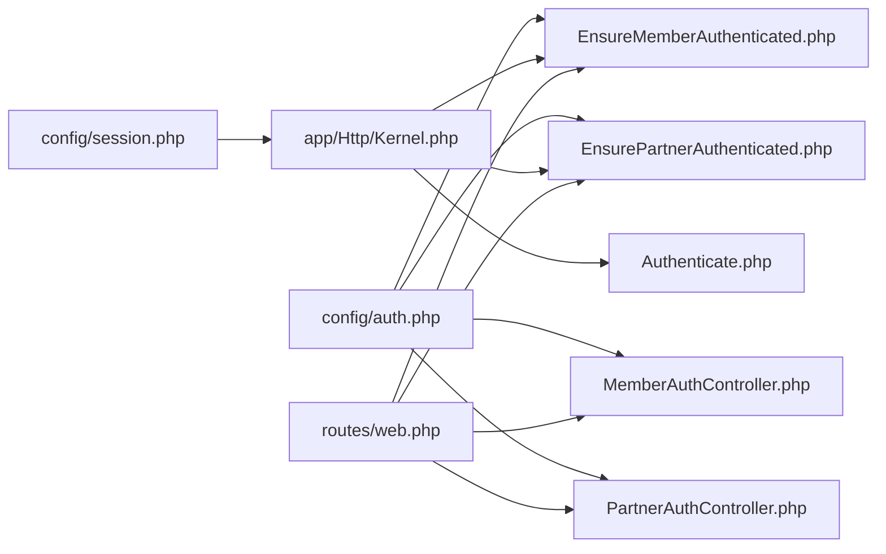

# Authentication Guards and Configuration

<cite>
**Referenced Files in This Document**
- [auth.php](file://config/auth.php)
- [session.php](file://config/session.php)
- [Kernel.php](file://app/Http/Kernel.php)
- [Authenticate.php](file://app/Http/Middleware/Authenticate.php)
- [EnsureMemberAuthenticated.php](file://app/Http/Middleware/EnsureMemberAuthenticated.php)
- [EnsurePartnerAuthenticated.php](file://app/Http/Middleware/EnsurePartnerAuthenticated.php)
- [AuthServiceProvider.php](file://app/Providers/AuthServiceProvider.php)
- [User.php](file://app/Models/User.php)
- [Partner.php](file://app/Models/Partner.php)
- [MemberAuthController.php](file://app/Http/Controllers/Member/MemberAuthController.php)
- [PartnerAuthController.php](file://app/Http/Controllers/Partner/PartnerAuthController.php)
- [web.php](file://routes/web.php)
</cite>

## Table of Contents
1. [Introduction](#introduction)
2. [Project Structure](#project-structure)
3. [Core Components](#core-components)
4. [Architecture Overview](#architecture-overview)
5. [Detailed Component Analysis](#detailed-component-analysis)
6. [Dependency Analysis](#dependency-analysis)
7. [Performance Considerations](#performance-considerations)
8. [Troubleshooting Guide](#troubleshooting-guide)
9. [Conclusion](#conclusion)

## Introduction
This document explains the authentication guards configuration for KatalogThrift’s multi-user system. It focuses on how the application sets up two authentication guards—web (for Members) and partner (for Partners)—both using the session driver with a shared Eloquent user provider. It also documents guard switching mechanisms, session and cookie configuration, provider setup, and practical usage in controllers and middleware. Finally, it covers route protection and how the system manages authentication state across different user types.

## Project Structure
The authentication configuration spans several key areas:
- Guard definitions and provider configuration in the authentication config
- Session and cookie configuration
- Middleware for protecting routes per user type
- Controllers implementing login/logout flows for each guard
- Routes grouped by user context and protected by dedicated middleware

**Diagram sources**
- [auth.php:1-120](file://config/auth.php#L1-L120)
- [session.php:1-215](file://config/session.php#L1-L215)
- [Kernel.php:1-72](file://app/Http/Kernel.php#L1-L72)
- [EnsureMemberAuthenticated.php:1-21](file://app/Http/Middleware/EnsureMemberAuthenticated.php#L1-L21)
- [EnsurePartnerAuthenticated.php:1-28](file://app/Http/Middleware/EnsurePartnerAuthenticated.php#L1-L28)
- [User.php:1-131](file://app/Models/User.php#L1-L131)
- [Partner.php:1-123](file://app/Models/Partner.php#L1-L123)
- [MemberAuthController.php:1-129](file://app/Http/Controllers/Member/MemberAuthController.php#L1-L129)
- [PartnerAuthController.php:1-60](file://app/Http/Controllers/Partner/PartnerAuthController.php#L1-L60)
- [web.php:1-240](file://routes/web.php#L1-L240)

**Section sources**
- [auth.php:1-120](file://config/auth.php#L1-L120)
- [session.php:1-215](file://config/session.php#L1-L215)
- [Kernel.php:1-72](file://app/Http/Kernel.php#L1-L72)
- [web.php:1-240](file://routes/web.php#L1-L240)

## Core Components
- Authentication defaults: The default guard is web, and password resets use the users provider.
- Guards:
  - web: session driver with users provider (Member context)
  - partner: session driver with users provider (Partner context)
- Provider: Eloquent driver pointing to the User model
- Middleware aliases:
  - member.auth: ensures Member authentication
  - partner.auth: ensures Partner authentication and approval
  - auth: generic authentication redirection for unauthenticated requests
- Controllers:
  - MemberAuthController: login/register/logout flows using the default guard
  - PartnerAuthController: login/logout flows using the partner guard and Partner approval checks

Practical implications:
- Both guards share the same provider and model, enabling a unified user table while allowing distinct authentication logic per role.
- Session isolation is handled by the session driver and cookie configuration; each guard authenticates against the same session store by default.

**Section sources**
- [auth.php:16-47](file://config/auth.php#L16-L47)
- [Kernel.php:55-70](file://app/Http/Kernel.php#L55-L70)
- [MemberAuthController.php:17-71](file://app/Http/Controllers/Member/MemberAuthController.php#L17-L71)
- [PartnerAuthController.php:13-58](file://app/Http/Controllers/Partner/PartnerAuthController.php#L13-L58)

## Architecture Overview
The authentication architecture separates concerns by guard while sharing the underlying session and user provider. The middleware enforces role-specific policies, and controllers implement guard-specific login/logout flows.

**Diagram sources**
- [Kernel.php:31-46](file://app/Http/Kernel.php#L31-L46)
- [EnsureMemberAuthenticated.php:11-19](file://app/Http/Middleware/EnsureMemberAuthenticated.php#L11-L19)
- [EnsurePartnerAuthenticated.php:11-26](file://app/Http/Middleware/EnsurePartnerAuthenticated.php#L11-L26)
- [Authenticate.php:13-16](file://app/Http/Middleware/Authenticate.php#L13-L16)
- [MemberAuthController.php:23-36](file://app/Http/Controllers/Member/MemberAuthController.php#L23-L36)
- [PartnerAuthController.php:19-50](file://app/Http/Controllers/Partner/PartnerAuthController.php#L19-L50)
- [auth.php:38-47](file://config/auth.php#L38-L47)
- [session.php:21-214](file://config/session.php#L21-L214)

## Detailed Component Analysis

### Authentication Guards and Provider Setup
- Guards:
  - web: session driver, users provider
  - partner: session driver, users provider
- Provider:
  - Eloquent driver with App\Models\User
- Defaults:
  - Default guard: web
  - Passwords provider: users

These settings enable:
- Shared user persistence across both guards
- Distinct authentication flows per guard via middleware and controllers

**Section sources**
- [auth.php:16-76](file://config/auth.php#L16-L76)
- [AuthServiceProvider.php:1-27](file://app/Providers/AuthServiceProvider.php#L1-L27)

### Session and Cookie Configuration
- Driver: file by default; configurable via environment
- Lifetime: 120 minutes by default
- Cookie name: derived from APP_NAME with a slugified suffix
- Domain/path/security attributes: configurable via environment
- SameSite: lax by default

Implications:
- Sessions are stored per guard by default because both guards use the session driver and the same provider. There is no explicit guard-specific session store configured.
- Cookie naming and SameSite behavior apply uniformly to both guards unless overridden at runtime.

**Section sources**
- [session.php:21-214](file://config/session.php#L21-L214)

### Guard-Specific Middleware and Route Protection
- member.auth:
  - Checks auth()->check() for Member context
  - Redirects to member.login with intended URL when unauthenticated
- partner.auth:
  - Checks auth('partner')->check() for Partner context
  - Validates that the associated Partner exists and is approved
  - Logs out and redirects with errors if not approved

Middleware aliases:
- member.auth → EnsureMemberAuthenticated
- partner.auth → EnsurePartnerAuthenticated
- auth → Authenticate (generic)

Usage in routes:
- Member-protected routes are grouped under member.auth
- Partner-protected routes are grouped under partner.auth

**Section sources**
- [EnsureMemberAuthenticated.php:11-19](file://app/Http/Middleware/EnsureMemberAuthenticated.php#L11-L19)
- [EnsurePartnerAuthenticated.php:11-26](file://app/Http/Middleware/EnsurePartnerAuthenticated.php#L11-L26)
- [Kernel.php:55-70](file://app/Http/Kernel.php#L55-L70)
- [web.php:89-116](file://routes/web.php#L89-L116)
- [web.php:124-166](file://routes/web.php#L124-L166)

### Practical Guard Usage in Controllers
- MemberAuthController (web guard):
  - Uses Auth::attempt and Auth::login implicitly via auth()->check() and auth()->logout()
  - Regenerates session after successful login
- PartnerAuthController (partner guard):
  - Uses Auth::guard('partner')->attempt and validates Partner approval
  - Regenerates session after successful login

**Diagram sources**
- [web.php:119-122](file://routes/web.php#L119-L122)
- [EnsurePartnerAuthenticated.php:11-26](file://app/Http/Middleware/EnsurePartnerAuthenticated.php#L11-L26)
- [PartnerAuthController.php:19-50](file://app/Http/Controllers/Partner/PartnerAuthController.php#L19-L50)

**Section sources**
- [MemberAuthController.php:23-71](file://app/Http/Controllers/Member/MemberAuthController.php#L23-L71)
- [PartnerAuthController.php:19-58](file://app/Http/Controllers/Partner/PartnerAuthController.php#L19-L58)

### Guard Switching Mechanism Between Member and Partner Roles
- Member context:
  - Uses default guard (web) via auth() helpers
  - Login flow: Auth::attempt with default guard
- Partner context:
  - Explicitly selects guard via auth('partner') and Auth::guard('partner')
  - Additional Partner approval checks before granting access

Switching is achieved by passing the guard name to the facade and helper functions. Because both guards use the same provider and session driver, switching does not require separate session stores.

**Diagram sources**
- [MemberAuthController.php:23-36](file://app/Http/Controllers/Member/MemberAuthController.php#L23-L36)
- [PartnerAuthController.php:26-46](file://app/Http/Controllers/Partner/PartnerAuthController.php#L26-L46)
- [EnsurePartnerAuthenticated.php:13-23](file://app/Http/Middleware/EnsurePartnerAuthenticated.php#L13-L23)

**Section sources**
- [MemberAuthController.php:19-36](file://app/Http/Controllers/Member/MemberAuthController.php#L19-L36)
- [PartnerAuthController.php:26-46](file://app/Http/Controllers/Partner/PartnerAuthController.php#L26-L46)
- [EnsurePartnerAuthenticated.php:13-23](file://app/Http/Middleware/EnsurePartnerAuthenticated.php#L13-L23)

### Authentication State Management Across User Types
- Both guards rely on the session driver and the same provider, ensuring consistent session handling.
- Cookie configuration applies globally; there is no guard-specific cookie override in the provided configuration.
- Logout flows invalidate the session and regenerate the CSRF token for both guards.

**Section sources**
- [auth.php:38-47](file://config/auth.php#L38-L47)
- [session.php:129-214](file://config/session.php#L129-L214)
- [MemberAuthController.php:65-71](file://app/Http/Controllers/Member/MemberAuthController.php#L65-L71)
- [PartnerAuthController.php:52-58](file://app/Http/Controllers/Partner/PartnerAuthController.php#L52-L58)

### User Provider and Role Modeling
- Provider: Eloquent App\Models\User
- User model:
  - Belongs to Partner via partner_id
  - Provides role checks (isAdmin, isPartner, isMember)
  - Has a relationship to Partner
- Partner model:
  - Validates approval via status field and helper method

This design allows:
- Single source of truth for credentials and roles
- Guard-specific logic (e.g., Partner approval) without duplicating user records

**Section sources**
- [auth.php:66-70](file://config/auth.php#L66-L70)
- [User.php:28-31](file://app/Models/User.php#L28-L31)
- [User.php:68-81](file://app/Models/User.php#L68-L81)
- [Partner.php:72-75](file://app/Models/Partner.php#L72-L75)

## Dependency Analysis
The following diagram shows how the configuration, middleware, controllers, and routes depend on each other to enforce authentication per guard.

**Diagram sources**
- [auth.php:16-76](file://config/auth.php#L16-L76)
- [session.php:21-214](file://config/session.php#L21-L214)
- [Kernel.php:31-70](file://app/Http/Kernel.php#L31-L70)
- [EnsureMemberAuthenticated.php:11-19](file://app/Http/Middleware/EnsureMemberAuthenticated.php#L11-L19)
- [EnsurePartnerAuthenticated.php:11-26](file://app/Http/Middleware/EnsurePartnerAuthenticated.php#L11-L26)
- [Authenticate.php:13-16](file://app/Http/Middleware/Authenticate.php#L13-L16)
- [MemberAuthController.php:23-36](file://app/Http/Controllers/Member/MemberAuthController.php#L23-L36)
- [PartnerAuthController.php:19-50](file://app/Http/Controllers/Partner/PartnerAuthController.php#L19-L50)
- [web.php:89-116](file://routes/web.php#L89-L116)
- [web.php:124-166](file://routes/web.php#L124-L166)

**Section sources**
- [auth.php:16-76](file://config/auth.php#L16-L76)
- [Kernel.php:31-70](file://app/Http/Kernel.php#L31-L70)
- [web.php:89-166](file://routes/web.php#L89-L166)

## Performance Considerations
- Session driver choice: Using file sessions is simple but may not scale under heavy load. Consider Redis or database sessions for production.
- Session lifetime: 120 minutes is reasonable; adjust based on security and UX needs.
- Cookie SameSite: lax is safe and compatible; avoid strict unless cross-site requests are unnecessary.
- Provider overhead: Eloquent provider is straightforward; ensure indexes exist on email and remember tokens for efficient lookups.

## Troubleshooting Guide
Common issues and resolutions:
- Mixed guard usage:
  - Symptom: Unexpected logout or wrong user context
  - Resolution: Ensure controllers explicitly select the intended guard (e.g., auth('partner')) and that middleware aligns with the route group.
- Partner not approved:
  - Symptom: Redirect to login with approval message
  - Resolution: Confirm Partner.status is 'approved'; otherwise, the middleware will log out and block access.
- Session not persisting:
  - Symptom: Users logged out unexpectedly
  - Resolution: Verify SESSION_DRIVER and SESSION_LIFETIME; confirm cookie SameSite and domain settings are appropriate for deployment.
- Incorrect redirect on auth failure:
  - Symptom: JSON requests redirect to login
  - Resolution: The generic Authenticate middleware returns null for JSON requests; ensure client-side handling for unauthenticated AJAX calls.

**Section sources**
- [EnsurePartnerAuthenticated.php:13-23](file://app/Http/Middleware/EnsurePartnerAuthenticated.php#L13-L23)
- [Authenticate.php:13-16](file://app/Http/Middleware/Authenticate.php#L13-L16)
- [session.php:34-199](file://config/session.php#L34-L199)

## Conclusion
KatalogThrift employs a clean separation of authentication contexts using two session-backed guards with a shared Eloquent provider. The web guard serves Members, while the partner guard serves Partners with additional approval checks. Middleware and controllers enforce guard-specific policies, and routes group protected endpoints accordingly. Session and cookie configuration are centralized, applying uniformly across both guards. This design supports multiple authentication contexts efficiently while maintaining simplicity and scalability.