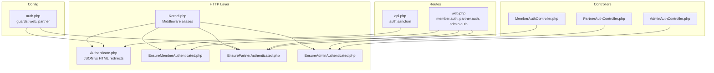
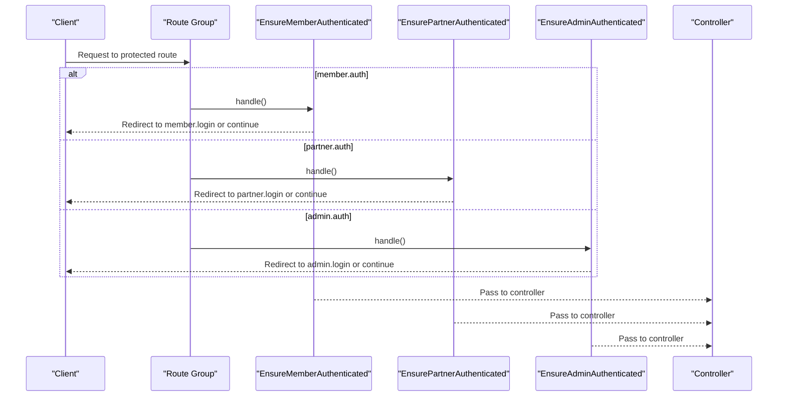
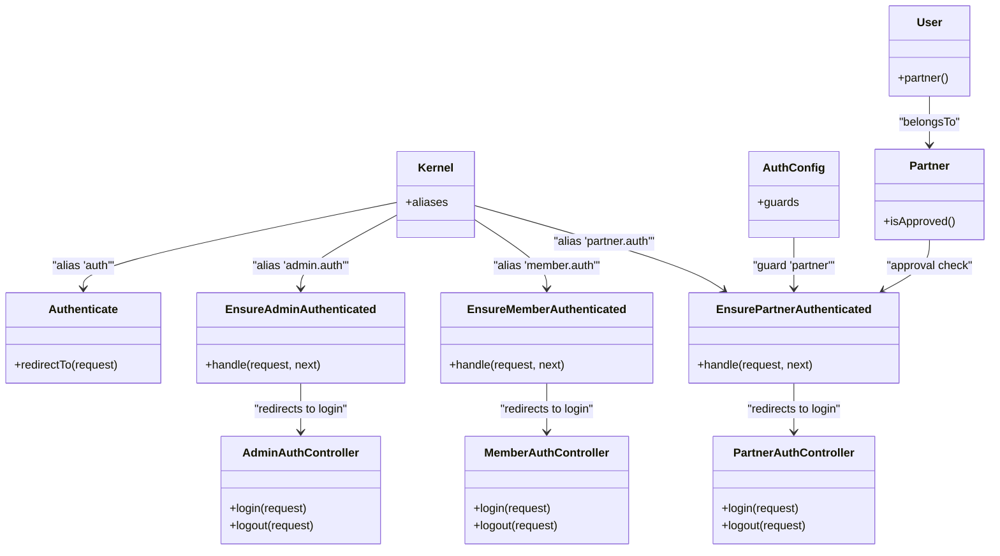

# Route Protection Middleware

<cite>
**Referenced Files in This Document**
- [Authenticate.php](file://app/Http/Middleware/Authenticate.php)
- [EnsureMemberAuthenticated.php](file://app/Http/Middleware/EnsureMemberAuthenticated.php)
- [EnsurePartnerAuthenticated.php](file://app/Http/Middleware/EnsurePartnerAuthenticated.php)
- [EnsureAdminAuthenticated.php](file://app/Http/Middleware/EnsureAdminAuthenticated.php)
- [Kernel.php](file://app/Http/Kernel.php)
- [auth.php](file://config/auth.php)
- [web.php](file://routes/web.php)
- [api.php](file://routes/api.php)
- [MemberAuthController.php](file://app/Http/Controllers/Member/MemberAuthController.php)
- [PartnerAuthController.php](file://app/Http/Controllers/Partner/PartnerAuthController.php)
- [AdminAuthController.php](file://app/Http/Controllers/AdminAuthController.php)
- [User.php](file://app/Models/User.php)
- [Partner.php](file://app/Models/Partner.php)
</cite>

## Table of Contents
1. [Introduction](#introduction)
2. [Project Structure](#project-structure)
3. [Core Components](#core-components)
4. [Architecture Overview](#architecture-overview)
5. [Detailed Component Analysis](#detailed-component-analysis)
6. [Dependency Analysis](#dependency-analysis)
7. [Performance Considerations](#performance-considerations)
8. [Troubleshooting Guide](#troubleshooting-guide)
9. [Conclusion](#conclusion)

## Introduction
This document explains KatalogThrift’s role-based middleware protection system. It covers the Authenticate middleware for general authentication, EnsureMemberAuthenticated for member-only routes, EnsurePartnerAuthenticated for partner-specific routes, and EnsureAdminAuthenticated for administrative access. It also documents middleware execution order, guard selection logic, redirect handling for unauthorized users, route model binding with authentication, middleware parameter passing, and guidance for creating custom middleware. Practical examples demonstrate applying middleware to routes, handling authentication failures, and implementing conditional access control. Finally, it addresses performance considerations, caching strategies, and debugging authentication middleware issues.

## Project Structure
KatalogThrift organizes HTTP middleware under app/Http/Middleware and registers aliases in the HTTP kernel. Authentication guards are configured in config/auth.php, and routes are grouped by role in routes/web.php. API routes use Sanctum authentication.

**Diagram sources**
- [Kernel.php:55-70](file://app/Http/Kernel.php#L55-L70)
- [Authenticate.php:8-17](file://app/Http/Middleware/Authenticate.php#L8-L17)
- [EnsureMemberAuthenticated.php:9-21](file://app/Http/Middleware/EnsureMemberAuthenticated.php#L9-L21)
- [EnsurePartnerAuthenticated.php:9-28](file://app/Http/Middleware/EnsurePartnerAuthenticated.php#L9-L28)
- [EnsureAdminAuthenticated.php:9-25](file://app/Http/Middleware/EnsureAdminAuthenticated.php#L9-L25)
- [auth.php:38-47](file://config/auth.php#L38-L47)
- [web.php:89-167](file://routes/web.php#L89-L167)
- [api.php:17-19](file://routes/api.php#L17-L19)
- [MemberAuthController.php:23-36](file://app/Http/Controllers/Member/MemberAuthController.php#L23-L36)
- [PartnerAuthController.php:19-47](file://app/Http/Controllers/Partner/PartnerAuthController.php#L19-L47)
- [AdminAuthController.php:20-43](file://app/Http/Controllers/AdminAuthController.php#L20-L43)

**Section sources**
- [Kernel.php:55-70](file://app/Http/Kernel.php#L55-L70)
- [auth.php:38-47](file://config/auth.php#L38-L47)
- [web.php:89-167](file://routes/web.php#L89-L167)
- [api.php:17-19](file://routes/api.php#L17-L19)

## Core Components
- Authenticate middleware: Extends the framework’s base authentication middleware and customizes redirect behavior for HTML requests versus JSON/API requests.
- EnsureMemberAuthenticated: Enforces member authentication and checks for intended URLs.
- EnsurePartnerAuthenticated: Validates partner authentication, ensures the associated partner record exists and is approved, and handles unapproved accounts.
- EnsureAdminAuthenticated: Uses a session flag to enforce admin access.

Key behaviors:
- Redirect handling: Member and partner middleware redirect to role-specific login routes; admin middleware uses a session flag.
- Guard selection: Partner guard is explicitly selected; member guard uses the default web guard; admin uses session-based logic.
- Route grouping: Routes are grouped by role and protected by respective middleware aliases.

**Section sources**
- [Authenticate.php:8-17](file://app/Http/Middleware/Authenticate.php#L8-L17)
- [EnsureMemberAuthenticated.php:9-21](file://app/Http/Middleware/EnsureMemberAuthenticated.php#L9-L21)
- [EnsurePartnerAuthenticated.php:9-28](file://app/Http/Middleware/EnsurePartnerAuthenticated.php#L9-L28)
- [EnsureAdminAuthenticated.php:9-25](file://app/Http/Middleware/EnsureAdminAuthenticated.php#L9-L25)
- [web.php:89-167](file://routes/web.php#L89-L167)

## Architecture Overview
The middleware stack applies per-route group. Member-only routes use member.auth, partner-only routes use partner.auth, and admin routes use admin.auth. The kernel registers aliases for convenient assignment.

**Diagram sources**
- [web.php:89-167](file://routes/web.php#L89-L167)
- [EnsureMemberAuthenticated.php:11-19](file://app/Http/Middleware/EnsureMemberAuthenticated.php#L11-L19)
- [EnsurePartnerAuthenticated.php:11-25](file://app/Http/Middleware/EnsurePartnerAuthenticated.php#L11-L25)
- [EnsureAdminAuthenticated.php:16-22](file://app/Http/Middleware/EnsureAdminAuthenticated.php#L16-L22)

## Detailed Component Analysis

### Authenticate Middleware
Purpose:
- Centralized authentication for general routes.
- Redirects to HTML login page for non-JSON requests; allows JSON APIs to return errors without HTML redirect.

Behavior highlights:
- Uses the framework’s default guard selection.
- Returns null for JSON requests to avoid HTML redirection.

Practical usage:
- Applied via alias 'auth' in route groups or individually.

**Section sources**
- [Authenticate.php:8-17](file://app/Http/Middleware/Authenticate.php#L8-L17)
- [Kernel.php:56](file://app/Http/Kernel.php#L56)
- [api.php:17-19](file://routes/api.php#L17-L19)

### EnsureMemberAuthenticated
Purpose:
- Protects member-only actions (e.g., reviews, wishlists, saved outfits, notifications, profile, badges).

Behavior highlights:
- Checks default guard (web) authentication.
- Redirects to member.login with the intended URL preserved.
- Does not enforce role membership; relies on login flow to establish identity.

Route usage:
- Wraps member-only routes in a group using 'member.auth'.

**Section sources**
- [EnsureMemberAuthenticated.php:9-21](file://app/Http/Middleware/EnsureMemberAuthenticated.php#L9-L21)
- [web.php:89-116](file://routes/web.php#L89-L116)

### EnsurePartnerAuthenticated
Purpose:
- Protects partner-only actions (e.g., product management, analytics, dashboard).

Behavior highlights:
- Explicitly uses the 'partner' guard.
- Ensures the authenticated user has an associated Partner record and that the partner is approved.
- Logs out and redirects with an appropriate error message if the account is not approved.

Guard and model relationship:
- Uses config/auth.php guards['partner'] with provider 'users'.
- Relies on User->partner relationship and Partner->isApproved().

**Section sources**
- [EnsurePartnerAuthenticated.php:9-28](file://app/Http/Middleware/EnsurePartnerAuthenticated.php#L9-L28)
- [auth.php:43-46](file://config/auth.php#L43-L46)
- [web.php:124-166](file://routes/web.php#L124-L166)
- [User.php:28-31](file://app/Models/User.php#L28-L31)
- [Partner.php:72-75](file://app/Models/Partner.php#L72-L75)

### EnsureAdminAuthenticated
Purpose:
- Protects admin-only routes.

Behavior highlights:
- Checks a session flag set during admin login.
- Redirects to admin.login if the flag is not present.

Admin login flow:
- Sets session flag after validating credentials from configuration.

**Section sources**
- [EnsureAdminAuthenticated.php:9-25](file://app/Http/Middleware/EnsureAdminAuthenticated.php#L9-L25)
- [web.php:174-238](file://routes/web.php#L174-L238)
- [AdminAuthController.php:20-43](file://app/Http/Controllers/AdminAuthController.php#L20-L43)

### Middleware Execution Order and Route Binding
Execution order:
- Middleware aliases are registered in Kernel.php and applied in the order they appear in route definitions.
- Typical web group includes session, CSRF verification, and bindings before role-specific middleware.

Route model binding:
- Routes may bind parameters (e.g., product slug, outfit token) prior to middleware execution.
- Role middleware should focus on authentication and authorization checks; model binding occurs earlier in the pipeline.

Practical examples:
- Member actions group: [web.php:89-116](file://routes/web.php#L89-L116)
- Partner actions group: [web.php:124-166](file://routes/web.php#L124-L166)
- Admin actions group: [web.php:174-238](file://routes/web.php#L174-L238)

**Section sources**
- [Kernel.php:31-46](file://app/Http/Kernel.php#L31-L46)
- [web.php:89-116](file://routes/web.php#L89-L116)
- [web.php:124-166](file://routes/web.php#L124-L166)
- [web.php:174-238](file://routes/web.php#L174-L238)

### Guard Selection Logic
- General auth uses the default guard (web) unless otherwise specified.
- Partner routes explicitly select the 'partner' guard.
- Admin routes rely on a session flag rather than a named guard.

Implications:
- EnsurePartnerAuthenticated uses auth('partner')->check() and auth('partner')->user().
- Member routes use the default guard via auth()->check() and auth()->user().

**Section sources**
- [auth.php:38-47](file://config/auth.php#L38-L47)
- [EnsurePartnerAuthenticated.php:13-17](file://app/Http/Middleware/EnsurePartnerAuthenticated.php#L13-L17)
- [web.php:124-166](file://routes/web.php#L124-L166)

### Redirect Handling for Unauthorized Users
- Member: Redirects to member.login with intended URL preserved.
- Partner: Redirects to partner.login; if not approved, logs out and shows an error.
- Admin: Redirects to admin.login if session flag is missing.
- API: Authenticate middleware returns null for JSON requests, allowing framework to produce JSON responses.

**Section sources**
- [EnsureMemberAuthenticated.php:13-16](file://app/Http/Middleware/EnsureMemberAuthenticated.php#L13-L16)
- [EnsurePartnerAuthenticated.php:13-23](file://app/Http/Middleware/EnsurePartnerAuthenticated.php#L13-L23)
- [EnsureAdminAuthenticated.php:18-20](file://app/Http/Middleware/EnsureAdminAuthenticated.php#L18-L20)
- [Authenticate.php:13-16](file://app/Http/Middleware/Authenticate.php#L13-L16)

### Route Model Binding with Authentication
- Route parameters (e.g., product slug, partner slug) are resolved before middleware runs.
- Authentication middleware should not depend on bound models; it should validate identity and role.
- If a route requires a specific model instance, apply model binding in the route definition and consider adding authorization gates/policies afterward.

[No sources needed since this section provides general guidance]

### Middleware Parameter Passing
- The middleware aliases in Kernel.php map to concrete classes.
- EnsureMemberAuthenticated and EnsureAdminAuthenticated do not accept parameters; they rely on session/state.
- EnsurePartnerAuthenticated accepts no parameters but uses the 'partner' guard internally.

Best practice:
- Keep middleware stateless and deterministic; pass configuration via config files or environment variables.

**Section sources**
- [Kernel.php:55-70](file://app/Http/Kernel.php#L55-L70)
- [EnsurePartnerAuthenticated.php:11-11](file://app/Http/Middleware/EnsurePartnerAuthenticated.php#L11-L11)

### Creating Custom Middleware
Steps:
- Create a new middleware class under app/Http/Middleware.
- Implement handle(Request, Closure) to check conditions and either return a redirect or call $next($request).
- Register an alias in Kernel.php under $middlewareAliases.
- Apply the alias to routes or route groups.

Example patterns:
- Use auth()->check() for general roles.
- Use auth('partner')->check() for partner-specific roles.
- Use session flags for admin-like state.

**Section sources**
- [Kernel.php:55-70](file://app/Http/Kernel.php#L55-L70)

## Dependency Analysis
Relationships among middleware, guards, routes, and controllers:

**Diagram sources**
- [Kernel.php:55-70](file://app/Http/Kernel.php#L55-L70)
- [Authenticate.php:8-17](file://app/Http/Middleware/Authenticate.php#L8-L17)
- [EnsureMemberAuthenticated.php:9-21](file://app/Http/Middleware/EnsureMemberAuthenticated.php#L9-L21)
- [EnsurePartnerAuthenticated.php:9-28](file://app/Http/Middleware/EnsurePartnerAuthenticated.php#L9-L28)
- [EnsureAdminAuthenticated.php:9-25](file://app/Http/Middleware/EnsureAdminAuthenticated.php#L9-L25)
- [MemberAuthController.php:23-36](file://app/Http/Controllers/Member/MemberAuthController.php#L23-L36)
- [PartnerAuthController.php:19-47](file://app/Http/Controllers/Partner/PartnerAuthController.php#L19-L47)
- [AdminAuthController.php:20-43](file://app/Http/Controllers/AdminAuthController.php#L20-L43)
- [auth.php:38-47](file://config/auth.php#L38-L47)
- [User.php:28-31](file://app/Models/User.php#L28-L31)
- [Partner.php:72-75](file://app/Models/Partner.php#L72-L75)

**Section sources**
- [Kernel.php:55-70](file://app/Http/Kernel.php#L55-L70)
- [auth.php:38-47](file://config/auth.php#L38-L47)
- [web.php:89-167](file://routes/web.php#L89-L167)

## Performance Considerations
- Session checks: All role middleware performs lightweight session/guard checks; minimal overhead.
- Guard switching: Using auth('partner') introduces negligible overhead compared to session reads.
- Redirects: Early exits on unauthenticated requests prevent unnecessary controller work.
- Caching: No middleware-level caching is implemented; rely on framework session caching.
- Recommendations:
  - Keep middleware logic minimal and deterministic.
  - Avoid heavy computations inside middleware; defer to controllers or services.
  - Use route model binding to reduce repeated lookups.

[No sources needed since this section provides general guidance]

## Troubleshooting Guide
Common issues and resolutions:
- Member routes redirect to login despite being logged in:
  - Ensure member login sets the default guard session correctly.
  - Confirm member.auth is applied to the route group.
  - References: [web.php:89-116](file://routes/web.php#L89-L116), [MemberAuthController.php:23-36](file://app/Http/Controllers/Member/MemberAuthController.php#L23-L36)

- Partner routes redirect immediately:
  - Verify the user has an associated Partner record and that status is approved.
  - Check partner.auth application and auth.php guard configuration.
  - References: [EnsurePartnerAuthenticated.php:13-23](file://app/Http/Middleware/EnsurePartnerAuthenticated.php#L13-L23), [auth.php:43-46](file://config/auth.php#L43-L46)

- Admin routes redirect to login:
  - Confirm admin login sets the session flag and that admin.auth is applied.
  - References: [web.php:174-238](file://routes/web.php#L174-L238), [AdminAuthController.php:20-43](file://app/Http/Controllers/AdminAuthController.php#L20-L43)

- API authentication failures:
  - Ensure Sanctum token is included for API routes.
  - References: [api.php:17-19](file://routes/api.php#L17-L19), [Authenticate.php:13-16](file://app/Http/Middleware/Authenticate.php#L13-L16)

Debugging tips:
- Log guard states: auth()->check(), auth('partner')->check(), session('is_admin_authenticated').
- Inspect route groups and middleware aliases in Kernel.php.
- Verify model relationships (User->partner) and Partner approval logic.

**Section sources**
- [web.php:89-116](file://routes/web.php#L89-L116)
- [web.php:124-166](file://routes/web.php#L124-L166)
- [web.php:174-238](file://routes/web.php#L174-L238)
- [api.php:17-19](file://routes/api.php#L17-L19)
- [MemberAuthController.php:23-36](file://app/Http/Controllers/Member/MemberAuthController.php#L23-L36)
- [PartnerAuthController.php:19-47](file://app/Http/Controllers/Partner/PartnerAuthController.php#L19-L47)
- [AdminAuthController.php:20-43](file://app/Http/Controllers/AdminAuthController.php#L20-L43)
- [EnsurePartnerAuthenticated.php:13-23](file://app/Http/Middleware/EnsurePartnerAuthenticated.php#L13-L23)
- [auth.php:43-46](file://config/auth.php#L43-L46)

## Conclusion
KatalogThrift’s middleware system cleanly separates authentication concerns by role. Member, partner, and admin protections are enforced through dedicated middleware with clear redirect semantics. The system leverages Laravel’s guard configuration and session-based state to minimize complexity. Following the documented patterns ensures consistent, secure, and maintainable route protection across the application.