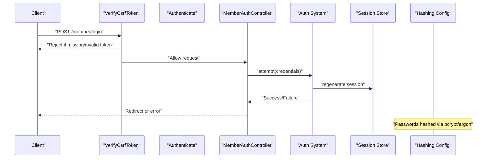
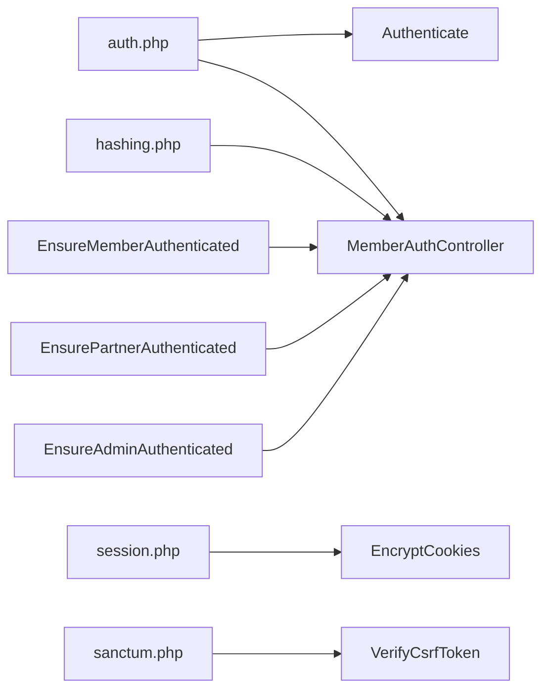
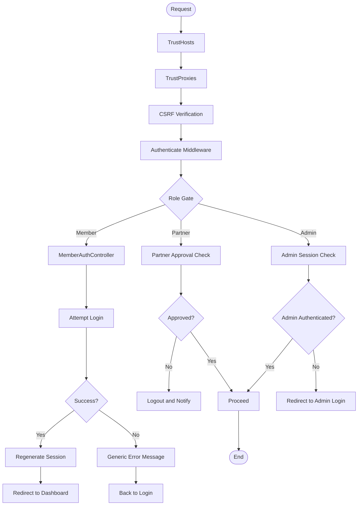

# Security Measures and Best Practices

<cite>
**Referenced Files in This Document**
- [auth.php](file://config/auth.php)
- [session.php](file://config/session.php)
- [hashing.php](file://config/hashin.php)
- [sanctum.php](file://config/sanctum.php)
- [VerifyCsrfToken.php](file://app/Http/Middleware/VerifyCsrfToken.php)
- [Authenticate.php](file://app/Http/Middleware/Authenticate.php)
- [EnsureMemberAuthenticated.php](file://app/Http/Middleware/EnsureMemberAuthenticated.php)
- [EnsurePartnerAuthenticated.php](file://app/Http/Middleware/EnsurePartnerAuthenticated.php)
- [EnsureAdminAuthenticated.php](file://app/Http/Middleware/EnsureAdminAuthenticated.php)
- [PreventRequestsDuringMaintenance.php](file://app/Http/Middleware/PreventRequestsDuringMaintenance.php)
- [TrustHosts.php](file://app/Http/Middleware/TrustHosts.php)
- [TrustProxies.php](file://app/Http/Middleware/TrustProxies.php)
- [EncryptCookies.php](file://app/Http/Middleware/EncryptCookies.php)
- [MemberAuthController.php](file://app/Http/Controllers/Member/MemberAuthController.php)
- [User.php](file://app/Models/User.php)
</cite>

## Table of Contents
1. [Introduction](#introduction)
2. [Project Structure](#project-structure)
3. [Core Components](#core-components)
4. [Architecture Overview](#architecture-overview)
5. [Detailed Component Analysis](#detailed-component-analysis)
6. [Dependency Analysis](#dependency-analysis)
7. [Performance Considerations](#performance-considerations)
8. [Troubleshooting Guide](#troubleshooting-guide)
9. [Conclusion](#conclusion)
10. [Appendices](#appendices)

## Introduction
This document consolidates KatalogThrift’s authentication security posture and operational best practices. It focuses on CSRF protection, maintenance mode handling, session security, password hashing, secure cookie configuration, HTTPS enforcement, security headers, rate limiting, brute-force protection, suspicious activity detection, and incident response. It also provides practical guidance for middleware implementation, secure error handling, and authentication event logging.

## Project Structure
KatalogThrift organizes authentication and security around configuration files and middleware layers:
- Configuration-driven authentication and session behavior
- Role-specific authentication middleware
- CSRF protection middleware
- Maintenance mode and trust/proxy handling
- Password hashing policy
- Sanctum-based SPA/API authentication integration

```mermaid
graph TB
subgraph "Config Layer"
CFG_AUTH["config/auth.php"]
CFG_SESS["config/session.php"]
CFG_HASH["config/hashing.php"]
CFG_SANC["config/sanctum.php"]
end
subgraph "Middleware Layer"
MW_CSRF["VerifyCsrfToken.php"]
MW_AUTH["Authenticate.php"]
MW_MEM["EnsureMemberAuthenticated.php"]
MW_PART["EnsurePartnerAuthenticated.php"]
MW_ADMIN["EnsureAdminAuthenticated.php"]
MW_MAINT["PreventRequestsDuringMaintenance.php"]
MW_TRUST_HOSTS["TrustHosts.php"]
MW_TRUST_PROXIES["TrustProxies.php"]
MW_ENCRYPT["EncryptCookies.php"]
end
subgraph "Controllers & Models"
CTRL_MEMBER["MemberAuthController.php"]
MODEL_USER["User.php"]
end
CFG_AUTH --> MW_AUTH
CFG_AUTH --> CTRL_MEMBER
CFG_SESS --> MW_ENCRYPT
CFG_HASH --> CTRL_MEMBER
CFG_SANC --> MW_CSRF
MW_MEM --> CTRL_MEMBER
MW_PART --> CTRL_MEMBER
MW_ADMIN --> CTRL_MEMBER
MW_TRUST_HOSTS --> MW_TRUST_PROXIES
```

**Diagram sources**
- [auth.php:1-120](file://config/auth.php#L1-L120)
- [session.php:1-215](file://config/session.php#L1-L215)
- [hashing.php:1-55](file://config/hashin.php#L1-L55)
- [sanctum.php:1-84](file://config/sanctum.php#L1-L84)
- [VerifyCsrfToken.php:1-18](file://app/Http/Middleware/VerifyCsrfToken.php#L1-L18)
- [Authenticate.php:1-18](file://app/Http/Middleware/Authenticate.php#L1-L18)
- [EnsureMemberAuthenticated.php:1-21](file://app/Http/Middleware/EnsureMemberAuthenticated.php#L1-L21)
- [EnsurePartnerAuthenticated.php:1-28](file://app/Http/Middleware/EnsurePartnerAuthenticated.php#L1-L28)
- [EnsureAdminAuthenticated.php:1-25](file://app/Http/Middleware/EnsureAdminAuthenticated.php#L1-L25)
- [PreventRequestsDuringMaintenance.php:1-18](file://app/Http/Middleware/PreventRequestsDuringMaintenance.php#L1-L18)
- [TrustHosts.php:1-21](file://app/Http/Middleware/TrustHosts.php#L1-L21)
- [TrustProxies.php:1-29](file://app/Http/Middleware/TrustProxies.php#L1-L29)
- [EncryptCookies.php:1-18](file://app/Http/Middleware/EncryptCookies.php#L1-L18)
- [MemberAuthController.php:1-129](file://app/Http/Controllers/Member/MemberAuthController.php#L1-L129)
- [User.php:1-131](file://app/Models/User.php#L1-L131)

**Section sources**
- [auth.php:1-120](file://config/auth.php#L1-L120)
- [session.php:1-215](file://config/session.php#L1-L215)
- [hashing.php:1-55](file://config/hashin.php#L1-L55)
- [sanctum.php:1-84](file://config/sanctum.php#L1-L84)
- [VerifyCsrfToken.php:1-18](file://app/Http/Middleware/VerifyCsrfToken.php#L1-L18)
- [Authenticate.php:1-18](file://app/Http/Middleware/Authenticate.php#L1-L18)
- [EnsureMemberAuthenticated.php:1-21](file://app/Http/Middleware/EnsureMemberAuthenticated.php#L1-L21)
- [EnsurePartnerAuthenticated.php:1-28](file://app/Http/Middleware/EnsurePartnerAuthenticated.php#L1-L28)
- [EnsureAdminAuthenticated.php:1-25](file://app/Http/Middleware/EnsureAdminAuthenticated.php#L1-L25)
- [PreventRequestsDuringMaintenance.php:1-18](file://app/Http/Middleware/PreventRequestsDuringMaintenance.php#L1-L18)
- [TrustHosts.php:1-21](file://app/Http/Middleware/TrustHosts.php#L1-L21)
- [TrustProxies.php:1-29](file://app/Http/Middleware/TrustProxies.php#L1-L29)
- [EncryptCookies.php:1-18](file://app/Http/Middleware/EncryptCookies.php#L1-L18)
- [MemberAuthController.php:1-129](file://app/Http/Controllers/Member/MemberAuthController.php#L1-L129)
- [User.php:1-131](file://app/Models/User.php#L1-L131)

## Core Components
- Authentication guards and providers: session-based guards for web and partner contexts, Eloquent user provider.
- Password reset policy: per-user token table, expiration window, throttling interval.
- Password hashing: bcrypt as default with tunable rounds; argon support available.
- Session security: configurable lifetime, encryption toggle, cookie flags (Secure, HttpOnly, SameSite), optional partitioned cookies.
- CSRF protection: framework-provided token verification with extensible exclusion list.
- Maintenance mode: global prevention with configurable exceptions.
- Trust and proxies: host and proxy header detection for accurate client metadata.
- Sanctum integration: SPA/API authentication with middleware hooks for session, cookies, and CSRF.

**Section sources**
- [auth.php:38-118](file://config/auth.php#L38-L118)
- [session.php:21-215](file://config/session.php#L21-L215)
- [hashing.php:18-52](file://config/hashin.php#L18-L52)
- [sanctum.php:18-81](file://config/sanctum.php#L18-L81)
- [VerifyCsrfToken.php:14-16](file://app/Http/Middleware/VerifyCsrfToken.php#L14-L16)
- [PreventRequestsDuringMaintenance.php:14-16](file://app/Http/Middleware/PreventRequestsDuringMaintenance.php#L14-L16)
- [TrustHosts.php:14-19](file://app/Http/Middleware/TrustHosts.php#L14-L19)
- [TrustProxies.php:22-27](file://app/Http/Middleware/TrustProxies.php#L22-L27)

## Architecture Overview
The authentication flow integrates configuration-driven policies with middleware and controller actions. CSRF protection is enforced centrally, while role-specific checks gate access to protected areas. Sessions and cookies are secured via configuration, and Sanctum supports SPA/API flows.

**Diagram sources**
- [VerifyCsrfToken.php:14-16](file://app/Http/Middleware/VerifyCsrfToken.php#L14-L16)
- [Authenticate.php:13-16](file://app/Http/Middleware/Authenticate.php#L13-L16)
- [MemberAuthController.php:23-36](file://app/Http/Controllers/Member/MemberAuthController.php#L23-L36)
- [session.php:34-36](file://config/session.php#L34-L36)
- [hashing.php:18-34](file://config/hashin.php#L18-L34)

## Detailed Component Analysis

### CSRF Protection Implementation
- Centralized CSRF middleware enforces token verification for state-changing requests.
- Exclusions list allows whitelisting specific URIs when necessary.
- Sanctum middleware references CSRF verification for SPA/API flows.

Best practices:
- Keep the exclusions list minimal.
- Ensure all AJAX endpoints and forms submit a valid CSRF token.
- Rotate tokens on sensitive actions (handled by framework).

**Section sources**
- [VerifyCsrfToken.php:14-16](file://app/Http/Middleware/VerifyCsrfToken.php#L14-L16)
- [sanctum.php:77-81](file://config/sanctum.php#L77-L81)

### Maintenance Mode Handling
- Global prevention middleware blocks requests unless explicitly permitted.
- Configure exceptions for monitoring endpoints or emergency access paths.

Operational guidance:
- Define maintenance exceptions carefully and review periodically.
- Use environment flags to enable/disable maintenance mode safely.

**Section sources**
- [PreventRequestsDuringMaintenance.php:14-16](file://app/Http/Middleware/PreventRequestsDuringMaintenance.php#L14-L16)

### Session Security Configurations
Key controls:
- Lifetime and idle expiration
- Encryption toggle
- Cookie flags: Secure, HttpOnly, SameSite, Partitioned
- Domain/path scoping

Recommendations:
- Set Secure=true behind TLS termination.
- Use HttpOnly=true to mitigate XSS.
- Apply SameSite=strict for highest protection or lax for cross-site navigations.
- Enable encryption for sensitive session data.
- Align cookie domain/path with deployment scope.

**Section sources**
- [session.php:34-36](file://config/session.php#L34-L36)
- [session.php:49](file://config/session.php#L49)
- [session.php:169-199](file://config/session.php#L169-L199)
- [session.php:211-212](file://config/session.php#L211-L212)

### Password Security Policies and Hash Algorithms
- Default driver: bcrypt with tunable rounds.
- Alternative: argon with memory/time/thread parameters.
- Password reset tokens: short-lived and throttled.

Guidance:
- Increase bcrypt rounds for stronger hashing where feasible.
- Prefer argon for environments with dedicated compute.
- Enforce minimum password length and reject weak patterns.

**Section sources**
- [hashing.php:18-34](file://config/hashin.php#L18-L34)
- [hashing.php:47-52](file://config/hashin.php#L47-L52)
- [auth.php:97-104](file://config/auth.php#L97-L104)

### Secure Session Management
- Regenerate session ID after login to prevent fixation.
- Invalidate session and regenerate CSRF token on logout.
- Use role-specific guards and partner approval checks.

**Section sources**
- [MemberAuthController.php:30-36](file://app/Http/Controllers/Member/MemberAuthController.php#L30-L36)
- [MemberAuthController.php:65-71](file://app/Http/Controllers/Member/MemberAuthController.php#L65-L71)
- [EnsurePartnerAuthenticated.php:13-23](file://app/Http/Middleware/EnsurePartnerAuthenticated.php#L13-L23)

### Rate Limiting, Brute Force Protection, and Suspicious Activity Detection
Current implementation highlights:
- Password reset throttling configured.
- No built-in IP-based rate limiting in the examined code.

Recommended enhancements:
- Introduce per-IP rate limits for login/reset endpoints.
- Add exponential backoff and CAPTCHA for high-risk IPs.
- Track failed attempts and trigger alerts for bursts.
- Log suspicious activities (multiple failed logins, unusual geographic access).

[No sources needed since this section provides general guidance]

### Secure Cookie Configuration and HTTPS Enforcement
- Use Secure flag for HTTPS-only cookies.
- Apply HttpOnly and SameSite policies.
- Scope domain/path appropriately.
- Consider Partitioned cookies for cross-site contexts.

HTTPS enforcement:
- Enforce HTTPS at the load balancer or reverse proxy.
- Use HSTS headers via server configuration or middleware.

**Section sources**
- [session.php:169-199](file://config/session.php#L169-L199)
- [TrustProxies.php:22-27](file://app/Http/Middleware/TrustProxies.php#L22-L27)
- [TrustHosts.php:14-19](file://app/Http/Middleware/TrustHosts.php#L14-L19)

### Security Headers Implementation
- HSTS, CSP, X-Content-Type-Options, X-Frame-Options, Referrer-Policy.
- Implement via server configuration or middleware.

[No sources needed since this section provides general guidance]

### Practical Examples: Security Middleware and Authentication Error Handling
- Implement role gates using EnsureMemberAuthenticated, EnsurePartnerAuthenticated, EnsureAdminAuthenticated.
- Redirect unauthenticated users to appropriate login pages.
- On authentication failure, avoid leaking account existence; return generic messages.
- Log authentication events (success/failure) with contextual metadata.

**Section sources**
- [EnsureMemberAuthenticated.php:11-19](file://app/Http/Middleware/EnsureMemberAuthenticated.php#L11-L19)
- [EnsurePartnerAuthenticated.php:11-26](file://app/Http/Middleware/EnsurePartnerAuthenticated.php#L11-L26)
- [EnsureAdminAuthenticated.php:16-23](file://app/Http/Middleware/EnsureAdminAuthenticated.php#L16-L23)
- [MemberAuthController.php:30-36](file://app/Http/Controllers/Member/MemberAuthController.php#L30-L36)

### Authentication Logging and Auditing
- Capture login/logout timestamps, IP, user agent, and outcomes.
- Store logs securely and retain for compliance periods.
- Alert on anomalies (failed logins, new devices, rapid retries).

[No sources needed since this section provides general guidance]

## Dependency Analysis
Authentication depends on configuration, middleware, and model/user behavior. CSRF and Sanctum integrate with middleware stacks. Session and cookie settings influence transport-layer protections.

**Diagram sources**
- [auth.php:38-118](file://config/auth.php#L38-L118)
- [hashing.php:18-52](file://config/hashin.php#L18-L52)
- [session.php:129-215](file://config/session.php#L129-L215)
- [sanctum.php:77-81](file://config/sanctum.php#L77-L81)
- [VerifyCsrfToken.php:14-16](file://app/Http/Middleware/VerifyCsrfToken.php#L14-L16)
- [EnsureMemberAuthenticated.php:11-19](file://app/Http/Middleware/EnsureMemberAuthenticated.php#L11-L19)
- [EnsurePartnerAuthenticated.php:11-26](file://app/Http/Middleware/EnsurePartnerAuthenticated.php#L11-L26)
- [EnsureAdminAuthenticated.php:16-23](file://app/Http/Middleware/EnsureAdminAuthenticated.php#L16-L23)
- [MemberAuthController.php:23-71](file://app/Http/Controllers/Member/MemberAuthController.php#L23-L71)

**Section sources**
- [auth.php:38-118](file://config/auth.php#L38-L118)
- [hashing.php:18-52](file://config/hashin.php#L18-L52)
- [session.php:129-215](file://config/session.php#L129-L215)
- [sanctum.php:77-81](file://config/sanctum.php#L77-L81)
- [VerifyCsrfToken.php:14-16](file://app/Http/Middleware/VerifyCsrfToken.php#L14-L16)
- [EnsureMemberAuthenticated.php:11-19](file://app/Http/Middleware/EnsureMemberAuthenticated.php#L11-L19)
- [EnsurePartnerAuthenticated.php:11-26](file://app/Http/Middleware/EnsurePartnerAuthenticated.php#L11-L26)
- [EnsureAdminAuthenticated.php:16-23](file://app/Http/Middleware/EnsureAdminAuthenticated.php#L16-L23)
- [MemberAuthController.php:23-71](file://app/Http/Controllers/Member/MemberAuthController.php#L23-L71)

## Performance Considerations
- Tune bcrypt rounds to balance security and latency under expected load.
- Use Redis or database-backed sessions for horizontal scaling.
- Minimize session data to reduce overhead.
- Cache frequently accessed user roles and permissions.

[No sources needed since this section provides general guidance]

## Troubleshooting Guide
Common issues and resolutions:
- CSRF failures: verify tokens are included and not cached; confirm SameSite alignment.
- Session fixation: ensure session regeneration after login.
- Partner approval rejections: enforce approval checks and clear stale sessions.
- Maintenance mode blocking legitimate traffic: adjust exceptions list.

**Section sources**
- [VerifyCsrfToken.php:14-16](file://app/Http/Middleware/VerifyCsrfToken.php#L14-L16)
- [MemberAuthController.php:30-36](file://app/Http/Controllers/Member/MemberAuthController.php#L30-L36)
- [EnsurePartnerAuthenticated.php:13-23](file://app/Http/Middleware/EnsurePartnerAuthenticated.php#L13-L23)
- [PreventRequestsDuringMaintenance.php:14-16](file://app/Http/Middleware/PreventRequestsDuringMaintenance.php#L14-L16)

## Conclusion
KatalogThrift’s authentication foundation leverages Laravel’s robust configuration and middleware ecosystem. Strengthening transport security, adding rate limiting and anomaly detection, and enforcing strict session and cookie policies will further harden the system. Operational excellence requires disciplined middleware usage, secure defaults, and continuous monitoring.

[No sources needed since this section summarizes without analyzing specific files]

## Appendices

### Appendix A: Authentication Flow Diagram

**Diagram sources**
- [TrustHosts.php:14-19](file://app/Http/Middleware/TrustHosts.php#L14-L19)
- [TrustProxies.php:22-27](file://app/Http/Middleware/TrustProxies.php#L22-L27)
- [VerifyCsrfToken.php:14-16](file://app/Http/Middleware/VerifyCsrfToken.php#L14-L16)
- [Authenticate.php:13-16](file://app/Http/Middleware/Authenticate.php#L13-L16)
- [EnsureMemberAuthenticated.php:11-19](file://app/Http/Middleware/EnsureMemberAuthenticated.php#L11-L19)
- [EnsurePartnerAuthenticated.php:11-26](file://app/Http/Middleware/EnsurePartnerAuthenticated.php#L11-L26)
- [EnsureAdminAuthenticated.php:16-23](file://app/Http/Middleware/EnsureAdminAuthenticated.php#L16-L23)
- [MemberAuthController.php:23-36](file://app/Http/Controllers/Member/MemberAuthController.php#L23-L36)