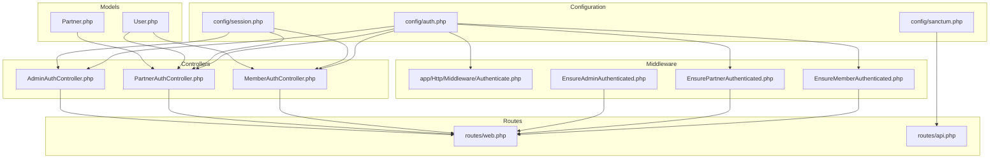
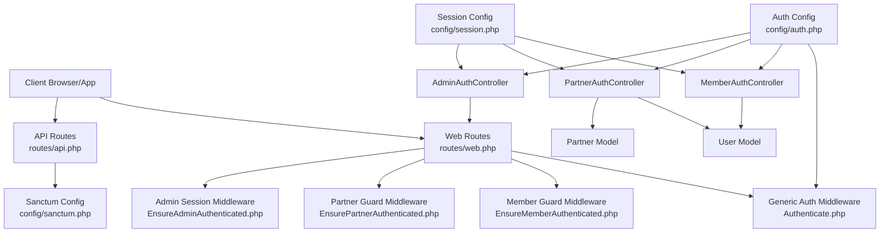
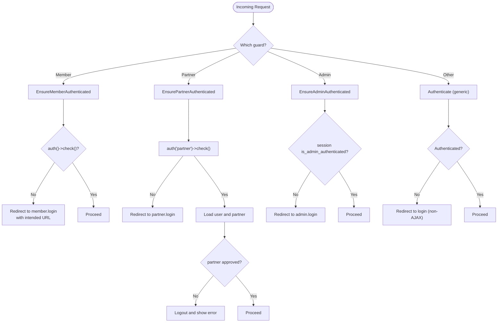
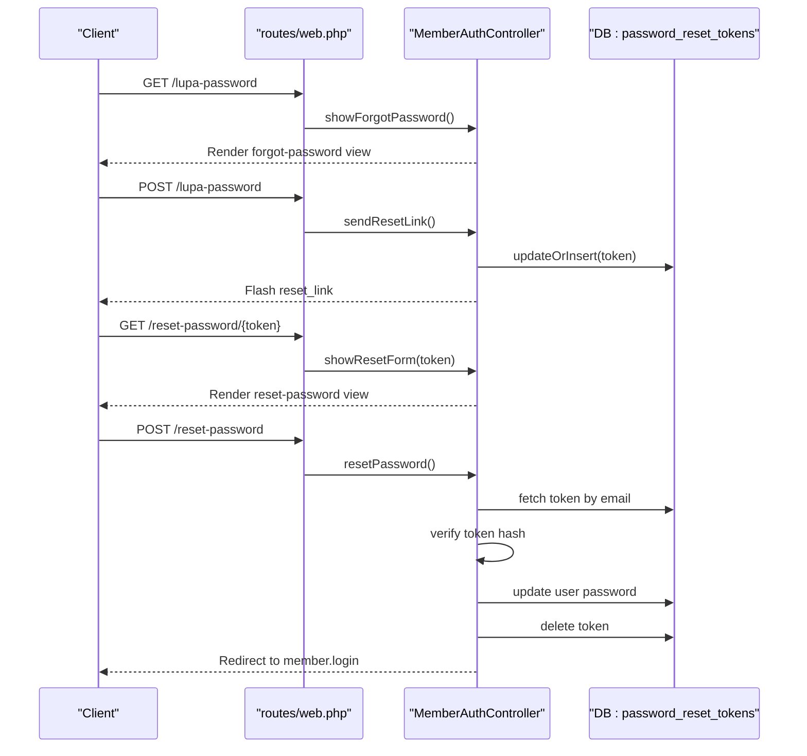
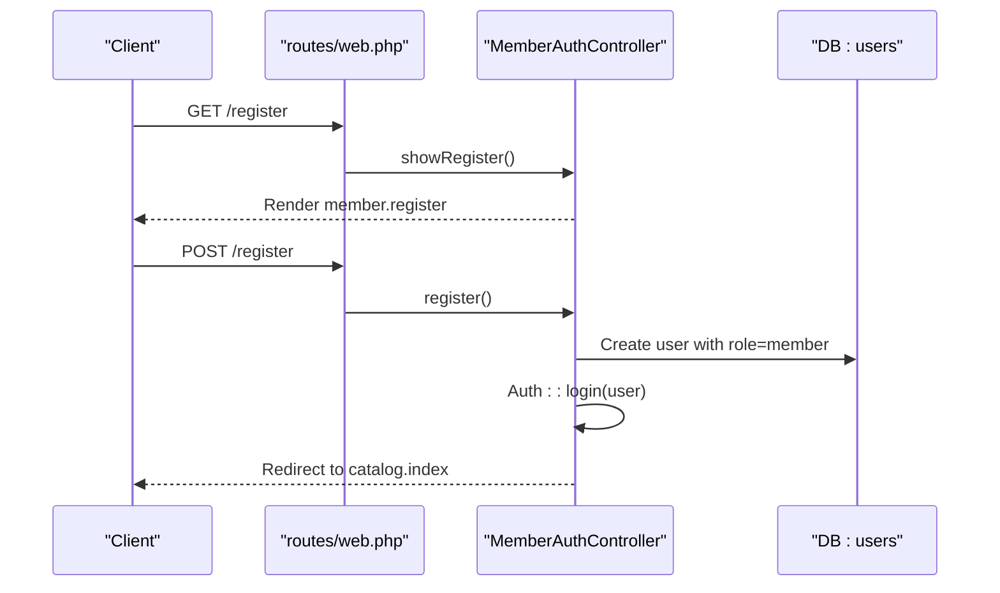
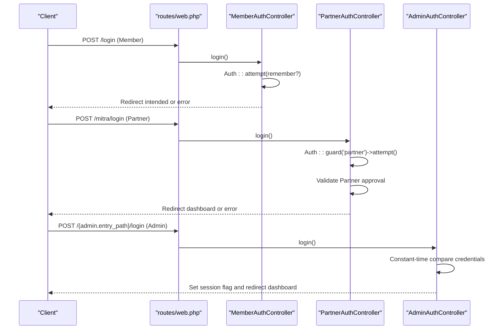
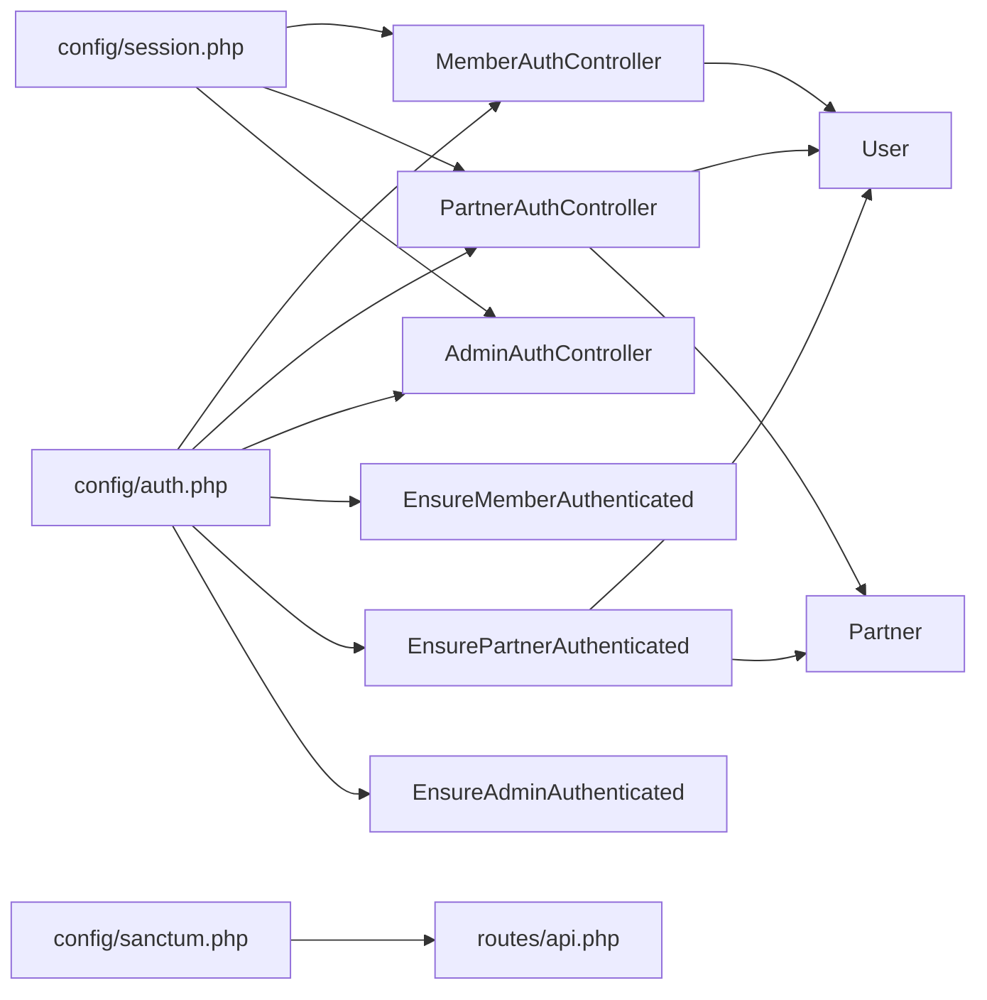

# User Authentication System

<cite>
**Referenced Files in This Document**
- [Authenticate.php](file://app/Http/Middleware/Authenticate.php)
- [EnsureMemberAuthenticated.php](file://app/Http/Middleware/EnsureMemberAuthenticated.php)
- [EnsurePartnerAuthenticated.php](file://app/Http/Middleware/EnsurePartnerAuthenticated.php)
- [EnsureAdminAuthenticated.php](file://app/Http/Middleware/EnsureAdminAuthenticated.php)
- [auth.php](file://config/auth.php)
- [sanctum.php](file://config/sanctum.php)
- [session.php](file://config/session.php)
- [AuthServiceProvider.php](file://app/Providers/AuthServiceProvider.php)
- [MemberAuthController.php](file://app/Http/Controllers/Member/MemberAuthController.php)
- [PartnerAuthController.php](file://app/Http/Controllers/Partner/PartnerAuthController.php)
- [AdminAuthController.php](file://app/Http/Controllers/AdminAuthController.php)
- [web.php](file://routes/web.php)
- [api.php](file://routes/api.php)
- [User.php](file://app/Models/User.php)
- [Partner.php](file://app/Models/Partner.php)
- [2014_10_12_000000_create_users_table.php](file://database/migrations/2014_10_12_000000_create_users_table.php)
</cite>

## Table of Contents
1. [Introduction](#introduction)
2. [Project Structure](#project-structure)
3. [Core Components](#core-components)
4. [Architecture Overview](#architecture-overview)
5. [Detailed Component Analysis](#detailed-component-analysis)
6. [Dependency Analysis](#dependency-analysis)
7. [Performance Considerations](#performance-considerations)
8. [Troubleshooting Guide](#troubleshooting-guide)
9. [Conclusion](#conclusion)

## Introduction
This document describes KatalogThrift’s multi-guard authentication system supporting three user roles: Member, Partner, and Administrator. It explains guards configuration, middleware-based route protection, session and token management, password reset and email verification flows, registration procedures per role, Sanctum API authentication, personal access token generation, mobile API authentication, login/logout processes, remember me functionality, CSRF protection, rate limiting, and practical examples for controllers and route protection.

## Project Structure
The authentication system spans configuration, middleware, controllers, models, routes, and database migrations. Key areas:
- Configuration: auth, sanctum, session
- Middleware: generic and role-specific authentication checks
- Controllers: Member, Partner, Admin authentication handlers
- Models: User and Partner with role and relationship helpers
- Routes: web and API endpoints for authentication and protected actions
- Migrations: users table and related schema

**Diagram sources**
- [auth.php:1-120](file://config/auth.php#L1-L120)
- [sanctum.php:1-84](file://config/sanctum.php#L1-L84)
- [session.php:1-215](file://config/session.php#L1-L215)
- [Authenticate.php:1-18](file://app/Http/Middleware/Authenticate.php#L1-L18)
- [EnsureMemberAuthenticated.php:1-21](file://app/Http/Middleware/EnsureMemberAuthenticated.php#L1-L21)
- [EnsurePartnerAuthenticated.php:1-28](file://app/Http/Middleware/EnsurePartnerAuthenticated.php#L1-L28)
- [EnsureAdminAuthenticated.php:1-25](file://app/Http/Middleware/EnsureAdminAuthenticated.php#L1-L25)
- [MemberAuthController.php:1-129](file://app/Http/Controllers/Member/MemberAuthController.php#L1-L129)
- [PartnerAuthController.php:1-60](file://app/Http/Controllers/Partner/PartnerAuthController.php#L1-L60)
- [AdminAuthController.php:1-54](file://app/Http/Controllers/AdminAuthController.php#L1-L54)
- [web.php:1-240](file://routes/web.php#L1-L240)
- [api.php:1-20](file://routes/api.php#L1-L20)
- [User.php:1-131](file://app/Models/User.php#L1-L131)
- [Partner.php:1-123](file://app/Models/Partner.php#L1-L123)

**Section sources**
- [auth.php:1-120](file://config/auth.php#L1-L120)
- [sanctum.php:1-84](file://config/sanctum.php#L1-L84)
- [session.php:1-215](file://config/session.php#L1-L215)
- [web.php:1-240](file://routes/web.php#L1-L240)
- [api.php:1-20](file://routes/api.php#L1-L20)

## Core Components
- Multi-guard configuration: web and partner guards backed by the same user provider
- Role-aware middleware for Member, Partner, and Admin
- Controllers for login/register/logout, password reset, and role-specific validations
- Sanctum for API authentication and personal access tokens
- Session configuration for lifetime, cookies, and CSRF behavior
- Models with role helpers and Partner relationships

Key implementation references:
- Guards and providers: [auth.php:38-76](file://config/auth.php#L38-L76)
- Password reset config: [auth.php:97-104](file://config/auth.php#L97-L104)
- Sanctum stateful domains and middleware: [sanctum.php:18-81](file://config/sanctum.php#L18-L81)
- Session cookie and CSRF settings: [session.php:129-200](file://config/session.php#L129-L200)
- Member auth controller: [MemberAuthController.php:17-71](file://app/Http/Controllers/Member/MemberAuthController.php#L17-L71)
- Partner auth controller: [PartnerAuthController.php:19-50](file://app/Http/Controllers/Partner/PartnerAuthController.php#L19-L50)
- Admin auth controller: [AdminAuthController.php:20-43](file://app/Http/Controllers/AdminAuthController.php#L20-L43)
- User model role helpers: [User.php:68-82](file://app/Models/User.php#L68-L82)
- Partner model approval helpers: [Partner.php:72-81](file://app/Models/Partner.php#L72-L81)

**Section sources**
- [auth.php:38-104](file://config/auth.php#L38-L104)
- [sanctum.php:18-81](file://config/sanctum.php#L18-L81)
- [session.php:129-200](file://config/session.php#L129-L200)
- [MemberAuthController.php:17-71](file://app/Http/Controllers/Member/MemberAuthController.php#L17-L71)
- [PartnerAuthController.php:19-50](file://app/Http/Controllers/Partner/PartnerAuthController.php#L19-L50)
- [AdminAuthController.php:20-43](file://app/Http/Controllers/AdminAuthController.php#L20-L43)
- [User.php:68-82](file://app/Models/User.php#L68-L82)
- [Partner.php:72-81](file://app/Models/Partner.php#L72-L81)

## Architecture Overview
The system uses separate guards for Member (web) and Partner (partner), both backed by the same Eloquent user provider. Admin authentication relies on session flags rather than a dedicated guard. Sanctum secures API endpoints and enables personal access tokens. Middleware enforces role-based access for protected routes.

**Diagram sources**
- [web.php:1-240](file://routes/web.php#L1-L240)
- [api.php:1-20](file://routes/api.php#L1-L20)
- [Authenticate.php:1-18](file://app/Http/Middleware/Authenticate.php#L1-L18)
- [EnsureMemberAuthenticated.php:1-21](file://app/Http/Middleware/EnsureMemberAuthenticated.php#L1-L21)
- [EnsurePartnerAuthenticated.php:1-28](file://app/Http/Middleware/EnsurePartnerAuthenticated.php#L1-L28)
- [EnsureAdminAuthenticated.php:1-25](file://app/Http/Middleware/EnsureAdminAuthenticated.php#L1-L25)
- [auth.php:38-76](file://config/auth.php#L38-L76)
- [sanctum.php:18-81](file://config/sanctum.php#L18-L81)
- [session.php:129-200](file://config/session.php#L129-L200)
- [MemberAuthController.php:17-71](file://app/Http/Controllers/Member/MemberAuthController.php#L17-L71)
- [PartnerAuthController.php:19-50](file://app/Http/Controllers/Partner/PartnerAuthController.php#L19-L50)
- [AdminAuthController.php:20-43](file://app/Http/Controllers/AdminAuthController.php#L20-L43)
- [User.php:68-82](file://app/Models/User.php#L68-L82)
- [Partner.php:72-81](file://app/Models/Partner.php#L72-L81)

## Detailed Component Analysis

### Guards and Providers
- Defaults: web guard for general auth, users provider for passwords
- Guards: web (Member) and partner (Partner) share the users provider
- Password reset: single reset configuration for users table with token expiry and throttle

Practical implications:
- Member and Partner share the same user model and credentials
- Partner-specific checks are enforced in middleware and controllers
- Password reset uses a dedicated token table and time-based expiry

**Section sources**
- [auth.php:16-19](file://config/auth.php#L16-L19)
- [auth.php:38-47](file://config/auth.php#L38-L47)
- [auth.php:66-76](file://config/auth.php#L66-L76)
- [auth.php:97-104](file://config/auth.php#L97-L104)

### Middleware Implementation
- Generic authentication middleware: redirects unauthenticated AJAX requests silently and web requests to login
- Member middleware: redirects to Member login with intended URL if not authenticated
- Partner middleware: validates Partner guard, ensures associated Partner exists and is approved; otherwise logs out and shows errors
- Admin middleware: checks session flag for admin login state

**Diagram sources**
- [Authenticate.php:13-16](file://app/Http/Middleware/Authenticate.php#L13-L16)
- [EnsureMemberAuthenticated.php:11-19](file://app/Http/Middleware/EnsureMemberAuthenticated.php#L11-L19)
- [EnsurePartnerAuthenticated.php:11-26](file://app/Http/Middleware/EnsurePartnerAuthenticated.php#L11-L26)
- [EnsureAdminAuthenticated.php:16-23](file://app/Http/Middleware/EnsureAdminAuthenticated.php#L16-L23)

**Section sources**
- [Authenticate.php:13-16](file://app/Http/Middleware/Authenticate.php#L13-L16)
- [EnsureMemberAuthenticated.php:11-19](file://app/Http/Middleware/EnsureMemberAuthenticated.php#L11-L19)
- [EnsurePartnerAuthenticated.php:11-26](file://app/Http/Middleware/EnsurePartnerAuthenticated.php#L11-L26)
- [EnsureAdminAuthenticated.php:16-23](file://app/Http/Middleware/EnsureAdminAuthenticated.php#L16-L23)

### Session and CSRF Management
- Session lifetime: configurable minutes; cookie name, path, domain, secure, httpOnly, SameSite
- CSRF: VerifyCsrfToken middleware integrated into Sanctum middleware stack
- Session invalidation and token regeneration on logout

Security considerations:
- SameSite “lax” mitigates CSRF risks
- Secure and httpOnly cookies protect session integrity
- Regenerating session and CSRF tokens on logout reduces session fixation risk

**Section sources**
- [session.php:34](file://config/session.php#L34)
- [session.php:129-200](file://config/session.php#L129-L200)
- [sanctum.php:77-81](file://config/sanctum.php#L77-L81)
- [MemberAuthController.php:65-71](file://app/Http/Controllers/Member/MemberAuthController.php#L65-L71)
- [PartnerAuthController.php:52-58](file://app/Http/Controllers/Partner/PartnerAuthController.php#L52-L58)
- [AdminAuthController.php:45-52](file://app/Http/Controllers/AdminAuthController.php#L45-L52)

### Password Reset Workflow
- Member-facing reset flow: request reset link, receive tokenized link, submit new password
- Token storage: dedicated table with hashed tokens and creation timestamps
- Validation: token presence and cryptographic comparison against stored hash
- Post-reset: clear token record and redirect to login

**Diagram sources**
- [web.php:82-86](file://routes/web.php#L82-L86)
- [MemberAuthController.php:74-127](file://app/Http/Controllers/Member/MemberAuthController.php#L74-L127)
- [auth.php:97-104](file://config/auth.php#L97-L104)

**Section sources**
- [MemberAuthController.php:74-127](file://app/Http/Controllers/Member/MemberAuthController.php#L74-L127)
- [web.php:82-86](file://routes/web.php#L82-L86)
- [auth.php:97-104](file://config/auth.php#L97-L104)

### Email Verification Processes
- Users table includes an optional verified timestamp column
- No dedicated verification controller or route was found in the repository snapshot
- Recommendation: integrate Laravel verification hooks or add routes/controllers for verification resend and handling

Note: This section does not analyze specific files because verification endpoints/controllers are not present in the provided context.

### Account Registration Flows
- Member registration: validated input, hashed password, role set to member, immediate login and session regeneration
- Partner registration: handled via public partner registration routes; PartnerAuthController login validates Partner existence and approval status

**Diagram sources**
- [web.php:78-80](file://routes/web.php#L78-L80)
- [MemberAuthController.php:38-63](file://app/Http/Controllers/Member/MemberAuthController.php#L38-L63)

**Section sources**
- [MemberAuthController.php:38-63](file://app/Http/Controllers/Member/MemberAuthController.php#L38-L63)
- [web.php:78-80](file://routes/web.php#L78-L80)

### Sanctum API Authentication and Personal Access Tokens
- API endpoint protected by auth:sanctum middleware returns authenticated user
- Sanctum guard configuration includes web guard and CSRF/cookies middleware
- User model includes API tokens trait enabling personal access tokens

Implementation highlights:
- API route: [api.php:17-19](file://routes/api.php#L17-L19)
- Sanctum config: [sanctum.php:36](file://config/sanctum.php#L36), [sanctum.php:77-81](file://config/sanctum.php#L77-L81)
- User model tokens: [User.php:8](file://app/Models/User.php#L8)

**Section sources**
- [api.php:17-19](file://routes/api.php#L17-L19)
- [sanctum.php:36](file://config/sanctum.php#L36)
- [sanctum.php:77-81](file://config/sanctum.php#L77-L81)
- [User.php:8](file://app/Models/User.php#L8)

### Mobile API Authentication
- Sanctum supports stateful API authentication via cookies and CSRF protection
- Configure stateful domains to include mobile web origins or SPAs as needed
- Personal access tokens can be issued for programmatic access

Recommendations:
- Add mobile app domain(s) to Sanctum stateful configuration
- Enforce CSRF middleware for stateful requests
- Use personal access tokens for backend-to-backend or mobile app integrations

**Section sources**
- [sanctum.php:18-22](file://config/sanctum.php#L18-L22)
- [sanctum.php:77-81](file://config/sanctum.php#L77-L81)
- [User.php:8](file://app/Models/User.php#L8)

### Login/Logout Processes and Remember Me
- Member login: credential validation, optional remember me, session regeneration, redirect intended
- Partner login: guard-specific attempt, Partner existence and approval checks, session regeneration
- Admin login: constant-time credential comparison, session flag set, redirect to dashboard
- Logout: guard-specific logout, session invalidate, CSRF token regeneration

**Diagram sources**
- [web.php:77](file://routes/web.php#L77)
- [web.php:121](file://routes/web.php#L121)
- [web.php:172](file://routes/web.php#L172)
- [MemberAuthController.php:23-36](file://app/Http/Controllers/Member/MemberAuthController.php#L23-L36)
- [PartnerAuthController.php:19-50](file://app/Http/Controllers/Partner/PartnerAuthController.php#L19-L50)
- [AdminAuthController.php:20-43](file://app/Http/Controllers/AdminAuthController.php#L20-L43)

**Section sources**
- [MemberAuthController.php:23-36](file://app/Http/Controllers/Member/MemberAuthController.php#L23-L36)
- [PartnerAuthController.php:19-50](file://app/Http/Controllers/Partner/PartnerAuthController.php#L19-L50)
- [AdminAuthController.php:20-43](file://app/Http/Controllers/AdminAuthController.php#L20-L43)
- [web.php:77](file://routes/web.php#L77)
- [web.php:121](file://routes/web.php#L121)
- [web.php:172](file://routes/web.php#L172)

### Rate Limiting
- Password reset throttle configured per users provider
- Consider adding rate limiting middleware around login endpoints for brute-force protection

**Section sources**
- [auth.php:102](file://config/auth.php#L102)

### Practical Examples

#### Protecting Routes with Middleware
- Member-only routes: apply member.auth middleware group
- Partner-only routes: apply partner.auth middleware group
- Admin-only routes: apply admin.auth middleware group

References:
- Member-protected group: [web.php:89-116](file://routes/web.php#L89-L116)
- Partner-protected group: [web.php:124-166](file://routes/web.php#L124-L166)
- Admin-protected group: [web.php:174-239](file://routes/web.php#L174-L239)

#### Implementing Authentication in Controllers
- Member login/register/logout: [MemberAuthController.php:17-71](file://app/Http/Controllers/Member/MemberAuthController.php#L17-L71)
- Partner login/logout: [PartnerAuthController.php:19-58](file://app/Http/Controllers/Partner/PartnerAuthController.php#L19-L58)
- Admin login/logout: [AdminAuthController.php:20-52](file://app/Http/Controllers/AdminAuthController.php#L20-L52)

#### Handling Authentication Failures
- Generic failure redirection: [Authenticate.php:13-16](file://app/Http/Middleware/Authenticate.php#L13-L16)
- Member failure: redirect to login with error bag
- Partner failure: logout and show approval-related messages
- Admin failure: redirect to login with error message

**Section sources**
- [Authenticate.php:13-16](file://app/Http/Middleware/Authenticate.php#L13-L16)
- [MemberAuthController.php:35](file://app/Http/Controllers/Member/MemberAuthController.php#L35)
- [PartnerAuthController.php:34-43](file://app/Http/Controllers/Partner/PartnerAuthController.php#L34-L43)
- [AdminAuthController.php:40-42](file://app/Http/Controllers/AdminAuthController.php#L40-L42)

## Dependency Analysis
- Controllers depend on Auth facade/guard helpers and Eloquent models
- Middleware depends on Auth guard checks and session state
- Routes depend on middleware bindings and controller actions
- Models expose role and relationship helpers used by controllers and middleware
- Configuration files define guards/providers and Sanctum/session policies

**Diagram sources**
- [auth.php:38-76](file://config/auth.php#L38-L76)
- [sanctum.php:18-81](file://config/sanctum.php#L18-L81)
- [session.php:129-200](file://config/session.php#L129-L200)
- [MemberAuthController.php:17-71](file://app/Http/Controllers/Member/MemberAuthController.php#L17-L71)
- [PartnerAuthController.php:19-58](file://app/Http/Controllers/Partner/PartnerAuthController.php#L19-L58)
- [AdminAuthController.php:20-52](file://app/Http/Controllers/AdminAuthController.php#L20-L52)
- [web.php:89-116](file://routes/web.php#L89-L116)
- [web.php:124-166](file://routes/web.php#L124-L166)
- [web.php:174-239](file://routes/web.php#L174-L239)
- [User.php:68-82](file://app/Models/User.php#L68-L82)
- [Partner.php:72-81](file://app/Models/Partner.php#L72-L81)

**Section sources**
- [auth.php:38-76](file://config/auth.php#L38-L76)
- [sanctum.php:18-81](file://config/sanctum.php#L18-L81)
- [session.php:129-200](file://config/session.php#L129-L200)
- [web.php:89-116](file://routes/web.php#L89-L116)
- [web.php:124-166](file://routes/web.php#L124-L166)
- [web.php:174-239](file://routes/web.php#L174-L239)

## Performance Considerations
- Session lifetime tuning impacts memory/CPU usage for file-based sessions
- Sanctum middleware adds cookie and CSRF overhead; ensure appropriate stateful domains
- Password reset token expiry and throttle reduce database load during bursts
- Consider Redis or database session drivers for scale

[No sources needed since this section provides general guidance]

## Troubleshooting Guide
Common issues and resolutions:
- Member login fails silently on AJAX: ensure proper JSON response handling or redirect behavior
  - Reference: [Authenticate.php:13-16](file://app/Http/Middleware/Authenticate.php#L13-L16)
- Partner login redirects with approval errors: verify Partner status and rejection reason
  - Reference: [PartnerAuthController.php:34-43](file://app/Http/Controllers/Partner/PartnerAuthController.php#L34-L43)
- Admin login rejected: confirm constant-time credential comparison and session flag
  - Reference: [AdminAuthController.php:30-33](file://app/Http/Controllers/AdminAuthController.php#L30-L33)
- CSRF or session issues after logout: ensure session invalidation and token regeneration
  - References: [MemberAuthController.php:65-71](file://app/Http/Controllers/Member/MemberAuthController.php#L65-L71), [PartnerAuthController.php:52-58](file://app/Http/Controllers/Partner/PartnerAuthController.php#L52-L58), [AdminAuthController.php:45-52](file://app/Http/Controllers/AdminAuthController.php#L45-L52)
- Sanctum API returns unauthorized: verify stateful domains and CSRF middleware inclusion
  - References: [sanctum.php:18-22](file://config/sanctum.php#L18-L22), [sanctum.php:77-81](file://config/sanctum.php#L77-L81)

**Section sources**
- [Authenticate.php:13-16](file://app/Http/Middleware/Authenticate.php#L13-L16)
- [PartnerAuthController.php:34-43](file://app/Http/Controllers/Partner/PartnerAuthController.php#L34-L43)
- [AdminAuthController.php:30-33](file://app/Http/Controllers/AdminAuthController.php#L30-L33)
- [MemberAuthController.php:65-71](file://app/Http/Controllers/Member/MemberAuthController.php#L65-L71)
- [PartnerAuthController.php:52-58](file://app/Http/Controllers/Partner/PartnerAuthController.php#L52-L58)
- [AdminAuthController.php:45-52](file://app/Http/Controllers/AdminAuthController.php#L45-L52)
- [sanctum.php:18-22](file://config/sanctum.php#L18-L22)
- [sanctum.php:77-81](file://config/sanctum.php#L77-L81)

## Conclusion
KatalogThrift’s authentication system leverages multi-guards for Member and Partner roles, with Admin relying on session flags. Middleware enforces role-specific access, while Sanctum secures APIs and enables personal access tokens. Session and CSRF configurations provide robust client-side protections. Controllers encapsulate login, registration, logout, and password reset flows. For completeness, consider adding email verification endpoints and rate limiting around login attempts.