# User Registration and Login Workflows

<cite>
**Referenced Files in This Document**
- [MemberAuthController.php](file://app/Http/Controllers/Member/MemberAuthController.php)
- [PartnerAuthController.php](file://app/Http/Controllers/Partner/PartnerAuthController.php)
- [AdminAuthController.php](file://app/Http/Controllers/AdminAuthController.php)
- [User.php](file://app/Models/User.php)
- [Partner.php](file://app/Models/Partner.php)
- [EnsureMemberAuthenticated.php](file://app/Http/Middleware/EnsureMemberAuthenticated.php)
- [EnsurePartnerAuthenticated.php](file://app/Http/Middleware/EnsurePartnerAuthenticated.php)
- [EnsureAdminAuthenticated.php](file://app/Http/Middleware/EnsureAdminAuthenticated.php)
- [VerifyCsrfToken.php](file://app/Http/Middleware/VerifyCsrfToken.php)
- [auth.php](file://config/auth.php)
- [session.php](file://config/session.php)
- [web.php](file://routes/web.php)
- [register.blade.php](file://resources/views/member/register.blade.php)
- [login.blade.php](file://resources/views/member/login.blade.php)
- [partner_login.blade.php](file://resources/views/partner/login.blade.php)
- [admin_login.blade.php](file://resources/views/admin/login.blade.php)
</cite>

## Table of Contents
1. [Introduction](#introduction)
2. [Project Structure](#project-structure)
3. [Core Components](#core-components)
4. [Architecture Overview](#architecture-overview)
5. [Detailed Component Analysis](#detailed-component-analysis)
6. [Dependency Analysis](#dependency-analysis)
7. [Performance Considerations](#performance-considerations)
8. [Troubleshooting Guide](#troubleshooting-guide)
9. [Conclusion](#conclusion)

## Introduction
This document explains the user registration and login workflows across all three user types in KatalogThrift: Member, Partner, and Administrator. It covers the end-to-end flows for account creation, authentication, session management, password reset, and logout. It also documents validation, error handling, flash messaging, CSRF protection, and session configuration.

## Project Structure
The authentication system spans controllers, middleware, models, configuration, routes, and Blade templates:
- Controllers implement login, registration, logout, and password reset actions per user type.
- Middleware enforces authentication and approval checks for Partners.
- Models encapsulate roles and relationships (User and Partner).
- Configuration defines guards, providers, password reset policies, and session behavior.
- Routes bind URLs to controller actions.
- Blade templates render forms and present feedback messages.

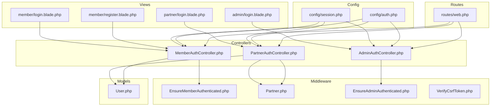

**Diagram sources**
- [web.php:75-86](file://routes/web.php#L75-L86)
- [MemberAuthController.php:17-71](file://app/Http/Controllers/Member/MemberAuthController.php#L17-L71)
- [PartnerAuthController.php:13-58](file://app/Http/Controllers/Partner/PartnerAuthController.php#L13-L58)
- [AdminAuthController.php:11-52](file://app/Http/Controllers/AdminAuthController.php#L11-L52)
- [EnsureMemberAuthenticated.php:9-20](file://app/Http/Middleware/EnsureMemberAuthenticated.php#L9-L20)
- [EnsurePartnerAuthenticated.php:9-26](file://app/Http/Middleware/EnsurePartnerAuthenticated.php#L9-L26)
- [EnsureAdminAuthenticated.php:9-23](file://app/Http/Middleware/EnsureAdminAuthenticated.php#L9-L23)
- [VerifyCsrfToken.php:7-17](file://app/Http/Middleware/VerifyCsrfToken.php#L7-L17)
- [auth.php:38-47](file://config/auth.php#L38-L47)
- [session.php:21-34](file://config/session.php#L21-L34)
- [register.blade.php:28-46](file://resources/views/member/register.blade.php#L28-L46)
- [login.blade.php:38-45](file://resources/views/member/login.blade.php#L38-L45)
- [partner_login.blade.php:33-39](file://resources/views/partner/login.blade.php#L33-L39)
- [admin_login.blade.php:59-67](file://resources/views/admin/login.blade.php#L59-L67)

**Section sources**
- [web.php:75-86](file://routes/web.php#L75-L86)
- [auth.php:38-47](file://config/auth.php#L38-L47)
- [session.php:21-34](file://config/session.php#L21-L34)

## Core Components
- MemberAuthController: Handles Member registration, login, logout, and password reset.
- PartnerAuthController: Handles Partner login, logout, and Partner-specific approval checks.
- AdminAuthController: Handles Admin login/logout with session-based authentication.
- User model: Role-based helpers and relations; Partner relationship for Partner approvals.
- Partner model: Approval status, verification, and tier calculations.
- Middleware: Enforce authentication and approval for each guard.
- CSRF and Session configuration: CSRF protection and session lifetime/security.

**Section sources**
- [MemberAuthController.php:15-128](file://app/Http/Controllers/Member/MemberAuthController.php#L15-L128)
- [PartnerAuthController.php:11-59](file://app/Http/Controllers/Partner/PartnerAuthController.php#L11-L59)
- [AdminAuthController.php:9-53](file://app/Http/Controllers/AdminAuthController.php#L9-L53)
- [User.php:10-81](file://app/Models/User.php#L10-L81)
- [Partner.php:8-75](file://app/Models/Partner.php#L8-L75)
- [EnsureMemberAuthenticated.php:9-20](file://app/Http/Middleware/EnsureMemberAuthenticated.php#L9-L20)
- [EnsurePartnerAuthenticated.php:9-26](file://app/Http/Middleware/EnsurePartnerAuthenticated.php#L9-L26)
- [EnsureAdminAuthenticated.php:9-23](file://app/Http/Middleware/EnsureAdminAuthenticated.php#L9-L23)
- [VerifyCsrfToken.php:7-17](file://app/Http/Middleware/VerifyCsrfToken.php#L7-L17)
- [auth.php:38-47](file://config/auth.php#L38-L47)
- [session.php:21-34](file://config/session.php#L21-L34)

## Architecture Overview
The authentication architecture separates concerns by user type while sharing common infrastructure:
- Guards: web (Member/Admin), partner (Partner).
- Providers: Eloquent User model.
- Password reset: centralized policy with token table.
- Session: shared configuration across guards.
- CSRF: global middleware enabled by default.

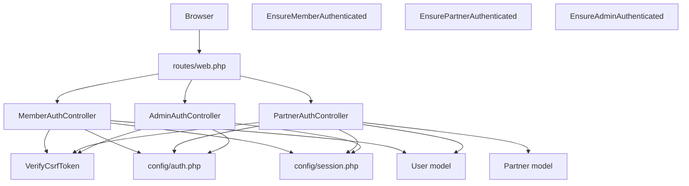

**Diagram sources**
- [web.php:75-86](file://routes/web.php#L75-L86)
- [MemberAuthController.php:17-71](file://app/Http/Controllers/Member/MemberAuthController.php#L17-L71)
- [PartnerAuthController.php:13-58](file://app/Http/Controllers/Partner/PartnerAuthController.php#L13-L58)
- [AdminAuthController.php:11-52](file://app/Http/Controllers/AdminAuthController.php#L11-L52)
- [EnsureMemberAuthenticated.php:9-20](file://app/Http/Middleware/EnsureMemberAuthenticated.php#L9-L20)
- [EnsurePartnerAuthenticated.php:9-26](file://app/Http/Middleware/EnsurePartnerAuthenticated.php#L9-L26)
- [EnsureAdminAuthenticated.php:9-23](file://app/Http/Middleware/EnsureAdminAuthenticated.php#L9-L23)
- [VerifyCsrfToken.php:7-17](file://app/Http/Middleware/VerifyCsrfToken.php#L7-L17)
- [auth.php:38-47](file://config/auth.php#L38-L47)
- [session.php:21-34](file://config/session.php#L21-L34)
- [User.php:10-81](file://app/Models/User.php#L10-L81)
- [Partner.php:8-75](file://app/Models/Partner.php#L8-L75)

## Detailed Component Analysis

### Member Registration Workflow
Member registration involves:
- Rendering the registration form with CSRF protection.
- Validating input (name, email, password confirmation).
- Creating a User record with role set to member and hashed password.
- Automatically logging in the user and regenerating session.
- Redirecting to the catalog with a success message.

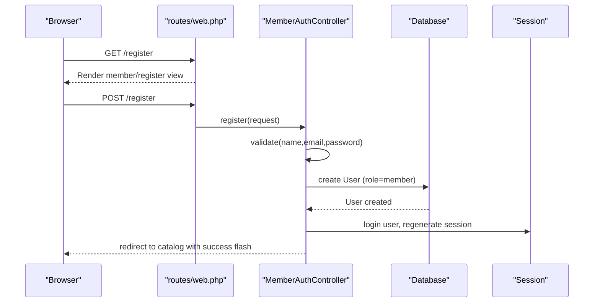

**Diagram sources**
- [web.php:78-79](file://routes/web.php#L78-L79)
- [MemberAuthController.php:44-63](file://app/Http/Controllers/Member/MemberAuthController.php#L44-L63)
- [register.blade.php:28-46](file://resources/views/member/register.blade.php#L28-L46)

**Section sources**
- [MemberAuthController.php:44-63](file://app/Http/Controllers/Member/MemberAuthController.php#L44-L63)
- [register.blade.php:28-46](file://resources/views/member/register.blade.php#L28-L46)

### Member Login Workflow
Member login includes:
- Rendering the login form with CSRF protection.
- Validating credentials.
- Attempting authentication with optional remember-me support.
- Regenerating session upon successful login.
- Redirecting to intended route (catalog index by default).

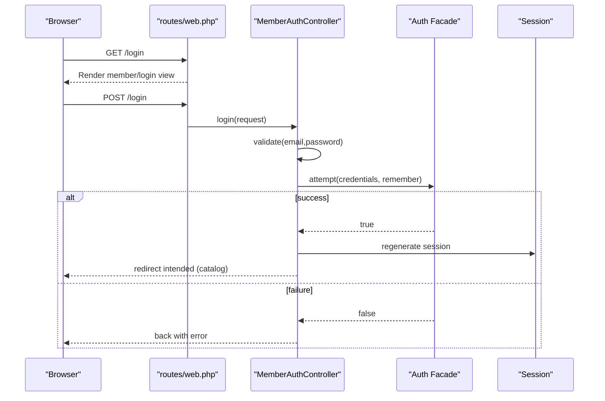

**Diagram sources**
- [web.php:76-77](file://routes/web.php#L76-L77)
- [MemberAuthController.php:23-36](file://app/Http/Controllers/Member/MemberAuthController.php#L23-L36)
- [login.blade.php:38-45](file://resources/views/member/login.blade.php#L38-L45)

**Section sources**
- [MemberAuthController.php:23-36](file://app/Http/Controllers/Member/MemberAuthController.php#L23-L36)
- [login.blade.php:38-45](file://resources/views/member/login.blade.php#L38-L45)

### Member Logout Workflow
Member logout performs:
- Logging out the current user.
- Invalidating the session and regenerating CSRF token.
- Redirecting to the catalog index.

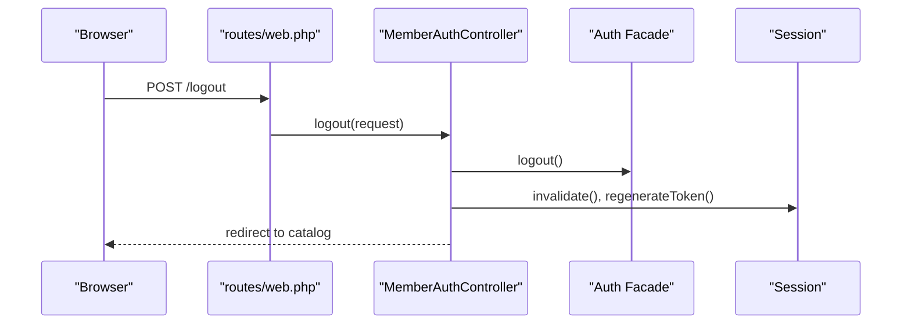

**Diagram sources**
- [web.php](file://routes/web.php#L80)
- [MemberAuthController.php:65-71](file://app/Http/Controllers/Member/MemberAuthController.php#L65-L71)

**Section sources**
- [MemberAuthController.php:65-71](file://app/Http/Controllers/Member/MemberAuthController.php#L65-L71)

### Member Password Reset Workflow
Password reset includes:
- Rendering the forgot password form.
- Validating the email exists in users table.
- Generating a random token and storing a hashed token with created timestamp.
- Producing a reset link (in development, flashed in the response).
- Showing the reset form with token and email.
- Validating token/email/password confirmation.
- Verifying token against stored hashed token.
- Updating the user’s password and clearing the token.

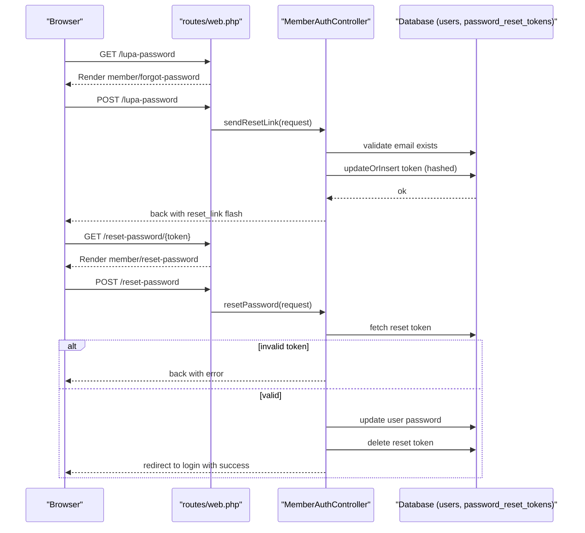

**Diagram sources**
- [web.php:83-86](file://routes/web.php#L83-L86)
- [MemberAuthController.php:74-127](file://app/Http/Controllers/Member/MemberAuthController.php#L74-L127)
- [auth.php:97-104](file://config/auth.php#L97-L104)

**Section sources**
- [MemberAuthController.php:74-127](file://app/Http/Controllers/Member/MemberAuthController.php#L74-L127)
- [auth.php:97-104](file://config/auth.php#L97-L104)

### Partner Registration Workflow
Registration for Partners is exposed publicly and handled by the public Partner registration route. The Partner registration form and submission are mapped in routes. After submission, Partners are created and await administrative approval. The Partner login flow validates approval status before granting access.

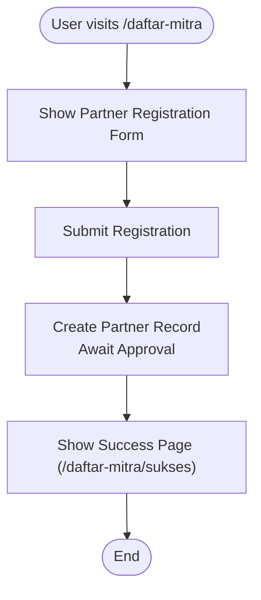

**Diagram sources**
- [web.php:71-73](file://routes/web.php#L71-L73)

**Section sources**
- [web.php:71-73](file://routes/web.php#L71-L73)

### Partner Login Workflow
Partner login includes:
- Rendering the Partner login form.
- Validating credentials.
- Attempting authentication with the partner guard.
- Ensuring the associated User belongs to a Partner and that Partner is approved.
- Regenerating session upon successful login.
- Redirecting to Partner dashboard.

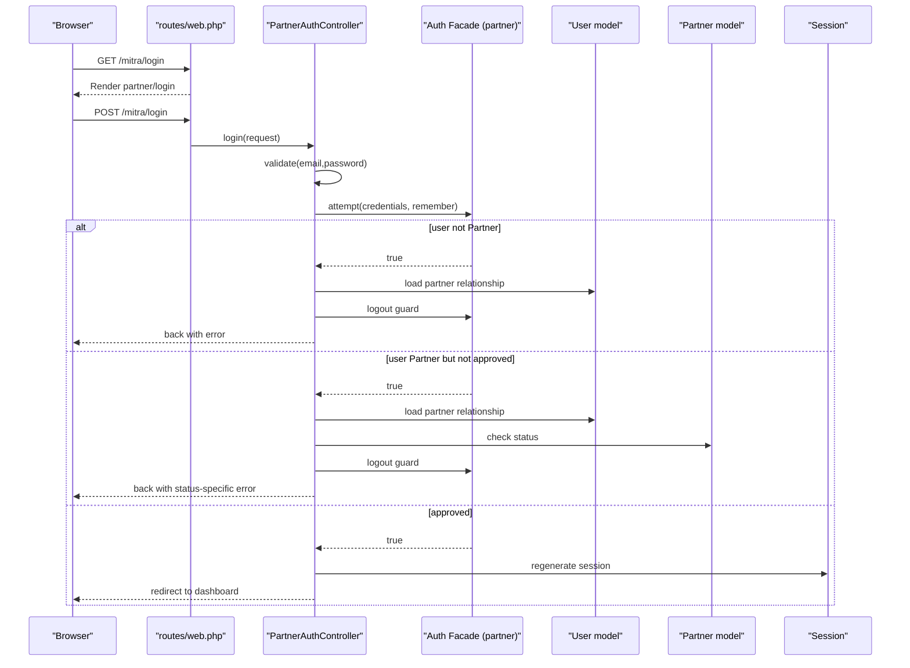

**Diagram sources**
- [web.php:119-122](file://routes/web.php#L119-L122)
- [PartnerAuthController.php:19-49](file://app/Http/Controllers/Partner/PartnerAuthController.php#L19-L49)
- [User.php:28-31](file://app/Models/User.php#L28-L31)
- [Partner.php:72-75](file://app/Models/Partner.php#L72-L75)

**Section sources**
- [PartnerAuthController.php:19-49](file://app/Http/Controllers/Partner/PartnerAuthController.php#L19-L49)
- [User.php:28-31](file://app/Models/User.php#L28-L31)
- [Partner.php:72-75](file://app/Models/Partner.php#L72-L75)

### Partner Logout Workflow
Partner logout performs:
- Logging out from the partner guard.
- Invalidating the session and regenerating CSRF token.
- Redirecting to the Partner login page.

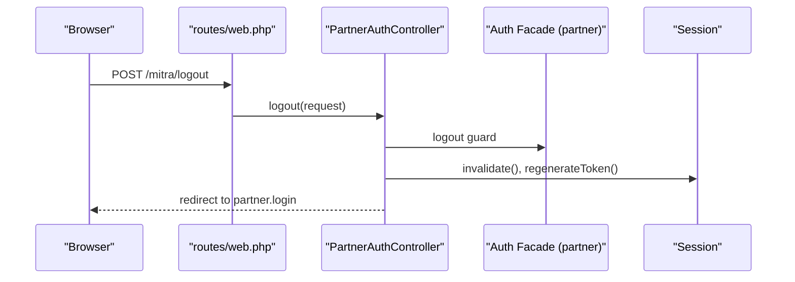

**Diagram sources**
- [web.php](file://routes/web.php#L122)
- [PartnerAuthController.php:52-58](file://app/Http/Controllers/Partner/PartnerAuthController.php#L52-L58)

**Section sources**
- [PartnerAuthController.php:52-58](file://app/Http/Controllers/Partner/PartnerAuthController.php#L52-L58)

### Administrator Account Creation and Login
Administrator login uses a session-based guard:
- Credentials validated against configuration values using constant-time comparison.
- On success, a session flag is set and the session is regenerated.
- Logout clears the session flag, invalidates the session, and regenerates CSRF token.

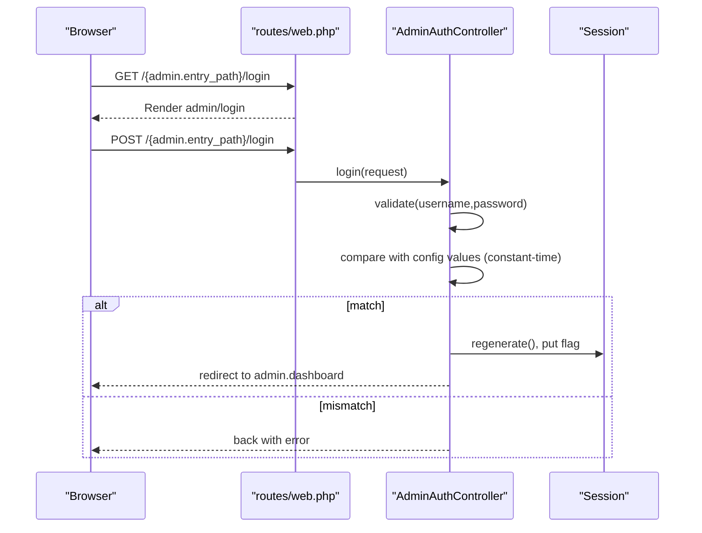

**Diagram sources**
- [web.php:170-172](file://routes/web.php#L170-L172)
- [AdminAuthController.php:20-43](file://app/Http/Controllers/AdminAuthController.php#L20-L43)
- [admin_login.blade.php:59-67](file://resources/views/admin/login.blade.php#L59-L67)

**Section sources**
- [AdminAuthController.php:20-43](file://app/Http/Controllers/AdminAuthController.php#L20-L43)
- [admin_login.blade.php:59-67](file://resources/views/admin/login.blade.php#L59-L67)

### Administrator Logout Workflow
Administrator logout performs:
- Removing the admin authentication flag from the session.
- Invalidating the session and regenerating CSRF token.
- Redirecting to the Admin login page.

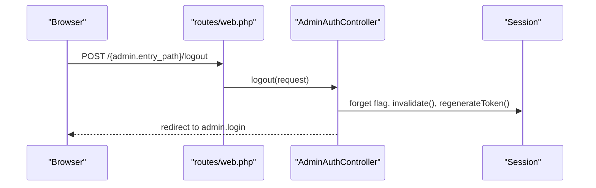

**Diagram sources**
- [web.php](file://routes/web.php#L176)
- [AdminAuthController.php:45-52](file://app/Http/Controllers/AdminAuthController.php#L45-L52)

**Section sources**
- [AdminAuthController.php:45-52](file://app/Http/Controllers/AdminAuthController.php#L45-L52)

### Session Management and CSRF Protection
- CSRF protection is enforced globally via the VerifyCsrfToken middleware.
- Session lifetime is configurable (default 120 minutes).
- Session cookie attributes (SameSite, Secure, HttpOnly) are configurable.
- Guards share the session configuration.

**Section sources**
- [VerifyCsrfToken.php:7-17](file://app/Http/Middleware/VerifyCsrfToken.php#L7-L17)
- [session.php:21-34](file://config/session.php#L21-L34)
- [session.php](file://config/session.php#L199)
- [session.php](file://config/session.php#L171)
- [session.php](file://config/session.php#L184)

### Form Validation, Error Handling, and Flash Messaging
- Controllers validate inputs and return errors to views.
- Views render validation errors and success messages using Blade directives.
- Flash messages are used for success and reset link delivery.

**Section sources**
- [MemberAuthController.php:25-28](file://app/Http/Controllers/Member/MemberAuthController.php#L25-L28)
- [MemberAuthController.php:83-89](file://app/Http/Controllers/Member/MemberAuthController.php#L83-L89)
- [MemberAuthController.php:108-112](file://app/Http/Controllers/Member/MemberAuthController.php#L108-L112)
- [login.blade.php:31-36](file://resources/views/member/login.blade.php#L31-L36)
- [login.blade.php:38-45](file://resources/views/member/login.blade.php#L38-L45)
- [partner_login.blade.php:29-31](file://resources/views/partner/login.blade.php#L29-L31)
- [admin_login.blade.php:55-57](file://resources/views/admin/login.blade.php#L55-L57)

## Dependency Analysis
Key dependencies and relationships:
- Controllers depend on Auth facades and guards.
- Partner login depends on User->Partner relationship and Partner approval checks.
- Middleware enforces authentication per guard and validates Partner approval.
- Configuration defines guards/providers and password reset policies.

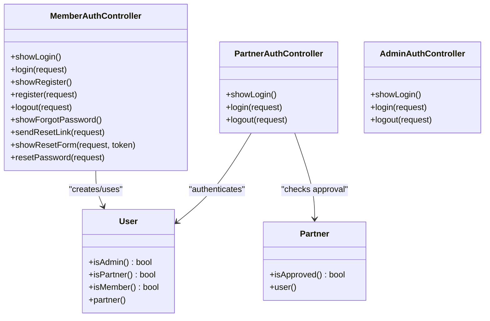

**Diagram sources**
- [MemberAuthController.php:15-128](file://app/Http/Controllers/Member/MemberAuthController.php#L15-L128)
- [PartnerAuthController.php:11-59](file://app/Http/Controllers/Partner/PartnerAuthController.php#L11-L59)
- [AdminAuthController.php:9-53](file://app/Http/Controllers/AdminAuthController.php#L9-L53)
- [User.php:10-81](file://app/Models/User.php#L10-L81)
- [Partner.php:8-75](file://app/Models/Partner.php#L8-L75)

**Section sources**
- [MemberAuthController.php:15-128](file://app/Http/Controllers/Member/MemberAuthController.php#L15-L128)
- [PartnerAuthController.php:11-59](file://app/Http/Controllers/Partner/PartnerAuthController.php#L11-L59)
- [AdminAuthController.php:9-53](file://app/Http/Controllers/AdminAuthController.php#L9-L53)
- [User.php:10-81](file://app/Models/User.php#L10-L81)
- [Partner.php:8-75](file://app/Models/Partner.php#L8-L75)

## Performance Considerations
- Session lifetime: Adjust SESSION_LIFETIME to balance security and UX.
- CSRF overhead: Minimal; ensure middleware is active for all state-changing routes.
- Password reset throttling: Configured via auth passwords policy to limit token generation frequency.
- Guard selection: Using separate guards avoids cross-user-type conflicts and simplifies middleware logic.

[No sources needed since this section provides general guidance]

## Troubleshooting Guide
Common issues and resolutions:
- Member login fails with invalid credentials: Ensure email and password match existing records; verify validation messages.
- Member password reset link not received: Confirm email exists and token insertion succeeds; check flashed reset link in development.
- Partner login blocked: Verify the associated User has a Partner and that Partner status is approved; otherwise, the guard logs out and shows a status-specific error.
- Admin login fails: Ensure username and password match configuration values using constant-time comparison; verify session regeneration on success.
- CSRF failures: Confirm forms include @csrf and that routes are covered by VerifyCsrfToken middleware.

**Section sources**
- [MemberAuthController.php:30-35](file://app/Http/Controllers/Member/MemberAuthController.php#L30-L35)
- [MemberAuthController.php:116-118](file://app/Http/Controllers/Member/MemberAuthController.php#L116-L118)
- [PartnerAuthController.php:29-43](file://app/Http/Controllers/Partner/PartnerAuthController.php#L29-L43)
- [AdminAuthController.php:30-42](file://app/Http/Controllers/AdminAuthController.php#L30-L42)
- [VerifyCsrfToken.php:7-17](file://app/Http/Middleware/VerifyCsrfToken.php#L7-L17)

## Conclusion
KatalogThrift implements distinct yet cohesive authentication flows for Members, Partners, and Administrators. Member flows focus on straightforward registration, login, and password reset. Partner flows include an approval gate enforced by middleware. Admin flows rely on session-based authentication with constant-time credential checking. Shared CSRF protection and session configuration ensure consistent security across guards.